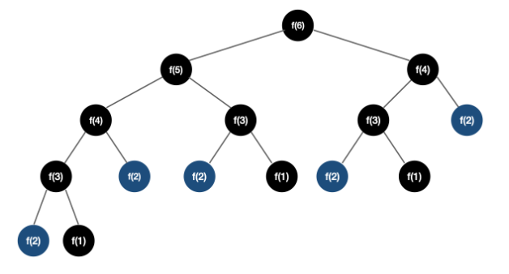
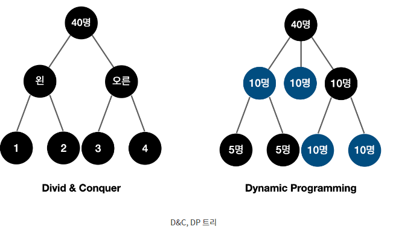

## **💡 Dynamic Programming**

자료구조의 동적할당 (Dynamic Allocation)에서 '동적'은 프로그램이 실행되는 도중에
실행에 필요한 메모리를 할당하는 기법이다.

<br>

그러나, 알고리즘의 동적 계획법에서의 **'동적'**은 별 뜻이 없고 그냥 '기억하기'라고 생각하면 편하다.

동적 프로그래밍에서의 **'프로그래밍'**은 테이블을 만든다는 뜻이다.

<br>

쉽게 말해, **이전에 구한 값**을 기반으로 **규칙성을 파악**하여 **다음 값을 구하는 것**이라고 생각하면 된다.

**알고리즘 설계 기법(패러다임)** 중 하나이며,

**하위 문제의 최적해를 적절히 사용하여 상위 문제를 해결**함으로써, 불필요한 계산을 줄일 수 있다.

<br>

### **DP 알고리즘 이란?**

DP 알고리즘 기법은 이미 계산된 결과(하위 문제)는 별도의 메모리 영역에 저장하여,
다시 계산하지 않도록 설계하여 메모리를 적절히 사용, 수행시간을 비약적으로 향상시킨다.

<br>

DP 구현 방법은 일반적으로 2가지 방식이 있다.

Top-down (하향식), Bottom-up (상향식)으로 구성된다.

<br>

### **DP가 성립하는 조건**

단순 재귀코드보다 높은 효율을 갖는 코드를 설계할 수 있다.

<br>

**최적 부분 구조 (Optimal Substructure)**

- 상위 문제를 하위 문제로 나눌 수 있으며, 하위 문제의 답을 모아 상위 문제를 해결할 수 있다.
- 이런 구조를 갖는 대표적인 경우는 어떤 경유지를 거쳐서 목적지로 가는 문제가 있다.

<br>

**중복되는 부분 문제 (Overlapping Subproblem)**

- 동일한 작은 문제를 반복적으로 해결해야 한다.
- 그러므로, 피보나치 수열은 DP 사용조건에 만족한다.

------

### **중복되는 부분 문제 예시**

피보나치 수열을 구현하려고 한다.

점화식이 F(n) = F(n-1) + F(n-2)이기 때문에 단순 재귀 함수로 구현한다.

```java
public class Simple {
    public static void main(String[] args) {
        Scanner sc = new Scanner(System.in);
        int n = sc.nextInt();
        dp = new int[n+1];
        System.out.println(fibonazzi(n));
    }

    // 단순 재귀
    static int fibonazzi(int x) {
        if (x == 1 || x == 2) return 1;
        return fibonazzi(x-1) + fibonazzi(x-2);
    }
}
```

위와 같이 Memoization을 사용하지 않으면 같은 함수를 계속 중복 호출하기 때문에,
재귀로 구현하면 시간복잡도가 O(2^n)이 된다.

<br>

다음 그림과 같이 굉장히 비효율적인 구조를 갖는다는걸 알 수 있다.



------

### **Top-down (하향식)**

상위 문제를 해결하기 위해 하위 문제를 재귀적으로 호출하여 하위 문제를 해결함으로써,

상위 문제를 해결하는 방식이다.

이 때 해결해놓은 하위 문제를 저장하기 위해 Memoization이 사용된다.

피보나치 함수를 구현할 때 Top-down은 재귀 호출을 이용해 구현한다.

```java
/* DP 하향식 */
public class TopDown {
    static int[] dp;

    public static void main(String[] args) {
        Scanner sc = new Scanner(System.in);
        int n = sc.nextInt();
        dp = new int[n+1];
        System.out.println(fibonazzi(n));
    }

    // Top-down
    static int fibonazzi(int x) {
        if (x == 1 | x == 2) return 1;
        if (dp[x] != 0) return dp[x];

        dp[x] = fibonazzi(x-1) + fibonazzi(x-2);
        return dp[x];
    }
```

------

### **Bottom-up (상향식)**

하위에서부터 문제를 해결해나가면서 먼저 계산했던 문제들의 값을 활용해서,

상위 문제를 해결해나가는 방식으로 DP의 전형적인 형태는 Bottom-up이다.

<br>

여기서 사용되는 문제 결과 값 저장용 리스트는 DP 테이블이라고 부른다.

<br>

Bottom-up 방식은 반복문을 사용해서 구현한다.

```java
/* DP 상향식 */
public class BottomUp {
    static int[] dp;

    public static void main(String[] args) {
        Scanner sc = new Scanner(System.in);
        int n = sc.nextInt();
        dp = new int[n+1];
        System.out.println(fibonazzi(n));
    }

    // Bottom-up
    static int fibonazzi(int x) {
        dp[1] = 1;
        dp[2] = 1;

        for (int i=3; i<x+1; i++) {
            dp[i] = dp[i-1] + dp[i-2];
        }
        return dp[x];
    }
}
```

------

### **Memoization**

DP 구현 방법 중 하나로, 한 번 계산한 결과를 메모리 공간에 메모하는 기법이다.

<br>

이를 사용하면 모든 부분 문제가 한번씩만 계산된다고 보장할 수 있기 때문에,
함수 호출 횟수를 엄청나게 감소시킬 수 있음을 예상할 수 있다.

```java
/* DP Memoization */
public class Memoization {

    static int[] dp;

    /* 일반 재귀 함수
     - 중복된 계산을 반복해서 하게 된다.
     - 시간복잡도는 O(2^n)으로 x의 수가 커질수록 복잡도가 기하급수적으로 커진다.
     */
    static int fibonazzi(int x) {
        if (x == 1 | x == 2) return 1;
        return fibonazzi(x-1) + fibonazzi(x-2);
    }

    /* Memoization
     - 하위 문제의 결과 값을 dp[]배열에 저장해놓고 필요할 때마다 계산된 값을 호출한다.
    */
    static int memo(int x) {
        if (x == 1 | x == 2) return 1;
        if (dp[x] != 0) return dp[x];
        dp[x] = memo(x-1) + memo(x-2);
        return dp[x];
    }
}
```

<br>

**Memoization 특징**

- 같은 문제를 다시 호출하면 메모했던 결과를 그대로 가져온다.
- 값을 기록해 놓는다는 점에서 캐싱과 유사하고 캐싱이라고도 부른다.
- DP에만 국한된 개념이 아니다.
- 한 번 계산된 결과를 담아 놓기만 하고 DP가 아닌 다른 방식으로도 사용될 수 있다.

------

### **동적계획법 (Dynamic Programming) vs 분할정복 (Divide and Conquer)**

최적 부분 구조는 분할 정복 방식으로 풀 수 있다.

DP와 분할 정복은 해당 문제가 최적 부분 구조의 조건을 가질 때 사용할 수 있다.

<br>

상위 문제를 작게 하위 문제로 나누어 해결하는 방식으로 처리하면 된다.

<br>

**두개의 제일 큰 차이점은 하위 문제의 중복이 일어나는지 안 일어나는지 이다.**

<br>

하위 문제가 독립적이지 않고 중복이 되는 경우, DP의 방식이 분할정복보다 더 나은 시간복잡도를 가진다.

왜냐하면 분할정복에서 동일한 하위 문제는 각각 독립적 구성이기 때문에 반복적 계산이 되지 않는다.

 