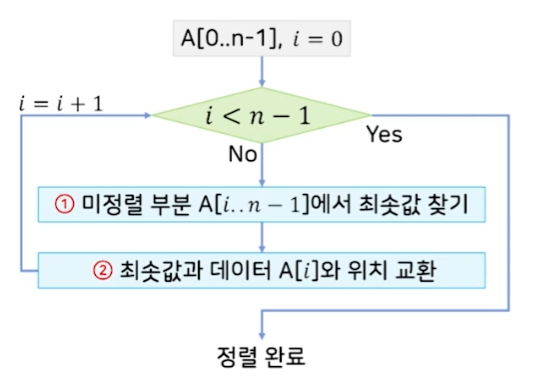
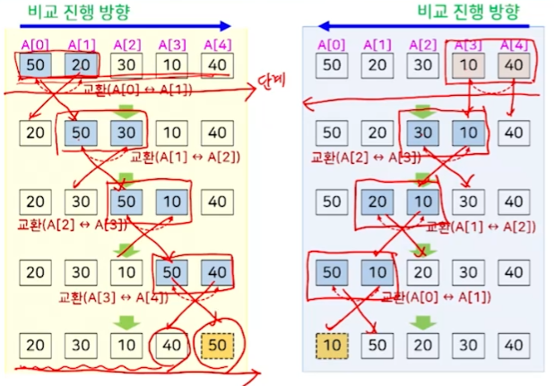

## 정렬

### 주어진 데이터를 값의 크기 순서에 따라 재배치 하는 것

- 오름차순 / 내림차순

<br>

**정렬 수행 시점에 데이터가 어디에 저장되어 있는지?**

|정렬구분|설명|
|---|---|
|내부 정렬|전체 데이터를 주 기억 장치에 저장 후 정렬을 수행하는 방식|
|외부 정렬|모든 데이터를 주 기억 장치에 저장할 수 없는 경우, 모든 데이터를 보조 기억 장치에 저장 -> 그 중 일부 데이터만을 반복적으로 주 기억 장치로 옮겨와 정렬|

---
## 내부 정렬

### 비교 기반 알고리즘

두 데이터의 값 전체를 직접적으로 비교하여 어떤 값이 큰지 또는 작은지를 결정하여 정렬하는 방식

키값의 비교 횟수에 따라 알고리즘의 성능이 다르다.

|알고리즘|시간복잡도|
|---|---|
|선택 정렬|O(n2)|
|버블 정렬|O(n2)|
|삽입 정렬|O(n2)|
|셀 정렬|O(n2)|
|퀵 정렬|O(nlogn)|
|합병 정렬|O(nlogn)|
|힙 정렬|O(nlogn)|

<br>

### 데이터 분포 기반 알고리즘

데이터의 분포 정보를 활용하여 정렬을 수행하는 방식

데이터의 이동 횟수에 따라 알고리즘의 성능이 다르다.

|알고리즘|시간복잡도|
|---|---|
|계수 정렬|O(n)|
|기수 정렬|O(n)|
|버킷 정렬|O(n)|

---
## 예시

아래 예시를 통해 정렬 알고리즘을 하나씩 알아보자.

|입력 배열|입력 크기|입력 데이터|정렬 방식|
|---|---|---|---|
|`A[0//n-1`|`n`|`양의 정수`|`오름차순`|

---
## Selection Sort - O(n2)

입력 배열에서 가장 작은 값부터 순서대로 **선택**해서 나열하는 방식이다.



<br>

**예시 코드**

- 최소값 찾기 -> 미정렬 부분 `A[i..n-1]`에서 항상 `(n-1) - i`번의 비교가 필요
- 입력 데이터의 상태와 상관없이 **항상 동일한 성능 O(n2)** 을 가짐
- 그리고 입력 배열A 외에 상수 개의 저장공간(변수 i, j 등)만 필요하므로 **제자리 정렬 알고리즘**이며.
- 동일한 값을 갖는 여러 데이터가 있을때, 정렬 전의 상대적인 순서가 정렬 후에도 유지되지 않으므로 **안정적이지 않은 알고리즘**이다.

```c
SelectionSort(A[], n) {
	for (i=0; i<n-1; i++) {
		min = i;

		for (j=i+1; j<n; j++) {
			if (A[min] > A[j]) min = j;

			// A[i]와 A[min] 자리 바꿈
		}
	}
}
```

---
### Bubble Sort - O(n2)

모든 인접한 두 데이터를 차례대로 비교해서 왼쪽 데이터가 더 큰 경우,

오른쪽 데이터와 자리를 바꾸는 과정을 반복해서 정렬을 수행하는 방식

아래는 버블 정렬의 기본적인 알고리즘 코드이다.

Selection Sort 에 비해 데이터 교환이 많이 발생해 더 비효율적인 알고리즘이다.

```c
BubbleSort(A[], n) {
	for (i=0; i<n-1; i++) { // 단계 만큼 반복
		for (j=0; j<n-1; j++) { // 왼쪽 -> 오른쪽으로 진행 하는 경우
			if (A[j] > A[j+1]) { // 왼쪽 데이터 > 오른쪽 데이터 일때
				// A[j]와 A[j+1]의 자리바꿈;
			}
		}
	}
	return (A);
}
```

<br>

> **비교를 진행하는 방향**

**왼쪽 -> 오른쪽**

- 가장 큰 값부터 찾아서 오른쪽 끝부터 위치 시킴

<br>

**오른쪽 -> 왼쪽**

- 가장 작은 값부터 찾아서 왼쪽 끝부터 위치 시킴



<br>

**개선된 버블 정렬 알고리즘**

- 배열에서 이미 정렬이 된 부분에서 또 비교를 수행할 필요가 없다.
- 같은 입력 데이터 일떄 기존 버블 알고리즘과 성능의 차이는 없지만 입력 데이터의 상태에 따라 성능이 달라진다.
- 예를 들어 역 순으로 정렬된 배열을 오름차순으로 정렬 할때는 성능이 안 좋고, - > O(n2)
- 이미 정렬된 경우 불필요한 비교를 하지 않기 때문이다. -> O(n)

```c
Advanced_BubbleSort(A[], n) {
	for (i=0; i<n-1; i++) { // 단계: 0,1 ... (n-2)
		Sorted = TRUE; // 이미 정렬된 상태라고 가정

		for (j=0; j<(n-1)-i; j++) { // 왼쪽 -> 오른쪽 방향으로 진행
			if (A[j] > A[j+1]) {
				// A[j]와 A[j+1]의 자리 바꿈
				Sorted = FALSE; // 자리 바꿈 발생 -> 미정렬 상태
			}
		}

		if (Sorted = TRUE) break; // 이미 정렬된 상태이므로 종료
	}
	return (A);
}
```

---
## Insertion Sort - O(n2)

주어진 데이터를 하나씩 뽑은 후 이미 나열된 데이터가 항상 정렬된 상태를 유지하도록,

뽑은 데이터를 맞는 위치에 삽입해서 나열하는 방식

<br>

**시간복잡도**는 O(n2)로 Insertion Sort도 중첩된 For Loop를 가지며 **안정적인 알고리즘**이다.

이유는 인접한 두 데이터가 정렬되지 않은 경우에만 위치 교환이 발생하기 때문.

또한 입력 배열 `A[]` 이외에 상수 개의 저장 공간만 필요함

<br>

**알고리즘 성능**

- 정렬된 배열 쪽이 역순으로 정렬된 경우 O(n2)의 시간복잡도를 가짐
- 정렬된 배열 쪽이 정순으로 정렬된 경우 O(n)의 시간복잡도를 가짐

<br>

**예시 코드**

- `A[0]`이 먼저 정렬
- `'K = 1`
- `A[K .. m-1` 미정렬 부분으로 간주하고 정렬 시작
- 미정렬 부분 `A[k .. n-1`의 첫번쨰 데이터 `A[k]` 추출
- 정렬 부분 `A[0.. k-1`에서 **제자리를 찾아 `A[K]`를 삽입**해서 `A[0 .. K]`가 정렬 상태를 유지하도록 만듬
- 미정렬 부분에서 첫번째 데이터를 뽑아 정렬된 부분의 마지막 데이터와 비교
- 비교 후 뽑은 데이터가 정렬된 배열의 마지막 데이터보다 작다면 (n-1) -1 의 데이터와 다시 비교
- 만약 (n-1) -1 index의 데이터보다 미정렬 부분에서 가져온 데이터가 크다면
- n-1 과 n-1 -1 사이(제자리)에 데이터를 위치 시킴

```c
InsertionSort (A[], n) {
	for (i=1; i<n; i++) { // A[0]은 제외하고 A[1]부터 n-1까지 반복
		val = A[i]; // 미정렬 부분 A[i.. n-1]의 첫번쨰 데이터 선택

		for (j=i; j>0 && A[j-1] > val; j--) { // 삽입할 위치 찾기
			A[j] = A[j-1]; // 정렬 부분의 A[j-1]이 크면 뒤로 한칸 이동
		}
		
		A[j] = val; // 찾아진 위치에 선택된 데이터 삽입
	}
	return (A);
}
```

위 코드는 오름차순 삽입 정렬 코드이고 내림 차순은 중첩된 for 문의 `A[j-1] > val` 부분의 부등호만 바꿔주면 된다.

---

## Shell Sort

Insertion Sort의 단점을 보완한 알고리즘

<br>

**Insertion Sort의 단점**

Insertion Sort의 단점은 현재 삽입하고자 하는 데이터가 삽입될 위치에서 많이 벗어나 있으면,

한 번에 한자리씩만 이동해서 찾아가야 함.

<br>

**단점 보완**

- 멀리 떨어진 데이터와의 비교/교환을 할 떄 한번에 이동할 수 있는 거리를 늘려서 처리 속도를 향상 시킴
- 점점 가까운 위치의 데이터를 비교/교환한 뒤 마지막에 인접한 데이터를 비교/교환
- 입력 배열을 부분 배열로 나눠 삽입 정렬을 수행하는 과정을 부분 배열의 크기와 개수를 변화시켜 가면서 반복

<br>

**부분 배열의 크기를 정하는 방법**

- 양수로 이루어진 임의의 순열 h(1) ~ h(k-1), h(k) 사용
- 임의의 i, j에 대해 i < j면 h(j)는 h(i)의 배수가 되지 않는다
- h(1)은 항상 1이 되어야 함