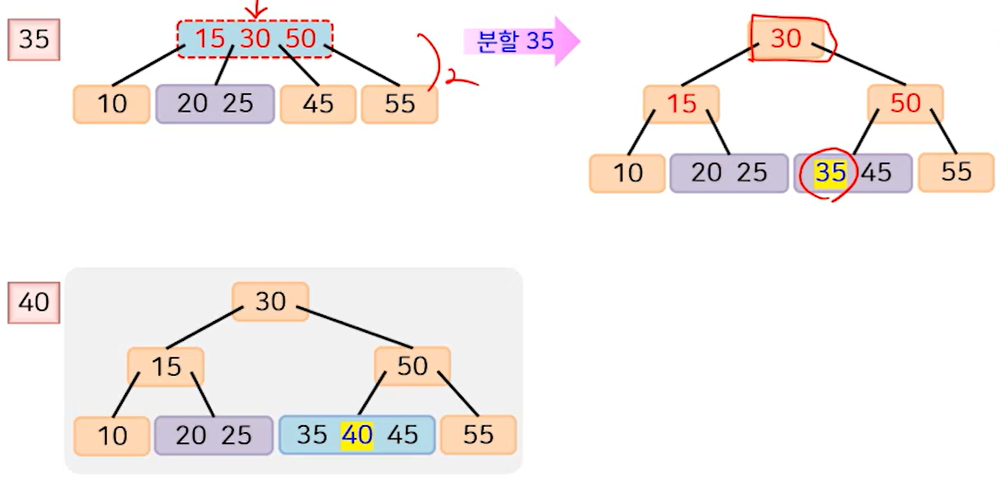

## 2-3-4 트리의 특징

**2-3-4 트리는 아래와 같은 성질을 만족하는 균형 탐색 트리입니다.**

- 2-노드 : 1개의 키와 2개의 자식 노드를 가짐
- 3-노드 : 2개의 키와 3개의 자식 노드를 가짐
- 4-노드 : 3개의 키와 4개의 자식 노드를 가짐
- 각 노드의 한 키의 왼쪽 서브 트리에 있는 모든 키 값은 그 키 값보다 작다.
- 각 노드의 한 키의 오른쪽 서브 트리에 있는 모든 키 값은 그 키 값보다 크다.
- 모든 리프 노드의 레벨은 동일하다.


---
## 연산

**탐색**

- 이진 트리의 방식과 성질이 유사하기 때문에 Root Node의 첫번째 키부터 탐색을 시작합니다.

<br>

**삽입**

- 삽입 과정도 이진 트리와 거의 유사하게 탐색이 실패한 곳에 노드를 추가하는 방식입니다.
- 하지만 다른점은 탐색 과정에서 4-노드를 만날 때, 항상 **노드 분할**을 우선 수행하고 삽입을 수행합니다.

> **노드 분할이란?**

- 4-노드를  2-노드 3개로 분할합니다. 즉, 키를 1개씩만 가진 노드 3개로 분할한다는 의미입니다.
- 그렇게 분할한 3개의 노드 중 **가운데 노드**를 부모 노드로 두고 나머지 2개의 2-노드는 자식 노드로 사용합니다.
- 만약 루트 노드가 4노드라면, 트리의 높이가 증가하게 됩니다.


<br>

**삽입 연산 예시**

- 별로 어려울 게 없이 노드의 개수를 2,3,4로 증가 시키면서, 4노-드가 되면 분할 후 삽입을 반복하면 됩니다.




---
## 성능 & 특징

**시간복잡도**

- 탐색, 삽입, 삭제 연산의 시간 복잡도는 O(logn)입니다.
- 왜냐하면 2-3-4 트리는 **균형 탐색 트리**이기 때문에 트리의 최대 높이가 logn 입니다.

<br>

**다른 특징**

- 삽입, 삭제가 일어나도 경사 트리로 변하지 않습니다.
- **루트 노드가 분할되는 경우에 한해서** 모든 노드의 레벨이 동일하게 1씩 증가하기 때문입니다.
- 그러므로 빈번한 삽입, 삭제 연산이 발생해도 최대 O(logn)의 시간을 보장합니다.

<br>

**단점**

- 2-3-4 트리를 그대로 구현할 경우, 노드 구조가 복잡해서 이진 탐색 트리보다 더 느려질 가능성이 있습니다.
- 위 단점을 보완하기 위해 2-3-4 트리를 이진 탐색 트리의 구조로 변환한 트리가 바로 **레드-블랙 트리**입니다.

---
## Java로 구현한 2-3-4 Tree

```java
class Node {
    private static final int ORDER = 4;
    private int numItems;
    private Node parent;
    private Node[] childArray = new Node[ORDER];
    private DataItem[] itemArray = new DataItem[ORDER-1];
    
    // 노드에 데이터 항목 추가
    public void insertItem(DataItem newItem) {
        numItems++;
        long newKey = newItem.dData;
        
        for(int j=ORDER-2; j>=0; j--) {
            if(itemArray[j] == null) { // 아무것도 하지 않음
                continue;
            } else {
                long itsKey = itemArray[j].dData;
                if(newKey < itsKey) {
                    itemArray[j+1] = itemArray[j];
                } else {
                    itemArray[j+1] = newItem;
                    return;
                }
            }
        }
        itemArray[0] = newItem;
    }
    
    // 자식 노드 연결
    public void connectChild(int childNum, Node child) {
        childArray[childNum] = child;
        if(child != null) {
            child.parent = this;
        }
    }
    
    // 자식 노드 분리
    public Node disconnectChild(int childNum) {
        Node tempNode = childArray[childNum];
        childArray[childNum] = null;
        return tempNode;
    }
    
    // 노드 데이터 항목 클래스
    class DataItem {
        public long dData;
        
        public DataItem(long dd) {
            dData = dd;
        }
    }
}

public class TwoThreeFourTree {
    private Node root = new Node();
    
    public void insert(long value) {
        Node curNode = root;
        Node.DataItem tempItem = curNode.new DataItem(value);
        
        while(true) {
            if(curNode.isFull()) { // 현재 노드가 가득 찼다면 분할
                // 분할 메소드 실행 (여기서는 구현 생략)
                curNode = curNode.getParent();
                curNode = getNextChild(curNode, value);
            } else if(curNode.isLeaf()) { // 리프 노드라면 삽입
                curNode.insertItem(tempItem);
                return;
            } else {
                curNode = getNextChild(curNode, value);
            }
        }
    }
    
    // 다음 자식 노드를 얻는 메소드 (구현은 예제에서 생략)
    public Node getNextChild(Node theNode, long theValue) {
        return null; // null 말고 적절한 자식 노드를 반환해야 함
    }
}
```