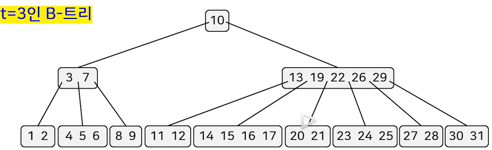
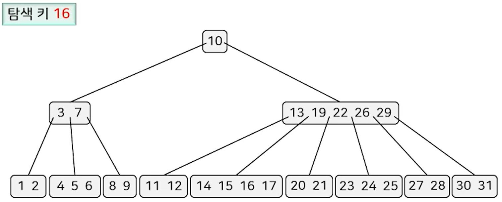
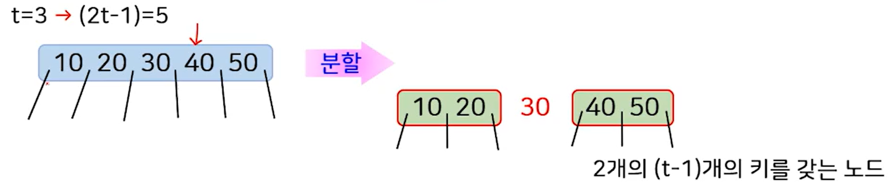
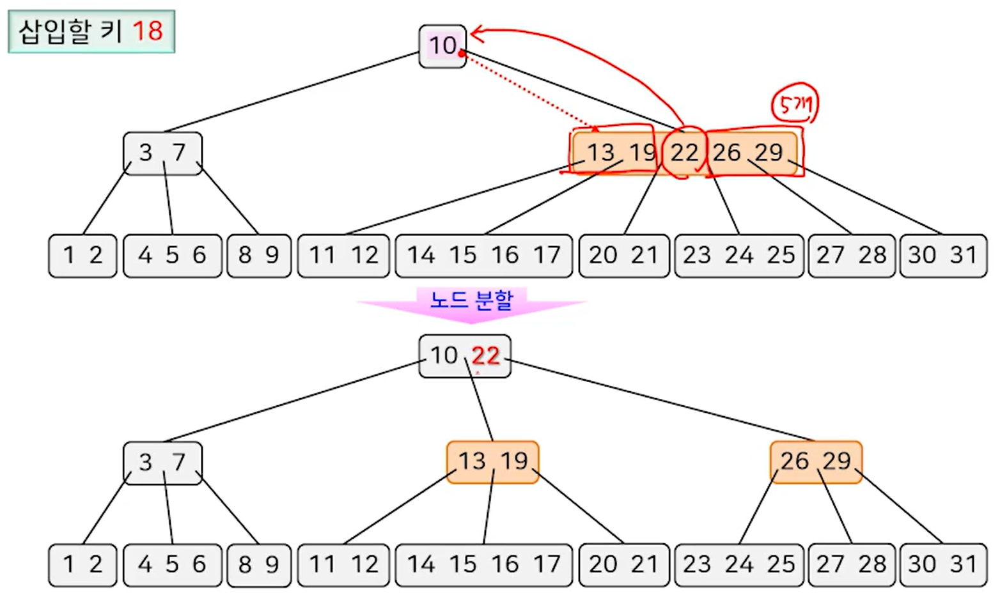

## B-Tree의 특징

아래 해당하는 성질을 만족하는 균형 탐색 트리입니다. (t는 자연수인 상수)

- 1번 : 루트 노드는 1개 이상, 2t개 미만의 오름차순으로 정렬된 키를 가짐.
- 2번 : 루트가 아닌 모든 노드는 (t-1)개 이상, 2t개 미만의 오름차순으로 정렬된 키를 가짐.
- 3번 : 내부 노드는 자신이 가진 키의 개수보다 하나 더 많은 자식 노드를 가짐.
- 4번 : 각 노드의 한 키의 왼쪽 서브트리에 있는 모든 키 값은 그 키값보다 작음.
- 5번 : 각 노드의 한 키의 오른쪽 서브트리에 있는 모든 키 값은 그 키값보다 큼.
- 6번 : 모든 리프 노드의 레벨은 동일함.

위 Tree에서 t가 3일때,

루트 노드는 `1보다 크고 (2t -1)보다 작은` 개수의 키를 가질 수 있으므로 총 5개의 키를 가질 수 있습니다.

그리고, 루트가 아닌 노드는  `(t-1)보다 크고 (2t - 1) 보다 작은`개수의 키를 가질 수 있으므로 4개의 키를 가질 수 있습니다.

또,  모든 리프 노드의 레벨은 동일하며, 값의 크기도 왼쪽부터 오름차순이고 현재 노드의 키값 + 1 개의 자식노드를 갖습니다.

---
## 탐색 연산

탐색 연산은 2-3-4 트리의 탐색 연산과 유사하고 간단합니다.

첫번째로, 탐색할 16이 루트노드인 10보다 크므로 오른쪽으로 내려가서 13과 비교합니다.

13보다 16이 크니 오른쪽 키인 19와 비교 후, 19보다 작으니 19의 왼쪽 자식 노드로 가서 동일하게 탐색합니다.

---
## 삽입 연산

루트 노드부터 탐색을 수행하여 리프 노드에도 존재하지 않으면 해당 노드에 추가합니다.

삽입 연산도 2-3-4 트리와 유사하게 **노드 분할**을 수행합니다.

 

> **노드 분할 과정**

**탐색 과정에서 (2t - 1)개의 키를갖는 노드를 만나면, 이 노드를 (t - 1)개의 키를 갖는 2개의 노드와 1개의 키를 갖는 노드로 분할**

위 과정을 통해 삽입으로 인해 노드의 키 개수가 2t개가 되는것을 방지합니다.

 

> **예시**

- 키의 개수가 2t개가 되기 전인 `2t - 1` 개가 되었으므로, 노드를 분할 해줍니다.
- 분할 후 14,15,16,17이 있는 노드가 18을 넣어줍니다. (2t - 1개까지 키 값을 가질 수 있기 때문에)

---
## 성능 & 특징

- 탐색, 삽입, 삭제 연산의 시간복잡도는 O(logn) 입니다.
- 트리의 높이 h, 각 노드에서 키의 위치를 찾는 시간 O(t) -> O(th)
- 키의 개수 : `(t-1) ~ (2t - 1)` , 자식 노드의 개수 : `t ~ 2t` 
- 모든 리프 노드의 레벨을 동일합니다.
- 트리의 높이 h -> O(logtn)
- 각 노드에서의 키 관리에 Red-Black Tree를 이용하면 O(t) 시간 -> O(logt)
- **내부탐색 / 외부탐색 모두 활용됩니다.**
	- 내부 탐색의 경우 보통 t를 2,3 정도의 작은 값으로 지정합니다. (ex: t가 2면 2-3-4 트리가 됩니다.)
	- 외부 탐색의 경우 디스크를 사용하는 경우라면 t를 충분히 크게 지정합니다.
		- 한 노드의 크기가 디스크의 한 블록에 저장되도록 하기 위해