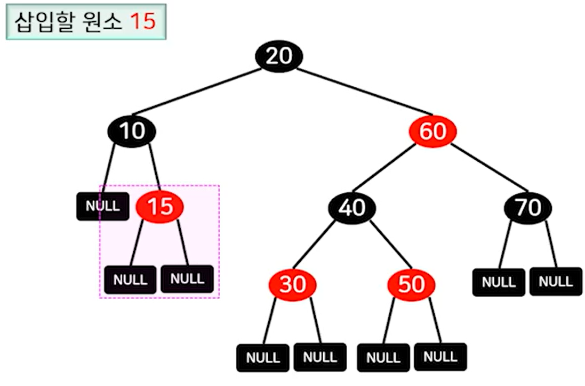
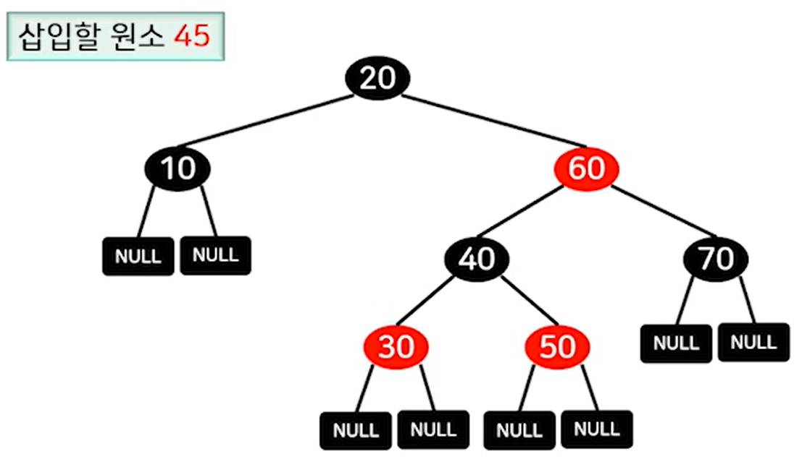
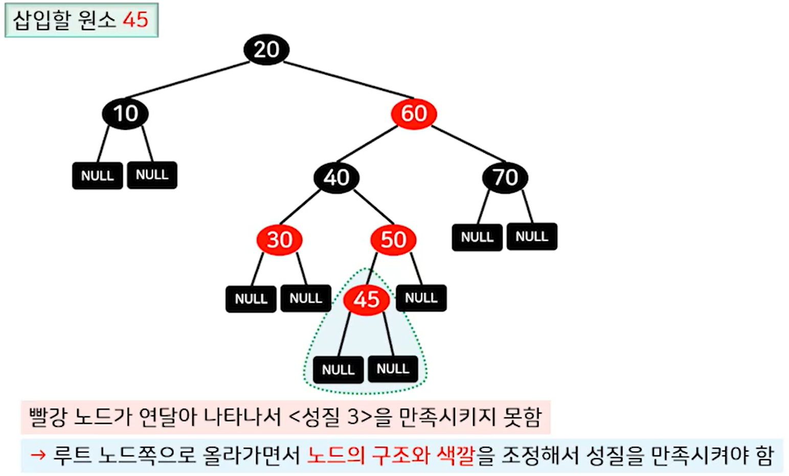
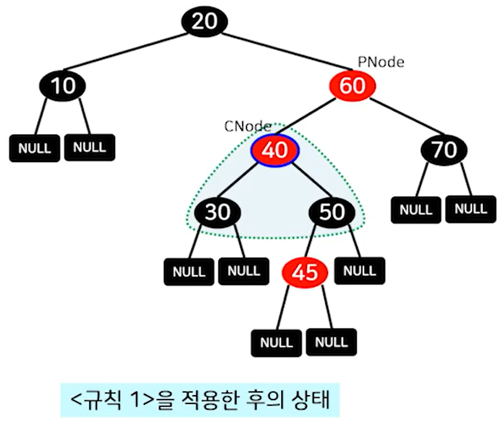
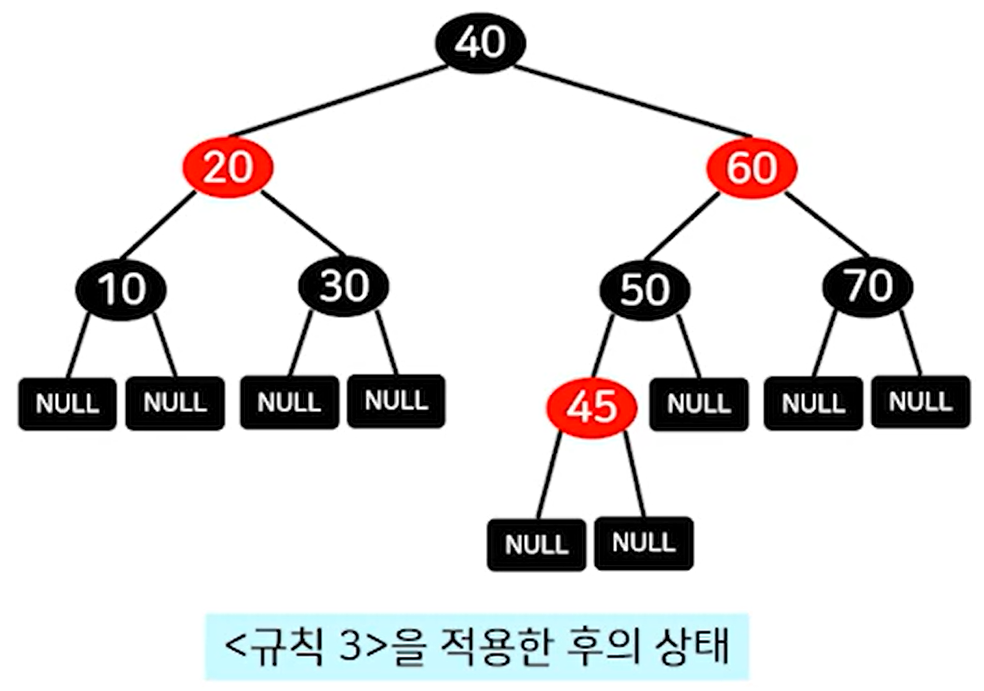

## Red-Black Tree

- 모든 노드는 검정이거나 빨강이다.
- 루트 노드와 리프 노드는 검정이다.
	- 모든 리프 노드는 값이 없는 Null 노드이다.
- 빨강 노드의 부모 노드는 항상 검정이므로, 빨강 노드가 연달아 나타날 수 없다.
- 임의의 노드로부터 리프 노드까지의 경로상에 동일한 개수의 검정 노드가 존재한다.
- 이진 탐색 트리와 같이 왼쪽부터 오른쪽 순으로 값이 커진다.

---
## 삽입 연산

> **예시 1**

삽입할 원소를 15라고 가정하고 이진 탐색 트리와 같은 성질이며, 

탐색이 실패한 노드에 **빨강 노드**를 추가하고, **두 자식 노드를 Null**로 만듭니다.

 

> **예시 2**

삽입할 원소는 45라고 가정해 보겠습니다.

50의 왼쪽 노드에 45가 들어가게 됩니다.

 

하지만, 3번째 레드블랙 트리의 성질 중 **빨강 노드는 연달아 나타나지 못한다.** 라는 특징을 가지고 있습니다.

어떻게 해야 할까요?

 

> **빨강 노드가 연달아 나타나는 경우 적용하는 규칙**

**규칙 1 : 부모 노드의 형제 노드가 빨강인 경우**

- 부모, 부모의 형제, 부모의 부모 노드의 색깔을 모두 변경 (검정이면 빨강, 빨강이면 검정으로)

 

**규칙 2 : 부모 노드의 형제 노드가 검정이고, 현재 노드의 키값이 부모, 부모의 부모 노드의 키값 사이인 경우**

- 현재 노드와 부모 노드를 회전(방향에 따라 시계/반시계 방향) 시킴

 

**규칙 3 : 부모 노드의 형제 노드가 검정이고, 현재 노드의 키값보다 부모, 부모의 부모 키 값이 크거나 작은 경우**

- 부모와 부모의 부모 노드를 회전시키고 색깔을 변경함

 

위 규칙을 기반으로 삽입된 원소 45는 어떻게 바뀌어야 할 지 풀어 보겠습니다.

이번 예시는 45의 부모노드인 50의 형제노드 30이 빨강이므로, 위에 나열한 규칙 중 1번에 해당합니다. (**부모 노드의 형제 노드가 빨강인 경우**)

그로므로, 부모 50, 부모의 형제30, 부모의 부모 40의 색깔을 **빨강이면 검정으로, 검정이면 빨강으로** 바꿔줍니다.

 

여기서 끝인줄 알았지만 규칙 1을 적용하고 보니 40의 부모노드도 **빨강**이고, 빨강은 연속으로 올 수 없으니 다시 규칙을 봅시다.

**부모의 형제누드가 검정이며, 현재 노드의 키 값이 부모 / 부모의 부모의 키 값 사이에 있는 경우**인 2번 규칙에 해당합니다.

즉, 40이 20과 60사이에 있다는 의미입니다.

그럼 규칙 2번에 따라 **부모와 현재 노드를 회전 시킵니다.**

 

규칙 2에 따라 회전을 통해 60이 있던 자리에 40이 가고, 기존 60은 시계 방향으로 내려갔습니다.

그리고 기존 30과 50이 40의 자식 노드로 있었는데 60까지 하면 자식 노드가 3개가 되므로,

40보다 큰 50은 60의 자식노드로 붙여줍니다.

 

규칙 2를 적용하니 또 40과 60이 연달아 빨강으로 나옵니다.

이번엔 3번쨰 규칙인 **부모의 형제가 검정이며, 부모/부모의 부모의 키 값이 현재 노드보다 크거나 작은 경우**에 해당됩니다.

이럴때는 부모, 부모의 부모를 회전시키고 색깔을 변경합니다.

40이 반시계 방향으로 올라가고 20이 밑으로 내려가면서, 40의 자식 노드인 30인 20의 자식 노드로 들어가고 마지막으로 20과 40의 색깔을 바꿔줍니다.

---
## 성능 & 특징

- 어떤 두 리프 노드의 레벨 차이가 2배를 넘지 않는 균형 트리 입니다.
	- 3번째 성질 : 루트 노드에서 리프 노드의 경로상에는 `빨강 노드의 개수 < 검정 노드의 개수`
	- 4번째 성질 : 루트 노드에서 리프 노드의 경로상에는 `동일한 개수의 검정 노드 존재`
- 그러므로, 최악의 경우 탐색, 삽입, 삭제 연산의 시간복잡도는 `O(logn)` 입니다.
- 사실상 탐색 연산은 이진 탐색트리와 동일하며, 삽입도 동일하지만 회전과 색깔 변경과 같은 추가 연산만 필요합니다.
- 요약 하면, **2-3-4 트리의 단점을 보완하면서 이진 탐색 트리의 형태를 갖는 균형 탐색 트리입니다.**
- 레드 블랙트리에서 빨강 노드와 부모 노드와 묶어서 하나의 2-3-4 트리 노드로도 표현 할 수 있습니다.