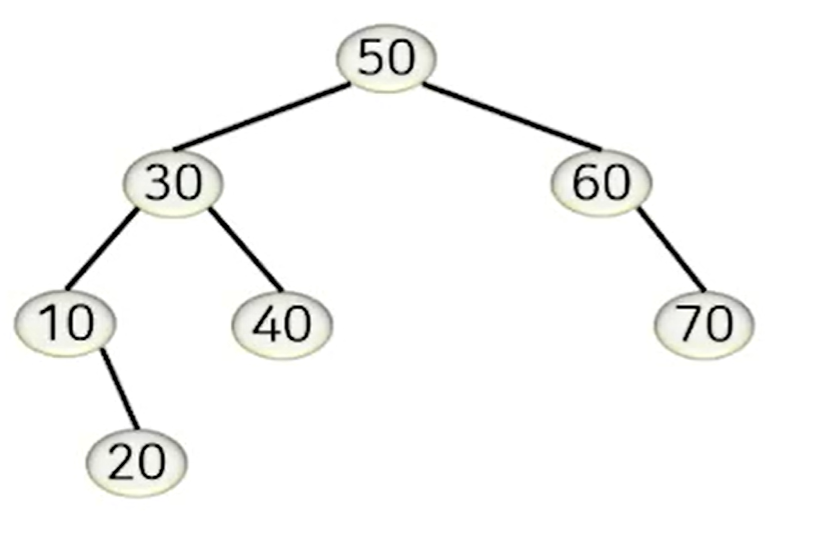
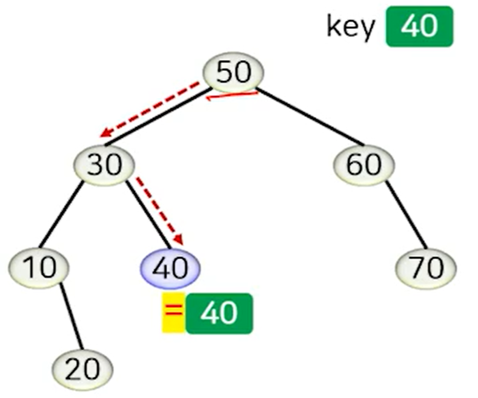
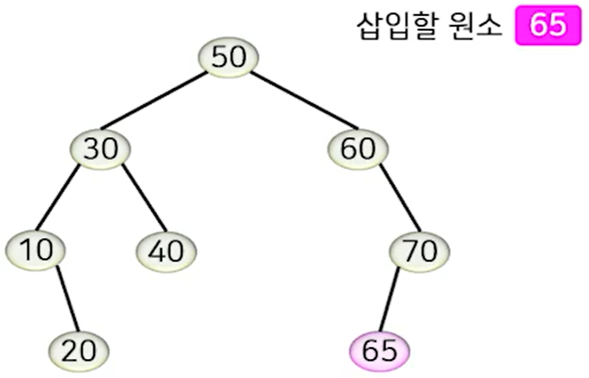
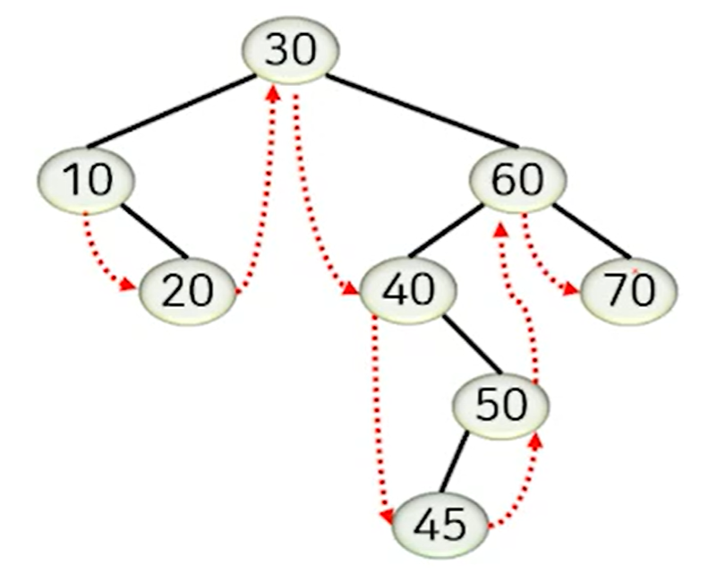
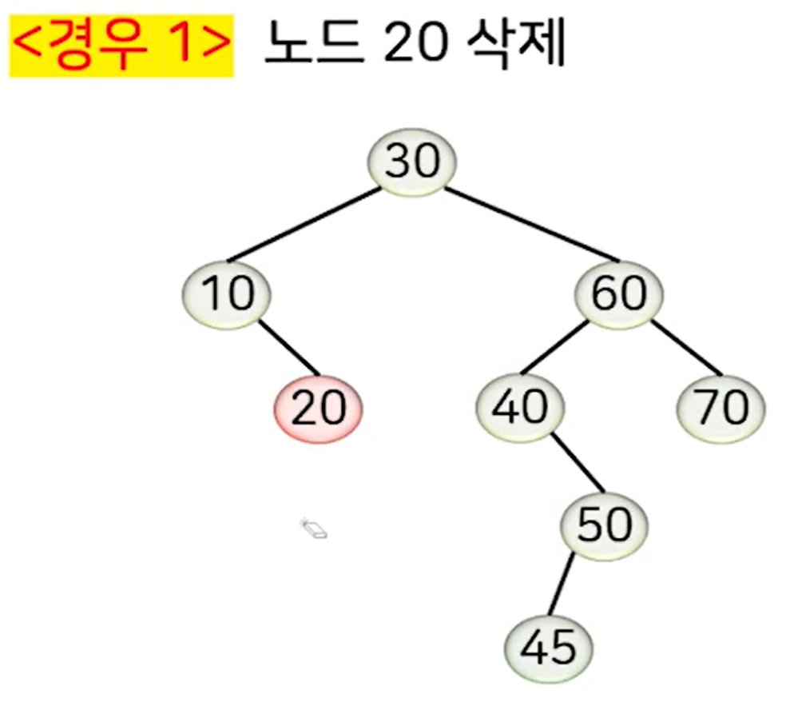
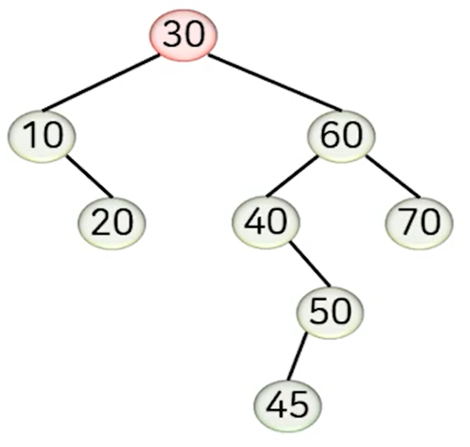
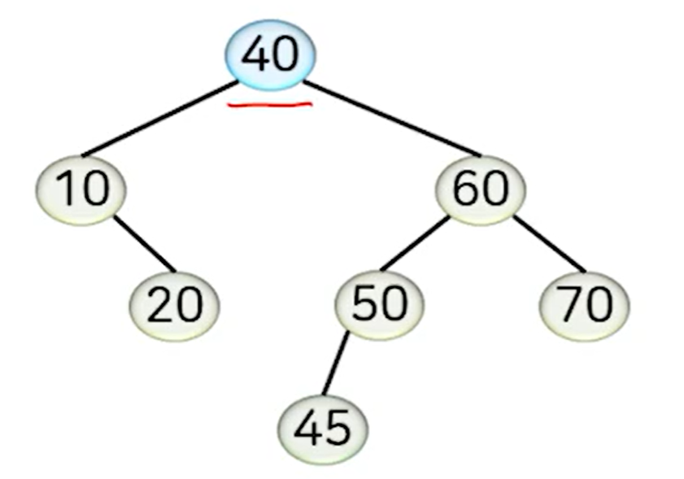

## 이진 탐색 트리의 특징

**모든 노드는 아래의 조건을 만족합니다.**

- 한 노드의 **왼쪽 서브트리**에 있는 **모든 키 값**은 **그 노드의 키 값보다 작습니다**.
- 한 노드의 **오른쪽 서브트리**에 있는 **모든 키 값**은 **그 노드의 키 값보다 큽니다.**

 

**이진 탐색 트리는 3개의 LinkedList Pointer를 이용해 구현합니다.**

- left
- key
- right

---
## 탐색 연산

Root Node에서 시작해 값의 크기 관계에 따라 트리 경로를 내려가면서 탐색합니다.

찾을 Key 값을 각 노드의 값과 비교해 작으면 왼쪽, 크면 오른쪽으로 내려 가면서 값이 나올떄 까지 탐색합니다.

---
## 삽입 연산

삽입할 원소를 탐색한 후, 탐색이 실패하면 해당 위치에 자식 노드로서 새 노드를 추가합니다.

값비교를 하며 알맞게 방향에 따라 내려가다가 다음 방문 노드가 Null일 경우 서브 노드로 추가합니다.

---
## 삭제 연산

어떤 노드의 바로 **다음 키값을 갖는 노드(후속자 노드 & Successor Node)** 를 의미합니다.

예를 들면 아래 이미지에서 10의 후속자는 20이고, 20의 후속자는 30, 30의 후속자는 40 이런식입니다.

 

위 내용을 토대로 삭제 연산은 **삭제되는 노드의 자식 노드의 개수**에 따라 구분해서 처리하며, 이 경우는 3가지 입니다.

> **자식 노드가 없는 경우 (리프 노드)**
	
남은 노드가 없으므로 위치 조절이 불필요, 그냥 삭제하면 됩니다.

 

> **자식 노드가 1개인 경우**

자식 노드를 삭제될 노드의 위치로 올리면서 서브트리 전체도 따로 올려줍니다.

이 경우도 위와 비슷하게 쉽게 때문에 이미지는 없습니다.

 

> **자식 노드가 2개인 경우**

삭제되는 노드의 후속자 노드를 삭제되는 노드의 위치로 올립니다.

후속자 노드를 삭제되는 노드로 취급하여 자식 노드의 개수에 따라 다시 처리합니다.

아래 이미지에서 노드 30을 삭제를 한다고 가정해 보겠습니다.

 

**과정**

- 30을 삭제하고 후속자 노드인 40을 30의 위치로 가져옵니다.
- 30의 자리에 40이 오고, 기존 40의 자리도 삭제된 것과 같으므로 위의 노드가 1개일떄 삭제할 경우를 적용해서 다시 처리합니다.
- 자식 노드가 1개인 노드 50을 그대로 기존 40의 자리로 가져오고 그 하위 서브트리까지 같이 옮겨줍니다.

---
## 성능 & 특징

**탐색, 삽입, 삭제 연산의 시간 복잡도**

- 키 값을 비교하는 횟수에 비례 합니다.
- 만약 이진 트리의 높이가 h 라면 시간 복잡도는 O(h) 이고, 평균 수행 시간은 O(logn)입니다.

 

**평균 수행시간이 왜 O(logn) 일까?**

노드의 개수를 7개라고 고정하고 예를 들어 봅시다.

- 포화/완전 이진 트리의 경우와 비슷하게 모든 노드의 차수가 2인 경우를 가정해보면,  트리의 높이는 3입니다.
- 경사 이진트리의 경우와 비슷하게 모든 노드의 차수가 1인 경우를 가정해보면, 최악의 수행시간은 O(n)번인 걸 알 수 있습니다.

 

**삽입/삭제 연산 시 기존 노드의 이동이 거의 발생하지 않습니다.**

- 삽입 : 노드의 이동 없음
- 삭제 : 상수 번 이동 (0, 1, 1 또는 2)
- 하지만 잦은 원소의 삽입/삭제를 거쳐 **경사 트리 형태**가 될 경우 최악의 수행시간인 O(n)의 시간복잡도를 가질 수 있습니다.

 

**최악의 시간복잡도를 피하려면?**

- 경사 트리 형태가 되지 않도록 트리의 균형을 유지해서 O(logn)의 시간복잡도를 보장해야 합니다.
- 이때 **균형 탐색 트리 (탐색 트리의 좌/우 서브트리가 같은 높이를 유지하는 자료구조)**를 사용합니다.
	- ex: 2-3-4 트리 / 레드-블랙 트리 / B-트리