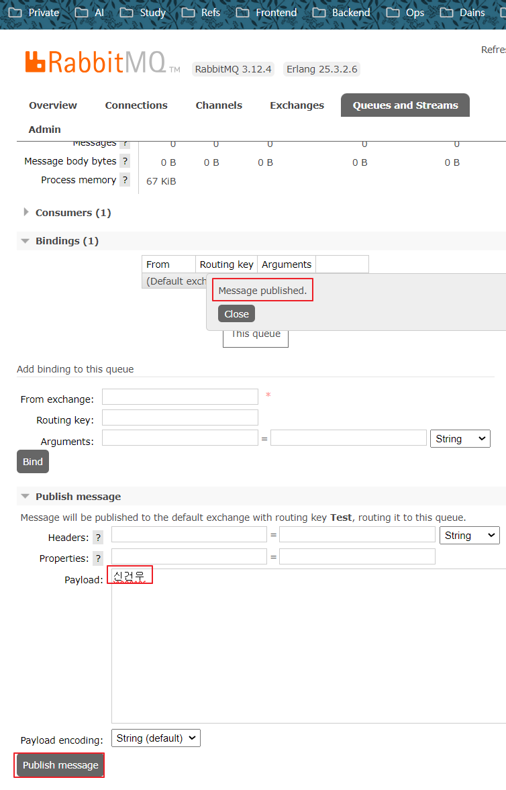
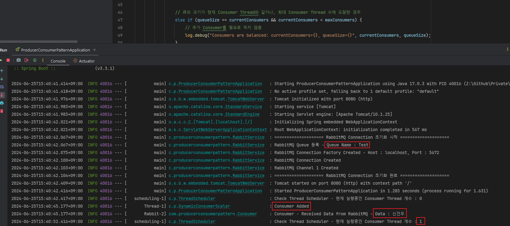

## 📚 Producer Consumer Pattern

기존에 RabbitMQ의 Queue에서 대량의 데이터를 받아서 동시성을 처리할 때 사용하던 방법은,

ReentrantLock의 tryLock을 이용해 명시적 Lock을 걸고 임계영역을 보호하는 방법을 사용 중 이었습니다.

<br>

근데 문제는 평소 AI Engine에서 받은 MQTT 데이터의 흐름이 평상시에는 일정한 개수(1초에 200개 정도) 나오다가

AI Engine에 특정 조건이 트리거 되어 특정 모드로 바뀔때 수 없이 많은 데이터가 쏟아져 나올 떄가 있으며, 그 메시지들을 그대로 Consume 해버리게 됩니다.

Thread들을 충분히 나누었음에도 부하가 심해 Spring Server가 일시적으로 멈춤, 오작동하거나 API 호출이 안 먹는다거나 이슈들이 많았습니다.

<br>

그래서 특정 모드에 들어갔을떄 Message를 Consume 받는 빈도를 BlockingQueue를 통해 조절 해 서버의 부하를 줄이고자 알아보다가 

발견한것이 LinkedBlockingQueue를 이용한 Producer -Consumer Pattern이라는

현재 상황에서 데이터를 더 안전하게 처리할 수 있는 적합한 디자인 패턴을 발견하게 되어,

기존 방식과의 **공통점**과 **차이점**, **결론적으로 어떤 방법이 더 적합한지** 작성 후 간단한 코드 예시로 구현해보겠습니다.

---
## 📚 ReentrantLock의 tryLock을 이용한 명시적인 Locking 처리

현재 사용중인 방법으로,

ReentrantLock의 tryLock을 이용하여 명시적으로 Lock을 획득하고 임계영역(critical section)을 보호하는 방식입니다. 

이 방식은 특정 코드 블록(임계 영역)이 다른 여러 스레드에 의해 동시에 실행되지 않도록 보장합니다.

<br>

#### 장점

- **정밀한 제어**: Locking과 unlocking 시점을 명시적으로 제어할 수 있어, 복잡한 동시성 제어가 필요한 경우여서 사용했었습니다.
- **Non-blocking 시도**: tryLock을 사용하면 블로킹 없이 Lock을 시도할 수 있어, Lock을 획득하지 못했을 때 다른 작업을 수행할 수 있습니다.

<br>

#### 단점

- **복잡성 증가**: Lock을 명시적으로 관리해야 하므로 코드가 복잡해질 수 있습니다.
- **Race Condition 발생 가능**: 여러 스레드가 Lock을 획득하려고 경쟁할 때 성능 저하가 발생할 수 있습니다.
- **Dead Lock**: 잘못된 Lock 관리로 인해 데드락(deadlock)이 발생할 위험이 있습니다.

---
## 📚 LinkedBlockingQueue를 이용한 Producer-Consumer 패턴

Producer-Consumer 패턴은 한 쪽에서 데이터를 생성(produce)하여 큐에 넣고, 다른 쪽에서 데이터를 소비(consume)하는 패턴입니다.

LinkedBlockingQueue는 스레드 안전한 큐로, 생산자와 소비자가 동시에 접근할 수 있도록 합니다.

<br>

#### 장점

- **단순화된 동시성 관리**: 큐 자체가 동기화되어 있어 별도의 Lock 관리가 필요 없습니다.
- **높은 효율성**: 생산자와 소비자가 비동기적으로 동작하며, 큐의 용량을 통해 자연스럽게 흐름 제어가 가능합니다.
- **확장성**: 여러 생산자와 소비자를 쉽게 추가할 수 있습니다.

<br>

#### 단점

- **큐 크기 관리 필요**: 큐의 용량을 잘못 설정하면 메모리 문제나 성능 저하가 발생할 수 있습니다.
- **지연 발생 가능성**: 큐의 크기가 크면 데이터 소비에 지연이 발생할 수 있습니다.

<br>

#### Producer-Consumer 패턴의 구성 요소

- **큐 (Queue)**: 데이터가 임시로 저장되는 버퍼입니다. 보통 스레드 안전한 구조로, 예를 들어 Java에서는 `LinkedBlockingQueue`를 사용합니다.
-  **생산자 (Producer)**: 데이터를 생성하여 큐에 넣는 역할을 합니다.
-  **소비자 (Consumer)**: 큐에서 데이터를 꺼내어 처리하는 역할을 합니다.

<br>

#### 동작 원리

- **생산자**는 데이터를 생성하여 큐에 넣습니다. 큐가 가득 차 있으면 큐에 빈 공간이 생길 때까지 기다립니다.
- **소비자**는 큐에서 데이터를 꺼내 처리합니다. 큐가 비어 있으면 데이터가 들어올 때까지 기다립니다.

<br>

#### 큐가 꽉 찬 경우

큐가 꽉 찬 경우 생산자는 큐에 데이터를 넣을 수 없으므로, 큐에 빈 공간이 생길 때까지 대기해야 합니다. 

`LinkedBlockingQueue`는 내부적으로 이 동작을 처리합니다. 

예를 들어, `put` 메소드는 큐에 빈 공간이 생길 때까지 생산자를 대기 상태로 만듭니다.

<br>

#### 큐가 비어 있는 경우

큐가 비어 있는 경우 소비자는 큐에서 데이터를 꺼낼 수 없으므로, 데이터가 들어올 때까지 대기해야 합니다. 

`LinkedBlockingQueue`의 `take` 메소드는 큐에 데이터가 들어올 때까지 소비자를 대기 상태로 만듭니다.

---
## 📚 비교

### 공통점

- **동시성 제어**: 두 방법 모두 다수의 스레드가 동시에 작업을 수행할 수 있도록 동시성 제어를 제공합니다.
- **임계영역 보호**: 명시적인 Locking이나 큐를 통한 접근 제어로 임계영역을 보호합니다.

<br>

### 차이점

- **제어 방식**:
    - **ReentrantLock**: 명시적인 Lock을 사용하여 임계영역을 보호합니다.
    - **LinkedBlockingQueue**: 큐를 사용하여 생산자와 소비자의 접근을 제어합니다.
- **복잡성**:
    - **ReentrantLock**: Lock 관리가 필요해 코드가 복잡해질 수 있습니다.
    - **LinkedBlockingQueue**: 큐 관리만으로 동시성을 처리할 수 있어 상대적으로 단순합니다.
- **확장성**:
    - **ReentrantLock**: Lock 경쟁이 발생할 수 있어 확장성이 제한적입니다.
    - **LinkedBlockingQueue**: 큐를 통해 쉽게 확장할 수 있습니다.
- **성능**:
    - **ReentrantLock**: Lock 경쟁과 데드락의 위험이 있습니다.
    - **LinkedBlockingQueue**: 큐의 효율적인 사용으로 성능이 높을 수 있습니다.

<br>
### 결론

RabbitMQ를 통해 들어오는 데이터의 숫자를 예측 할 수 없을때를 생각해서 더 알아본 결과 몇가지 방법이 있었습니다.

- Producer-Consumer 패턴에서 Consumer의 수를 Auto-Scaling 하는 방법
- RabbitMQ의 Management API를 이용한 Queue 길이 모니터링
- Queue 길이에 따라 Consumer의 Thread Pool 크기 조절
- RabbitMQ의 QoS를 지정해 한번에 처리할 메시지의 수를 미리 조절
- 만약 Consumer가 비정상적으로 데이터를 받을 수 없을 경우 Graceful Shutdown으로 메시지를 다시 Queue에 보관

---
## 📚 패턴 구현

RabbitMQ, Thread Pool Config와 application.yml, RabbitMQ Connection을 맺는 코드 등 기본 세팅 코드는 이미 되어 있으니,

생략하고 Producer-Consume 패턴에 관련된 코드만 올리며, 실제 코드가 아닌 블로그 용으로 아주 간단하게 만든 샘플코드를 작성합니다.

[이전에 포스팅 한 글 - RabbitMQ Basic Consume](https://github.com/spacedustz/Note/blob/main/Backend/Message-Queue/RabbitMQ/Basic-Consume/RabbitMQ%20-%20Basic%20Consume.md)

- **QoS 설정**: RabbitMQ의 Channel Param에 QoS 설정을 통해 한 번에 처리할 메시지의 수를 조절할 수 있습니다.
- **Producer (EventDeliverCallBack)**: RabbitMQ에서 데이터를 받아 `LinkedBlockingQueue`에 넣습니다.
- **Consumer**: `LinkedBlockingQueue`에서 데이터를 꺼내 처리합니다.
- **DynamicConsumerManager**: 큐의 길이에 따라 소비자 스레드 풀의 크기를 조절합니다.
- **RabbitMQ Management API**: 큐의 길이를 모니터링합니다.

<br>

### DynamicConsumerScaler

- Blocking Queue의 길이에 따라 Consumer 스레드의 수를 동적으로 조절하는 기능을 합니다.
- maxConsumers 값은 application.yml 파일에서 가져옵니다.
- Consumer가 생성되면 `Consumer Added` 라는 로그를 찍게 해두었습니다.

```java
@Slf4j  
@Service  
@RequiredArgsConstructor  
public class DynamicConsumerScaler {  
    private final TaskExecutor rabbitExecutor;  
    private final List<Consumer> consumerList = new ArrayList<>();  
  
    @Value("${consumer.max}")  
    private int maxConsumers;  
  
    public void adjustConsumers(BlockingQueue<String> queue) {  
        while (true) {  
            try {  
                int queueSize = queue.size(); // Blocking Queue에 저장된 메시지 수  
                int currentConsumers = ((ThreadPoolTaskExecutor) rabbitExecutor).getActiveCount(); // 현재 실행중인 Consumer 스레드 수  
  
                // 큐의 크기가 현재 Consumer Thread보다 많고, Consumer Thread가 최대값 보다 적을때 Consumer 추가  
                if (queueSize > currentConsumers && currentConsumers < maxConsumers) {  
                    Consumer consumer = new Consumer(queue);  
                    consumerList.add(consumer);  
                    rabbitExecutor.execute(consumer);  
                    log.info("Consumer Added");  
                }  
  
                // 큐의 크기가 현재 Consumer Thread보다 작고, Consumer Thread가 1보다 클 때 Consumer 제거  
                else if (queueSize < currentConsumers && currentConsumers > 1) {  
                    consumerList.remove(consumerList.size() - 1);  
                    // ThreadPoolTaskExecutor의 제한 사항으로 인해 기본적으로 실행 중인 스레드를 강제로 종료할 수는 없지만,  
                    // 다른 방법을 통해 Consumer의 수를 줄이는 것을 구현할 수는 있음  
                    log.debug("Consider reducing consumers: currentConsumers={}, queueSize={}", currentConsumers, queueSize);  
                }  
  
                // 큐의 크기가 현재 Consumer Thread와 같거나, 최대 Consumer Thread 수에 도달한 경우  
                else if (queueSize == currentConsumers && currentConsumers < maxConsumers) {  
                    // 추가 Consumer를 필요로 하지 않음  
                    log.debug("Consumers are balanced: currentConsumers={}, queueSize={}", currentConsumers, queueSize);  
                }  
  
                // 큐의 크기가 현재 Consumer Thread와 같거나, 최대 Consumer Thread 수에 도달한 경우  
                else if (queueSize >= currentConsumers && currentConsumers == maxConsumers) {  
                    // 최대 Consumer Thread 수에 도달하여 더 이상 추가할 수 없음  
                    log.debug("Maximum consumers reached: currentConsumers={}, queueSize={}", currentConsumers, queueSize);  
                }  
  
                // 기타 경우 (예를 들어, 큐의 크기가 현재 Consumer Thread 수보다 적으나 Consumer를 줄일 필요가 없을 때)  
                else {  
                    log.debug("Consumers are in optimal state: currentConsumers={}, queueSize={}", currentConsumers, queueSize);  
                }  
  
                Thread.sleep(500);  
            } catch (InterruptedException e) {  
                log.error("Dynamic Consumer Scaler Interrupted", e.getMessage());  
                Thread.currentThread().interrupt();  
            }  
        }  
    }  
}
```

<br>

### RabbitService

- RabbitMQ의 Channel들을 Basic Consume 방식을 통해 메시지를 소비합니다.
- RabbitMQ Queue에 쌓인 데이터의 첫 EntryPoint는 EventDeliverCallBack (Producer) 클래스 입니다.

```java
@Slf4j  
@Service  
@RequiredArgsConstructor  
public class RabbitService {  
    private final TaskExecutor rabbitExecutor;  
    private final Map<Integer, ConnectionFactory> connectionFactoryMap = new ConcurrentHashMap<>();  
    private final Map<Integer, Connection> connectionMap = new ConcurrentHashMap<>();  
    private final Map<Integer, List<Channel>> channelMap = new ConcurrentHashMap<>();  
    private final Map<Integer, String> queueNameMap = new ConcurrentHashMap<>();  
    private final EventDeliverCallBack eventDeliverCallBack;  
    private final EventCancelCallBack eventCancelCallBack;  
    private final DynamicConsumerScaler scaler;  
    private final Props props;  
  
    @PostConstruct  
    public void init() {  
        log.info("==================== RabbitMQ Connection 초기화 시작 ====================");  
        this.connectRabbitMQ();  
        this.listenEvent();  
        new Thread(() -> scaler.adjustConsumers(eventDeliverCallBack.getQueue())).start(); // Comsumer 자동 조절 시작  
        log.info("==================== RabbitMQ Connection 초기화 완료 ====================");  
    }  
  
    public void listen(final Channel channelParam, String queueName) {  
        try {  
            channelParam.basicQos(1); // QoS 설정 - 한 번에 처리할 메시지 수  
            channelParam.basicConsume(queueName, true, eventDeliverCallBack, eventCancelCallBack);  
        } catch (Exception e) {  
            log.error("[Consume Queue] Consume Failed - Exception : {}, Cause : {}", e.getMessage(), e.getCause());  
        }  
    }  
   
    private void listenEvent() {  
        List<Channel> channelList = channelMap.get(1);  
  
        // 글 작성을 위해 임시로 Test Queue 만들어서 이 Queue의 데이터를 Subscribe 함  
        for (Channel channel : channelList) {  
            rabbitExecutor.execute(() -> listen(channel, "Test"));  
        }  
    }

	// ... 이 외 다른 함수들 생략
}
```

<br>

### EventDeliverCallBack - Producer

- RabbitMQ Queue에 쌓인 데이터를 여러 RabbitMQ Channel에서 직접 가져오는 Producer 역할을 합니다.
- 받은 데이터를 String으로만 변환해주고 BlockingQueue에 넣습니다.

```java
@Slf4j  
@Getter  
@Service  
@RequiredArgsConstructor  
public class EventDeliverCallBack implements DeliverCallback {  
    private BlockingQueue<String> queue = new LinkedBlockingQueue<>(1000);  
  
    @Override  
    public void handle(String consumerTag, com.rabbitmq.client.Delivery delivery) throws IOException {  
        String message = new String(delivery.getBody(), StandardCharsets.UTF_8);  
  
        try {  
            queue.put(message);  
        } catch (InterruptedException e) {  
            log.error(e.getMessage(), e);  
            Thread.currentThread().interrupt();  
        }  
    }  
}
```

<br>

### Consumer

- Consumer 에서는 RabbitMQ로부터 온 메시지를 BLockingQueue에서 꺼내 간단하게 로그로만 출력되도록 하였습니다.

```java
@Slf4j  
@RequiredArgsConstructor  
public class Consumer implements Runnable {  
    private final BlockingQueue<String> queue;  
  
    @Override  
    public void run() {  
        try {  
            while (true) {  
                String data = queue.take();  
                processData(data);  
            }  
        } catch (InterruptedException e) {  
            log.error("Consumer Thread Interrupted - {}", e.getMessage());  
            Thread.currentThread().interrupt();  
        }  
    }  
  
    // 여기서 실제 Blocking Queue에서 데이터를 꺼내 처리, 글 작성용이므로 출력만 함
    private void processData(String data) {  
        log.info("테스트 : Received Data from RabbitMQ - {}", data);  
    }  
}
```

---
## 📚 데이터 확인

서버를 실행하기 전, 현재 Consumer에 개수가 몇개인지 10초마다 로그를 찍는 Scheduler 1개만 만들겠습니다.

서버에 존재하는 여러 TaskExecutor 중에 rabbitExecutor를 사용했으니 해당 Bean을 주입해주고 현재 개수를 카운팅 합니다.

```java
@Slf4j  
@Service  
@AllArgsConstructor  
@EnableScheduling  
public class ThreadScheduler {  
    private final TaskExecutor rabbitExecutor;  
  
    @Scheduled(fixedRate = 10000)  
    public void checkThread() {  
        int currentConsumers = ((ThreadPoolTaskExecutor) rabbitExecutor).getActiveCount();  
        log.info("Check Thread Scheduler - 현재 실행중인 Consumer Thread 개수 : {}", currentConsumers);  
    }  
}
```

이제 코드를 다 짰으니 서버를 실행을 시켜보겠습니다.

서버를 실행시킨 후, RabbitMQ에 간단하게 제 이름을 넣어 메시지를 Publish 해보았습니다.



<br>

서버 로그를 보면 Consumer Thread가 1개 실행되고, Thread 개수를 체크하는 스케쥴러도 1개라고 나오며, 제 이름도 잘 나오고 있습니다.



이렇게 BlockingQueue를 이용해 서버 부하도 줄이고 명시적인 Locking 코드도 없이 부하를 조금이나마 분산할 수 있게 되었습니다.