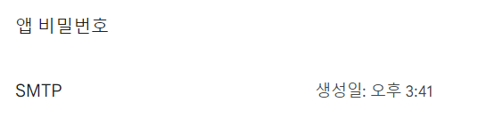
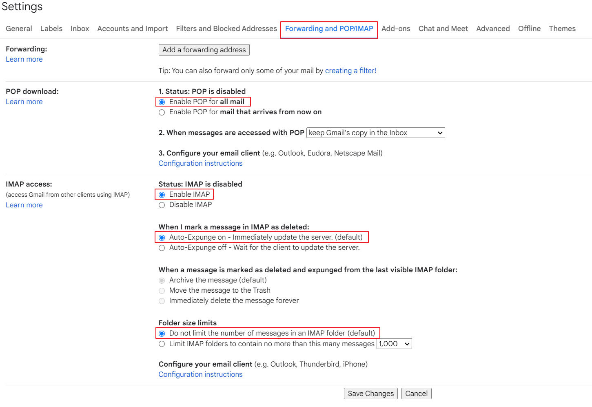
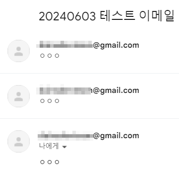
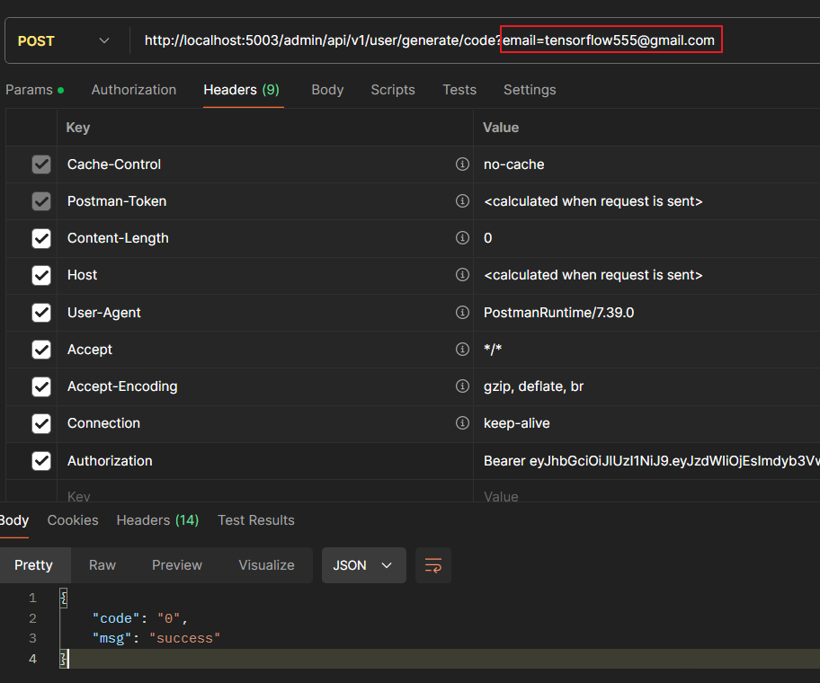
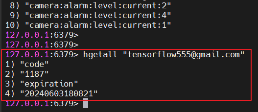
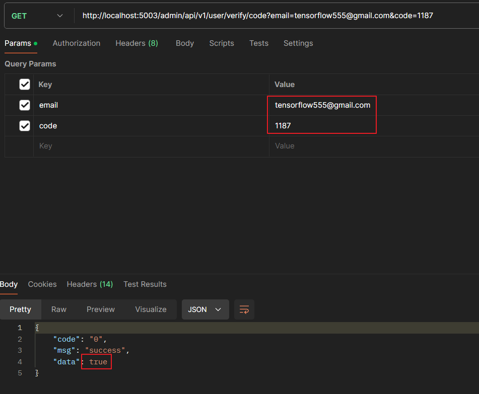
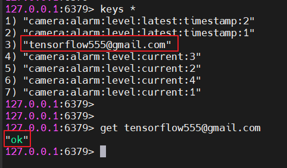

## 비밀번호 찾기 & 재설정 기능 구현(Google SMTP)

사내 비밀번호 찾기/초기화 기능을 위해 Email 인증을 자체 SMTP 서버를 만들어서 하려다가, 귀찮아서 Google SMTP를 이용하기로 했습니다.

<br>

우선 Google 계정 설정에 들어가서 아래 2개의 작업을 해줍니다.

- Multi Factor Authentication(2FA) 활성화
- App Password 생성



<br>

그리고 Gmail 탭으로 들어가 Mail 설정의 Forwarding and POP/IMAP 탭에 들어가서 아래와 같이 설정합니다.



---
## Spring Boot Server 설정

> **build.gradle 파일에 Mail 추가**

```groovy
implementation 'org.springframework.boot:spring-boot-starter-mail'
```

<br>

 > **application.yml 파일에 메일 설정**

```yaml
spring: 
  mail:  
    host: smtp.gmail.com  
    port: 587  
    username: dainsdevteam  
    password: abcd 
    properties:  
      mail.smtp.debug: true  
      mail.smtp.connection timeout: 1000 #1초  
      mail.starttls.enable: true  
      mail.smtp.auth: true
```

<br>

> **Mail Config 작성**

```java
@Configuration  
@RequiredArgsConstructor  
public class MailConfig {  
    private static final String MAIL_SMTP_AUTH = "mail.smtp.auth";  
    private static final String MAIL_DEBUG = "mail.stmp.debug";  
    private static final String MAIL_CONNECTION_TIMEOUT = "mail.smtp.connectiontimeout";  
    private static final String MAIL_SMTP_STARTTLS_ENABLE = "mail.smtp.starttls.enable";  
  
    // SMTP 서버  
    @Value("${spring.mail.host}")  
    private String host;  
  
    // 계정  
    @Value("${spring.mail.username}")  
    private String username;  
  
    // 비밀번호  
    @Value("${spring.mail.password}")  
    private String password;  
  
    // 포트번호  
    @Value("${spring.mail.port}")  
    private int port;  
  
    @Value("${spring.mail.properties.mail.smtp.auth}")  
    private boolean auth;  
  
    @Value("${spring.mail.properties.mail.smtp.debug}")  
    private boolean debug;  
  
    @Value("${spring.mail.properties.mail.smtp.connectiontimeout}")  
    private int connectionTimeout;  
  
    @Value("${spring.mail.properties.mail.starttls.enable}")  
    private boolean startTlsEnable;  
  
    @Bean  
    public JavaMailSender mailSender() {  
        // Sender 정보 추가  
        JavaMailSenderImpl javaMailSender = new JavaMailSenderImpl();  
        javaMailSender.setHost(host);  
        javaMailSender.setUsername(username);  
        javaMailSender.setPassword(password);  
        javaMailSender.setPort(port);  
  
        // Mail Properties 추가  
        Properties properties = javaMailSender.getJavaMailProperties();  
        properties.put(MAIL_SMTP_AUTH, auth);  
        properties.put(MAIL_DEBUG, debug);  
        properties.put(MAIL_CONNECTION_TIMEOUT, connectionTimeout);  
        properties.put(MAIL_SMTP_STARTTLS_ENABLE, startTlsEnable);  
  
        javaMailSender.setJavaMailProperties(properties);  
        javaMailSender.setDefaultEncoding("UTF-8");  
  
        return javaMailSender;  
    }  
}
```

<br>

> **Mail Service로 테스트 이메일 보내보기**

```java
@Slf4j  
@Service  
@Scheduled  
@Transactional(readOnly = true)  
@RequiredArgsConstructor  
public class MailService {  
    private final JavaMailSender mailSender;  
  
    public void sendEmail(String receiver, String title, String text) {  
        SimpleMailMessage message = new SimpleMailMessage();  
        message.setTo(receiver);  
        message.setSubject(DateUtil.getDate() + " " + title);  
        message.setText(text);  
  
        try {  
            mailSender.send(message);  
        } catch (RuntimeException e) {  
            log.warn("Failed to Send Email - {}", receiver);  
            throw new CommonException(CommonExceptionCode.SERVER_ERROR);  
        }  
    }  
  
    @Scheduled(fixedRate = 5000)  
    public void emailScheduler() {  
        sendEmail("tensorflow555@gmail.com", "테스트 이메일", "ㅇㅇㅇ");  
    }  
}
```



<br>

> **랜덤 인증번호 생성 & 인증번호 검증 함수 구현**

- 인증번호를 생성할 때 Redis Hash를 생성해 code, expiration Key/Value를 넣고 Expire를 120초로 설정해줍니다.
- 인증번호 검증 성공 시, 즉시 Redis Hash를 제거합니다.
- Redis Hash 제거 후, 비밀번호 초기화 및 재설정 API에서 사용할 Redis Key를 1개 만들어 "ok"를 저장해줍니다.

```java
@Slf4j  
@Service  
@Transactional(readOnly = true)  
@RequiredArgsConstructor  
public class MailService {  
    private final AdmUserRepository admUserRepository;  
    private static final String TITLE = "비밀번호 재설정 인증번호";  
    private final JavaMailSender mailSender;  
    private final JwtProvider jwtProvider;  
    private final RedisTemplate<String, Object> redisTemplate;  
  
    // Send Mail  
    public void sendEmail(String receiver) {  
        SimpleMailMessage message = new SimpleMailMessage();  
        String to = receiver;  
        String code = this.generateAuthCode();  
  
        message.setTo(to);  
        message.setSubject(TITLE);  
        message.setText(code);  
  
        // Redis에 인증코드 + 수신자 저장, 120초로 만료시간 설정  
        redisTemplate.opsForHash().put(receiver, "code", code);  
        redisTemplate.opsForHash().put(receiver, "expiration", DateUtil.getTime());  
        redisTemplate.expire(receiver, 120, TimeUnit.SECONDS);  
  
        try {  
            mailSender.send(message);  
        } catch (RuntimeException e) {  
            log.warn("Failed to Send Email - {}", receiver);  
            throw new CommonException(CommonExceptionCode.SERVER_ERROR);  
        }  
    }  
  
    // 4자리 인증번호 생성  
    public String generateAuthCode() {  
        try {  
            Random random = SecureRandom.getInstanceStrong();  
            StringBuilder codeBuilder = new StringBuilder();  
  
            for (int i = 0; i < 4; i++) {  
                codeBuilder.append(random.nextInt(10));  
            }  
  
            return codeBuilder.toString();  
        } catch (Exception e) {  
            log.warn("Failed to generate auth code - {}", e.getMessage());  
            throw new CommonException(CommonExceptionCode.SERVER_ERROR);  
        }  
    }  
  
    // 인증코드 검증  
    public boolean verifyAuthCode(String email, String authCode) {  
        try {  
            Optional<AdmUser> optUser = admUserRepository.searchUserByEmail(email);  
  
            AdmUser user = null;  
            if (optUser.isPresent()) user = optUser.get();  
            else throw new CommonException(CommonExceptionCode.NOT_EXIST_USER);  
  
            String key = user.getEmail();  
            String now = DateUtil.getTime();  
            String redisCode = (String) redisTemplate.opsForHash().get(user.getEmail(), "code");  
            String expiration = (String) redisTemplate.opsForHash().get(user.getEmail(), "expiration");  
  
            // 현재 시간과 만료 시간의 차이를 milli second로 반환  
            long checkExpirationTime = DateUtil.getSecondsDifference(now, expiration);  
  
            // 만료시간 120초로 설정  
            if (checkExpirationTime < 120 && redisCode.equals(authCode)) {  
                // 인증 성공 시, Redis Hash 삭제  
                redisTemplate.opsForHash().delete(key, "code");  
                redisTemplate.opsForHash().delete(key, "time");  
  
                // 비밀번호 재설정 API 에서 사용할 Redis Key 추가(OK 사인)  
                redisTemplate.opsForValue().set(user.getEmail(), "ok", 120, TimeUnit.SECONDS); 
                  
                return true;  
            } else {  
                redisTemplate.opsForHash().delete(key, "code");  
                redisTemplate.opsForHash().delete(key, "time");  
                  
                return false;  
            }  
        } catch (Exception e) {  
            e.printStackTrace();  
        }  
          
        return false;  
    }  
}
```

<br>

> **컨트롤러 작성**

```java
@PreAuth(componentId = 4, authorization = AuthorizationType.Create)  
@PostMapping("/generate/code")  
public ResponseEntity requestAuthCode(CustomHttpServletRequest request, @RequestParam("email") String email) { 
    mailService.sendEmail(email);  
    return new ResponseEntity(ApiResponseDto.makeSuccessResponse(), HttpStatus.OK);  
}  
  
@PreAuth(componentId = 4, authorization = AuthorizationType.Read)  
@GetMapping("/verify/code")  
public ResponseEntity verifyAuthCode(CustomHttpServletRequest request, @RequestParam("email") String email, @RequestParam("code") String code) {  
    return new ResponseEntity(ApiResponseDto.makeResponse(mailService.verifyAuthCode(email, code)), HttpStatus.OK);  
}
```

<br>

> **인증번호 생성 & 검증하기**

**PostMan으로 요청을 보내 인증번호를 받습니다.**



<br>

**이메일 확인**


<br>

**Redis Hash를 보면 코드와 만료시간이 들어가 있습니다.**



<br>

**인증번호 검증 API를 호출해보면 120초 이내에 요청하고, 검증이 성공해 true 반환**



<br>

이후 비밀번호 재설정 및 초기화 로직은 인증코드 검증 시 마지막에 추가한 Redis Key를 이용해,

비밀번호를 새로 넣어주고 사용한 Redis Key는 제거 해주었고, 다시 로그인을 하니 비밀번호가 잘 바뀐걸 확인할 수 있습니다.

```java
@Transactional  
public void generateNewPassword(final Integer userId, final String password) {  
    AdmUser user = admUserRepositoryInf.findAdmUserByUserId(userId);  
  
    if (user != null) {  
        String sign = (String) redisTemplate.opsForValue().get(user.getEmail());  
  
        if ("ok".equals(sign)) {  
            BCryptPasswordEncoder encoder = new BCryptPasswordEncoder();  
            String newPassword = encoder.encode(password);  
  
            user.changeAdminPassword(newPassword);  
            admUserRepositoryInf.save(user);  
            redisTemplate.delete(user.getEmail());  
        } else {  
            throw new CommonException(CommonExceptionCode.ACCESS_DENIED);  
        }  
    } else {  
        throw new CommonException(CommonExceptionCode.NOT_EXIST_USER);  
    }  
}
```

