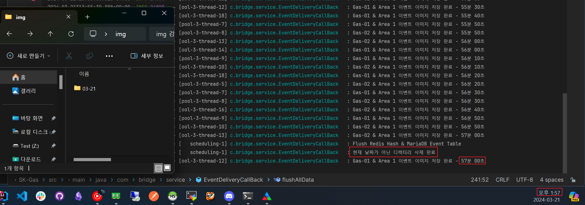

## Java - File & Diretory 삭제 (Recursive)

Scheduler를 이용하여 특정 시간에 오늘 날짜가 아닌 디렉터리와 디렉터리 내부의 파일들을 주기적으로 제거하는 로직을 만들던 중,

자바에서는 디렉터리 내부에 파일이 존재하면 디렉터리 삭제가 불가능한걸 알았습니다.

그래서 디렉터리 내부에 복잡한 트리구조의 디렉터리와 파일들이 있어도 손쉽게 제거할 수 있게 Recursive한 방법으로 구현 해 보았습니다.

---

## 구현

### saveImageFile()

- 현재 날짜("MM-dd")형식의 디렉터리 생성
- 디렉터리 내부에 RabbitMQ RoutingKey + TimeStamp.png 형식의 이미지 파일 저장

```java
    private String saveImageFile(final String base64EncodedImage, final String instanceName, String zoneName, String timeStamp) {
    String fullPath = "";
    String imageUri = "";

    if (!StringUtils.hasLength(base64EncodedImage)) return "";

    try {
        byte[] decodedBytes = Base64.getDecoder().decode(base64EncodedImage);
        String directory = props.getEventImagePath();

        if (!directory.endsWith(File.separator)) {
            directory = directory + File.separator;
        }

        String yyyymmdd = timeStamp.substring(0, 8);

        // 이미지를 저장할 하위 디렉터리 경로 생성 : "02-22/"
        StringBuilder imagePathBuilder = new StringBuilder();
        String imagePath = imagePathBuilder
                .append(yyyymmdd, 4, 6)
                .append("-")
                .append(yyyymmdd, 6, 8)
                .append(File.separator)
                .toString();

        // 전체 디렉터리 경로에 이미지 하위디렉터리 경로 추가 : "/{image-path}/02-22/"
        directory += imagePath;

        // 이미지 파일명 생성 : "routingKey_zoneName_131313.png (시,분,초)
        String imageFileName = instanceName + "_" + timeStamp.substring(8, 14) + ".png";

        File file = new File(directory);

        if (!file.exists()) {
            file.mkdirs();
        }

        // 이미지 URI 생성 : "02-22/routingKey_131313.png"
        imageUri = File.separator + imagePath + imageFileName;

        // 전체 파일 경로 생성 : "/{image-path}/02-22/routingKey_131313.png"
        fullPath = directory + imageFileName;

        // Full Path를 Paths 객체로 변환
        Path outputPath = Paths.get(fullPath);

        // 디코딩된 이미지 데이터를 파일로 저장
        Files.write(outputPath, decodedBytes);
        log.info("{} & {} 이벤트 이미지 저장 완료 - {}분 {}초", instanceName, zoneName, timeStamp.substring(10, 12), timeStamp.substring(12, 14));
    } catch (Exception e) {
        log.warn("Save Image Exception : {}", e.getMessage());
    }

    return imageUri;
}
```

<br>

**저장된 이미지**


<br>

### deleteDerectory() & deleteFiles()

- BasePath의 하위 Files들을 모두 가져와 만약 디렉터리라면 deleteFiles() 함수 호출
- deleteFiles()에서 똑같이 디렉터리인지 확인 후 디렉터리라면 똑같이 재귀 호출 후,
- 내부에 파일들 삭제 후 마지막에 빈 디렉터리 삭제

```java
    private void deleteDirectory() {
        String today = LocalDate.now().format(DateTimeFormatter.ofPattern("MM-dd"));

        String baseDirectory = props.getEventImagePath();
        File baseDir = new File(baseDirectory);

        File[] files = baseDir.listFiles();

        if (files != null) {
            for (File file : files) {
                if (file.isDirectory() && !file.getName().equals(today)) {
                    deleteFiles(file);
                } else {
                    file.delete();
                }
            }
        }
        log.info("현재 날짜가 아닌 디렉터리 삭제 완료");
    }

    private void deleteFiles(File file) {
        File[] allContents = file.listFiles();
        if (allContents != null) {
            for (File f : allContents) {
                if (f.isDirectory()) {
                    deleteFiles(f);
                } else {
                    f.delete();
                }
            }
        }
        file.delete();
    }
```

<br>

**디렉터리 제거 함수 호출 전 디렉터리 목록**

현재 날짜는 2024년 3월 21로 "03-21" 디렉터리 외에 디렉터리는 전부 지워져야 합니다.


<br>

**함수 호출 후 지워진 디렉터리와 내부 파일들**

"03-21" 디렉터리 외에 전부 삭제가 되었습니다.

