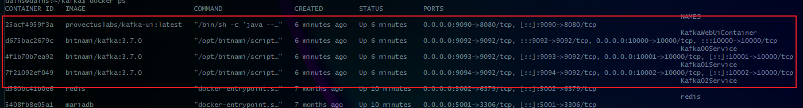
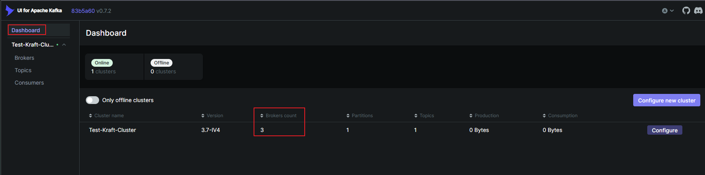
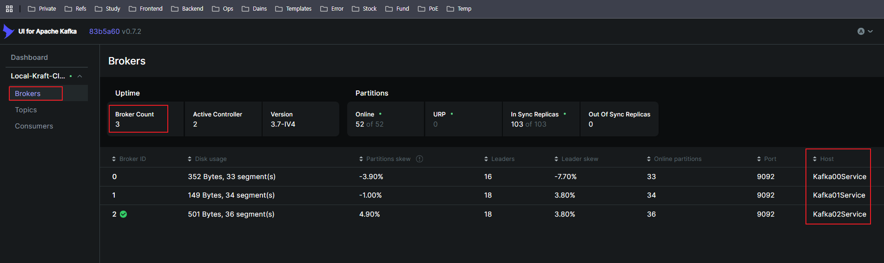
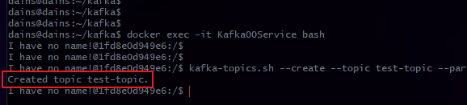
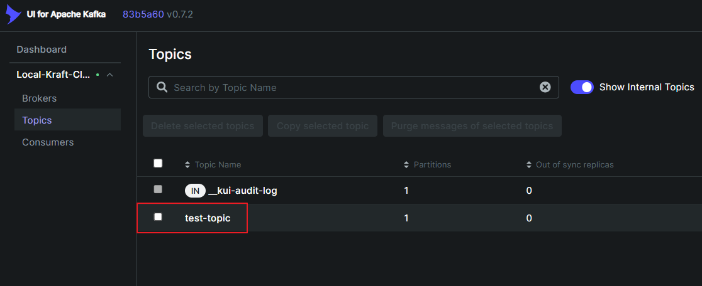
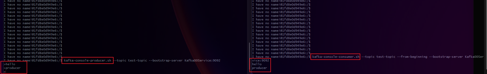
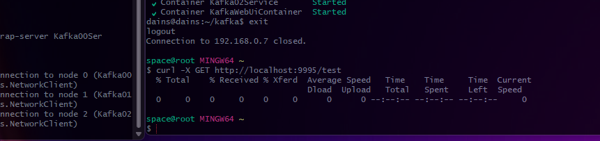
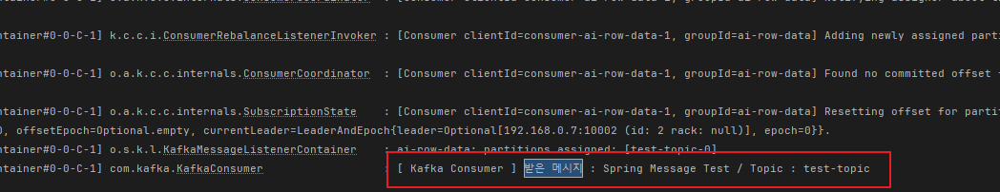

## 📚 Kafka

이번에 Kafka를 공식문서를 보며 따라 구현해보고 있습니다.

사내에서 진행하는 프로젝트들중 대부분은 RabbitMQ를 이용한 초당 데이터가 몇 안되는 작은 데이터 파이프라인을 사용 중 이었습니다.

하지만 이번에 새로 개발하는 플랫폼에서는 수백군데의 고객사 데이터를 중앙서버 한곳에서 모든 데이터 스트림을 Consume 해야하는 요구사항이 있었고 RabbitMQ로는 데이터 처리량이 부족할 거 같아,

실무 적용까지는 한참 공부해야 겠지만, 무작정 구현해보고자 우선 구현 후 글을 작성합니다.


<br>

### Kafka를 사용하려는 이유

**1. 귀찮음**

- 기존에 각각 다른 서버에 RabbitMQ를 개별적으로 설치하고, Queue 생성, Binding 설정, Exchange 관리 등 반복적인 작업이 많았음.
- 프로젝트마다 새로운 서버를 추가할 때마다 RabbitMQ 설정을 매번 새로 해야 하는 번거로움이 존재.
- RabbitMQ Clustering도 고려했지만, 유지보수 비용이 크고, Cluster 간 메시지 동기화 문제로 성능이 저하될 위험이 있음.
- 그래서 이번 기회에 Kafka Cluster를 도입하여 단일 메시징 시스템으로 통합하기로 결정!

<br>

**2. 고가용성 및 확장성**

- RabbitMQ는 개별 브로커가 독립적으로 동작하여, 서버 추가 시마다 개별 설정이 필요했음.
- Kafka는 기본적으로 클러스터 기반이라, 새로운 서버를 추가해도 자동으로 파티션을 분배하고, 부하를 분산할 수 있음
- RabbitMQ는 HA(High Availability) 구성을 별도로 해야 하지만, Kafka는 Replication Factor 설정만 하면 자동으로 고가용성이 보장됨
- 새로운 서비스나 서버가 추가될 때도 Kafka에 Producer/Consumer만 붙이면 끝이고, RabbitMQ처럼 일일이 설정할 필요 없이 확장 가능!

<br>

**3. 메시지 유실 방지 & 데이터 재처리**

- RabbitMQ는 기본적으로 메시지를 Queue에서 꺼내면 삭제되고, 메시지 손실 방지를 위해 Persistent 설정을 해야 함
- Kafka는 메시지를 디스크에 저장하며 일정 기간 유지할 수 있음.
  - → 장애가 발생하더라도 특정 시간 이후부터 다시 메시지를 읽을 수 있음.
- 실수로 Consumer가 장애로 인해 메시지를 못 가져갔다면?
  - RabbitMQ는 메시지를 복구할 수 없지만, Kafka는 그대로 남아 있어서 다시 처리 가능.

<br>

**4. 스트리밍 & 실시간 데이터 처리**

- Kafka는 단순 메시징 시스템이 아니라, 스트리밍 데이터 처리에도 강하고, 보통 프로젝트를 할 때 실시간으로 변하는 AI Data 통계 차트를 보여줘야 하는 경우가 많음.
- Kafka Streams나 Flink 같은 기술과 연계하면 강력한 실시간 분석 시스템 구축 가능하고, RabbitMQ는 기본적으로 메시지를 저장하고 삭제하는 용도라 실시간 스트리밍 분석에 적합하지 않음.

---

## 📚 서버에 Kafka 설치 (Ubuntu 22.04 LTS / Docker-Compose)

**Yaml 설정**

- Kafka 클러스터 내의 서비스들이 서로 통신할 수 있도록 독립적인 Docker Network 설정
- Kafka Stream의 데이터 저장을 위해 각 브로커 별로 Local Drive를 사용하는 Docker Volumn 설정 (Kafka00 ~ 02)
- Kafka00~02 3개의 노드로 클러스터를 형성하고, 각 브로커마다 KRaft 모드를 사용해 컨트롤러와 브로커 역할을 동시에 수행함

<br>

**Port 설정**

- Kafka00 ~ 03에 바인딩한 9092 ~ 9094(내부포트) / 10000 ~ 10002(외부포트) 포트가 있음
- 내부 포트가 필요한 이유는 브로커간 내부 통신(메타데이터 동기화 및 데이터 복제)에 사용됨
- 외부 포트가 필요한 이유는 외부 Client가 Kafka Producer를 통해 데이터를 보내고 보낸 데이터의 분산 처리 및 수집을 위해 사용됨

<br>

**KRaft 모드란?**

- KRaft 모드는 ZooKeeper 없이 Kafka Cluster를 운영할 수 있도록 하는 Kafka의 새로운 운영 모드임
- `KAFKA_ENABLE_KRAFT=yes`로 설장하면 활성화되며 Kafka 브로커들이 스스로 클러스터를 관리하고 메타데이터를 유지함
- 이 모드에서는 Kafka 브로커가 클러스터의 구성과 상태를 관리하는 `컨트롤러 쿼럼` 역할을 수항하며, 데이터의 저장과 전송을 담당하는 `브로커`의 역할을 동시에 수행함
- **컨트롤러 쿼럼을 통한 고가용성** : `KAFKA_CFG_CONTROLLER_QUORUM_VOTERS` env 변수는 KRaft 모드에서 각 브로커가 컨트롤러 쿼럼에 참여하도록 설정한다.
  - 이 변수는 클러스터의 메타데이터 변경 작업(리더 선출, 파티션 이동 등등)을 처리하는 브로커들 사이의 투표를 통해 합의를 이룰 수 있게 한다.
  - 이 설정을 통해 클러스터의 메타데이터의 일관성을 보장한다.

<br>

### **yaml 설정 중 주의할 점**

- `KAFKA_CFG_CONTROLLER_QUORUM_VOTERS=0@Kafka00Service:9093,1@Kafka01Service:9093,2@Kafka02Service:9093` 부분은 Kafka 클래스터 내부의 Broker들이 사용하는 내부 통신용이므로 Container 이름으로 지정해도 되지만,
- `KAFKA_CFG_ADVERTISED_LISTENERS=PLAINTEXT` 부분은 외부 서버(Spring Boot)에서 접근해야 하기 떄문에 Kafka Cluster가 위치한 서버의 IP를 지정해줘야 Spring 에서 `UnknownHostException`이 뜨지 않음.

```yaml
version: '3.8'

networks:
  kafka_network:

volumes:
  Kafka00:
    driver: local
  Kafka01:
    driver: local
  Kafka02:
    driver: local

services:
  Kafka00Service:
    image: bitnami/kafka:3.7.0
    restart: unless-stopped
    container_name: Kafka00Service
    ports:
      - '9092:9092' # 내부 네트워크 통신을 위한 PLAINTEXT 리스너
      - '10000:10000' # 외부 접근을 위한 EXTERNAL 리스너
    environment:
      # KRaft 설정
      - KAFKA_ENABLE_KRAFT=yes # KRaft 모드 활성화
      - KAFKA_CFG_BROKER_ID=0
      - KAFKA_CFG_NODE_ID=0
      - KAFKA_KRAFT_CLUSTER_ID=HsDBs9l6UUmQq7Y5E6bNlw # 고유 클러스터 ID, 모든 브로커에 동일하게 설정
      - KAFKA_CFG_CONTROLLER_QUORUM_VOTERS=0@Kafka00Service:9093,1@Kafka01Service:9093,2@Kafka02Service:9093
      - KAFKA_CFG_PROCESS_ROLES=controller,broker
      # 리스너 설정
      - KAFKA_CFG_AUTO_CREATE_TOPICS_ENABLE=true
      - ALLOW_PLAINTEXT_LISTENER=yes
      - KAFKA_CFG_LISTENERS=PLAINTEXT://:9092,CONTROLLER://:9093,EXTERNAL://:10000
      - KAFKA_CFG_ADVERTISED_LISTENERS=PLAINTEXT://192.168.0.7:9092,EXTERNAL://192.168.0.7:10000
      - KAFKA_CFG_LISTENER_SECURITY_PROTOCOL_MAP=PLAINTEXT:PLAINTEXT,CONTROLLER:PLAINTEXT,EXTERNAL:PLAINTEXT
      - KAFKA_CFG_CONTROLLER_LISTENER_NAMES=CONTROLLER
      # 클러스터 설정
      - KAFKA_CFG_OFFSETS_TOPIC_REPLICATION_FACTOR=2
      - KAFKA_CFG_TRANSACTION_STATE_LOG_REPLICATION_FACTOR=2
      - KAFKA_CFG_TRANSACTION_STATE_LOG_MIN_ISR=2
    networks:
      - kafka_network
    volumes:
      - Kafka00:/bitnami/kafka

  Kafka01Service:
    image: bitnami/kafka:3.7.0
    restart: unless-stopped
    container_name: Kafka01Service
    ports:
      - '9093:9092' # 내부 네트워크 통신을 위한 PLAINTEXT 리스너
      - '10001:10000' # 외부 접근을 위한 EXTERNAL 리스너
    environment:
      # KRaft 설정
      - KAFKA_ENABLE_KRAFT=yes # KRaft 모드 활성화
      - KAFKA_CFG_BROKER_ID=1
      - KAFKA_CFG_NODE_ID=1
      - KAFKA_KRAFT_CLUSTER_ID=HsDBs9l6UUmQq7Y5E6bNlw # 고유 클러스터 ID, 모든 브로커에 동일하게 설정
      - KAFKA_CFG_CONTROLLER_QUORUM_VOTERS=0@Kafka00Service:9093,1@Kafka01Service:9093,2@Kafka02Service:9093
      - KAFKA_CFG_PROCESS_ROLES=controller,broker
      # 리스너 설정
      - KAFKA_CFG_AUTO_CREATE_TOPICS_ENABLE=true
      - ALLOW_PLAINTEXT_LISTENER=yes
      - KAFKA_CFG_LISTENERS=PLAINTEXT://:9092,CONTROLLER://:9093,EXTERNAL://:10000
      - KAFKA_CFG_ADVERTISED_LISTENERS=PLAINTEXT://192.168.0.7:9092,EXTERNAL://192.168.0.7:10001
      - KAFKA_CFG_LISTENER_SECURITY_PROTOCOL_MAP=PLAINTEXT:PLAINTEXT,CONTROLLER:PLAINTEXT,EXTERNAL:PLAINTEXT
      - KAFKA_CFG_CONTROLLER_LISTENER_NAMES=CONTROLLER
      # 클러스터 설정
      - KAFKA_CFG_OFFSETS_TOPIC_REPLICATION_FACTOR=2
      - KAFKA_CFG_TRANSACTION_STATE_LOG_REPLICATION_FACTOR=2
      - KAFKA_CFG_TRANSACTION_STATE_LOG_MIN_ISR=2
    networks:
      - kafka_network
    volumes:
      - Kafka01:/bitnami/kafka

  Kafka02Service:
    image: bitnami/kafka:3.7.0
    restart: unless-stopped
    container_name: Kafka02Service
    ports:
      - '9094:9092' # 내부 네트워크 통신을 위한 PLAINTEXT 리스너
      - '10002:10000' # 외부 접근을 위한 EXTERNAL 리스너
    environment:
      # KRaft 설정
      - KAFKA_ENABLE_KRAFT=yes # KRaft 모드 활성화
      - KAFKA_CFG_BROKER_ID=2
      - KAFKA_CFG_NODE_ID=2
      - KAFKA_KRAFT_CLUSTER_ID=HsDBs9l6UUmQq7Y5E6bNlw # 고유 클러스터 ID, 모든 브로커에 동일하게 설정
      - KAFKA_CFG_CONTROLLER_QUORUM_VOTERS=0@Kafka00Service:9093,1@Kafka01Service:9093,2@Kafka02Service:9093
      - KAFKA_CFG_PROCESS_ROLES=controller,broker
      # 리스너 설정
      - KAFKA_CFG_AUTO_CREATE_TOPICS_ENABLE=true
      - ALLOW_PLAINTEXT_LISTENER=yes
      - KAFKA_CFG_LISTENERS=PLAINTEXT://:9092,CONTROLLER://:9093,EXTERNAL://:10000
      - KAFKA_CFG_ADVERTISED_LISTENERS=PLAINTEXT://192.168.0.7:9092,EXTERNAL://192.168.0.7:10002
      - KAFKA_CFG_LISTENER_SECURITY_PROTOCOL_MAP=PLAINTEXT:PLAINTEXT,CONTROLLER:PLAINTEXT,EXTERNAL:PLAINTEXT
      - KAFKA_CFG_CONTROLLER_LISTENER_NAMES=CONTROLLER
      # 클러스터 설정
      - KAFKA_CFG_OFFSETS_TOPIC_REPLICATION_FACTOR=2
      - KAFKA_CFG_TRANSACTION_STATE_LOG_REPLICATION_FACTOR=2
      - KAFKA_CFG_TRANSACTION_STATE_LOG_MIN_ISR=2
    networks:
      - kafka_network
    volumes:
      - Kafka02:/bitnami/kafka

  KafkaWebUiService:
    image: provectuslabs/kafka-ui:latest
    restart: unless-stopped
    container_name: KafkaWebUiContainer
    ports:
      - '9090:8080' # 호스트의 9090 포트를 컨테이너의 8080 포트에 바인딩
    environment:
      - KAFKA_CLUSTERS_0_NAME=Local-Kraft-Cluster
      - KAFKA_CLUSTERS_0_BOOTSTRAPSERVERS=Kafka00Service:9092,Kafka01Service:9092,Kafka02Service:9092
      - DYNAMIC_CONFIG_ENABLED=true
      - KAFKA_CLUSTERS_0_AUDIT_TOPICAUDITENABLED=true
      - KAFKA_CLUSTERS_0_AUDIT_CONSOLEAUDITENABLED=true
    depends_on:
      - Kafka00Service
      - Kafka01Service
      - Kafka02Service
    networks:
      - kafka_network
```

<br>

yaml 파일을 작성하고 아래 명령으로 compose를 실행시켜 줍니다.

```bash
docker-compose up -d
```

정상적으로 실행이 되었다면 총 4개의 컨테이너가 뜬 것을 볼 수 있습니다.



<br>

그리고 Kafka WebUI를 9090포트로 설정했으니 들어가서 브로커들이 잘 인식 되는지 확인해봅니다.





---

## 📚 Topic 생성

Kafka의 Producer와 Consumer는 Topic을 통해 서로 메시지를 주고 받습니다.

위에 만들어진 Kafka00 ~ 02 Service중 00Service에 Topic을 생성해 보겠습니다.

<br>

아래 Topic 생성 명령어 중 잘 설정해야 하는 옵션은 `--partitions`와 `--replication-factor` 옵션입니다.

저는 임시로 15개의 각각 다른 서버에서 Producer를 통해 특정 토픽(test-topic)에 메시지를 보내고 1개의 메인서버(Consumer)에서 데이터를 Consume 하는 시나리오를 기반으로 구현합니다.

<br>

### Partition(파티션) 옵션

Kafka에서 데이터를 분산 저장하고 처리 속도를 높이기 위한 단위.

<br>

**✅ 개념**

- 하나의 토픽을 여러 개의 파티션으로 나눠 저장하여 병렬 처리가 가능하도록 한다.
- 각 파티션은 개별적인 로그 파일이며, 데이터가 시간 순서대로 추가된다.
- Producer는 데이터를 특정 파티션에 보내고, Consumer는 여러 파티션에서 데이터를 병렬로 소비할 수 있다.
- partition 수가 많을수록 더 많은 Consumer가 데이터를 병렬로 처리할 수 있음.

<br>

**✅ Partition 수를 늘리면 생기는 효과**

- Throughput 증가 → 여러 파티션에 데이터를 나눠 저장하여 처리 속도가 향상됨.
- Consumer 병렬 처리 가능 → Consumer Group이 여러 개의 Consumer를 활용하여 데이터를 나눠 처리할 수 있음.
- 데이터 정렬 보장 범위가 줄어듦 → 같은 파티션 안에서는 순서가 보장되지만, 서로 다른 파티션 간에는 순서가 보장되지 않음.

<br>

**✅ Partition 동작 방식**

- Producer가 데이터를 전송할 때 특정 파티션을 지정할 수도 있고, Kafka가 자동으로 분배할 수도 있음.

```java
kafkaTemplate.send("test-topic", "key", "message");
```

<br>

이 경우, Key가 동일한 데이터는 항상 같은 파티션으로 전송됨.
Key가 없으면 Round-Robin 방식으로 자동 분배됨.

<br>

### Replication-Factor(복제 계수) 옵션

데이터의 내구성과 가용성을 보장하기 위한 복제 개수.

<br>

**✅ 개념**

- replication-factor는 각 파티션을 몇 개의 노드에 복제할지 결정하는 옵션.
- Kafka 클러스터 내에서 장애가 발생하더라도 데이터를 보호하기 위해 사용됨.
- 최소 2 이상의 값을 사용하여 하나의 노드가 다운되더라도 데이터를 유지할 수 있도록 하는 것이 일반적.

<br>

**✅ Replication Factor 동작 방식**

- 예를 들어 replication-factor=2이면, 각 파티션의 데이터가 두 개의 브로커에 복제됨.
- 한 브로커가 다운되더라도 다른 브로커에서 데이터를 유지할 수 있음.
- Primary Replica(리더): 특정 파티션에서 데이터를 읽고 쓰는 역할을 수행하는 브로커.
- Follower Replica(팔로워): Primary Replica를 복제하여 백업 역할을 수행함.
- Leader-Follower 방식을 통해 하나의 노드가 장애가 발생하면 자동으로 다른 노드가 리더 역할을 수행.


<br>

**명령어**

```bash
docker exec -it Kafka00Service bash # 컨테이너 진입

# --topic test-topic → test-topic이라는 토픽 생성
# --partitions 15 → 파티션 개수 (여러 개 사용 가능)
# --replication-factor 2 → 브로커들 간의 복제본 개수
# --bootstrap-server Kafka00Service:9092 → Kafka 브로커와 통신할 주소
kafka-topics.sh --create --topic test-topic --partitions 15 --replication-factor 2 --bootstrap-server Kafka00Service:9092 # test-topic 생성


# Topic이 잘 생성되었는지 확인
kafka-topics.sh --list --bootstrap-server Kafka00Service:9092
```





<br>

### Producer & Consumer 실행해서 메시지 보내보기

터미널을 2개 켜서 임시로 만든 `test-topic`을 이용해 Kafkf00Service의 Producer & Consumer를 실행해 메시지를 보내서 잘 도착하는지 확인 합니다.

```bash
# Producer 실행
kafka-console-producer.sh --topic test-topic --bootstrap-server Kafka00Service:9092

# Consumer 실행
kafka-console-consumer.sh --topic test-topic --from-beginning --bootstrap-server Kafka00Service:9092
```

<br>

Producer와 Consumer를 싱행하고 Producer에서 메시지를 보내면 Consumer에 바로 메시지가 도착하는 것을 볼 수 있습니다.



---

## 📚 Spring Boot에 Kafka 적용

### build.gradle

`build.gradlw`에 Kafka 의존성을 추가합니다.

```groovy
implementation 'org.springframework.kafka:spring-kafka'
```

<br>

### application.yml

yml 파일에서 주의할 점은 `bootstrap-servers` 부분을 producer와 consumer 둘다 적용되도록 spring.kafka 하위에 명시해줘야 Spring에서 UnknownHostException이 안뜹니다.

그리고 저는 위에서 말한 시나리오 대로 각각 15개의 다른 서버에서 각각의 Producer가 메시지를 보내고 1개의 서버에서 Consume을 한다고 했으니,

아래 Yml 설정에서 메인서버는 `producer` 부분을 빼고 배포하고, 데이터를 보내는 Producer 서버들의 설정에는 `consumer` 부분을 빼서 서버를 실행시켜야 합니다.

```yaml
server:
  port: 9995

spring:
  kafka:
    bootstrap-servers: 192.168.0.7:10000,192.168.0.7:10001,192.168.0.7:10002 # 카프카 서버 주소, Producer, Consumer 둘다 전역으로 설정. 이거 추가안하면 연결 에러 남
    # Producer 에서만 설정
    producer:
      key-serializer: org.apache.kafka.common.serialization.StringSerializer
      value-serializer: org.apache.kafka.common.serialization.StringSerializer
    # Consumer(메인 서버) 에서만 설정
    consumer:
      group-id: ai-row-data
      auto-offset-reset: earliest
    template:
      default-topic: test-topic
```

<br>

### Producer & Consumer생성

Producer는 아주 간단하게 Spring Message Test 라는 문자열을 위에서 설정한 `test-topic`으로 보내는 단순한 API를 만들어 192.168.0.6번 서버에 배포할 예정입니다.

이 API는 Kafka Producer의 역할을 합니다.

15개에 직접 다 설정은 안할거고 특정 1개 서버(192.168.0.6)에 배포할 예정입니다.

```java
@Slf4j
@RestController
@RequestMapping("/test")
@RequiredArgsConstructor
public class KafkaProducer {
    private final KafkaTemplate<String, String> kafkaTemplate;

    // Producer
    @GetMapping
    public ResponseEntity test() {
        kafkaTemplate.send("test-topic", "Spring Message Test");
        return ResponseEntity.ok().build();
    }
}
```

<br>

이 KafkaConsumer 클래스는 네 로컬 노트북(192.168.0.157)에서 돌릴 예정이며, Producer에서 발행한 Message를 `@KafkaListener`를 통해 특정 토픽을 구독하여 메시지를 받습니다.

로직은 단순히 받은 메시지와 토픽의 이름을 출력하도록 하였습니다.

```java
@Slf4j
@Service
public class KafkaConsumer {
    // Consumer
    @KafkaListener(topics = "test-topic", groupId = "ai-row-data")
    public void listen(ConsumerRecord<String, String> record) {
        log.info("[ Kafka Consumer ] 받은 메시지 : {} / Topic : {}", record.value(), record.topic());
    }
}
```

<br>

이제 6번에 배포한 Producer 역할을 하는 Spring Boot Server를 키고 `/test` API에 GET 요청을 보내면 Kafka Producer를 통해 `test-topc`에 `Spring Message Test`라는 메시지를 발행합니다.



<br>

그리고 로컬 노트북의 Spring Boot Consumer 로그를 보면 test-topic에 Spring Message Test 라는 문자가 도착한 걸 볼 수 있습니다.



<br>

이번 글은 카프카의 동작 방식을 배우기 위해 간단히 만들었으며 실무에 적용하려면 아직 많이 배워야 할 것 같습니다.


