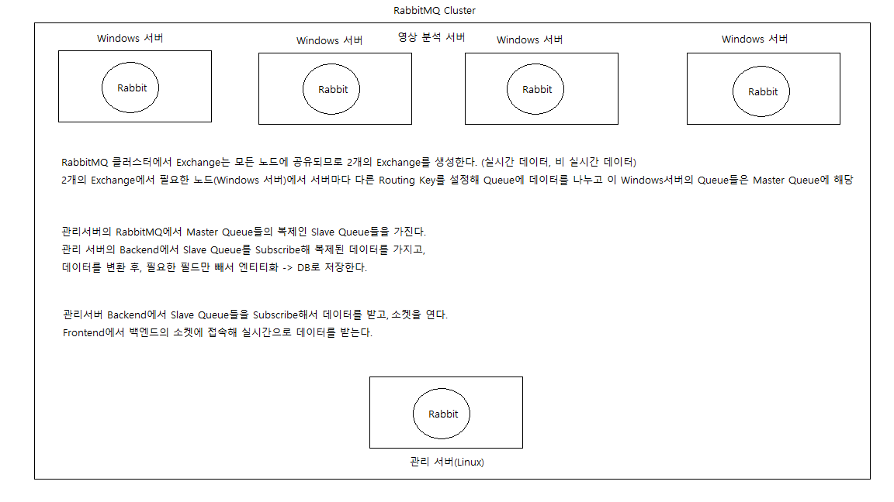
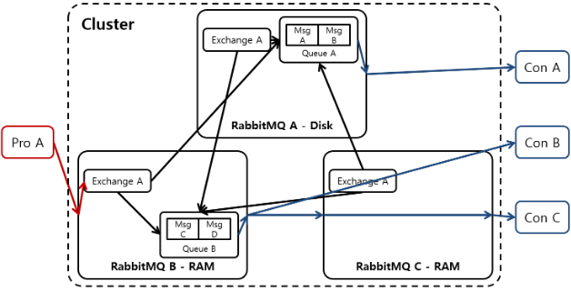
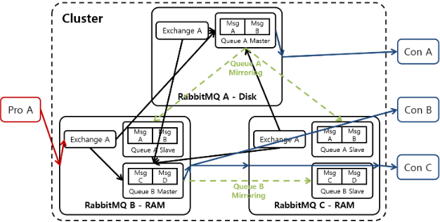
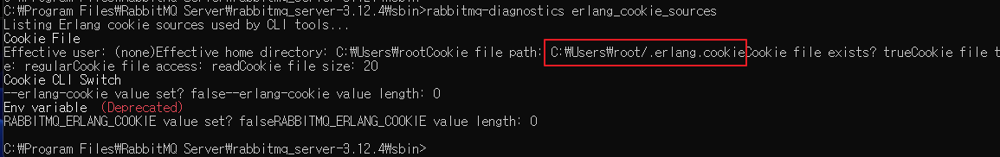
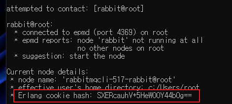
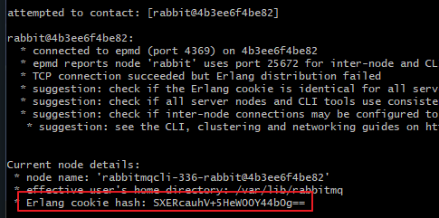

## 📘 요구사항

**내가 구현하고 싶은 그림 (그림 잘 못 그림)**

- **RabbitMQ의 Clustering & Mirroring을 사용해 구현**
- 같은 네트워크에 있는 5개의 서버(WIndows 4, Linux1)에 각각의 RabbitMQ를 설치 해야 함.
- WIndows 서버에 있는 4대의 RabbitMQ + 관리서버(Linux) +1로 클러스터링
- WIndows 서버의 Rabbit은 각각 다른 Exchange/Queue (Master Queue)를 가진다
- Linux 서버의 RabbitMQ는 Windows Rabbit의 각 Queue의 Mirroring인 Slave Queue를 둔다.
- Linux 서버의 Backend Redis에서 Slave Queue들을 Subscribe하고 데이터를 필요에 따라 변환, Maria DB에 저장 한다.
- Frontend에서 Backend의 소켓에 접속해 변환된 MQTT, Json, CSV데이터를 차트에 뿌려 차트를 변화시킨다.



---
## 📘 RabbitMQ Clustering

서로 다른 네트워크에 있는 RabbitMQ 서버를 클러스터링 해 데이터를 라우팅 하는 방법을 찾아보겠습니다.



<br>

RabbitMQ Clustering은 다수의 RabbitMQ를 하나의 RabbitMQ처럼 묶어서 사용하는 방법입니다.

Cluster안의 노드들은 Erlang Cookie라고 불리는 비밀키를 공유하고 이를 통해 동일한 Cluster에 있는 RabbitMQ인지 확인합니다.

동일 클러스터에 있는 모든 RabbitMQ는 동일한 Exchange를 가집니다.

또한 클러스터를 제어하는 CLI Tool 또한 Erlang Cookie를 가지고 있어야 해당 클러스터를 제어할 수 있습니다.

<br>

위 그림을 이해해보면 클러스터는 Exchange를 공유하기 때문에 Producer는 Cluster의 어떤 RabbitMQ와 Connection을 맺어도 상관 없습니다.

Client는 CLuster의 RabbitMQ중 하나와 Connection을 맺지만 고가용성을 위해 Cluster와 Client 사이에 로드밸런서를 두어 모든 RabbitMQ와 Connection LoadBalancing이 되는 환경이면 더 좋습니다.

<br>

그리고, 클러스터를 구성하는 각 RabbitMQ는 `Disk, Ram` 2가지 Mode를 사용할 수 있는데 **Default는 Disk모드** 이며,

클러스터 구성 시 **반드시** 1개 이상의 RabbitMQ는 Disk 모드로 동작해야 합니다.

왜냐하면 Ram Mode의 RabbitMQ는 서비스 재 시작 시 Disk Mode 노드가 갖고 있는 정보를 받아서 초기화하기 때문입니다.

<br>

여기에 단점이 존재하는데 Client가 Cluster의 모든 Rabbit과 Connection을 맺을 수 있어도, Queue는 Cluster에 하나만 존재하기 때문에,

장애가 발생한 Rabbit의 Queue에 있는 Message의 손실까지는 막을 수 없습니다.

이러한 데이터 손실을 방지하기 위해 클러스터링에 Mirroring을 적용합니다.

동일 클러스터 내에서 Queue의 Message를 다른 Rabbit으로 데이터를 복제하는 Mirroring은 바로 아래에 작성해 보겠습니다.

---
## 📘 RabbitMQ Mirroring

RabbitMQ Mirroring은 RabbitMQ Cluster 안에서 Message를 다수의 RabbitMQ에 Message를 복제합니다.

아래 그림은 여러대의 RabbitMQ를 클러스터링하고 미러링한 그림입니다.



<br>

Mirroring 구성 시 Queue는 Master/Slave 구조로 구성되며 1:N 관계를 갖습니다.

이름 그래도 Master Queue는 원본 데이터이며 Slave Queue는 Master를 복제한 Queue를 의미합니다.

<br>

Master <-> Queue 사이의 Mirroring은 기본적으로 **Sync** 방식을 사용합니다.

Producer가 Mirroring된 Queue에게 Message를 전송하면 RabbitMQ는 받은 Message를 Master에만 넣고 Producer에게 ACK를 보내는 것이 아닌,

모든 Slave Queue에 Mirroring이 완료 된 후에야 Producer에게 ACK를 보냅니다.

위의 말을 잘 생각 해보면 Slave Queue의 개수가 많아질 수록 Message 처리량이 떨어질 겁니다.

<br>

**즉, Mirroring을 통한 Slave Queue 구성은 HA를 위한 것이지 Message 처리량 향상을 위한 방법은 아닙니다.**

Slave가 있어도 Producer의 모든 Message는 오직 Master Queue로만 전달되고, Consumer는 오직 복제된 Slave에서 메시지를 얻습니다.

그래서 Slave의 개수를 늘려도 처리량은 전혀 향상/분산되지 않으며 오히려 Slave가 늘어날 수록 처리량이 떨어지는 것입니다.

<br>

🎃 **여기서 한 가지 주의해야 할 점**
- Mirroring 정책이 변경되거나 Cluster에 새로운 Rabbit이 추가 되면서 새로운 Slave Queue가 추가될 수 있습니다.
- 이때 새로운 Slave Queue는 처음에 아무런 Message가 없는 빈 상태를 유지합니다.
- 즉, 기존 Master Queue가 가지고 있던 Message를 가져오지 않으며, 새로 들어온 메시지만 받는다는 의미입니다.
- 이러한 상태를 RabbitMQ에서 **UnSynchronised** 상태라고 부릅니다.
- 시간이 지남에 따라 Consumer가 Mater의 Message등을 소비하고, 결국 나중엔 **Synchronized** 상태가 됩니다.

---
## 📘 Clustering & Mirroring 구현

 **CLI로 클러스터 구성**

[RabbitMQ 공식 문서](https://www.rabbitmq.com/clustering.html#starting)

- Windows 서버의 4대 RabbitMQ 인스턴스와 Linux 서버의 RabbitMQ 인스턴스 간에 클러스터를 구성합니다.
- 모든 RabbitMQ 인스턴스가 동일한 Erlang Cookie 값을 가지도록 설정합니다. 이 값은 노드간 통신을 위해 사용됩니다.
- 각 노드에서 `rabbitmqctl` 명령어를 사용하여 클러스터를 설정합니다.
- **클러스터에 조인 하면 기존 데이터,리소스는 전부 사라집니다.**

<br>

윈도우 로컬 RabbitMQ + Docker Desktop RabbitMQ 컨테이너 2대를 테스트로 클러스터링 해보겠습니다.

<br>

>  **Cluster의 Root 노드** (Windows)

**Erlang Cookie 파일의 위치 찾기**

- RabbitMQ 서버를 중지합니다.
- 아래 명령어를 사용하여파일의 위치를 찾고 파일로 들어가서 쿠키 값을 **복사**해둡니다.
- Windows 기준 RabbitMQ의 Erlang Cookie 파일은 `C:/Users/유저이름/.erlang.cookie`에 위치합니다.

```bash
rabbitmq-diagnostics erlang_cookie_sources
```



<br>

**Hashing된 쿠키 값을 확인합니다 (확인만 해도 됨, 복사는 불필요)**

```bash
rabbitmqctl list_connections
```



<br>

>  **Cluster로 Join할 노드**

**위에서 해싱되지 않은 쿠키 값을 조인할 노드의 Erlang Cookie 값으로 맟춰주고 클러스터에 조인 합니다.**

- RabbitMQ 서버(컨테이너)를 중지합니다.
- Linux 기준 Erlang Cookie 파일이 위치한 곳은 `/var/lib/rabbitmq` 이지만 처음엔 보통 `.erlang.cookie` 파일이 없습니다.
- 해당 디렉터리로 이동해서 `.erlang.cookie` 파일을 만들고 권한을 600으로 설정하고 해싱되지 않은 쿠키값을 넣어줍니다.

```bash
# RabbitMQ 컨테이너로 접속
docker exec -it rabbit bash

# 컨테이너의 RabbitMQ 중지 & 초기화
rabbitmqctl stop_app
rabbitmqctl reset

# Erlang Cookie를 설정할 디렉터리로 이동
cd /var/lib/rabbitmq

# .erlang.cookie 파일 생성 & 쿠키 값 넣기
touch .erlang.cookie
echo "복사한쿠키값" > .erlang.cookie

# 쿠키 값 들어간지 확인
cat .erlang.cookie
```

<br>

쿠키 값을 설정하고 해싱된 쿠키값도 위의 Root 노드와 일치하는지 확인 해줍니다.

```bash
rabbitmqctl list_connections
```

확인 해보면 위의 Hashing된 쿠키 값과 동일하게 나옵니다.



<br>


**이제 노드를 클러스터에 조인시켜 줍니다.**

```bash
# 컨테이너 Rabbitmq의 클러스터 조인
rabbitmqctl join_cluster --ram rabbit@<윈도우_노드_이름>
rabbitmqctl start_app

# 클러스터 조인 확인
rabbitmqctl cluster_status
```

- 위 명령어는 Linux 서버의 RabbitMQ 노드가 윈도우 서버의 한 노드에 참여하도록 합니다.

<br>

**Exchange 및 Queue 설정**

- Windows 서버의 4대 RabbitMQ 인스턴스 각각에서 다른 Exchange 및 Queue(Master Queue)를 생성, 바인딩 합니다.
- 관련 내용은 [RabbitMQ Exchange & Queue 생성 글](https://iizz.tistory.com/403)에 작성 해 두었습니다.

<br>

**Mirroring 설정**

- Linux 서버의 RabbitMQ 인스턴스에서 Windows 서버의 Master Queue들을 Mirroring하기 위해 정책(policy)을 설정합니다.

```bash
# 정책(Policy) 생성 (Mirroring)
rabbitmqctl set_policy ha-all "^master\." '{"ha-mode":"all"}' --priority=1 --apply-to=queues

# 정책 확인 (Mirroring)
rabbitmqctl list_policies

# Slave Queue 확인
rabbitmqctl list_queues name slave_pids state synchronised_slave_pids | grep "slave"
```

<br>

**Backend 데이터 처리**

- Linux 서버에서 Backend 애플리케이션을 개발하고, Slave Queue들을 Subscribe하여 데이터 변환 및 필요한 처리 작업 수행 후 DB에 저장합니다.

<br>

**Frontend 데이터 표시**

- Frontend 애플리케이션에서 Backend로부터 MQTT, JSON, CSV 등으로 변환된 데이터를 받아와 차트 등으로 표시하는 로직을 개발합니다.
