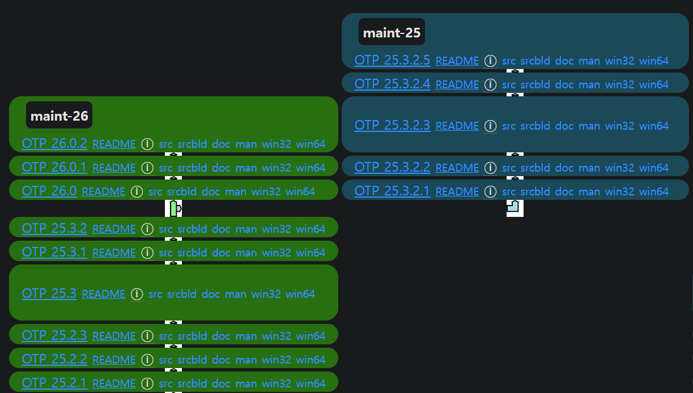
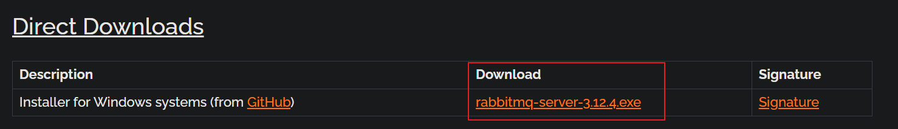
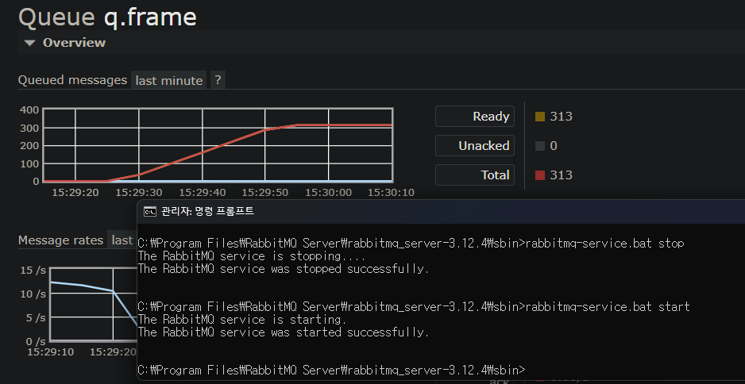
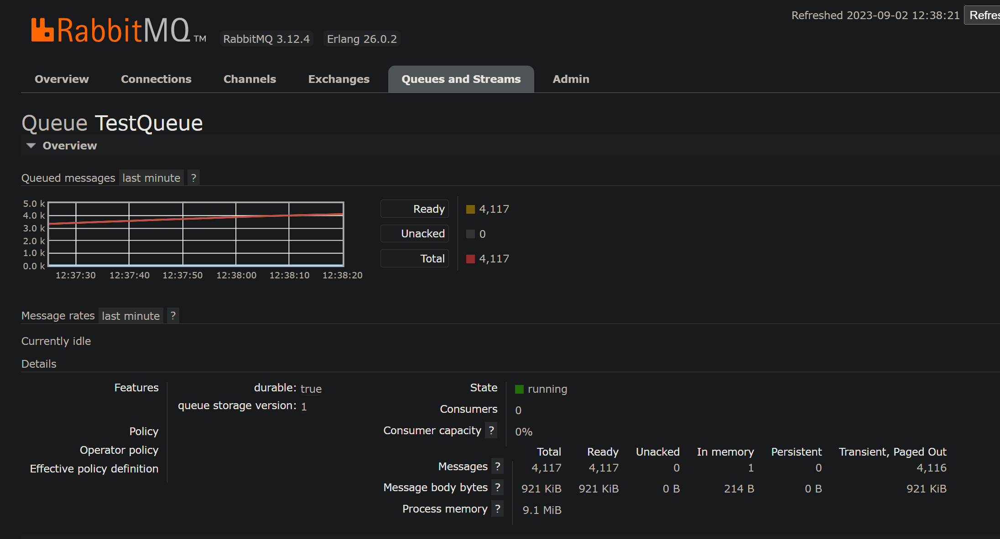
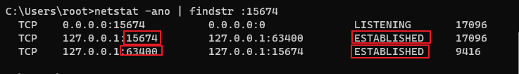
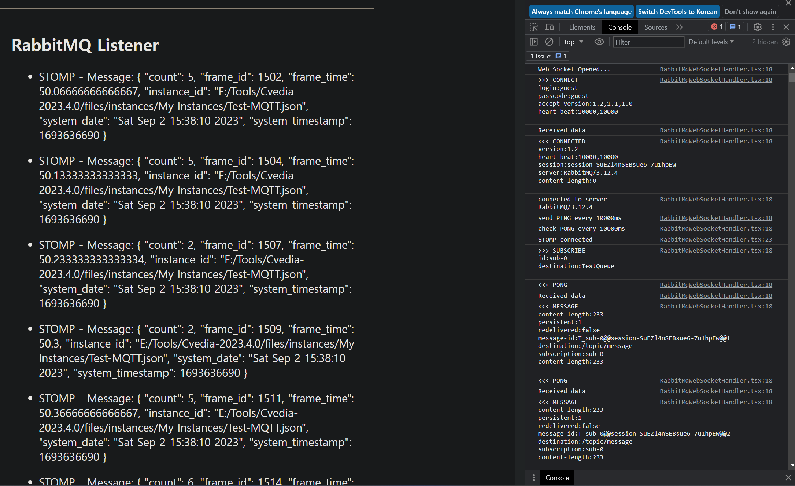
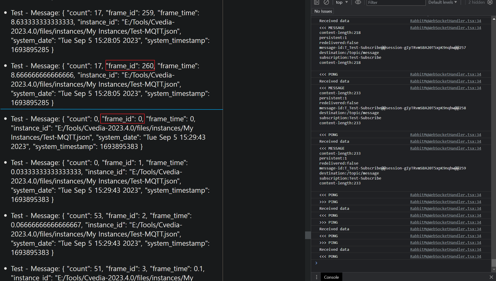

## 📘 RabbitMQ - Publish & Subscribe MQTT Data

- **MQTT Producer** : 특정 소프트웨어에서 딥러닝 엔진을 거쳐 MQTT로 데이터가 계속 나옴
- **MQTT Broker(RabbitMQ**) : Message Broker인 RabbitMQ를 이용해 MQTT 데이터를 Rabbit MQ의 Exchange를 거쳐 Routing Key에 맞는Queue에 쌓는다.
- **MQTT Client(FrontEnd Server)** : Queue에 쌓인 데이터를 Pub/Sub 구조로 프론트엔드(MQTT Client)와 실시간 통신을 하고싶음(Web Socket)

<br>

**환경 요구 사항**

- 도커 컨테이너 사용 중지지, 
- 로컬(Windows)에 RabbitMQ 등 설치
- RabbitMQ GUI Management Console 기반으로 진행

<br>

**🫡 내용 수정 & 추가**

Queue에 쌓인 Message의 영속성(Persistent & Delivery Mode)을 지정하는 방식 변경

- Topic Message의 Persistent Header를 수정해서 설정하는 방법 대신 Quorum Queue를 사용하는 것으로 변경
- RabbitMQ 3.11 부터 Quorum Queue 사용 시 Message의 Persistent 옵션이 기본으로 **Delivery Mode 2**가 되고 메모리 저장이 아닌 디스크 저장 방식
- Quorum Queue의 대표적인 장점은 **고가용성**이라서 RabbitMQ 클러스터의 노드를 증설하고 **RabbitMQ 노드 간 통신 및 동기화 작업** 필요
- Client(React)에서 Stomp의 헤더에 autoConfirm의 값을 true로 넘겨야 소켓 연결이 안끊김
- Client (React) 코드에 Quorum Queue의 Auto Confirm 헤더 추가함

---
## 📘 Erlang OTP 설치

RabbitMQ를 설치하기 전 Erlang을 설치해야 하는데, 설치는 **관리자 권한**으로 설치해야 합니다.

Erlang을 설치하는 이유는 RabbitMQ가 Erlang으로 만들어져 있기 때문입니다.

관리자 권한이 아니라면 윈도우 서비스에서 RabbitMQ를 검색할 수 없게 됩니다.

<br>

[Erlang OTP 설치](https://erlang.org/download/otp_versions_tree.html)

설치 페이지로 이동해서 원하는 버전의 **win64** 버튼을 클릭해 다운로드 후 설치합니다.



---
## 📘 RabbitMQ 설치

Erlang을 **관리자 권한**으로 설치 했으면 이제 RabbitMQ를 설치합니다.

<br>

[RabbitMQ 설치](https://www.rabbitmq.com/install-windows.html)

링크로 이동해서 마우스 스크롤을 내리다 보면 아래 사진 부분이 나오는데 Download 부분에 있는 다운로드 링크를 클릭해 설치합니다.



<br>

**시스템 환경 변수 설정**

1. 윈도우 검색창에 **시스템 환경**까지만 검색하면 **시스템 환경 변수 편집** 메뉴가 나옵니다.

2. 클릭해서 열어주고 제일 하단의 **환경 변수(N)** 를 클릭합니다.

3. 2개의 탭 중 **시스템 변수(S)** 부분에서 스크롤을 내려 **Path**를 찾아서 더블클릭 합니다.

4. **새로 만들기**를 눌러서 RabbitMQ가 설치된 폴더 내부의 bin 폴더를 지정하고 추가해줍니다. (ex: C:\Program Files\RabbitMQ Server\rabbitmq_server-3.12.4\sbin)

<br>

**윈도우 서버 재시작 시RabbitMQ 자동 실행(윈도우 서비스 등록) 설정**

1. 윈도우 CMD를 **관리자 권한**으로 엽니다.
2. 환경변수로 등록한 RabbitMQ의 sbin 폴더로 이동해줍니다.
3. 아래 명령어들을 차례대로 입력합니다.

```shell
rabbitmq-service.bat install
sc config RabbitMQ start=auto
rabbitmq-service.bat start
```

---
## 📘 RabbitMQ 초기 설정

테스트를 위해 윈도우 Local 환경에서 진행합니다.

<br>

**RabbitMQ 기본 사용 포트**

- eqmd: 4369
- Erlang Distributuin: 25672
- AMQP TLS : 5671, 5672
- 관리자 웹 콘솔 : 15672
- MQTT : 1883, 8883
- RabbitMQ Socket Port : 15674

<br>

**로그 파일 위치**

- C:\Users\계정명\AppData|Roaming\RabbitMQ\log

<br>

**RabbitMQ Conf 파일 생성 위치**

- C:\Program Files\RabbitMQ Server\rabbitmq_server-3.12.4\etc\rabbitmq\rabbitmq.conf

<br>

**윈도우 CMD창을 열어 아래 명령어를 입력하여 RabbitMQ를 실행합니다.**

```shell
rabbitmq-server
```

<br>

**RabbitMQ 관리자 페이지를 GUI로 보기 위한 플러그인, MQTT 플러그인, Web Socket 설치**

- rabbitmq_management : 웹 관리 콘솔 플러그인
- rabbitmq_mqtt : MQTT 플러그인
- rabbitmq_web_mqtt : 웹 소켓 연결을 지원하는 MQTT 플러그인
- rabbitmq_web_stomp : 웹 소켓 플러그인

```shell
rabbitmq-plugins enable rabbitmq_management
rabbitmq-plugins enable rabbitmq_mqtt
rabbitmq-plugins enable rabbitmq_web_mqtt
rabbitmq-plugins enable rabbitmq_web_stomp
```

<br>

**RabbitMQ 관리자 페이지, MQTT, Rabbit Socket 포트 떠있는지 (Listening) 확인**

```bash
netstat -ano | findstr :15672 # 관리자 콘솔 포트
netstat -ano | findstr :1883 # MQTT 포트
netstat -ano | findstr :15674 # Rabbit Socket 포트
```

<br>

**RabbitMQ 관리자 페이지 접속 (인터넷 주소창에 입력)**

- Default 로그인 ID : guest
- Default 비밀번호 : guest

```
http://localhost:15672
```

---
## 📘 RabbitMQ Exchange & Queue & Binding 설정

Publish/Subscribe 패턴을 구현하기 위해 Exchange의 타입을 Topic으로 설정합니다.

Topic Exchange는 Binding Key 패턴이 일치하는 Queue에만 선택적으로 데이터를 전송합니다.

<br>

Topic Exchange는 `*`와 `#`을 이용해 와일드 카드를 표현할 수 있습니다.

- `*` : 단어 하나 일치
- `#` : 0 또는 1개 이상의 단어 일치

<br>

**Exchange 생성**
- Name: Exchange 이름
- Type : 보통 "Topic"을 선택 (MQTT Topic Routing에 가장 적함함)
- Durable 설정 (Transient로 설정 시 RabbitMQ 재시작 하면 Exchange가 사라집니다.)
- Add Exchange

<br>

**Queue 생성**
- Type : Default for Virtual Host (저는 Quorum Queue를 사용 하였습니다)
- Name: Queue 이름
- Durable 설정 (Transient로 설정 시 RabbitMQ 재시작 하면 Queue가 사라집니다.)
- Add Queue

<br>

**Exchange <-> Queue 바인딩**
- Queue 탭으로 이동 후 만든 큐의 이름 클릭
- 하단의 Bindings 섹션에서 Bind from an Exchange 옵션 선택
- From Exchange 필드에 앞서 만든 Exchange의 이름 입력
- Routing Key 필드에 MQTT Topic 입력 (MQTT 데이터를 내보내는 곳에서 설정한 토픽으로 설정)
- Bind 클릭

---

## 😯 Default Exchange로 들어오는 데이터를 직접 만든 Exchange로 데이터 라우팅

RabbitMQ의 Default Binding 정책 때문에 Topic타입의 Exchange는 기본으로 만들어져 있는 `amq.topic` Exchange로 갑니다.

그래서 Default Exchange로 들어오는 데이터를 위에서 직접 만든 Exchange로 데이터가 넘어가게 설정(바인딩)해줘야 합니다.

- amq.topic Exchange로 들어가서 만든 **Exchange(Queue가 아님)**와 바인딩을 해줍니다.
- amq.topic Exchange의 Binding 섹션에서 **To Exchange**를 선택하고 Routing Key로 `#`을 입력해서 기본 Exchange -> 만든 Exchange로 데이터가 넘어가게 해줍니다.

<br>

[RabbitMQ Topolozy 구성 좋은 글 발견](https://medium.com/@supermegapotter/rabbitmq-topology-guide-8427ebbe927f)

---

## 📘 Queue Data에 영속성을 부여하고 싶을 경우 (Persist Data)

- Queue 생성 시 타입을 Quorum Queue로 생성합니다.
- **Exchange와 바인딩할때 Argument로 `x-auto-confirm : true`로 설정합니다**
- RabbitMQ 3.11 버전부터 쿼럼 큐의 메세지 저장방식의 Default는 디스크 저장입니다.
- `C:\Users계정명\AppData\Roaming\RabbitMQ\db\클러스터이름\quorum` 에 데이터가 쌓입니다.
- 단 Quorum Queue는 Confirm 방식이기 떄문에 Client(React)에서 autoConfirm 옵션을 True로 설정해야 합니다.



<br>

<br>

**3번 방법 : Publisher Confirm**

`Publisher Confirm` 방식은 메시지가 RabbitMQ에  성공적으로 도달했음을 보장하는 매커니즘입니다.

이 기능은 메시지를 발행하는 Producer 측에서 사용되며 프로듀서가 RabbitMQ에 메시지를 보낸 후, 

RabbitMQ가 메시지를 받았음을 알리는 확인(Acknowledgment)를 프로듀서에게 보내는 방식입니다.

<br>

- 1번 방법: 메시지를 Publish 할 때 Header에 `persistent : true` 옵션을 걸면 Message의 Delivery Mode가 2가 되며 메시지는 영속성을 가집니다.
- 2번 방법 : Python Pika 라이브러리의 `pika.BlockingConnection(pika.ConnectionParameters('localhost)).confirm_delivery()`` 함수를 사용하는 방식이 있습니다.

```python
import pika

# Connection 생성
connection = pika.BlockingConnection(pika.ConnectionParameters('localhost'))
channel = connection.channel()

# Confirm delivery 기능 활성화
channel.confirm_delivery()

# Message 발행 (delivery_mode=2)
if channel.basic_publish(exchange='my_exchange',
                         routing_key='my_routing_key',
                         body='Hello World!',
                         properties=pika.BasicProperties(delivery_mode=2),
                         mandatory=True):
    print('Message was confirmed')
else:
    print('Message was returned')

```

<br><br>

위의 설정을 마무리 하면 RabbitMQ는 설정한 Topic으로 발행된 MQTT 메시지를 수신할 준비가 됩니다.

이렇게 설정한 큐는 React + TypeScript 앱(MQTT Client)이 해당 Topic을 Subscribe하기 시작하면,

그때부터 해당 Topic으로 발행(Publish)되는 모든 MQTT 메시지를 받을 수 있습니다.

<br>

이제 MQTT Producer에서 MQTT를 내보낼때 Topic을 설정하고 내보내면 RabbitMQ의 Exchange를 거쳐, Routing Key에 맞는 Queue에 MQTT 데이터가 쌓입니다.



---
## 📘 MQTT Client 설정

MQTT Client는 React + TypeScript로 개발 하였습니다.

RabbitMQ와의 Socket 통신을 위해 @stomp/stompjs 패키지를 설치 해 줍니다.

<br>

**RabbitMqWebSocketHandler.tsx**

이제 프론트엔드 서버인 React에 MQTT Client 코드를 작성합니다.

웹 소켓을 열고 RabbitMQ의 웹 소켓 플러그인의 포트인 15674,15675 둘중 하나에 `ws://URL/ws`로 연결해줍니다.

나머지 코드는 Exchange와 Queue & Topic에 대한 설정입니다.

<br>

**Quorum Queue를 사용했으므로 Stomp Client Header에 `autoConfirm 옵션을 true`로 설정해주었습니다.**

Exchange & Queue에 맞는 Routing Key와 Topic을 설정하고 출력하는 컴포넌트를 작성했습니다.

Subscribe 해제는 별도의 버튼을 만들었는데, 이유는 RabbitMQ에서 데이터의 영속성 테스트를 할때 편하게 하려고 만들었습니다.

```tsx
import React, { useEffect, useState } from 'react';  
import { Client, StompHeaders } from '@stomp/stompjs';  
  
interface RabbitMqWebSocketHandlerState {  
    messages: string[];  
    subscribed: boolean;  
    client: Client;  
}  
  
const RabbitMqWebSocketHandler: React.FC<RabbitMqWebSocketHandlerState> = () => {  
    const [messages, setMessages] = useState<string[]>([]);  
    const [subscribed, setSubscribed] = useState(false);  
    const [client, setClient] = useState<Client>();  
  
    // Life Cycle Hooks  
    useEffect(() => {  
        subscribeToQueue();  
        return () => {  
            unSubscribeFromQueue();  
        };  
    }, []);  
  
    // 구독 함수  
    const subscribeToQueue = () => {  
        const client = new Client({  
            brokerURL: 'ws://localhost:15674/ws',  
  
            // RabbitMQ 관리 콘솔 인증 정보  
            connectHeaders: {  
                login: 'guest',  
                passcode: 'guest',  
            },  
            debug: (str: string) => {  
                console.log(str);  
            },  
        });  
  
        // Stomp Client Header - AutoConfirm, Message TTL 옵션 추가  
        const connectHeadersWithAutoConfirm: StompHeaders = {  
            ...client.connectHeaders,  
            'x-queue-type': 'quorum',  
            'x-message-ttl': 200000,  
            autoConfirm: true,  
        };  
  
        // Quorum Queue Subscribe  
        client.onConnect = () => {  
            console.log('Socket Connected');  
            // 1번째 파라미터로 Queue 이름, 2번째는 콜백 함수  
            client.subscribe('q.frame', (frame) => {  
                    const newMessage = `Test - Message: ${frame.body}`;  
                    setMessages((prevMessages) => [...prevMessages, newMessage]);  
                },  
                {  
                    id: 'Test-Subscribe',  
                    ...connectHeadersWithAutoConfirm,  
                });  
            setSubscribed(true);  
        };  
  
        // 오류 메시지의 세부 정보 출력  
        client.onStompError = (frame) => {  
            console.error('STOMP error', frame.headers['message']);  
            console.log('Error Details:', frame.body);  
        };  
  
        setClient(client);  
        client.activate();  
    };  
  
    // 구독 해제 함수, 버튼을 클릭하면 구독을 해제함  
    const unSubscribeFromQueue = () => {  
        if (client) {  
            client.unsubscribe('Test-Subscribe');  
            setClient(null);  
            setSubscribed(false);  
        }  
    };  
  
    return (  
        <div>  
            <h2>RabbitMQ Listener</h2>  
            <ul>  
                {messages.map((message, index) => (  
                    <li key={index}>  
                        <p>{message}</p>  
                    </li>  
                ))}  
            </ul>  
            {!subscribed ? (  
                <button onClick={subscribeToQueue}>Subscribe</button>  
            ) : (  
                // 구독 중일 때 해지 버튼  
                <button onClick={unSubscribeFromQueue}>Unsubscribe</button>  
            )}  
        </div>  
    );  
};  
  
export default RabbitMqWebSocketHandler;
```

<br>

RabbitMQ의 소켓 포트인 15674 포트를 확인해보면 양방향으로 Established 된것을 확인 할 수 있습니다.



<br>

프론트엔드 서버의 URL로 들어가보면 웹 소켓을 통해 실시간으로 데이터가 계속 들어옵니다.



<br>

간단하게 MQTT 데이터를 RabbitMQ를 통해 Queue로 받아서 프론트엔드에서 실시간 통신을 해보았습니다.

---
## 📘 Topic Message Persist(데이터 영속성) 테스트

Topic Message가 RabbitMQ 재기동 했을시 사라지지 않고, 추가 데이터도 잘 받아지는지 확인하였습니다.

- Subscriber (React) 중지
- MQTT -> RabbitMQ로 쿼럼 큐에 데이터 쌓임
- RabbitMQ 재기동 -> 데이터 살아있음
- Subscriber ON (큐에 쌓인 데이터 전체 출력 완료)
- 다시 MQTT 데이터 추가로 내보내기
- Subscriber (React) 에 정상 도착

<br>

아래 사진을 보면, 

MQTT 영상 분석 데이터 중 Frame ID가 260에서 끊겼다가 추가 데이터 전송 후 다시 0으로 시작하는 것을 볼 수 있습니다.



<br>

테스트는 완료했으니 다음 글에서는 데이터를 백엔드에서 받고, 

RabbitMQ <-> Backend와 실시간 통신을 해서 실시간으로 받은 데이터를 프론트엔드에서 RestAPI로 가져와서 

실시간으로 그래프가 변하는 Scatter 차트를 만들어 보겠습니다.