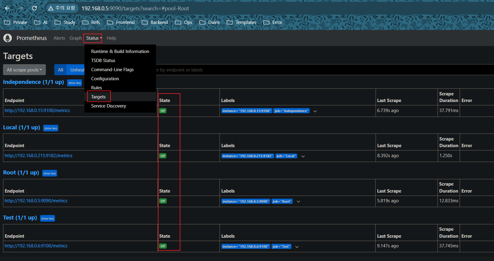
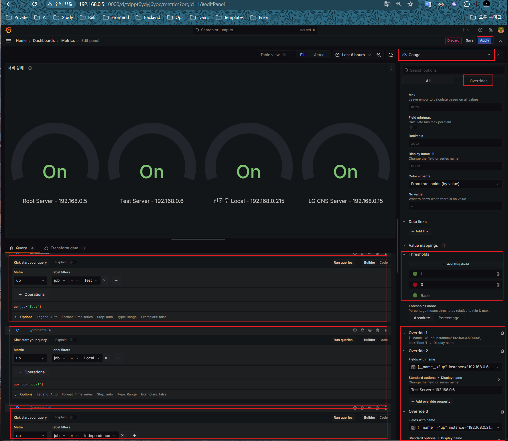
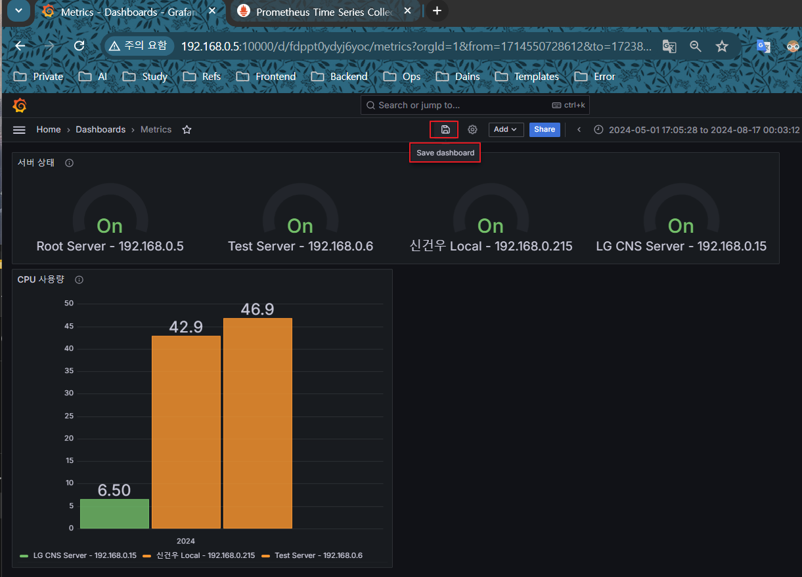

## Prometheus & Grafana - Status Monitoring

각 서버들의 상태 metric들을 수집하는 **Prometheus**와 그 metric 데이터들을 시각화 해주는 **Grafana** 구축 방법을 포스팅 합니다.

저는 현재 메인 서버가 있고 메인 서버에서 Prometheus를 이용해,

하위 서버들의 Metric을 받아 Grafana Dashboard를 통해 서버의 Resource들을 모니터링 할 예정이고,

툴 선정하기 전 가볍게 써보고 정하자는 생각으로 일단 간단하게 만들어 보았습니다.

---
## Metric 수집 대상 서버 설정

**Linux Server**

Main Server를 설정하기 전, 메트릭 수집을 원하는 서버에 `node-exporter` 컨테이너를 실행시켜 주면 Sub Server는 설정 완료입니다.

Linux에서 Exporter의 기본 포트는 9100 입니다.

```bash
sudo docker run -d --name=metric --restart=on-failure --net=host prom/node-exporter
```

<br>

**Windows Server**

[Windows Node Exporter](https://github.com/prometheus-community/windows_exporter/releases) 위 사이트에서 Windows 전용 Exporter를 받고 임의의 폴더에 압축을 풀어줍니다.

압축 해제한 폴더 내부에 있는 prometheus.yml 파일에 Windows Exporter를 Scrab Target으로 추가합니다.

Windows Exporter 기본 포트는 9182 입니다.

---
## Root Server 설정

우선 Prometheus 설정 파일인 `prometheus.yml`을 작성하기 위해 `~/metrics` 경로에 `prometheus` 디렉터리를 생성하고 파일을 만들어줍니다.

<br>

디렉터리 구조는 아래와 같습니다.

granafa와 prometheus 디렉토리 내부에는 아무 파일도 없지만 컨테이너가 실행되고,

설정 파일들을 작성 후, grafana, prometheus Container를 재시작 하면 해당 디렉토리들의 설정파일이 컨테이너 내부에 적용됩니다.

- docker-compose 파일은 metrics 디렉터리 내부에 있으며, compose up 시 이곳에서 진행합니다.
- grafana 디렉토리 : Grafana 설정 파일인 `defaults.ini`를 Container의 볼륨과 마운트합니다.
- prometheus 디렉토리 : Prometheus 설정 파일인 `prometheus.yml`을 Container의 볼륨과 마운트합니다.

```
/home/skw/metrics
├── docker-compose.yml
├── grafana
│   └── 
└── prometheus
    └── 
```

<br>

**docker-compose.yml**

Prometheus와 Grafana 컨테이너를 띄우기 위한 Docker Compose를 작성합니다.

Grafana Web 기본 비밀번호는 1234로 지정하고 현재 서버에서 3000번 포트는 사용중이어서 10000으로 포트포워딩 하였습니다.

```yaml
version: '3.7'

services:
  prometheus:
    image: prom/prometheus:latest
    container_name: Root-Metric
    volumes:
      - /home/skw/metrics/prometheus:/etc/prometheus
    command:
      - --config.file=/etc/prometheus/prometheus.yml
    ports:
      - "9090:9090"
    restart: unless-stopped

  grafana:
    image: grafana/grafana:latest
    container_name: Grafana
    volumes:
     - /home/skw/metrics/grafana:/usr/share/grafana/conf
    ports:
      - "10000:3000"
    environment:
      - GF_SECURITY_ADMIN_PASSWORD=1234
    restart: unless-stopped
```

<br>

이제 컨테이너들을 올려주고 잘 실행중인지 확인합니다.

```bash
# docker-compose.yml 파일 실행
docker-compose up -d

# 컨테이너 확인
docker ps
```


<br>

**prometheus.yml 파일 작성**

- 컨테이너가 실행됬으니 이제 prometheus 디렉토리에 `prometheus.yml` 파일을 작성해줍니다.
- Root 서버, Jetson 서버, 윈도우 서버 이렇게 3개의 스크랩으로 나누었으며, 임시로 4개 서버만 등록 하였습니다.
- 작성 완료 후, Prometheus 컨테이너를 재시작 하면 아래 설정이 컨테이너 내부로 들어가 적용됩니다.

```yaml
global:
  scrape_interval: 15s

scrape_configs:
  - job_name: 'Root Server'
    static_configs:
      - targets: ['192.168.0.5:9090'] # Root Server

  - job_name: 'NVIDIA Jetson'
    static_configs:
      - targets: ['192.168.0.6:9100', '192.168.0.15:9100'] # 하위 Linux 서버들

  - job_name: 'Windows Agent'
    static_configs:
      - targets: ['192.168.0.214:9182'] # 하위 왼도우 서버들
```

<br>

**Grafana 설정 파일 수정 - defaults.ini**

- 우선 초기 파일이 없으므로 `docker cp Granafa:/usr/share/grafana/defaults.ini /home/skw/metrics/grafana` 명령을 통해 설정 파일을 복사합니다.
- 그리고, 해당 설정파일에서 Grafana Panel Embedding을 위한 defaults.ini 설정을 수정합ㅂ니다.
- 나중에 Grafana Dashboard의 각 Panel을 다른 Web UI로 Embed를 하기 위해,
- grafana 디렉토리(볼륨 마운트된)의 defaults.ini를 수정후 Grafana 컨테이너만 재실행 해주면 설정이 적용됩니다.

```
[security]
allow_embedding = true

[auth.anonymous]
enabled = true
```

---
## Prometheus

Root Server에 띄운 Prometheus의 Port인 `http://{서버IP}:9090`으로 진입해 Prometheus 서버에 접속합니다.

상단의 Status - Targets를 클릭해보면 하위 서버들이 Online 상태인 걸 볼 수 있습니다.



<br>

### Prometheus Query 설정

수집할 데이터를 쿼리하는 곳이며, Prometheus Web 상단 Graph를 클릭 후, Add Panel 버튼을 클릭해 쿼리를 1개씩 추가해줍니다.

제가 수집할 메트릭은 아래와 같습니다.

이렇게 Prometheus에 등록한 Panel은 Grafana의 Dashboard에서 등록 할 수 있습니다.

- `up` : 서버의 Online/Offline 상태
- `100 - (avg by (instance) (irate(node_cpu_seconds_total{mode="idle"}[5m])) * 100)` : CPU 사용량
- `(node_memory_MemTotal_bytes - node_memory_MemAvailable_bytes) / node_memory_MemTotal_bytes * 100` : 메모리 사용량
- `node_memory_Active_bytes` : 사용중인 메모리
- `100 - ((node_filesystem_avail_bytes{mountpoint="/"} / node_filesystem_size_bytes{mountpoint="/"}) * 100)` : 디스크 사용량


---
## Grafana Dashboard

이제 `http://{메인서버IP}:10000`으로 Grafana에 접속해 admin / 1234로 로그인 해줍니다.

로그인 후, 왼쪽 사이드바의 `Connections - DataSources`로 진입해서 데이터 소스를 추가해줍니다.

데이터 소스는 메인 서버의 Prometheus 포트인 `http://{메인서버IP}:9090` 으로 설정해줍니다.


<br>

데이터 소스를 추가했으면 저장하고 나옵니다.

정상적으로 Prometheus 컨테이너가 실행 중 이라면 바로 성공 할 겁니다.


<br>

데이터 소스를 설정하고, 다시 왼쪽 사이드바에서 `Dashboard` 탭을 클릭해 Add Dashboard를 선택후 Add Visualization을 선택합니다..


<br>

DataSource는 자동으로 아까 지정한 Prometheus가 지정되어 있을거고 이걸 클릭해줍니다.


<br>

이제 Dashboard에서 보여줄 Panal들을 하나씩 만들거고, Prometheus에 등록한 쿼리를 그대로 입력하면 아래와 같이 나오게 됩니다.

- **Add Query** : Prometheus에 등록한 쿼리 그대로 입력하면 됩니다.
- **Panel** : 패널의 제목과 기타 설정을 할 수 있으며, 우측 박스 부분입니다.
- **Gauge 부분** : 그래프 유형을 선택합니다.
- **Transform Data** : 데이터를 다양하게 변환 하는 항목들을 추가
- **저장** : 우측 상단 Apply를 클릭해 Panel을 임시 대시보드에 저장합니다.

아래 사진은 예시로 `up`이라는 쿼리를 등록해 서버3대의 상태를 Gauge Graph를 이용해 모니터링 합니다.



<br>

위처럼 Panel을 설정하고 우측 상단 Apply를 클릭하면, 임시 Dashboard에 패널이 1개 추가됩니다.

원하는 패널이 더 있으면 Add Panal을 통해 추가로 다른 메트릭도 등록합니다.


<br>

이번엔 프로메테우스에 추가했던 CPU 사용량 쿼리인 

`100 - (avg by (instance) (irate(node_cpu_seconds_total{mode="idle"}[5m])) * 100)` 

쿼리를 등록해보면 하위 2개 서버의 최근 CPU 사용량이 나오게 됩니다.


<br>

이렇게 2개의 Panel을 추가했고 저장 버튼을 눌러 Dashboard를 저장해주면 끝입니다.



<br>

이 Dashboard의 각 Panel들을 Imbedding도 가능한데 Dashboard에서 Panel의 점 3개 옵션을 눌러 share를 선택 후,

Imbed 옵션에 있는 HTML을 활용하면 됩니다.

CPU, Memory, Disk 3개의 Panel Imbedding iframe을 임시 HTML을 만들어서 Imbed 해보았습니다.

<br>

저는 만약 Grafana를 쓰더라도 Grafana의 Web UI는 쓰지 않을 것 같고,

각 Panel들의 그래프만 쓸것 같아서 Imbed를 통해 Panel UI만 옮기는 기능이 있는지 알아보다가 발견하게 되었습니다.

```html
<!DOCTYPE html>
<html lang="en">
<head>
    <meta charset="UTF-8">
    <meta name="viewport" content="width=device-width, initial-scale=1.0">
    <title>Grafana Dashboard Embed</title>
</head>
<body>
    <h1>CPU</h1>
    <iframe src="http://192.168.0.5:10000/d-solo/fdpc1y3a30dmoe/server-metric?orgId=1&from=1718912236448&to=1718933836448&panelId=2" width="750" height="500" frameborder="0"></iframe>

    <h1>Memory</h1>
    <iframe src="http://192.168.0.5:10000/d-solo/fdpc1y3a30dmoe/server-metric?orgId=1&refresh=1m&from=1718916269337&to=1718937869337&panelId=3" width="750" height="500" frameborder="0"></iframe>

    <h1>Disk</h1>
    <iframe src="http://192.168.0.5:10000/d-solo/fdpc1y3a30dmoe/server-metric?orgId=1&refresh=1m&from=1718916302848&to=1718937902848&panelId=4" width="750" height="500" frameborder="0"></iframe>
</body>
</html>
```

