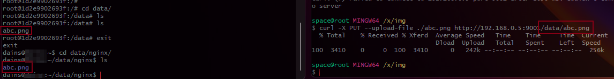
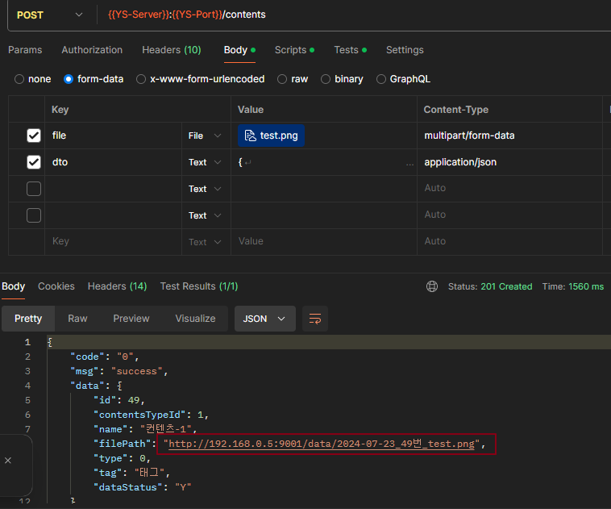
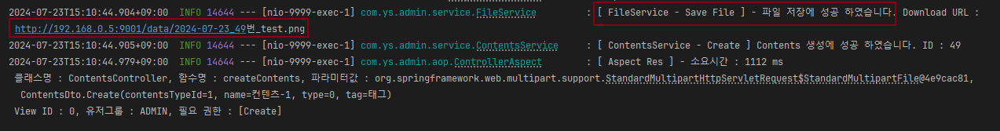
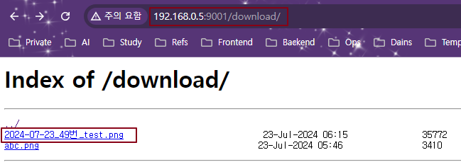

## 📚 Nginx Static Contents Server

이번에 구현해본 것은 Spring Rest API로 받는 MultiPart Form Data(이미지, 영상 파일)를 Nginx에 업로드/다운로드 할 수 있게 서버를 구축해 보았습니다.

기본적으로 Docker Container를 사용하며, 기존에 다른 용도의 Nginx 컨테이너가 80포트로 떠있으므로, 

이 글에서의 Nginx Container의 컨테이너 내부 Nginx 포트는 9001번을 사용합니다.

---
## 📚 Nginx Container 설정

Nginx Container를 9001번 포트로 포워딩 및 실행시켜 주면서 Local의 /data/nginx와 Container의 /data를 볼륨 마운팅 해줍니다.

```bash
docker run -d --name nginx --restart always -p 9001:9001 -v /home/skw/data/nginx:/data nginx
```

<br>

그리고, 컨테이너로 들어가 vim을 설치하고 Nginx에서 파일들을 저장할 `/data` 디렉터리의 권한을 수정해 줍니다.

```bash
# Container 내부 진입
docker exex -it nginx /bin/bash

# APT 업데이트, vim 설치
apt-get u-y pdate && apt -y install vim

# /data 디렉터리 권한 설정
chown -R nginx:nginx /data
chmod -R 755 /data
```

<br>

이제 `/etc/nginx/conf.d/default.conf` 파일을 열어 Nginx Config를 수정해 파일 **업로드 & 다운로드** 설정을 진행합니다.

- `listen` : 컨테이너 내부 Nginx의 기본 포트를 9001로 설정합니다. (로컬의 9001과 포워딩)
- `location /data/` : 파일을 업로드하는 URL이며, `/data` 디렉터리 밑에 파일들이 저장됩니다.
	- `root /;` : 기본 설정 root URL을 `/`로 설정하여 바로 `/data` 하위로 파일이 들어가도록 해줍니다.
	- `dav_methods` :  nginx는 기본적으로 POST 요청을 지원하지 않기 떄문에 PUT Method를 허용해줍니다.
	- `client_max_body_size` : 요청 파일의 크기를 설정합니다, mp4 파일도 있기 떄문에 500MB로 설정하였습니다.
- `location /download` : 이 URL로 접근하면 `/data` 하위의 파일들 목록을 보여줍니다.
	- `autoindex on` 옵션을 통해 자동으로 리스트업 해줍니다.

<br>

**/etc/nginx/conf.d/default.conf 파일**

```js
server {
    listen       9001;
    listen  [::]:9001;
    server_name  localhost;
    charset utf-8;

    access_log  /var/log/nginx/access.log;
    error_log /var/log/nginx/error.log debug;

    client_max_body_size 500M;
    dav_methods PUT;
    dav_access user:rw group:rw all:r;

    location / {
        root   /usr/share/nginx/html;
        index  index.html index.htm;
    }

    location /data/ {
        root /;
        client_max_body_size 500M;
        charset utf-8;

        # Enable DAV methods for file uploads
        dav_methods PUT;
        create_full_put_path on;
        dav_access user:rw group:rw all:r;

		
		access_log  /var/log/nginx/data-access.log;
	    error_log /var/log/nginx/data-error.log debug;
    }

    location /download {
        alias /data;
        autoindex on;
        charset utf-8;
    }

    #error_page  404              /404.html;

    # redirect server error pages to the static page /50x.html
    #
    error_page   500 502 503 504  /50x.html;
    location = /50x.html {
        root   /usr/share/nginx/html;
    }
}
```

<br>

설정을 완료 했으면 Nginx를 Refresh 해줍니다.

```bash
nginx -s reload
```

<br>

### **볼륨 동기화**

이제 curl을 이용해서 간단하게 아무 이미지 파일이나 보내보겠습니다.

컨테이너 내부 `/data` 디렉토리에 abc 파일이 생기고, 로컬의 `/data/nginx` 디렉토리에 abc 파일이 동기화 되었습니다.

```bash
curl -X PUT --upload-file ./abc.png http://192.168.0.5:9001/data/abc.png
```



---
## 📚 Spring Rest API

### Controller

- 파일과 정보(DTO)를 RequestPart를 이용해 MultiPart Form Data 형식과 Json 형식으로 요청을 받습니다.

```java
@PreAuth(viewId = 0, authorization = AuthorizationType.Create)  
@PostMapping(consumes = MediaType.MULTIPART_FORM_DATA_VALUE, produces = MediaType.APPLICATION_JSON_VALUE)  
@Operation(summary = "Create Contents", description = "컨텐츠 등록 (파일)")  
@Parameter(name = "file", description = "이미지(png 등), 영상(mp4 등)")  
@Schema(implementation = ContentsDto.Create.class)  
@ApiResponse(responseCode = "201", description = "컨텐츠 정보 반환")  
public ResponseEntity createContents(CustomHttpServletRequest request,  
                                     @RequestPart MultipartFile file,  
                                     @RequestPart ContentsDto.Create dto) {  
    return new ResponseEntity(ApiResponseDto.makeResponse(contentsService.createContents(file, dto)), HttpStatus.CREATED);  
}
```

<br>

### Service

Contents Service는 파일 업로드와 관련없으니 생략하고 FileService만 보겠습니다.

코드에서는 단순히 컨트롤러에서 받은 멀티파트 파일을 그대로 Nginx로 보냅니다.

API에서 파일을 받을땐 MultiPart 형식으로 받았지만 Nginx에 WebClient로 보낼때는 `OCTET_STREAM` 형식으로 보냅니다.

```java
/**  
 * @author 신건우  
 * @desc Nginx로 Multi Part Data 업로드  
 */  
@Slf4j  
@Service  
@Transactional  
@RequiredArgsConstructor  
public class FileService {  
    private final WebClient webClient;  
    private final static String OS = System.getProperty("os.name").toLowerCase();  
  
    @Value("${file.nginx}")  
    private String nginxUrl;  
  
    public String saveFile(MultipartFile data, Integer contentsId) {  
        if (data.isEmpty() || contentsId == null) throw new CommonException(ExceptionCode.REQUIRED_MISSING_VALUE);  
  
        String fileName = null;  
        String fullPath = null;  
  
//        String separator = File.separator;  
//        if (OS.contains("win")) separator = "\\";  
//        else separator = "/";  
  
        try {  
            DateTimeFormatter format = DateTimeFormatter.ofPattern("yyyy-MM-dd");  
            String now = format.format(LocalDateTime.now());  
            fileName = now + "_" + contentsId + "번_" + data.getOriginalFilename();  
            fullPath = nginxUrl + "/" + fileName;  
  
            uploadFileToNginx(data, fileName);  
  
            log.info("[ FileService - Save File ] - 파일 저장에 성공 하였습니다. Download URL : {}", fullPath);  
            return fullPath;  
        } catch (Exception e) {  
            log.error("[ FileService - Save File ] - 파일 저장에 실패 하였습니다. Exception : {}", e.getMessage());  
            throw new CommonException(ExceptionCode.SAVE_FILE_ERROR);  
        }  
    }  
  
    private void uploadFileToNginx(MultipartFile file, String fileName) {  
        try {  
            webClient.put()  
                    .uri(nginxUrl + "/" + fileName)  
                    .contentType(MediaType.APPLICATION_OCTET_STREAM)  
                    .body(BodyInserters.fromResource(new ByteArrayResource(file.getBytes())))  
                    .retrieve()  
                    .bodyToMono(String.class)  
                    .doOnError(error -> {  
                        log.error("[ FileService - Upload to Nginx ] - Nginx에 파일 업로드가 실패 하였습니다. Exception : {}", error.getMessage());  
                        error.printStackTrace();  
                        throw new CommonException(ExceptionCode.FILE_UPLOAD_ERROR);  
                    })  
                    .block();  
        } catch (Exception e) {  
            throw new CommonException(ExceptionCode.FILE_UPLOAD_ERROR);  
        }  
    }  
}
```

---
## 📚 테스트

이제 Spring Boot를 실행시키고, Postman을 이용해 파일과 정보를 API Request로 요청합니다. 결과는 성공입니다.



<br>



<br>

API Response로 나온 File Path도 잘 나왔고, Nginx의 `/download` 경로로 들어가보면 파일들이 잘 들어 있는걸 볼 수 있습니다.

