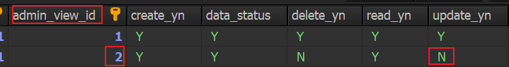
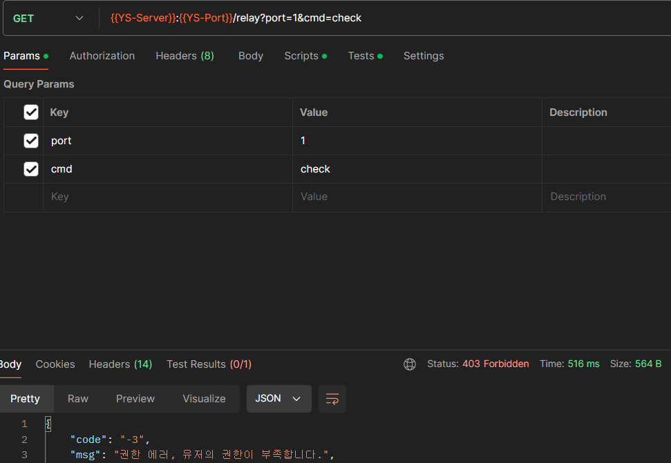
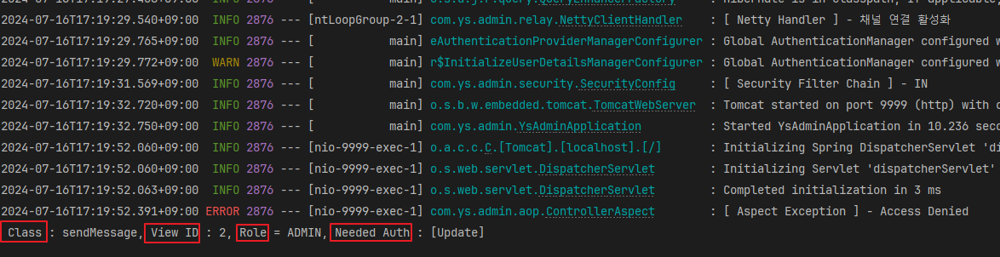
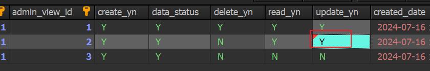
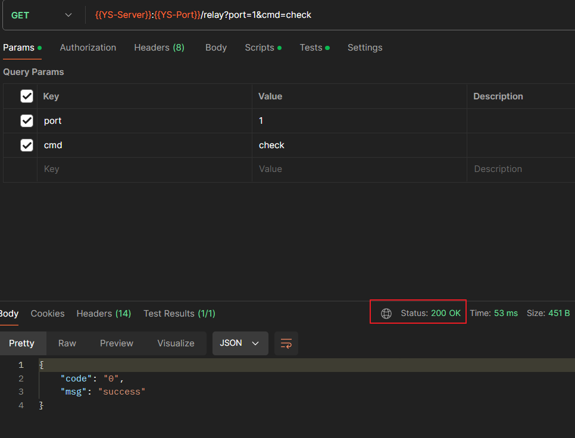
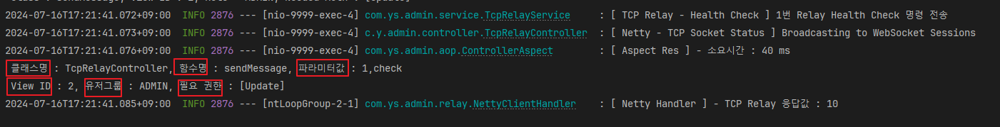

## 📚 Spring AOP - API Verification 공통화

이번에 코드 리팩터링 도중 이전에 구현 해두었던 API Filter에서 JWT만 검증하고, 

나머지 Request를 요청하는 유저의 권한 등등을 컨트롤러 마다 검증 private method를 쓰거나, 공통 클래스에 넣어서 썼었습니다.

Rest Controller 마다 다양한 검증 로직이 존재 하는 상태이고, 그 중 공통화를 할 수 있는 로직들만 묶고 싶어서 알아보다가 

기존에 개념만 알고 있던 AOP를 한번 써보자 해서 구현 해보았습니다.

<br>

검증 로직을 공통화 하기위해 Aspect 기능을 사용하여 검증할 값들을 Security Filter에서 Header로 넣고 API 호출 전, Aspect 클래스에서 검증하는 방향으로 잡았습니다.

<br>

기본 흐름은 API Request가 들어오면 Security Filter를 먼저 거치고, 

Controller의 Method를 호출하기 전에 Aspect가 요청을 가로채 검증을 먼저 수행 후 실제 비즈니스 로직이 실행됩니다.

---

## 📚 Controller Aspect 구현

자세한 설명은 구현하며 **주석**으로 적었고, 구현한 Controller Aspect를 요약하면 아래와 같습니다.

- API Request가 들어오면 API Filter를 먼저 거치고, Controller의 Method를 거치기 전 Aspect가 요청을 가로채 검증을 먼저 수행합니다.
- Security Filter인 API Filter에서 유저의 Role과 JWT Token을 검사해 헤더에 Role과 Token의 상태 등 4개의 헤더값을 넣어 주었습니다.
- 위에 만들어둔 Security API Filter에서 유저의 Request 헤더 4개 중, 2개인 **User Role**과 **Token Status**를 검증하도록 로직을 짰습니다.
- Token Status는 `Valid`, `Invalid`, `Expired` 3가지의 상태를 가지는 Enum으로 만들었으며 Valid가 아니면 전부 Exception을 Throw 합니다.
- 실제 Exception을 던지는 곳은 Controller Aspect이고, API Filter에서는 헤더에 상태만 주입합니다.
- Aspect 시작 - 끝 응답속도와 클래스명, 함수명, 파라미터를 로그에 찍습니다.

<br>

**@Around**

- `@Around("execution(public * com.ys.admin.controller.*.*(..))")` : `com.ys.admin.controller` 패키지 내의 모든 컨트롤러의 Public Method를 대상으로 한다는 포인트컷 표현식입니다.


```java
/**  
 * @author 신건우  
 * @desc Controller AOP 공통 로직 - Request Header를 통해 유저 권한, 토큰 상태 검증  
 */  
@Slf4j  
@Aspect  
@Component  
@RequiredArgsConstructor  
public class ControllerAspect {  
    private final UserGroupService userGroupService;  
  
    /**  
     * @author 신건우  
     * @desc 1. 사용자의 Header에 넣은 Token Status, User Role 2개의 값을 가져와 토큰 상태 Enum에 정의 해놓은 Valid 상태가 아니면 Throw Exception  
     * 2. 두번쨰 헤더의 값인 User Role을 가져와 해당 Role에 해당하는 권한(ViewGroup)의 Y/N을 Map에 매핑 -> 잘못된 Role 일 시 Throw Exception  
     * 3. Custom Annotation인 PreAuth의 코드를 가져와 해당 코드에 존재하는 권한 리스트 체크  
     * 4. 응답속도, Class, Method, Parameter 등등 로깅  
     */  
    @Around("execution(public * com.ys.admin.controller.*.*(..))")  
    public Object around(ProceedingJoinPoint joinPoint) throws Throwable {  
        Object result = null;  
        Object[] paramValues;  
        StringBuilder paramValueStr = new StringBuilder();  
        long startTime = System.currentTimeMillis();  
  
        try {  
            String userRoleStr = null;  
            String tokenStatusStr = null;  
  
            TokenStatus tokenStatus = TokenStatus.Invalid;  
            UserRole role = UserRole.OTHER;  
  
            boolean hasRight = false;  
            Map<Integer, CustomAuth> authMap = new HashMap<Integer, CustomAuth>();  
  
            // TODO 1: Request Header에서 TOKEN_STATUS, USER_ROLE을 가져와서 String 값과 객체로 변수화  
            // 컨트롤러의 모든 파라미터를 배열로 받음 - PathVariable, RequestParam, RequestBody 모두 해당  
            paramValues = joinPoint.getArgs();  
  
            // 컨트롤러의 파라미터들을 1줄의 String으로 append 시키면서 ","로 구분  
            // 첫번쨰 paramValue 스킵 -> 첫번쨰 파라미터는 패키지+클래스명인데 가독성을 위해 스킵함  
            // 마지막에 붙은 "," 제거  
            if (paramValues != null && paramValues.length > 0) {  
                Arrays.stream(paramValues).skip(1).forEach(param -> paramValueStr.append(param).append(","));  
  
                // 파라미터 마지막에 붙은 "," 제거  
                if (!paramValueStr.isEmpty()) paramValueStr.deleteCharAt(paramValueStr.length() - 1);  
            }  
  
            // Request를 처리하는 컨트롤러 클래스명, 함수형을 로그로 찍기 위한 문자열 분리 및 변수화  
            String classNameWithPackageName = joinPoint.getTarget().getClass().getCanonicalName(); // 패키지명을 포함한 클래스명  
            String classNameWithoutPackageName = classNameWithPackageName.substring(classNameWithPackageName.lastIndexOf(".") + 1); // 패키지명을 제외한 클래스명  
  
            log.debug("[ Aspect Req ] - Class : {}, Method : {} , Param Value : {}", classNameWithoutPackageName, joinPoint.getSignature().getName(), paramValueStr);  
  
            // 요청(HttpServletRequest)의 헤더에 넣었던 토큰 상태, 유저 권한 가져오기  
            for (int i = 0; i < Objects.requireNonNull(paramValues).length; i++) {  
                if (paramValues[i] instanceof HttpServletRequest) {  
                    tokenStatusStr = ((HttpServletRequest) paramValues[i]).getHeader(UserConstants.TOKEN_STATUS);  
                    userRoleStr = ((HttpServletRequest) paramValues[i]).getHeader(UserConstants.USER_ROLE);  
                    break;  
                }  
            }  
  
            // TODO 2: TOKEN_STATUS 헤더 값 검증 - Valid가 아니라면 Throw Exception            
            if (StringUtils.hasText(tokenStatusStr)) tokenStatus = TokenStatus.valueOf(tokenStatusStr);  
  
            switch (tokenStatus) {  
                case Invalid -> {  
                    log.error("[ Aspect Error ] - Invalid Token Status : {}", tokenStatusStr);  
                    throw new CommonException(ExceptionCode.INVALID_TOKEN);  
                }  
                case Expired -> {  
                    log.error("[ Aspect Error ] - Expired Token Status : {}", tokenStatusStr);  
                    throw new CommonException(ExceptionCode.EXPIRED_TOKEN);  
                }  
            }  
  
            // TODO 3 : NO_NEED_TOKEN이 들어오면 검증 전부 예외 (Spring Security의 Filter를 구현해서 토큰이 필요 없는 URL을 설정 했음)  
            if (tokenStatus == TokenStatus.NO_NEED_TOKEN) {
                result = joinPoint.proceed();
            } else {  
                // TODO 4: USER_ROLE에 해당하는 권한(ViewGroup)을 GrantAuthority를 구현한 CustomAuth를 이용해 Map에 권한의 Y/N 여부 매핑  
                if (StringUtils.hasText(userRoleStr)) {  
                    role = UserRole.valueOf(userRoleStr);  
                    authMap = userGroupService.mapAuthorityForAspect(role);  
                }  
  
                // TODO 5: API에 붙인 Custom으로 생성한 PreAuth Annotation의 View ID 검증을 위해 Method Signature 조회 후 PreAuth로 매핑  
                MethodSignature signature = (MethodSignature) joinPoint.getSignature();  
                Method method = signature.getMethod();  
  
                PreAuth preAuth = method.getAnnotation(PreAuth.class);  
  
                // TODO 6: 컨트롤러의 PreAuth 어노테이션에 붙은 필요 권한  
                AuthorizationType[] userAuthMethodArray = preAuth.authorization();  
  
                // TODO 7: API에 붙인 PreAuth의 View ID를 가져와 View가 가지고 있는 권한 리스트를 체크 해 어떤 권한을 가졌는지 체크 후 hasRight True/False 설정  
                // 0은 JWT Authentication Filter에서 검증 예외로 지정된 URL(NO_NEED_TOKEN_API)에 붙이는 값이므로 이 값에 해당되는 Endpoint를 가진 API는 hasRight 통과시킴  
                if (preAuth.viewId() == 0) {  
                    hasRight = true;  
                } else {  
                    // View ID가 0번이 아닌 경우  
                    if (authMap.containsKey(preAuth.viewId())) {  
                        CustomAuth auth = authMap.get(preAuth.viewId());  
  
                        // TODO 8 : 가져온 View의 권한 리스트를 돌며 권한을 체크하고 4개 모두 권한이 없을 경우 hasRight는 false로 ACCESS_DINIED Exception을 던짐  
                        for (AuthorizationType authType : userAuthMethodArray) {  
                            switch (authType) {  
                                case Create -> {  
                                    if (auth.isCreate()) hasRight = true;  
                                }  
                                case Read -> {  
                                    if (auth.isRead()) hasRight = true;  
                                }  
                                case Update -> {  
                                    if (auth.isUpdate()) hasRight = true;  
                                }  
                                case Delete -> {  
                                    if (auth.isDelete()) hasRight = true;  
                                }  
                                case NoCheck -> hasRight = true;  
                            }  
                        }  
                    }  
                }  
  
                // TODO 9 : Aspect를 통과 / 실패했을떄 클래스명, 함수명, 파라미터값, 권한, 필요권한 등 로깅  
                if (hasRight) {  
                    result = joinPoint.proceed();  
                    log.info("[ Aspect Res ] - 소요시간 : {} ms\n 클래스명 : {}, 함수명 : {}, 파라미터값 : {}\n View ID : {}, 유저그룹 : {}, 필요 권한 : {}", (System.currentTimeMillis() - startTime), classNameWithoutPackageName, joinPoint.getSignature().getName(), paramValueStr, preAuth.viewId(), role.name(), Arrays.stream(userAuthMethodArray).toArray());  
                } else {  
                    log.error("[ Aspect Exception ] - Access Denied\n Class : {}, View ID : {}, Role = {}, Needed Auth : {}", joinPoint.getSignature().getName(), preAuth.viewId(), role.name(), Arrays.stream(userAuthMethodArray).toArray());  
                    throw new CommonException(ExceptionCode.ACCESS_DENIED);  
                }  
            }  
  
            return result;  
        } catch (Throwable tr) {  
            throw tr;  
        }  
    }  
}
```

---
## 📚 API 호출

아래 사용중인 API를 사용하여 임시로 TCP Socket 통신으로 Health Check 명령을 보내는 API를 사용하여 Aspect 로그를 생성 해보았습니다.

Request 시 API Filter를 거쳐 Request Header에 유저의 권한과 JWT 토큰의 Valid 여부를 넣어주고, Aspect를 거쳐 Request가 넘어갑니다.

Aspect에서 컨트롤러에 붙은 `@PreAuth` 어노테이션의 `ViewId`와 `AuthorizationType(필요한 권한)`을 DB에 저장되어있는 권한 리스트에서 `Y/N` 여부를 체크합니다.

권한 인증에 실패 / 성공 한 두 경우 모두 로그로 남겨보았습니다.

```java
/**  
 * @author 신건우  
 * @desc TCP Relay Controller  
 */
@Slf4j  
@RestController  
@RequestMapping("/relay")  
@RequiredArgsConstructor  
@Tag(name = "TCP Relay API", description = "[Relay 명령어] \"check\" : 상태 체크, \"start\" : 포트 열기, \"stop\" : 포트 닫기")  
public class TcpRelayController {  
    private final TcpRelayService tcpRelayService;  
  
    @PreAuth(viewId = 2, authorization = AuthorizationType.Update)  
    @Operation(summary = "TCP Relay Socket 통신 API", description = "[Relay 명령어] \"check\" : 상태 체크, \"start\" : 포트 열기, \"stop\" : 포트 닫기")  
    @ApiResponse(responseCode = "200", description = "성공 응답 반환")  
    @Parameter(name = "port", description = "TCP Relay 포트 번호")  
    @Parameter(name = "cmd", description = "[Relay 명령어] \"check\" : 헬스체크, \"start\" : 포트 열기, \"stop\" : 포트 닫기")  
    @GetMapping  
    public ResponseEntity<ApiResponseDto> sendMessage(CustomHttpServletRequest request, @RequestParam Integer port, @RequestParam String cmd) throws Exception {  
        String command = null;  
  
        switch (cmd) {  
            case "check": command = port + "-"; break;  
            case "start": command = port + "1."; break;  
            case "stop": command = port + "0."; break;  
            default: throw new CommonException(ExceptionCode.INVALID_PARAMETER);  
        }  
  
        tcpRelayService.sendMessage(command);  
        log.info("[ Netty - TCP Socket Status ] Broadcasting to WebSocket Sessions");  
        return new ResponseEntity(ApiResponseDto.makeSuccessResponse(), HttpStatus.OK);  
    }  
}
```

<br>

### 실패했을 때의 Aspect 로그

컨트롤러에 제가 붙인 필요 권한은 Update이고, View ID는 2번을 지정 했으니 DB의 2번 View의 Update 권한을 `N`으로 설정합니다.



<br>

그리고 Postman을 이용해 API에 Request를 던져 봅니다. (사용자는 관리자 권한을 가졌지만 해당 관리자 권한의 View 객체의 Update 권한은 N으로 설정해둔 상태)

요청을 보내보면 권한이 부족하다는 응답이 뜹니다.



<br>

이제 서버 로그를 보면 필요 권한, 현재 View ID 등 정보를 로깅합니다.



<br>

### 성공했을 떄의 Aspect 로그

그럼 이제 다시 DB에서 2번 View의 Update 권한을 다시 줘보겠습니다.



<br>

그 후 다시 Postman 요청을 하면 200 OK가 떨어집니다.



<br>

이제 서버 로그를 보면 응답시간과 클래스,함수명,파라미터 값 등등 정보들을 로깅합니다.



<br>

이렇게 Spring AOP의 공통 관심사를 적용 함으로써 모든 컨트롤러에 대한 권한 설정 및 로깅을 편리하게 할 수 있게 되었습니다.