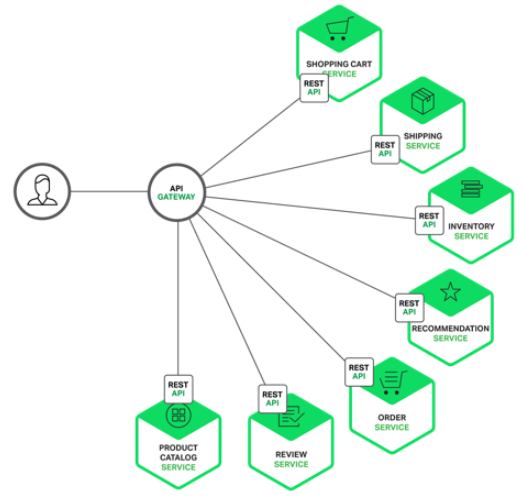

## 📘 API Gateway

- 클라이언트의 마이크로 서비스 호출에 대한 접근 인증 및 ACL을 적용하여 중요 데이터를 보호하는 트래픽 관리
- 외부 클라이언트와 백엔드 서비스 간 통신을 최적화하여 클라이언트에게 원활한 경험 제공
- 확장성과 고가용성을 보장하며 클라이언트의 모든 API 호출을 가져와 적절한 마이크로 서비스로 라우팅 함.
  (로드밸런서와 유사한 구조)

<br>

### **API Gateway를 사용하는 이유**

- 마이크로 서비스는 각각 자체기능을 필요로 하기 떄문에 어플리케이션을 느슨하게 결합된 여러 서비스로 분해 가능
- 더 쉽게 개발, 배포 및 유지 관리를 할 수 있지만 고객이 어플리케이션에 빠르고 안전하게 액세스 하기가 더 어려워진다
- Non-Blocking I/O가 지원되는 플랫폼에 구축하는것이 가장 합리적이다 (반응형 프로그래밍 모델)



<br>

### **클라이언트가 직접 마이크로 서비스에 요청을 보내는 경우**

- 각 마이크로 서비스는 Public Endpoint가 있는데 이 URL은 사용 가능한 인스턴스에 요청을 분산하는
  마이크로 서비스의 로드밸런서와 매핑됨
- **이론적으론 가능하지만 제약 사항이 많으며 거의 의미가 없음**
  - 클라이언트의 요구 사항과 각 마이크로 서비스에서 노출되는 세분화된 API 간 불일치 문제
  - 웹 & 방화벽 친화적이지 않은 프로토콜 사용 시 방화벽 외부에서 WebSocket 같은 프로토콜을 사용해야 함
  - 위 방식의 또 다른 단점은 마이크로서비스와 클라이언트 코드를 더 복잡하고 리팩터링을 어렵게 만든다
    ex) 서비스를 병합하거나 분할 할 때

<br>

### **장점 & 단점**

- 단일 진입점 (클라이언트 코드의 단순화)
- 어플리케이션의 내부 아키텍처를 캡슐화하여 각 클라이언트에게 적절하게 특정 API 제공
- 인증, 모니터링, 로드밸런싱, 캐싱, 요청 셰이핑 및 관리, 정적 응답 처리 등
- Custom API 제공
- 요청 처리 **결과 집계**하여 다른 요청 처리

<br>

### **성능 및 확장성**

- JVM 옵션
  - Netty, Vertx, Spring Reactor, JBoss Undertow와 같은 NIO기반 프레임워크 중 하나 사용
- 비 JVM 옵션
  - Node.js
  - Nginx Plus - Reverse Proxy, ACL, Load Balancing, Authentication, Monitoring 제공

<br>

### **Service Invocation**

- 비동기식 메시징 기반 메커니즘 사용
  - 일부 구현에서는 JMS 또는 AMQP와 같은 메시지 브로커를 사용한다
- HTTP or Thrift와 같은 동기 메커니즘 사용
- 시스템은 일반적으로 동기 & 비동기를 모두 사용함
- API Gateway는 다양한 통신 메커니즘을 지원해야 함

<br>

### **Service Discovery**

- API Gateway는 각 마이크로 서비스의 위치(IP 및 포트)를 알아야 함
- 기존의 어플리케이션에서는 위치를 하드와이어링할 수 있지만 MSA 환경에서는 문제가 됨
- 결과적으로 API Gateway는 서버 측 탐색 & 클라이언트 측 탐색 메커니즘을 사용해야함
- 모든 마이크로서비스 인스턴스 및 해당 위치의 데이터베이스인 서비스 레지스트리를 쿼리할 수 있어야 함

<br>

### **Handling Partial Failures (부분 실패 문제 핸들링)**

- API Gateway를 구현할 때 부분 실패 문제를 유의해야 한다.
- 한 서비스가 느리게 응답하거나 사용불가능한 서비스를 호출할때마다 모든 분산시스템에서 발생함
- API Gateway는 Downstream 서비스를 무기한으로 차단해서는 안됨
- ex) 제품 세부 정보에서 추천 기능이 응답하지 않을 경우
  - 추천을 제외한 나머지 제품 세부 정보가 사용자에게 유효하기 떄문에 클라이언트에
    이 정보들을 반환해야 함
  - 이때 응답하지 않는 추천기능의 캐시된 데이터가 있다면 캐시된 데이터를 반환함
  - 이 캐시된 데이터는 API Gateway에서 자체 캐시를 하거나 Redis 등 외부 캐시에 저장 가능
- API Gateway는 기본 & 캐시된 데이터를 반환하여 시스템 오류가 사용자에게 영향을 미치지 않도록 함

------
## 📘 API Gateway 구축

사전 준비 사항

1. Spring Cloud Gateway 프로젝트 생성 (Gateway, Eureka Discovery Client Dependency 추가)
2. Service 프로젝트 생성 (Eureka Discovery Client, Spring Web 등 추가)

<br>

### **application.yml 설정**

```yaml
# Service 프로젝트

server:
  port: 8080
  servlet:
    context-path: /spring-cloud-service

spring:
  application:
    name: spring-cloud-service

eureka:
  instance:
    prefer-ip-address: true
  client:
    registryFetchIntervalSeconds: 5
    disable-delta: true
    register-with-eureka: true
    fetch-registry: true
    service-url:
      defalutZone: http://localhost:8761/eureka
# Gateway 프로젝트

server:
  port: 8081

spring:
  application:
    name: spring-cloud-gateway
  cloud:
    gateway:
      routes:
        - id: spring-cloud-service
          uri: lb://SPRING-CLOUD-SERVICE
          predicates:
            - Path=/spring-cloud-service/**

eureka:
  instance:
    prefer-ip-address: true
  client:
    register-with-eureka: true
    fetch-registry: true
    service-url:
      defalutZone: http://localhost:8761/eureka
```

<br>

### **어플리케이션 실행 클래스**

- @EnableDiscoveryClient Annotation 추가

<br>

### **Service API 추가 (Service 프로젝트)**

```java
@RestController
public class SpringCloudServiceController {

    @GetMapping("/service")
    public String springCloudService() {
        return "spring-cloud-service 호출!";
    }

}
```

<br>

### **서버 실행**

- localhost:8761로 접속하면 API Gateway와 Service가 등록된걸 볼 수 있다