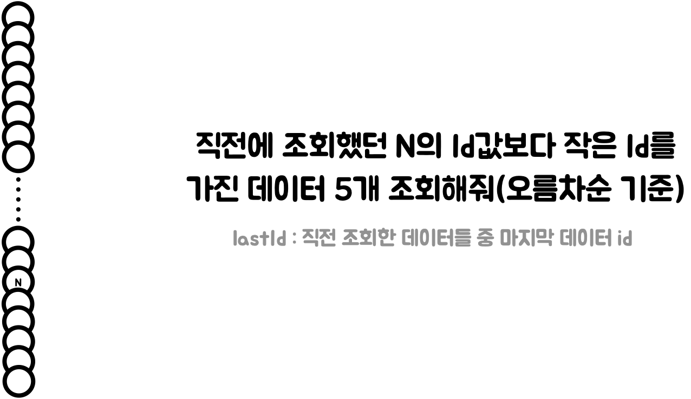

## No Offset - Paging 성능 개선

웹 서비스에서 페이지네이션은 흔하게 사용되는 기능 중 하나이다. 

현재 진행중인 66Challenge에서도 페이지네이션이 기능이 필요했고 JPA에서 기본적으로 제공하는 Offset 페이지네이션을 적용했다.

Offset 페이지네이션은 Pageable 객체를 통해 페이지네이션을 구현하는 방식이다. 

```java
// Offset Pagination
SELECT * 
FROM 테이블 
WHERE 조건문 
ORDER BY id DESC 
LIMIT 컨텐츠개수
OFFSET 페이지번호 * 컨텐츠개수
```

하지만 Offset 페이지네이션에는 두 가지 문제점이 있었다.😕

이번에는 이 문제점을 어떻게 해결하여 페이징 성능을 개선했는지에 다뤄 보려고한다.

---

## Offset 페이지네이션의 문제점

### 뒤로 갈수록 심해지는 성능 저하

Offset 페이지네이션은 매번 페이지 단위로 offset 값을 계산하여 데이터베이스에 쿼리를 요청하고, 이후에 원하는 데이터를 가져오는 방식을 사용한다. 하지만 이 방식은 페이지가 끝날 때마다 offset을 계산하고 데이터를 가져오기 때문에 페이지가 크거나 데이터가 많을 경우에는 성능 이슈가 발생할 수 있습니다.

<br>

예를 들어, N번째부터 5개의 데이터를 조회하고 싶다면 Offset 페이지네이션은 바로 N번째 데이터로 건너뛰는 것이 아니라 N번째 데이터를 찾을 때까지 앞에서 읽었던 모든 행들을 읽게 되고 N번째 데이터를 찾으면 나머지 행들을 삭제한다.

<br>


데이터가 별로 없다면 큰 문제가 되지 않겠지만 만약 100만번째 데이터에서부터 10개의 데이터를 조회하고 싶다면 어떻게 될까? 

무려 1,000,010개의 행을 조회해야 한다. 그리고 실제로 필요한 데이터는 마지막 10개의 데이터이기 때문에 앞에 조회했던 100만 개의 데이터는 삭제되게 된다. 이러한 이유때문에 페이지가 뒤로 갈수록 의미없이 읽어야하는 행의 개수가 많아지면서 성능이 느려지고 DB에 많은 부하를 주게 된다.

 <br>

아래는 15만 건의 더미 데이터를 넣어 테스트 한 결과 이미지이다.

첫 페이지 조회와 마지막 페이지 조회에서 약 100배 이상의 성능 차이가 나는 것을 확인할 수 있다! 😱


지금은 작은 서비스이기 때문에 큰 문제가 없지만, 서비스가 커짐에 따라 페이징 기능이 수십초에서부터 심하면 수분까지 성능이 느려질 수 있기 때문에 페이징 성능 개선이 필요했다.

---

### 데이터 중복 문제

두 번째로 데이터 중복 문제가 있다. 페이지를 이동하는 중간에 데이터가 삽입, 삭제, 업데이트 등의 작업이 발생하면 다른 페이지에 영향 주게 된다.

예를 들어, 1페이지에서 3개의 데이터를 조회한 후 2페이지로 넘어가는 과정에서


새로운 데이터가 추가된다면 이전 페이지에서 읽었던 데이터가 밀려와 이미 조회한 데이터를 중복 조회하게 된다.

<br>


데이터 중복 조회는 사용자 경험에 부정적인 경험을 줄 수 있다.

이러한 성능 저하 문제와, 데이터 중복 조회 문제를 해결하기 위해 알아보던 중 No Offset 페이지네이션 방식을 알게되었다.

---

### No Offset 페이지네이션으로 해결해보자!

No Offset 방식은 이전 페이지의 마지막 데이터의 id 값을 기억하고, 다음 페이지를 요청할 때 이 id 값 이후의 데이터를 가져오는 방식이다. 이를 통해 매번 offset 값을 계산하지 않아도 되기 때문에 데이터베이스에서 더욱 효율적으로 데이터를 가져올 수 있다.

```java
// No Offset 페이지네이션
SELECT * 
FROM 테이블 
WHERE 조건문
AND id < lastId
ORDER BY id DESC 
LIMIT 컨텐츠개수
```

예를 들어, 유저가 N번째 데이터부터 5개의 데이터를 조회하고 싶다고 요청한다면 직전에 조회한 데이터들 중 마지막 데이터의 id를 조건문으로 사용하여 이전에 조회했던 데이터들을 읽을 필요 없이 원하는 데이터로 건너 뛸 수 있게 된다. 

때문에 페이지가 뒤로 가더라도 처음 페이지를 읽은 것과 동일한 성능을 가지게 된다.

<br>




또한 페이지를 순차적으로 가져오기 때문에 중간에 삽입, 삭제, 업데이트 등의 작업이 발생해도 다른 페이지에 영향을 미치지 않는다. 이를 통해 데이터베이스의 부하를 줄일 수 있다. 

아까와 동일한 예시로 첫 번째 페이지에서 3개의 데이터를 조회한 후 다음 페이지로 넘어가는 사이에 새로운 데이터가 추가되더라도 다음 페이지에 영향을 주지 않는다. (동일한 데이터를 중복 조회할 일이 없어진다.)


---

### No Offset 구현하기

No Offset 방식을 구현하기 위해서는 이전 페이지의 마지막 데이터의 id 값을 저장하고, 다음 페이지를 요청할 때 이 값을 기준으로 데이터를 가져오는 방식으로 구현할 수 있다. 

No Offset은 2가지 상황에 따라 쿼리가 달라져야 한다.

- 첫 번째 조회 : 이전 페이지가 없기 때문에 이전 페이지의 마지막 데이터의 id가 존재하지 않는다.
- 이후 조회 : 이전 페이지의 마지막 데이터의 id를 파라미터로 사용한다. 

이 부분은 QueryDSL의 동적 쿼리를 사용하여 해결하였다. 아래는 No Offset을 구현한 코드이다.

```java
public List<Habit> findAll(Long lastHabitId, int size) {
	return jpaQueryFactory
    		.selectFrom(habit)
           	.where(ltHabitId(lastHabitId)
         	.orderBy(habit.habitId.desc())
         	.limit(size)
         	.fetch();
}

// id < 첫 번째 조회에서는 파라미터를 사용하지 않기 위한 동적 쿼리
private BooleanExpression ltHabitId(Long lastHabitId) {
	if (lastHabitId == null) {
    	return null;	// BooleanExpression 자리에 null이 반환되면 조건문에서 자동을 제외된다.
    }
    retrun habit.habitId.lt(lastHabitId);
}
```

---

### 성능 확인

아래는 더미 데이터 15만 건을 넣어 테스트한 결과 이미지이다.

No Offset 방식에서 offset 방식보다 월등한 성능 향상을 보였고, 마지막 페이지 조회와 첫 페이지 조회의 성능이 동일한 것을 확인할 수 있습니다. 

이로 인해 성능을 유지하고 DB의 부하를 줄여 안정적인 사용자 경험을 제공할 수 있게 됐다.


---

### 마무리

종합적으로 No Offset 방식은 데이터베이스에서 데이터를 가져오는 성능을 향상시키고, 데이터 변경 작업에 대한 부하를 줄일 수 있는 방법이다.

그러나 No Offset 방식은 이전 페이지의 마지막 데이터를 기억해야 하기 때문에, 페이지를 건너뛰는 기능을 구현하기 어렵다는 단점이 있다.

그리고 페이징 조건이 복잡해지면 쿼리가 상당히 복잡해지는 점도 단점이다. 상황과 필요에 따라 적절히 사용하면 좋을 것 같다.

 <br>

[참조-1](jojoldu.tistory.com)

[참조-2](use-the-index-luke.com)