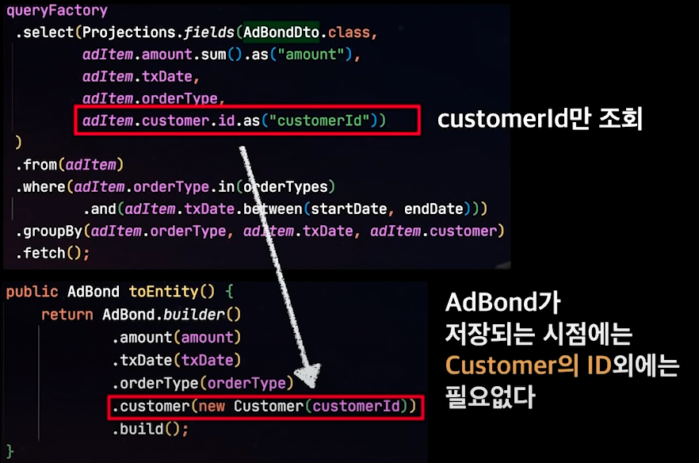
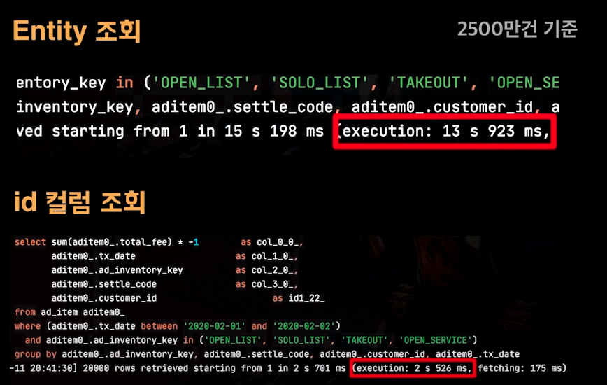
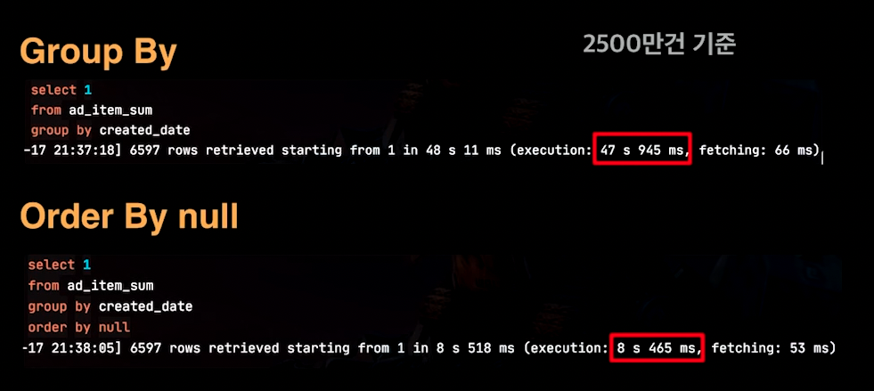
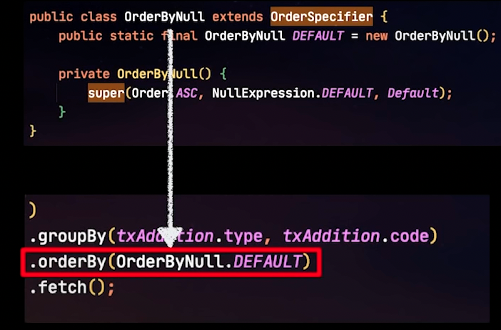
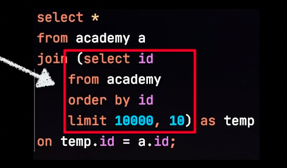
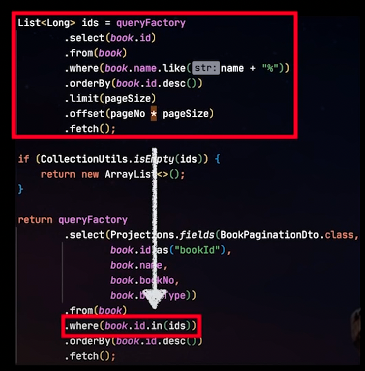

## QueryDsl 성능 개선 (+ JPQL 관련 이슈)

---

## exist 금지

SQL exists문은 조건을 만족하는 레코드를 1개 찾으면 바로 결과를 반환하고 쿼리를 종료한다.

반면 count(1)의 경우 마지막 레코드까지 검색을 하기 떄문에 성능이 낭비된다.

이런 성능차이는 스캔 대상이 앞에 위치할수록 더 심하게 발생될것이고,

**QueryDsl의 exists는 SQL의 count()>0 쿼리로 날린다.**

이를 개선하기 위해 QueryDsl의 `selectOne`과 `fetchFirst(= limit 1)`을 사용해 직접 exists 쿼리를 구현한다.

주의할 점은 조회결과가 없으면 null이 반환되기 떄문에 0이 아닌 null로 체크를 해야 한다.

아래 코드로 exists를 직접 쿼리하자 SQL의 exists와 거의 동일한 성능을 가지는 효과가 생겼다.

```kotlin
fun exist(Long bookId): Boolean {
  
  val query = queryFctory
		.selectOnt()
		.from(book)
		.where(book.id.eq(bookId))
		.fetchFirst()
  
  return fetchOne != null;
}
```

---

## Cross Join 회피

일반적으로 Cross Join의 성능이 좋지 않은 것은 사실이다. 아래 코드 예시를 보면 알 수 있다.

```kotlin
fun crossJoin() {
  val query = queryFactory
  .selectFrom(customer)
  .where(customer.customerNo.gt(customer.shop.shopNo))
  .fetch()
}
```

where 문에서 customer.shop과 비교하면서 묵시적 조인으로 인해 Cross Join이 발생한다.

일부 DB는 Optimizer가 어느정도 최적화를 해주지만 DB에 의존을 기대할 필요가 없다.

이는 Hibernate 이슈라서 Spring Data JPA도 동일하게 발생하는 이슈이므로,

간단하게 **명시적 조인을 사용하면 된다.**

```kotlin
fun noCrossJoin {
  val query = queryFactory
  .selectFrom(customer)
  .innerjoin(customer.shop, shop)
  .where(customer.customerNo.gtshop.shopNo)
  .fetch()
}
```

---

## Entity 보다 DTO

많은 사람들이 **오해하는 것** 중 하나가 Jpa를 사용할 때는 무조건 Entity를 사용해야 한다는 것이다.

Entity 조회시 **Hibernate 캐시에 복사본 저장, 불필요한 컬럼 조회, OneToOne에서의 N+1 쿼리** 등 **단순 조회 기능**에서는 **성능 이슈** 요소가 많다.

따라서 반드시 Entity를 사용할 것이 아니라 Entity가 필요하지 않다면 DTO 조회를 하는 것이 리소스 관점에서 도움이 된다.

 <br>

**[Entity 조회]**

- 실시간으로 Entity 변경이 필요한 경우

**[DTO 조회]**

- 고강도 성능 개선 or 대량의 데이터 조회가 필요한 경우 

다음은 DTO 조회를 할 때 성능을 더 개선할 수 있는 방법에 대해 알아보자.

---

## 조회컬럼 최소화하기

**조회 컬럼 수를 줄여서 딱 필요한 데이터만 조회**하면 **대량 데이터를 다루는데 성능상으로 이점**이 있다.

아래 예시를 보면 파라미터로 들어온 값을 그대로 Projections.fileds에 넣어주고 있다. 

이는 **이미 알고 있는 데이터이기 때문에 조회할 필요가 없다.**

```kotlin
fun getBooks (bookNo: Int, pageNo: Int): List<BookPageDto> {
    return queryFactory
            .select(Projections.fields(BookPageDto.class,
                    book.name,
                    book.bookNo, // 이미 알고 있는 값으로 조회할 필요가 없음
                    book.id
            ))
}
```

**이미 알고 있는 값은 as 표현식으로 대체**할 수 있어서 as 컬럼은 select에서 제외시킬 수 있다.

```kotlin
fun getBooks (bookNo: Int, pageNo: Int): List<BookPageDto> {
    return queryFactory
            .select(Projections.fields(BookPageDto.class,
                    book.name,
                    Expressions.asNumber(bookNo).as("bookNo"),
                    book.id
            ))
}
```

---

## Select 컬럼에 Entity 자제

Select 컬럼에 조회할 Entity와 관계를 맺는 다른 Entity를 넣게 되면 그 Entity의 **불필요한 모든 컬럼도 함께 조회**가 된다.

<br>

추가적으로 **Customer 엔터티가 Shop 엔티티와 OneToOne 관계를 갖고 있을 경우 shop이 매 건마다 조회가 되어 N+1 상황이 발생**한다. **(OneToOne 관계는 Lazy Loading을 허용하지 않음)**

<br>

**이때 만약 Shop에도 OnetoOne 관계를 맺는 다른 Entity가 있다면? 100배, 1000배 쿼리가 나가게 된다.**

Q. 연관된 Entity의 save를 위해서는 반대 Entity가 있어야 하지 않나요?

A. 아니다. 반대편 Entity의 id만 있으면 save할 수 있다.

 <br>

따라서 연관된 엔터티 전체를 select절에 추가하지 말고 해당 엔터티의 id만 추가하면 된다.



결과적으로 실행시간의 차이를 보면 6배 정도의 차이가 나는 것을 확인할 수 있다.



그래서 select 컬럼을 작성할 때는 실제로 사용할 컬럼만 조회하는 것이 좋다.

---

## Group By 최적화

일반적으로 MySQL에서는 Group By를 실행하면 Filesort가 필수적으로 발생한다. (Index가 아닌 경우)

MySQL에서는 order by null을 사용하면 Filesort가 제거된다. 아래를 보면 성능 차이가 극명한 것을 알 수 있다.



문제는 QueryDSL 에서는 order by null 문법을 지원하지 않는다.

그래서 아래 예시와 같이 조건 클래스를 생성해서 쿼리에 적용하면 된다.



Querydsl에서는 공식적으로 null에 대해 NullExpression.DEFAULT 클래스로 사용하길 권장하니 이를 사용하면 된다.

<br>

**단, 페이징일 경우, order by null을 사용하지 못하므로 페이징이 아닌 경우에만 사용해야 합니다.**

---

## 커버링 인덱스

커버링 인덱스는 **쿼리를 충족**시키는데 필요한 **모든 컬럼**을 갖고 있는 **인덱스**이다. `select / where / order by / group by` 등에 활용되는 모든 컬럼이 인덱스의 구성 요소인 경우 **대용량 데이터 조회 시 성능을 크게 향상**시킬 수 있다.

<br>

커버링 인덱스는 **NoOffset** 기법과 더불어 **페이징 조회 성능**을 향상시키는 가장 보편적인 방법이다.

<br>

아래의 예시는 Join절에서 커버링 인덱스를 사용해서 빠르게 데이터를 조회하고, 그 후에 레코드 데이터를 조회한다.



문제는 QueryDSL의 근간이 되는 JPQL에서 from(또는 Join)절의 서브쿼리를 지원하지 않는다.

<br>

그래서 해당 경우 클러스터 키를 **커버링 인덱스**로 빠르게 조회하고, 조회된 Key로 **SELECT 컬럼**들을 후속 조회하는 것이 좋다.

 

성능 개선 - Select 파트는 여기까지다.
