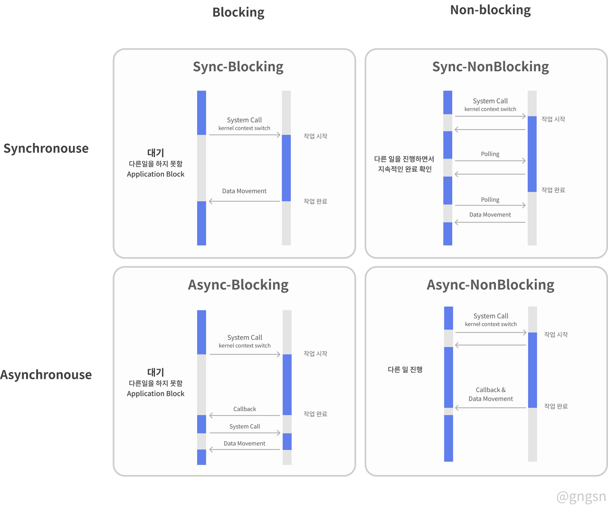

## 📘 Spring WebClient란?

Spring WebClient를 계속 써왔었는데, 글로 남기는걸 자꾸 미루다가 이제서야 포스팅합니다.

Spring WebClient는 RestTemplate을 대체하는 HTTP Client 입니다.

기존 Sync API를 제공하며, Non-Blocking & Async 방식을 지원해서 효율적인 통신이 가능합니다.

<br>

WebClient는 Builder 방식의 인터페이스를 사용하며, 외부 API로 요청을 할 때 **리액티브 타입**의 전송과 수신을 합니다. (Mono, Flux)

<br>

> 📕 **WebClient의 특징**

- Single Thread 방식
- Non-Blocking 방식
- Json, Xml의 쉬운 응답

<br>

> 📕 **제어권 반환 : Blocking & Non-Blocking**

**Blocking**

- Application이 Kernel로 작업 요청을 할 때, Kernel에서는 요청에 대한 로직을 실행합니다.
- 이 때, Application은 요청에 대한 응답을 받을 때까지 대기합니다.
- Application은 Kernel이 작업을 끝낼때까지 백그라운드에서 작업이 끝났는지 지속적으로 확인합니다. (Polling)

<br>

**Non-Blocking**

- Application이 요청을 하고 바로 **제어권**을 돌려받습니다.
- 즉, 요청이 Blocking 되지 않았으므로 Non-Blocking이라고 불립니다.

---
## 📘 Sync & Asyn / Blocking & Non-Blocking 개념

Blocking & Non-Blocking은 **제어권 반환**에 중점을 두지만, Sync & Async는 **응답값 반환**에 중점을 둡니다.

Sync는 결과값을 직접 받아 처리하는 반면, Async는 결과값을 받을때 어떻게 할지의 CallBack 함수를 미리 정의합니다.



<br>

> 📌 **Sync Blocking / Sync Non-Blocking**

**Sync Blocking**

동기 방식의 블로킹은 작업을 수행한 순서에 맞게 수행됩니다.

- Kernel : 작업 할동안 대기하셈
- Application : 기다리는중
- Kernel : 끝남, 결과 받으셈

<br>

**Sync Non-Blocking**

동기 방식의 논블로킹은 작업을 시작하고 제어권을 다시 돌려주기 때문에 다른 작업을 수행할 수 있습니다.

종료 시점은 Application단의 Process or Thread가 Polling(지속적인 완료 확인) 을 합니다.

- Kernel : 나 작업할 동안 딴거 하고 있으셈
- Application : (다른 일 하면서) 다 됨?
- Kernel : ㄴㄴ
- Application : (다른 일 하면서2) 다 됨?
- Kernel : ㅇㅇ 받으셈 (결과값)

<br>

> 📌 **Async Blocking / Async Non-Blocking**

**Async Blocking**

비동기 블로킹 방식은 비동기의 장점을 못살리는 대표적인 경우입니다.

- Application : 결과 나오면 알려주셈
- Kernel : ㄴㄴ 작업 동안 기달리셈 (Blocking)
- .....
- Kernel : 끝남 가져가셈 (결과값)
- Application : ㅇㅇ..

<br>

**Async Non-Blocking**

비동기 논블로킹 방식은 **작업**에 대한 서로의 자유도가 높습니다.

각자 할일을 수행하며, 필요한 시점에 각자 결과를 처리합니다.

- Application : 결과 나오면 알려주셈
- Kernel : ㅇㅇ 다른거 해
- .....
- Kernel : 작업 끝남 (결과물)
- Application : ㄱㅅ

---
## 📘 WebClient 생성

WebClient를 생성하는 방법은 2가지가 있습니다.

단순하게 create() 이용하는 방법과, option을 추가할 수 있는 build()를 사용한 생성이 있습니다.

<br>


> 📕 **Dependencies**

```groovy
implementation 'org.springframework.boot:spring-boot-starter-webflux'
```

<br>

> 📕 **create()**

- 단순하게 WebClient의 Default Setting으로 아래와 같이 생성합니다. Base URL과 함께 생성도 가능합니다.

```java
WebClient.create();
// or
WebClient.create("http://localhost:8080");
```

<br>

> 📕 **builder()**

설정을 Custom하게 바꿔서 널을 수 있는 DefaultWebClientBuilder 클래스를 사용하는 build()를 사용합니다.

**Options**

- **uriBuilderFactory** : Base URL을 커스텀 한 UriBuilderFactory
- **defaultHeader** : 모든 요청에 사용할 헤더
- **defaultCookie** : 모든 요청에 사용할 쿠키
- **defaultRequest** : 모든 요청을 커스텀할 Consumer
- **filter** : 묘든 요청에 사용할 클라이언트 필터
- **exchangeStrategies** : HTTP Message Reader & Writer 커스터마이징
- **clientConnector** : HTTP Client Library Settings

<br>

```java
// 예시
@Bean 
public WebClient webClient() {  
    return WebClient.builder()  
            .baseUrl("http://localhost:8080")  
            .defaultCookie("cookieKey", "cookieValue")  
            .defaultHeader(HttpHeaders.CONTENT_TYPE, MediaType.APPLICATION_JSON_VALUE)  
            .defaultUriVariables(Collections.singletonMap("url", "http://localhost:8080"))  
            .build();  
}
```

---
## 📘 WebClient Configuration

WebClient에서의 TimeOut 처리나 ErrorHandling 같은 세부적인 설정 방법입니다.

<br>

> 📕 **TimeOut**

특정 WebClient Bean에 대한 모든 요청의 TimeOut을 전역적으로 설정합니다.

- ConnectTimeOut : 5000
- ReadTimeOut : 5000
- WriteTimeOut : 5000
- 위 같이 설정한 HttpClient 객체를 **clientConnector()에 주입합니다.**

```java
import io.netty.channel.ChannelOption;  
import io.netty.handler.timeout.ReadTimeoutHandler;  
import io.netty.handler.timeout.WriteTimeoutHandler;
import org.springframework.http.client.reactive.ReactorClientHttpConnector;
import java.time.Duration;  
import java.util.concurrent.TimeUnit;

@Bean  
public WebClient webClient() {  
    HttpClient httpClient = HttpClient.create()  
            .option(ChannelOption.CONNECT_TIMEOUT_MILLIS, 5000)  
            .responseTimeout(Duration.ofMillis(5000))  
            .doOnConnected(i ->   
                    i.addHandlerLast(new ReadTimeoutHandler(5000, TimeUnit.MILLISECONDS))  
                    .addHandlerLast(new WriteTimeoutHandler(5000, TimeUnit.MILLISECONDS)));  
      
    return WebClient.builder()  
            .clientConnector(new ReactorClientHttpConnector(httpClient))  
            .build();  
}
```

<br>

> 📕 **mutate()**

한 번 빌드된 WebClient는 Immutable (불변) 합니다.

WebClient를 Singleton으로 사용할 때 Default Setting과 다르게 사용하고 싶을때도 분명 있을겁니다.

그럴 때, mutate()를 사용하여 Singleton인 WebClient Bean 객체에 다른 설정값을 가지는 요청을 할 수 있습니다.

```java
WebClient Server = WebClient.builder().filter(filterA).filter(filterB).build();

WebClient Client = WebClient.builder().filter(filterA).filter(filterB).filter(filterC).build();
```

같은 Singleton WebClient 인스턴스지만, **mutate()** 를 이용해 서로 다른 설정 값을 가지는 요청을 할 수 있습니다.

---
## 📘 Request

WebClient는 WebFlux와 같이 나온만큼 Mono와 Flux를 메인으로 사용합니다.

만약 Reactive에 대한 이해가 부족 하다면 [Reactive 이해하기](https://gngsn.tistory.com/223#google_vignette)를 참고하시길 바랍니다.

요청은 Get과 Post만 알면 Put, Delete는 비슷하게 사용할 수 있으니 Get, Post만 알아보겠습니다.

<br>

> 📕 **Get**

일반적으로 Get은 단일 리소스(Mono) 혹은 리소스 모음(Flux)를 가져옵니다.

대부분 어렵지 않게 사용할 수 있습니다.

코드에 나오는 retrive()와 bodyToXX는 Response에서 알아보겠습니다.

<br>


**Mono**

```java
public Mono<Person> findById(final Integer id) {
	return webClient.get()
							.uri("/person/" + id)
							.retrieve()
							.bodyToMono(Person.class);
}
```

<br>

**Flux**

```java
public Flux<Person> findAll() {
	return webClient.get()
							.uri("/persons")
							.retrieve()
							.bodyToFlux(Person.class);
}
```

<br>

> 📕 **Post**

Post의 body() 부분에 반환 타입이 있으면 `Mono<Person>` 없으면 `Mono<Void>`를 지정해 줍니다.

```java
public Mono<Person> create(Person data) {
	return webClient.post()
							.uri("/person")
							.body(Mono.just(data), Person.class)
							.retrieve()
							.bodyToMono(Person.class);
}
```

---
## 📘 Response

응답을 받을땐 2개의 함수 중 적절하게 선택해서 사용하면 됩니다.

- **retrieve()** : Body를 받아 디코딩 하는 간단한 함수
- **exchange()** : ClientResponse를 상태값, 헤더와 같이 가져오는 함수

exchange()를 통해 Response의 세부적인 컨트롤이 가능하지만, Response 컨텐츠에 대한 모든 처리를 직접 하면,

메모리 누수 가능성 때문에 retrieve()를 권장하고 있습니다.

<br>

> 📕 **retrieve()**

retrieve()를 사용한 후 데어터는 크게 2가지 형태로 받을 수 있습니다.

<br>

**toEntity()**

Status, Header, Body를 포함하는 ResponseEntity 객체로 받기

```java
Mono<ResponseEntity<Person>> monoEntity = client.get()
  	.uri("/persons/1")
  	.accept(MediaType.APPLICATION_JSON)
  	.retrieve()
  	.toEntity(Person.class);
```

<br>

**toMono() / toFlux()**

Body의 데이터만 받기

```java
Mono<Person> monoEntity = client.get()
  	.uri("/persons/1")
  	.accept(MediaType.APPLICATION_JSON)
  	.retrieve()
  	.bodyToMono(Person.class);
```

<br>

**exchangeToXX()**

exchange()는 Deprecated 예정이니 exchangeToXX()를 사용합니다.

```java
Mono<Person> monoEntity = client.get()
    .uri("/persons/1")
    .accept(MediaType.APPLICATION_JSON)
    .exchangeToMono(response -> {
        if (response.statusCode().equals(HttpStatus.OK)) {
            return response.bodyToMono(Person.class);
        }
        else {
            return response.createException().flatMap(Mono::error);
        }
    });
```

<br>

> 📕 **block() & subscribe()**

Blocking 방식을 사용하려면 **block()**, Non-Blocking 방식을 사용하려면 **subscribe()** 를 통해 콜백 함수를 지정할 수 있습니다.

```java
// blocking
Mono<Employee> employeeMono = webClient.get(). ...
employeeMono.block()

// non-blocking
Mono<Employee> employeeFlux = webClient.get(). ...
employeeFlux.subscribe(employee -> { ... });
```

---
## 📘 ErrorHandling

에러 핸들링은 결과값을 반환받을 상황에 따라 적절히 처리가 가능합니다.

**retrive()와 exchangeToXX()** 를 각각 어떻게 처리할 지 살펴봅시다.

<br>

> 📕 **retrieve()**

retrieve는 1xx, 2xx, 3xx ... StatusCode 별로 처리가 가능합니다.

```java
Mono<Person> result = client.get()
        .uri("/persons/{id}", id).accept(MediaType.APPLICATION_JSON)
        .retrieve()
        .onStatus(HttpStatus::is4xxClientError, response -> ...)
        .onStatus(HttpStatus::is5xxServerError, response -> ...)
        .bodyToMono(Person.class);
```

<br>

> 📕 **exchangeToXX()**

exchange를 통해 받은 결과값에 대한 StatusCode를 이용해 분기 처리하여 핸들링 할 수 있습니다.

```java
Mono<Object> monoEntity = client.get()
       .uri("/persons/1")
       .accept(MediaType.APPLICATION_JSON)
       .exchangeToMono(response -> {
           if (response.statusCode().equals(HttpStatus.OK)) {
               return response.bodyToMono(Person.class);
           }
           else if (response.statusCode().is4xxClientError()) {
               return response.bodyToMono(ErrorContainer.class);
           }
           else {
               return Mono.error(response.createException());
           }
       });
```