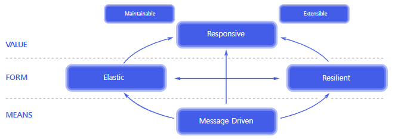

## 📚 Reactive System & Reactive Programming

- 선언형 프로그래밍(Lambda 표현식, Stream API), 순차 실행 X
- Reactive System은 Requst Thread의 응답 대기시간을 최소화 할 수 있게 Non-Bloking 통신 지원함
- Reactive Programming 에서의 반응은 Thread의 Non-Blocking과 관련이 있다.

 

### Reactive System 설계 원칙

 

**Means - 리액티브 시스템의 커뮤니케이션을 담당**
- Message Driven
    - 리액티브 시스템은 메세지 기반 통신을 통한 시스템 간 느슨한 결합 유지

 

**Form - 메세지 기반 통신을 통한 구조 형성**
- Elastic
    - 트래픽량에 관계없이 일정한 응답성 유지
- Resiilient
    - 시스템 장애 발생 시, 응답성 유지

 

**Value - 리액티브 시스템의 핵심 가치 표현**
- Responsive
    - 즉각 응답
- Maintainable
    - 즉각 응답의 지속
- Extensible
    - 요청 처리의 오토스케일링

 

### Reactive Programing 특징

**Declarative Programming Paradigm**
- 선언형 프로그래밍 방식 사용

 

**Data Streams and The Propagation of Change**
- 지속적인 데이터의 요청이 있음을 의미하며, 요청 = 변경이벤트로 간주해 이벤트 발생시 마다 데이터 전달
- **Automatic Propagation of the Changed Data Flow**
    - 위와 동일
- **Reactive Streams**
    - Reactive Programming을 사용하기 위한 Specification

---

## 📚 Components of Reactive Streams

> `Publisher<T>` - 소스로부터 데이터 emit

- `subscribe(Subscriber<? super T>) `
- Subscriber가 Publisher가 내보낸 데이터 소비

 

> `Subscriber<T>` - Publisher가 내보낸 데이터 소비

- onSubscribe(Subscription)
    - 구독 시작 시 호출, Publisher에게 요청할 데이터의 개수 지정 & 구독 해지 처리
- onNext(T)
    - 데이터 emit 시 호출, emit된 데이터 소비
- onError(Throwable)
    - emit 데이터 -> Subscriber 전달 시 오류 발생되면 호출
- onComplete()
    - 데이터 emit 종료 시 호출, emit후 처리할 작업이 있으면 여기서 수행

 

> `Subscription` - 구독상태를 표현한 인터페이스

- request(long)
    - emit 개수 요청
- cancle()
    - 구독 해지, 해지시 더 이상 데이터 emit X

 

> `Processor<T, R>` extends Subscriber<T>, Publisher<R>

- Publisher, Subscriber 의 역할을 동시에 처리

---

## 📚 Implementation Reactive Streams

**Project Reactor**
- Spring Reactive Application 구현의 대표적인 구현체, Spring 5의 Reactive Stack에 포함

**RxJava**
- .NET 기반 Reactive Library를 Netflex에서 Java 언어로 포팅한 JVM 기반 Reactive 확장 라이브러리

**Java Flow API**
- Java9 부터 지원
- Reactive Streams의 구현체들의 SPI역할
- Reactive Streams의 Specification을 Java안에 포함 시킨 구조

**Signal**
- Publisher가 발생시키는 이벤트

**Operator**
- 동작 수행 메소드

**Sequence**
- 메소드 체인을 하나의 시퀀스로 간주

**UpStream** **&** **DownStream**
- Sequence 기준 위 아래를 의미 (ex. filter() 기준)

**Reactive Extension**
- RxJS, RxAndroid, RxKotlin, RxPython, RxScala