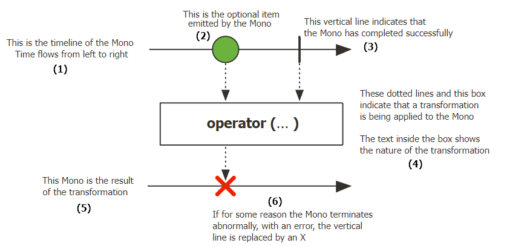
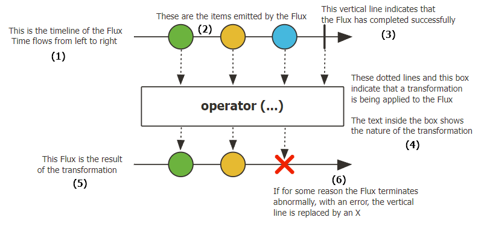

## 📚 Project Reactor

완전한 Non-Blocking 통신 지원
Publisher 타입으로 Mono[0|1] , Flux[N] 존재, 숫자는 가능한 데이터 emit의 수
MSA 기반 Application에 적합한 Library
BackPresure 전략 사용

 

**BackPresure 전략이란?**
Subscriber의 emit 데이터 처리 속도가 Publisher의 emit 속도를 따라가지 못할때 제어하는 전략

------
## 📚 Marble Diagram

### **Reactor의 데이터 타입 중 하나인 Mono 마블 다이어 그램**

- **(1)** 원본 Mono에서 시작되는 Sequence를 타임라인으로 표현
- **(2)** Sequence에서 구슬 1개가 생기는걸 데이터 Emit으로 표현
- **(3)** 수직 막대바( | ) -> Sequence 정상 종료를 의미
- **(4)** Operator에서의 데이터 가공 처리를 의미
- **(5)** 가공 데이터가 DownStream으로 전달될때를 의미
- **(6)** 'X' 의미 -> 에러 인한 비정상 종료

 

### **Reactor의 데이터 타입 중 하나인 Flux 마블 다이어 그램**

- 위의 Mono와 동일하지만 유일하게 다른점은 Flux[N] 이므로 여러개의 Emit 데이터 표현

------
## 📚 Scheduler

쓰레드 관리자
Non-Blocking - Async
복잡한 멀티쓰레딩 프로세스의 단순화

 

### **Scheduler 전용 Operator**

- **subscribeOn()**
  - 구독 직 후 실행되는 Operator 체인의 실행 쓰레드를 Scheduler로 지정한 쓰레드로 변경
  - ex) Schedulers.boundedElastic()
- **publishOn()**
  - 데이터를 emit 하는 Publisher의 실행 쓰레드 지정
  - 데이터를 가공하는 Operator 앞에 추가해서 실행 쓰레드를 별도로 추가함
  - ex) Schedulers.parallel()

------
## 📚 Operators

Opterator의 수가 너무 많으므로 상황별, 자주쓰는 Operator 정리

 

### **새로운 Sequence를 생성(Creating)하고자 할 경우**

- just()
- fromStream() - Stream을 입력으로 받아 emit
- fromIterable() - Iterable을 입력으로 받아 emit
- fromArray()
- range()
- interval()
- empty()
- never()
- defer()
- using()
- generate()
- create() - 프로그래밍 방식으로 Signal 이벤트(Publisher가 발생시키는 이벤트)를 발생시킴
  - 한번에 여러 개의 데이터를 async적으로 emit

 

### **기존 Sequence에서 변환 작업(Transforming)이 필요한 경우**

- map()
- flatMap() - 내부로 들어오는 데이터 1개당 하나의 Sequence 생성
- concat() - Publisher의 Sequence를 연결해서 순서대로 데이터 emit
- collectList()
- collectMap()
- merge()
- zip() - emit 데이터 결합 = emit 데이터를 하나씩 받아서 Downstream으로 전달
- then()
- switchIfEmpty()
- and()
- when()

 

### **Sequence 내부의 동작을 확인(Peeking)하고자 할 경우**

- doOnSubscribe
- doOnNext() - 데이터 emit 시 트리거되어 side-effect를 추가
- doOnError()
- doOnCancel()
- doFirst()
- doOnRequest()
- doOnTerminate()
- doAfterTerminate()
- doOnEach()
- doFinally()
- log() - Publisher 에서 발생하는 Signal 이벤트 로그 출력

 

### **Sequence에서 데이터 필터링(Filtering)이 필요한 경우**

- filter()
- ignoreElements()
- distinct()
- take()
- next()
- skip()
- sample()
- single()

 

### **에러를 처리(Handling errors)하고자 할 경우**

- error() - 의도적인 onError Signal 이벤트 발생시킴
- timeout() - 입력으로 얻은 시간동안 emit 데이터가 없으면 onError 이벤트 발생시킴
- onErrorReturn()
- onErrorResume()
- onErrorMap()
- doFinally()
- retry() - Sequence상 에러 발생할 경우, 입력값 만큼 재구독해서 Sequence 재시작