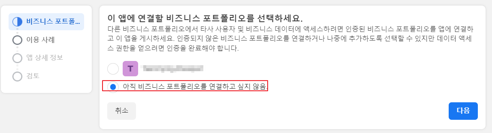
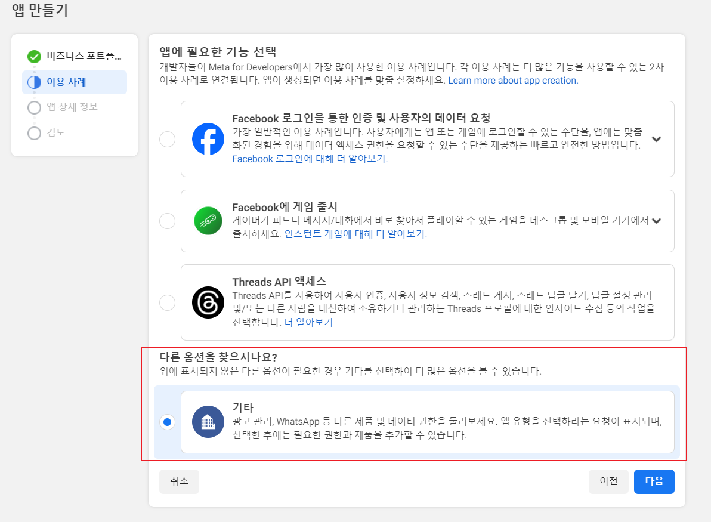
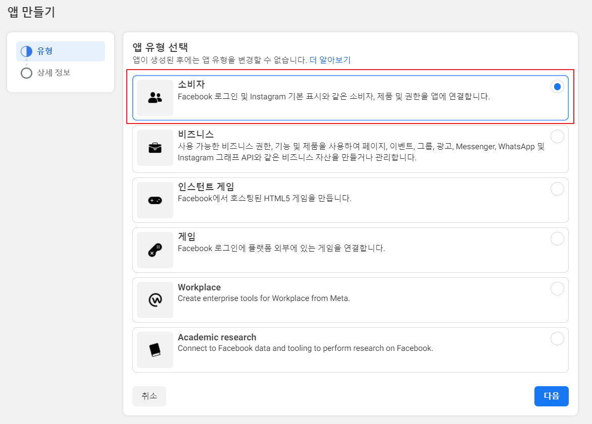
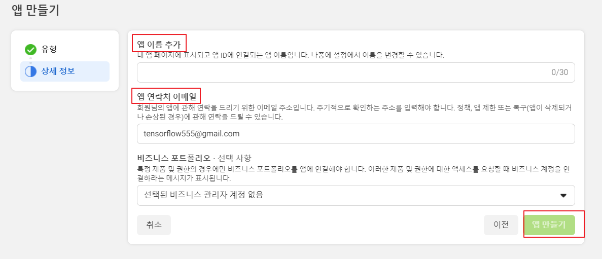
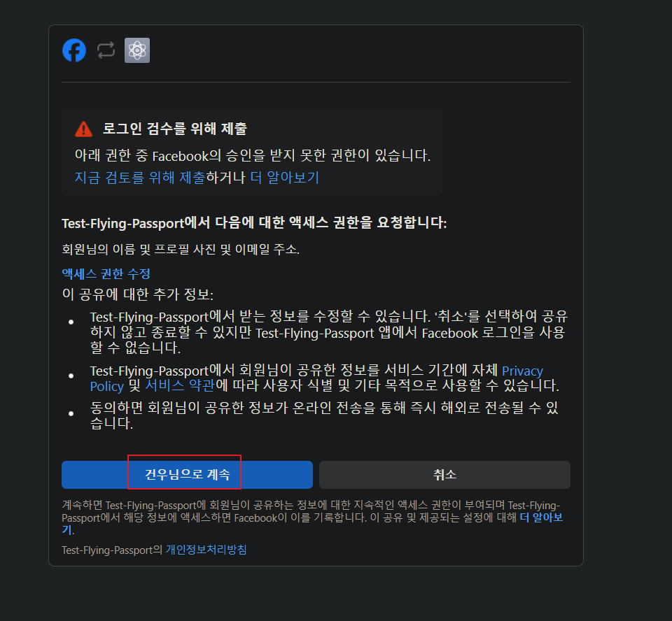

## Facebook OAuth2

[Meta Developers](https://developers.facebook.com/)에서 로그인을 하고 Get Started를 선택해 Meta for Developer에 가입합니다.

<br>

### 앱 만들기

가입 후, 우측 상단 **내 앱**을 클릭 해 **앱 만들기**를 눌러줍니다.

<br>

**비즈니스 프로필 지정 X 후 다음으로 넘어가기**



<br>

앱에 필요한 기능은 **기타**로 선택



<br>
**앱 유형**은 **소비자** 선택



<br>


**앱 이름과 이메일을 적어주고 만듭니다.**



<br>

## 제품 추가

앱 생성 후, 내 앱 대시보드 메인 화면에 보이는 **제품추가** 탭에서 **Facebook 로그인**을 선택합니다.

- 용도는 Web으로 선택 후 사이트 URL을 적어줍니다. (`http://{server}:{port})

그리고, 앱 대시보드 메인 화면의 왼쪽 하단 **앱설정** -> **기본설정**으로 진입

- App ID와 Secret Code를 따로 적어둡니다. (application.yml 에서 사용)

---
### Spring Boot

> **Yaml**

Yaml은 이전 Google과 같은 형식이며 Facebook 부분만 추가해주면 됩니다.

다른점은 scope의 `profile`이 Facebook에서는 `public_profile`로 사용해야 합니다.

```yaml
security:  
  oauth2:  
    client:  
      registration:  
        # 구글 로그인 추가  
        google:  
          client-id: {ID}
          client-secret: {PW}
          scope:  
            - email  
            - profile  
        # 페이스북 로그인 추가
        facebook:  
          client-id: {ID}
          client-secret: {PW}
          scope:  
            - email  
            - public_profile
```

<br>

> **OAuthAttributes**

- 테스트 용도이니 간단하게 전에 생성한 Google과 비슷한 생성자를 만들어서 매핑합니다.

```java
@Getter  
public class OAuthAttributes {  
    private Map<String, Object> attributes;  
    private String nameAttributeKey;  
    private String email;  
    private String password;  
  
    @Builder  
    public OAuthAttributes(Map<String, Object> attributes,  
                           String nameAttributeKey,  
                           String email,  
                           String password) {  
        this.attributes = attributes;  
        this.nameAttributeKey = nameAttributeKey;  
        this.email = email;  
        this.password = password != null ? password : "1234";  
    }  
  
    // OAuth2User에서 반환하는 사용자 정보는 Map    // 따라서 값 하나하나를 변환해야 한다.  
    public static OAuthAttributes of(String registrationId, String userNameAttributeName, Map<String, Object> attributes) {  
        if ("google".equals(registrationId)) {  
            return ofGoogle(userNameAttributeName, attributes);  
        } else {  
            return ofFacebook(userNameAttributeName, attributes);  
        }  
    }  
  
    // Google Attribute 생성자  
    private static OAuthAttributes ofGoogle(String usernameAttributeName, Map<String, Object> attributes) {  
        return OAuthAttributes.builder()  
                .email((String) attributes.get("email"))  
                .password((String) attributes.get("password"))  
                .attributes(attributes)  
                .nameAttributeKey(usernameAttributeName)  
                .build();  
    }  
  
    // Facebook Attribute 생성자  
    private static OAuthAttributes ofFacebook(String usernameAttributeName, Map<String, Object> attributes) {  
        return OAuthAttributes.builder()  
                .email((String) attributes.get("email"))  
                .password(null)  
                .attributes(attributes)  
                .nameAttributeKey(usernameAttributeName)  
                .build();  
    }  
  
    // User 엔티티 생성  
    public Member toEntity() {  
        return Member.createOrUpdateGoogleOAuthOf(email, password);  
    }  
}
```

<br>

이후 다른 클래스들은 딱히 큰 변화가 없으니 생략하고

서버를 실행시켜 `http://{server}:{port}/login/oauth2/login/facebook`로 진입해서 FaceBook Login 버튼을 클릭하면 아래와 같이 인증을 Meta Server에 위임합니다.

