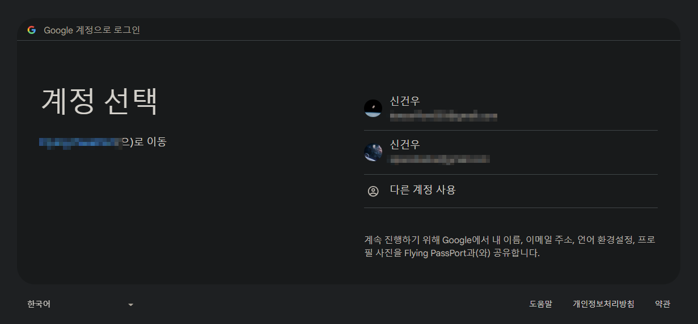
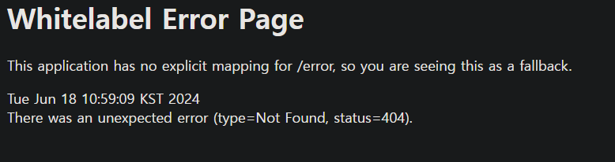
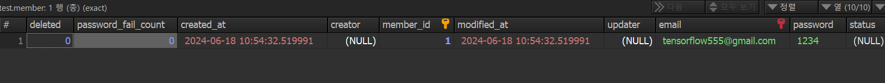

## Google OAuth Client 생성

- [Google Cloud Console](https://console.cloud.google.com/) 사이트에 방문해 상단 프로젝트 선택 버튼을 눌러 새 프로젝트를 생성하고 해당 프로젝트를 선택합니다.
- Google Cloud 페이지 왼쪽 삼단바에 **API 및 서비스** -> **사용자 인증정보** -> **사용자 인증정보 만들기** -> **OAuth 클라이언트 ID** 선택
- OAuth Client ID를 만들기 전 동의 화면을 구성해야 하기 떄문에 `동의 화면 구성` 선택
	- User Type은 **External**로 설정하고 만들기 버튼 클릭
	- 앱 이름, 로고, 도메인, 개발자 연락처 등 입력하고 넘어가기
	- 범위 추가 -> 맨위 3개(email, profile, openid) 선택후 넘어가기
- 다시 `사용자 인증 정보`  탭 -> **사용자 인증 정보 만들기** -> **Oauth 클라이언트 ID**를 선택
	- 어플리케이션 유형은 용도에 맞게 선택해줍니다.
	- **승인된 리디렉션 URI 추가** 버튼 클릭 -> `http://localhost:{port}/login/oauth2/code/google` 등록
	- Spring Boot는 기본적으로 `{도메인}/login/oauth2/code/{소셜서비스코드}`로 리디렉션 URL를 지원합니다.
	- 만약 다른 URI를 사용할거면 그 URI 입력
- 위의 과정을 다 했으면 Client ID/PW가 나오는데 잘 메모해 둡니다.

---
## Server 설정

> **Yaml 설정**

Scope에 email과 profile을 등록한 이유

- scope의 기본값은 openid, email, profile 입니다. 하지만 openid라는 scope가 있으면 openid provider로 인식하게 됩니다.
- 그렇게 되면 openid provider은 서비스(구글)와 그렇지 않은 서비스(네이버, 카카오 등)로 나눠서 각각 OAuth2 Service를 만들어야 합니다.
- 따라서 1개의 OAuth2 Service를 사용하기 위해 의도적으로 scope에 openid를 제외하고 등록합니다.

```yaml
spring:
  security:
    oauth2:
      client:
        registration:
          # 구글 로그인 추가
          google:
            client-id: [Client ID]
            client-secret: [Client Secret]
            scope:
              - email
              - profile
```

<br>

> **build.gradle**

```groovy
implementation 'org.springframework.boot:spring-boot-starter-oauth2-client'
```

<br>

> **SecurityConfig**

Security Config 설정에 아래 내용을 추가 해줍니다.

```java
                // OAuth2 로그인 기능에 대한 여러 설정
                .oauth2Login(Customizer.withDefaults()); // 아래 코드와 동일한 결과
        /*
                .oauth2Login(
                        (oauth) ->
                            oauth.userInfoEndpoint(
                                    (endpoint) -> endpoint.userService(customOAuth2UserService)
                            )
                );
        */
```

<br>

> **OAuth Attributes & OAuthUserService**

구글 로그인 이후 가져온 사용자의 정보를 기반으로 가입 및 정보 수정, 세션 저장 등의 기능을 수행합니다.

구글 OAuth2 구현 완료 후, Kakao, Facebook, Line등도 추가할 예정이기 때문에 이 클래스를 공통 모듈처럼 사용합니다.

예시이기 때문에 간단하게 email과 하드코딩된 비밀번호를 이용해 멤버를 생성해주고 각 OAuth마다 of 함수를 만들어,

Attributes를 세팅해줍니다.

```java
@Getter  
public class OAuthAttributes {  
  
    private Map<String, Object> attributes;  
    private String nameAttributeKey;  
    private String email;  
    private String password;  
  
    @Builder  
    public OAuthAttributes(Map<String, Object> attributes,  
                           String nameAttributeKey,  
                           String email,  
                           String password) {  
        this.attributes = attributes;  
        this.nameAttributeKey = nameAttributeKey;  
        this.email = email;  
        this.password = "1234";  
    }  
  
    // OAuth2User에서 반환하는 사용자 정보는 Map    // 따라서 값 하나하나를 변환해야 한다.  
    public static OAuthAttributes of(String registrationId, String userNameAttributeName, Map<String, Object> attributes) {  
        return ofGoogle(userNameAttributeName, attributes);  
    }  
  
    // Google Attribute 생성자  
    private static OAuthAttributes ofGoogle(String usernameAttributeName,  
                                            Map<String, Object> attributes) {  
        return OAuthAttributes.builder()  
                .email((String) attributes.get("email"))  
                .password((String) attributes.get("password"))  
                .attributes(attributes)  
                .nameAttributeKey(usernameAttributeName)  
                .build();  
    }  
  
    // User 엔티티 생성  
    public Member toEntity() {  
        return Member.createOrUpdateGoogleOAuthOf(email, password);  
    }  
}
```

```java
@Service  
@RequiredArgsConstructor  
public class OAuthUserService implements OAuth2UserService<OAuth2UserRequest, OAuth2User> {  
    private final MemberRepository memberRepository;  
    private final HttpSession httpSession;  
  
    @Override  
    public OAuth2User loadUser(OAuth2UserRequest userRequest) throws OAuth2AuthenticationException {  
        OAuth2UserService<OAuth2UserRequest, OAuth2User> delegate = new DefaultOAuth2UserService();  
        OAuth2User oAuth2User = delegate.loadUser(userRequest);  
  
        // 로그인 진행중인 서비스 구분, Google인지 Facebook 인지 등  
        String registrationId = userRequest.getClientRegistration().getRegistrationId();  
  
        // OAuth2 Login 시 Key가 되는 필드(Primary Key와 같은 의미)  
        // 구글의 경우 기본적으로 코드를 지원하지만 네이버, 카카오 등은 안됨  
        String userNameAttributeName = userRequest.getClientRegistration()  
                .getProviderDetails()  
                .getUserInfoEndpoint()  
                .getUserNameAttributeName();  
  
        // OAuth2UserService를 통해 가져온 OAuth2User의 Attribute 등을 담은 클래스  
        OAuthAttributes attributes = OAuthAttributes.of(registrationId, userNameAttributeName, oAuth2User.getAttributes());  
  
        // 사용자 저장 or 업데이트  
        Member member = saveOrUpdate(attributes);  
  
        // 세션에 사용자 정보 저장  
        httpSession.setAttribute("user", member);  
  
        return new DefaultOAuth2User(  
                Collections.singleton(new SimpleGrantedAuthority("ROLE_USER")),  
                attributes.getAttributes(),  
                attributes.getNameAttributeKey());  
    }  
  
    private Member saveOrUpdate(OAuthAttributes attributes) {  
        Member member= memberRepository.findByEmail(attributes.getEmail())  
                .map(entity -> entity.updateEmailAndPassword(attributes.getEmail(), attributes.getPassword()))  
                .orElse(attributes.toEntity());  
  
        return memberRepository.save(member);  
    }  
}
```

<br>

서버를 실행 시키고 `http://localhost:{port}/login/oauth2/code/google` URL로 들어가서 로그인 버튼을 누르고 계정을 선택하고 회원가입을 해줍니다..



<br>


<br>

회원가입에 성공해서 404가 나오고 Member가 저장되었습니다. 

(현재 프론트엔드 프로젝트는 생성을 안했기 때문에 Spring Web 기본페이지인 404가 나오는것이 정상)



