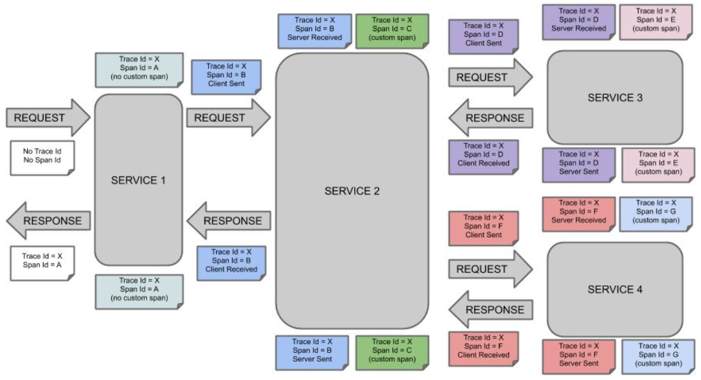
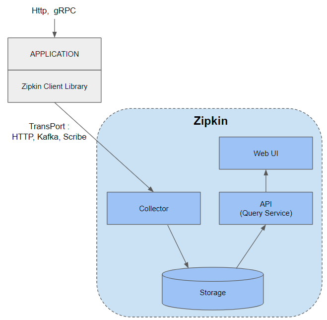
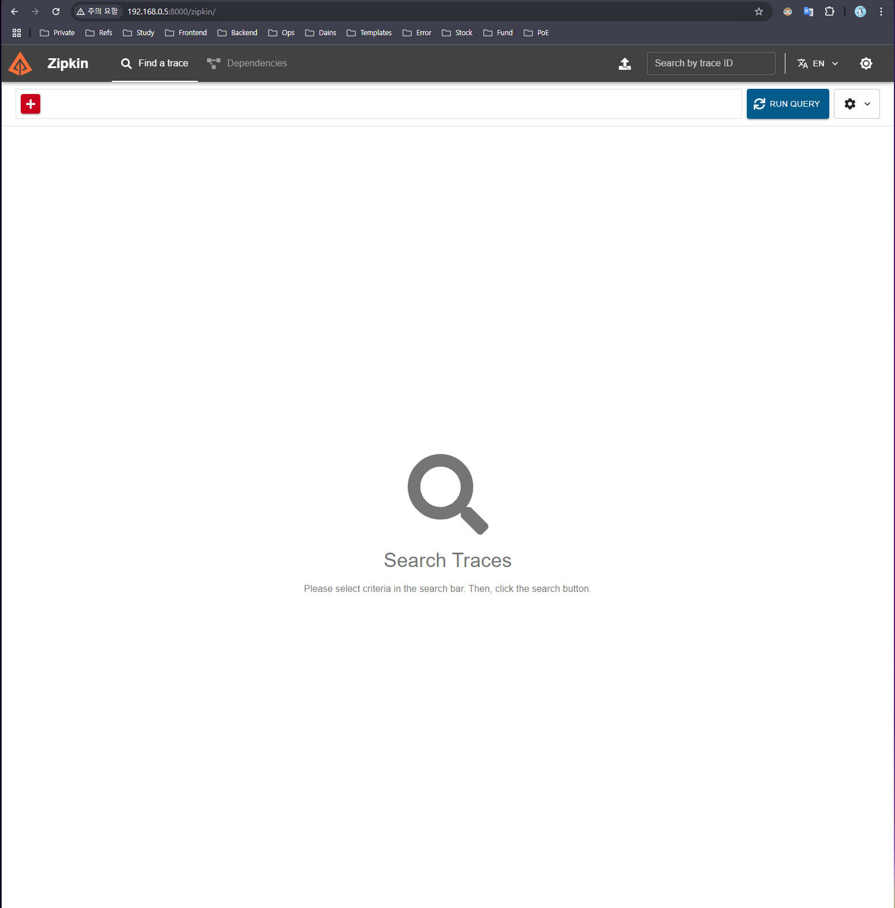
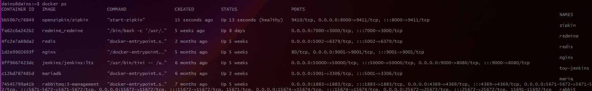
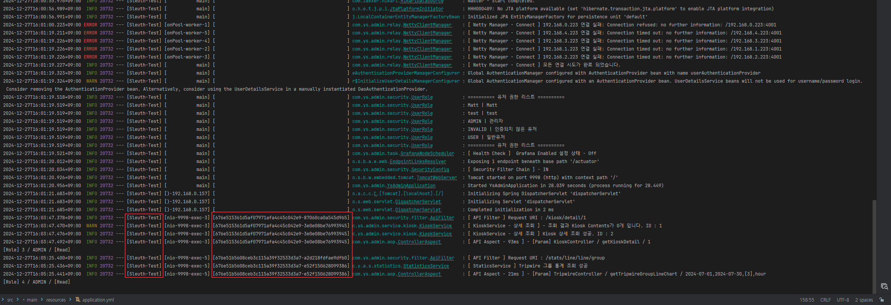
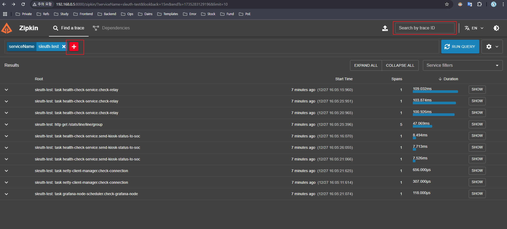
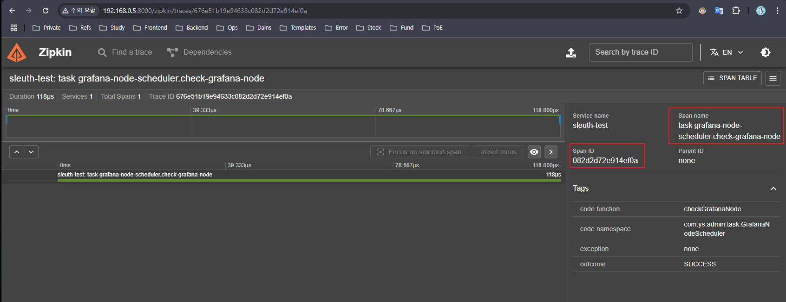

## 📚 Distributed Log Tracing (Zipkin + Spring Cloud Sleuth)

### Spring Cloud Sleuth 란?

[Spring Cloud Sleuth 공식 문서](https://spring.io/projects/spring-cloud-sleuth)

Spring Cloud Sleuth는 분산 로그 추적기로, Spring에서 Zipkin Client 모듈로 각 Request에 대한 ID를 자동으로 생성해 줍니다.

이 ID 정보는 각 Protocal의 Header를 통해 전달되며, 정보를 수신한 서버는 다음 서버에게 동일한 정보를 제공하는 방식으로 History를 추적할 수 있습니다.



|Trace Id|Span Id|
|---|---|
|전체 작업에 할당된 ID. <br>작업은 각각의 작은 단위들로 구성되어 있다고 한다면, 각각의 작은 단위들은 공통의 Trace ID 를 갖고 있습니다.<br>각각의 작은 단위들이 가지고 있는 ID.|모두 서로 다른 ID 를 가지고 있기 때문에 서로 다른 작업 단위들을 구분해주는 역할을 할 수 있습니다.|

위 사진은 하나의 Client 요청에 대해 여러 서버를 거치는 마이크로 서비스 흐름입니다.

위 아키텍처에서 문제점은 **서버 간 트랜잭션이 별도로 관리**된다는 것인데, Service 1 에서는 정상이지만 Service 2에서 예외가 발생했을 때 로그가 동일한 요청인지 파악할 수 없게 됩니다.

<br>

그래서 Spring Cloud Sleuth는 Trace ID와 Span ID를 이용해 분산 로그 추적을 합니다.

- `span` : 작업에 대한 단위, 각 트랜잭션 별 고유한 ID값을 가집니다.
- `trace`: 여러개의 span을 Tree 구조로 가지고 있으며, 전체 요청에 대한 고유 ID를 가집니다.
- 만약 여러 서버에 대한 통합 로그를 보고 싶다면 Trace ID 하나로 전체 서버의 흐름을 파악할 수 있게 됩니다.

<br>

### Zipkin 이란?

[Zipkin 공식 문서](https://zipkin.io/)

Zipkin은 Twitter에서 개발된 오픈소스 분산 환경 로그를 트레이싱 라이브러리입니다.

Zipkin으로 추적할 수 있는 분산 트랜잭션에는 HTTP, gRPC가 있으며 Sleuth를 통해 생성된 Trace 정보를 Zipkin으로 보내면,

트래픽의 흐름을 시각화하여 Web UI로 보여줍니다.



<br>

**Zipkin client library**

- 서비스에서 트레이스 정보를 수집하여 Zipkin Server의 Collector 모듈로 전송하며, 지원하는 언어는 Java, Javascript, Go, C# 등이 있습니다. 
- Collector로 전송할 때는 다양한 프로토콜을 사용할 수 있지만 일반적으로 HTTP를 사용하고, 시스템이 클 경우 Kafka 큐를 통해서도 전송을 합니다.

<br>

**Collector**

- Zipkin Client Library로부터 전달된 트레이스 정보 유효성을 검증하고 검색 가능하게 저장 및 색인화 합니다.

<br>

**Storage**
- Zipkin Collector로 보내진 트레이스 정보는 Storage에 저장됩니다. Zipkin은 초창기에는 Cassandra에 데이터를 저장하도록 만들어졌지만(Cassandra가 확장 가능하고 유연한 스키마를 가지고 있기 때문에 Twitter 내에서 많이 사용되었음),
- 그 뒤로 ElasticSearch나 MySQL도 지원 가능하게 구성되었습니다. 그 외에 In-Memory도 지원 가능하기 때문에 간단히 로컬에서 테스트할 때는 In-Memory, 소규모는 MySQL, 운영환경에 적용은 Cassandra나 ElasticSearch를 저장소로 사용하는 것이 좋습니다.

<br>

**API(Query Service)**

- 저장되고 색인화된 트레이스 정보를 검색하기 위한 JSON API이며, 주로 Web UI에서 호출됩니다.

<br>

**Web UI**

- 수집된 트레이스 정보를 확인할 수 있는 GUI로 만들어진 대쉬보드이며, 서비스 / 시간 / 어노테이션 기반으로 데이터 확인이 가능합니다. Zipkin 서버의 대쉬보드를 사용할 수도 있고, ElasticSearch 백앤드를 이용한 경우는 Kibana 활용도 가능합니다.

---

## 📚 적용

**서버(Ubuntu 22.04 LTS)에 Zipkin 설치**

Zipkin의 기본 포트는 9411이지만 8000으로 포트포워딩 해주었고, 아래 명령을 실행해 컨테이너가 떳다면 서버 IP:8000 으로 접속해봅니다.

```bash
docker run -d --name zipkin --restart always --network trace --privileged -p 8000:9411 openzipkin/zipkin
```





<br>

**Spring Dependency**

```groovy
    implementation 'org.springframework.boot:spring-boot-starter-actuator'
    implementation 'io.micrometer:micrometer-tracing-bridge-brave'
    implementation 'io.zipkin.reporter2:zipkin-reporter-brave'
```

<br>

**application.yml**

spring.sleuth.sampler.probability는 샘플링 확률을 설정하는 값이며, Spring Cloud Sleuth에서 이 설정은 어플리케이션에서 발생하는 트레이스를 얼마나 수집하고 보고할지를 결정합니다.

`probability 값의 범위` : 0.0에서 1.0까지의 값으로 설정할 수 있습니다.

- 0.0: 아무 요청도 샘플링하지 않고. 트레이스를 전혀 수집하지 않습니다.
- 0.5: 50%의 확률로 요청을 샘플링. 트래픽의 절반만 수집하게 됩니다.
- 1.0: 모든 요청을 샘플링한다는 뜻입니다. 즉, 발생하는 모든 트레이스를 수집하고 Zipkin이나 Jaeger 같은 트레이싱 시스템으로 보냅니다.

<br>

`propagation 옵션` : 마이크로 서비스 환경에서 추적 문맥(Trace context)을 다른 서비스로 전파할 때 HTTP 헤더에 정보를 넣어서 전송하며, 이떄 헤더에 어떤 이름을 사용할지를 선택하는 옵션입니다.

- W3C propagation (기본값)
- B3 single header
- B3 multiple headers

<br>

`zipkin.tracing.endpoint` : 로그를 전송할 Zipkin URL 입니다. API URL은 [Zipkin 공식 v2 API Spec](https://zipkin.io/zipkin-api/#/)에서 확인할 수 있습니다.

```yaml
management:
  tracing:
    sampling:
      probability: 1.0
    propagation:
      consume: b3_multi
      produce: b3_multi
  zipkin:
    tracing:
      endpoint: "http://192.168.0.5:8000/api/v2/spans"
```

<br>

이제 서버를 실행시켜서 아무 API 하나를 호출하면 로그에 Zipkin의 서비스이름으로 지정한 `Sleuth-Test`와 `Trace ID`가 찍히게 됩니다.



<br>

이제 Zipkin에 들어가서 Service Name으로 검색하거나, Spring Log에 찍힌 Trace ID를 이용해 검색하면 Request에 대한 샘플링이 나오게 됩니다.



<br>

위에 나온 Requests 중 아무거나 눌러서 들어가보면 Span ID와 Span Name도 확인할 수 있습니다.

