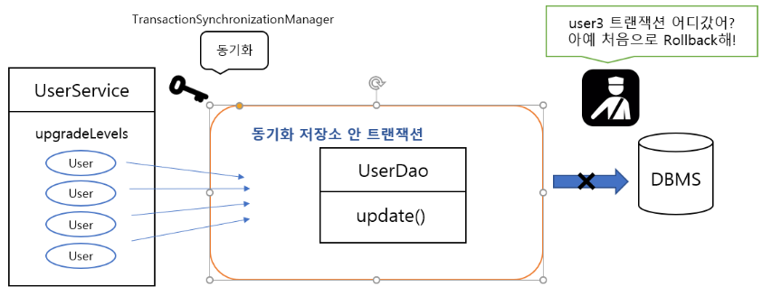
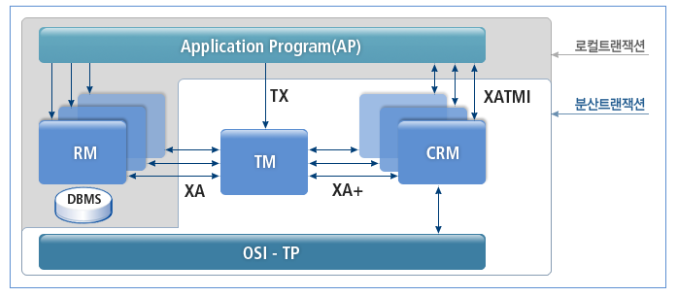

## 📚 Transaction



<br>

### **ACID 원칙**

- 1. 원자성 (Atomicity)

    - All or Nothing 보장

- 2. 일관성 (Consistency)

    - 어떤 값 증가시 연관된 값 일관성있게 증가

- 3. 격리성 (Isolation)

    - 각 트랜잭션 당 각각 독립적 실행

- 4. 지속성 (Durability)

    - 트랜잭션 완료 후 결과 지속 보장

<br>

### **트랜잭션 커밋 & 롤백**

- Commit
    - 완료된 작업 최종 DB 반영 - 트랜잭션 종료
- RollBack
    - 작업중 문제 발생 시 수행작업 취소 -> 원상태 복귀
- 조회 메소드에는 @Transaction의 Attr을 readOnly=true 로 설정함으로써 성능 최적화 과정을 거치도록 한다

<br>

### **트랜잭션 전파 (Transaction Propagation)**

- @Transactional의Attribute
    - Propagation.REQUIRED
        - Default 값, 진행중 트랜잭션이 있으면 해당 트랜잭션 참여, 없으면 새로 생성
    - Propagation.REQUIRED_NEW
        - 진행중인 트랜잭션과 별개로 새로운 트랜잭선 생성, 기존 트랜잭션은 이 트랜잭션이 끝날때까지 terminate
    - Propagation.MANDATORY
        - 진행중 트랜잭션이 없으면 예외를 발생시킴
    - Propagation.NOT_SUPPORTED
        - 트랜잭션을 필요로 하지 않음, 메소드 실행시 진행중 트랜잭션 중지, 메소드 종료시 진행중 트랜잭션 이어서 실행
    - Propagation.NEVER
        - 트랜잭션을 필요로 하지 않음, 트랜잭션 진행 중일시, 예외를 발생시킴

<br>

### **트랜잭션 격리 레벨 (트랜잭션 격리성 조정 옵션)**

- Isolation.DEFAULT
    - 기본값
- Isolation.READ_UNCOMMITTED
    - 다른 트랜잭션에서 커밋하지 않은 데이터 읽기 허용
- Isolation.READ_COMMITTED
    - 다른 트랜잭션에서 커밋된 데이터 읽기 허용
- Isolation.REPEATABLE_READ
    - 트랜잭션의 조회된 데이터를 계속 조회해도 같은 데이터가 조회되도록 보장
- Isolation.SERIALIZABLE
    - 동일 데이터에 동시에 여러개의 트랜잭션이 수행되지 않게 함

<br>

### **체크 예외**

- @Transactional의 Attribute로 rollbackFor 옵션을 사용해서 해당 체크예외를 직접 지정하거나
  unchecked exception으로 감싸야 rollback 기능 적용 가능

------
## 📚 AOP 방식 트랜잭션 구현

```java
package com.returns.aop;

import org.springframework.aop.Advisor;
import org.springframework.aop.aspectj.AspectJExpressionPointcut;
import org.springframework.aop.support.DefaultPointcutAdvisor;
import org.springframework.context.annotation.Bean;
import org.springframework.context.annotation.Configuration;
import org.springframework.transaction.TransactionDefinition;
import org.springframework.transaction.interceptor.NameMatchTransactionAttributeSource;
import org.springframework.transaction.interceptor.RuleBasedTransactionAttribute;
import org.springframework.transaction.interceptor.TransactionAttribute;
import org.springframework.transaction.interceptor.TransactionInterceptor;

import javax.transaction.TransactionManager;
import java.util.HashMap;
import java.util.Map;

@Configuration
public class TxAdvisor {

    private final TransactionManager transactionManager;

    public TxAdvisor(@SuppressWarnings("SpringJavaInjectionPointsAutowiringInspection") TransactionManager transactionManager) {
        this.transactionManager = transactionManager;
    }

    @Bean
    public TransactionInterceptor txAdvice() {

        //i 메소드 이름 패턴에 따른 구분 적용
        NameMatchTransactionAttributeSource txAttributeSource = new NameMatchTransactionAttributeSource();

        //i 조회 메소드를 제외한 공통 트랜잭션 Attribute
        RuleBasedTransactionAttribute txAttribute = new RuleBasedTransactionAttribute();
        txAttribute.setPropagationBehavior(TransactionDefinition.PROPAGATION_REQUIRED);

        //i 조회 메소드에 적용하기 위한 트랜잭션 Attribute
        RuleBasedTransactionAttribute txFindAttribute = new RuleBasedTransactionAttribute();
        txFindAttribute.setPropagationBehavior(TransactionDefinition.PROPAGATION_REQUIRED);
        txFindAttribute.setReadOnly(true);

        //i 설정한 트랜잭션 Attribute를 Map에 추가, Map의 키를 '메소드 이름 패턴' 으로 지정해서 각각의 트랜잭션 Attribute 추가
        Map<String, TransactionAttribute> txMethods = new HashMap<>();
        txMethods.put("find*", txFindAttribute);
        txMethods.put("*", txAttribute);

        //i 트랜잭션 Attribute를 추가한 Map 객체를 Source로 넘겨줌
        txAttributeSource.setNameMap(txMethods);

        //i TransactionInterceptor의 생성자 파라미터로 TransactionManager, txAttributeSource 전달
        return new TransactionInterceptor((org.springframework.transaction.TransactionManager) transactionManager, txAttributeSource);
    }

    @Bean
    public Advisor txAd() {
        AspectJExpressionPointcut pointcut = new AspectJExpressionPointcut();
        pointcut.setExpression("execution(* com.returns.coffee.service." + "CoffeeService.*(..))");

        return new DefaultPointcutAdvisor(pointcut, txAdvice());
    }
}
```

---

## 📚 분산 트랜잭션



- 스프링 부트는 Atomikos 임베디드 트랜잭션 매니저를 통해
  여러 XA 리소스에 걸친 분산 JTA 트랜잭션을 지원하며,
  올바른 순서대로 기동,종료 할 수 있도록 스프링 빈에 적절한 depends-on 설정을 적용해준다.
- JTA 환경을 감지하면 스프링의 'JtaTranscationManager'를 사용해 트랜잭션을 관리한다
- 자동 설정된 JMS, DataSource, JPA 빈은 XA 트랜잭션을 지원하도록 업그레이드 된다
- Atomikos 트랜잭션 로그는 어플리케이션의 홈디렉토리안의 transcation-logs 디렉토리에 기록
  이를 위해서 application.properties에 spring.jta.log-dir 프로퍼티를 설정하면 사용디렉토리 custom 가능
- 2개 이상의 네트워크 상 시스템 간의 트랜잭션
- 2개의 Phase Commit으로 분산 리소스 간 All or Nothing 보장
- XA 트랜잭션 - XA 프로토콜을 이용한 분산 트랜잭션

<br>

### **JTA란?**

JTA(Java Transaction API)은 플랫폼마다 상이한 트랜잭션 매니저들과

어플리케이션들이 상호작용할 수 있는 인터페이스를 정의하고 있다.

Java에서 제공되는 대부분의 API와 마찬가지로, JTA는 실제 구현은 다르지만

어플리케이션이 공통적으로 사용할 수 있는 하나의 인터페이스를 제공한다.

이 말은 트랜잭션 처리가 필요한 어플리케이션이 (API의 사용 방식 그대로만 사용한다면)

특정 벤더의 트랜잭션 매니저에 의존할 필요가 없음을 의미한다.

Atomikos와 같이 JTA 구현체들을 오픈소스로 제공하는 벤더들도 있고,

IBM 같이 JTA 구현체를 어플리케이션 서버의 한 부분으로 제공하는 벤더들도 있다.

JTA의 구현체를 사용할 때에는 주의를 기울여야 한다: 자세히 들여다 보면 뭔가 잘 못 되어 있는 것처럼 보이기 때문이다.

믿기 어렵겠지만, ‘J2EE 호환됨’이라고 검증을 받은 어플리케이션 서버들도

트랜잭션 관리를 제대로 지원하지 않거나 가상적으로만 지원할 수도 있다

<br>

### **XA란?**

XA(eXtended Architecture)는 **동일한 전역 트랜잭션(Global Transaction) 내에서**
**몇 개의 백엔드 데이터 저장소에 접근하기 위한 X/Open 그룹 표준의 하나**이다.

**XA 표준 규격은 하나의 트랜잭션 매니저가 어떤 트랜잭션의 한 부분으로**
**어떤 작업이 수행되고 있는지를 데이터베이스에 통보하는 방식과,**
**각 트랜잭션이 완료될 때 2단계 커밋(2 Phase Commit)을 수행되는 방식을 관장**한다.

또 **데이터 저장소에서 지연되고 있는 트랜잭션을 회복시키는 방법도 포함**하고 있다.

<br>

### **예시**

- DB1, 2 가 있다고 가정.
- WAS가 DB1, 2에 prepare 요청 전송
- 하나의 DB라도 준비가 되지 않으면 RollBack 실행 -> 트랜잭션의 ACID 충족
- 모든 DB에서 준비가 될때까지 Commit요청 전송

<br>

### **구현**

- Gradle 설정
- XA 리소스 정보 추가 -> @EnableJpaRepositories 사용
- 리소스별 설정 -> DB별 데이터 소스 생성 -> DataSource, MysqlXADataSource 클래스 사용
- JTA TransactionManager 설정
- JTA Platform 설정

<br>

### **요약**

```markdown
> ### ⭐ Distribute 트랜잭션
* 서로 다른 DB를 하나의 트랜잭션으로 묶기 위함

[구현]
* DB 접속 정보 생성
  * DataSource 타입의 메소드를 사용해 @Primary, @Bean 등록
  * MysqlXADataSource 객체 생성
  * AtomikosDataSourceBean 객체 생성, 이 객체를 이용하여 DB 접속 정보 생성

* JPA의 EntityManager를 얻기위한 LocalContainerEntityManagerFactoryBean 사용
  * LocalContainerEntitymanagerFactoryBean 타입의 메소드를 사용해 @Primary, @Bean 등록
  * LocalContainerEntityManagerFactoryBean 객체 생성
  * HibernateJpaVendorAdapter 객체 생성
  * JTA 플랫폼 이름 설정 - LocalContainerEntityManagerFactoryBean
  * 어댑터 설정 - HibernateJpaVendorAdapter
```

------

## 📚 예제

###  **DB 설정**

```java
// (1) JpaRepository 활성화
@EnableJpaRepositories(
        basePackages = {"com.solo.member",
                "com.solo.stamp",
                "com.solo.order",
                "com.solo.coffee"},
        entityManagerFactoryRef = "coffeeOrderEntityManager"
)
@Configuration
public class XaCoffeeOrderConfig {
		// (2) 데이터소스 생성
    @Primary
    @Bean
    public DataSource dataSourceCoffeeOrder() {
        MysqlXADataSource mysqlXADataSource = new MysqlXADataSource();
        mysqlXADataSource.setURL("jdbc:mysql://localhost:3306/coffee_order" +
                "?allowPublicKeyRetrieval=true" +
                "&characterEncoding=UTF-8");
        mysqlXADataSource.setUser("guest");
        mysqlXADataSource.setPassword("guest");

        AtomikosDataSourceBean atomikosDataSourceBean = new AtomikosDataSourceBean();
        atomikosDataSourceBean.setXaDataSource(mysqlXADataSource);
        atomikosDataSourceBean.setUniqueResourceName("xaCoffeeOrder");

        return atomikosDataSourceBean;
    }

		// (3) EntityManagerFactoryBean 설정
    @Primary
    @Bean
    public LocalContainerEntityManagerFactoryBean coffeeOrderEntityManager() {
        LocalContainerEntityManagerFactoryBean emFactoryBean =
                new LocalContainerEntityManagerFactoryBean();
        HibernateJpaVendorAdapter vendorAdapter = new HibernateJpaVendorAdapter();
        vendorAdapter.setDatabase(Database.MYSQL);
        Map<String, Object> properties = new HashMap<>();
        properties.put("hibernate.hbm2ddl.auto", "create");
        properties.put("hibernate.show_sql", "true");
        properties.put("hibernate.format_sql", "true");

				// (4)
        properties.put("hibernate.transaction.jta.platform", 
                                             AtomikosJtaPlatform.class.getName());
        properties.put("javax.persistence.transactionType", "JTA");

        emFactoryBean.setDataSource(dataSourceCoffeeOrder());
        emFactoryBean.setPackagesToScan(new String[]{
                "com.solo.member",
                "com.solo.stamp",
                "com.solo.order",
                "com.solo.coffee"
        });
        emFactoryBean.setJpaVendorAdapter(vendorAdapter);
        emFactoryBean.setPersistenceUnitName("coffeeOrderPersistenceUnit");
        emFactoryBean.setJpaPropertyMap(properties);

        return emFactoryBean;
    }
}
```

<br>

### **백업용 회원 정보 DB 설정**

```java
@EnableJpaRepositories(
        basePackages = {"com.solo.backup"},
        entityManagerFactoryRef = "backupEntityManager"
)
@Configuration
public class XaBackupConfig {
    @Bean
    public DataSource dataSourceBackup() {
				// (2)
        MysqlXADataSource mysqlXADataSource = new MysqlXADataSource();
        mysqlXADataSource.setURL("jdbc:mysql://localhost:3306/backup_data" +
                "?allowPublicKeyRetrieval=true" +
                "&characterEncoding=UTF-8");
        mysqlXADataSource.setUser("backup");
        mysqlXADataSource.setPassword("backup");

        AtomikosDataSourceBean atomikosDataSourceBean = new AtomikosDataSourceBean();
        atomikosDataSourceBean.setXaDataSource(mysqlXADataSource);
        atomikosDataSourceBean.setUniqueResourceName("xaMySQLBackupMember");

        return atomikosDataSourceBean;
    }

    @Bean
    public LocalContainerEntityManagerFactoryBean backupEntityManager() {
        LocalContainerEntityManagerFactoryBean emFactoryBean =
                new LocalContainerEntityManagerFactoryBean();
        HibernateJpaVendorAdapter vendorAdapter = new HibernateJpaVendorAdapter();
        vendorAdapter.setDatabase(Database.MYSQL);
        Map<String, Object> properties = new HashMap<>();
        properties.put("hibernate.hbm2ddl.auto", "create");
        properties.put("hibernate.show_sql", "true");
        properties.put("hibernate.format_sql", "true");
        properties.put("hibernate.transaction.jta.platform",  
                                             AtomikosJtaPlatform.class.getName());
        properties.put("javax.persistence.transactionType", "JTA");

        emFactoryBean.setDataSource(dataSourceBackup());

				// (3)
        emFactoryBean.setPackagesToScan(new String[]{"com.codestates.backup"});
        emFactoryBean.setJpaVendorAdapter(vendorAdapter);
        emFactoryBean.setPersistenceUnitName("backupPersistenceUnit");
        emFactoryBean.setJpaPropertyMap(properties);

        return emFactoryBean;
    }
}
```

<br>

###  **JTA TransactionManager 설정**

```java
@Configuration
public class JtaConfig {
	// (1)
    @Bean(name = "userTransaction")
    public UserTransaction userTransaction() throws Throwable {
        UserTransactionImp userTransactionImp = new UserTransactionImp();
        userTransactionImp.setTransactionTimeout(10000);
        return userTransactionImp;
    }

    @Bean(name = "atomikosTransactionManager")
    public TransactionManager atomikosTransactionManager() throws Throwable {
	// (2)
        UserTransactionManager userTransactionManager = new UserTransactionManager();
        userTransactionManager.setForceShutdown(false);

	// (3)
        AtomikosJtaPlatform.transactionManager = userTransactionManager;

        return userTransactionManager;
    }

    @Bean(name = "transactionManager")
    @DependsOn({ "userTransaction", "atomikosTransactionManager" })
    public PlatformTransactionManager transactionManager() throws Throwable {
        UserTransaction userTransaction = userTransaction();

        AtomikosJtaPlatform.transaction = userTransaction;

        TransactionManager atomikosTransactionManager = atomikosTransactionManager();

	// (4)
        return new JtaTransactionManager(userTransaction, atomikosTransactionManager);
    }
}
```

<br>

### **JTA Platform 설정**

```java
public class AtomikosJtaPlatform  extends AbstractJtaPlatform {
    static TransactionManager transactionManager;
    static UserTransaction transaction;

    @Override
    protected TransactionManager locateTransactionManager() {
        return transactionManager;
    }

    @Override
    protected UserTransaction locateUserTransaction() {
        return transaction;
    }
}
```

<br>

### **백업 Entity 클래스 생성**

```java
@NoArgsConstructor
@Getter
@Setter
@Entity
public class BackupUser extends Auditable {
    @Id
    @GeneratedValue(strategy = GenerationType.IDENTITY)
    private Long userId;

    @Column(nullable = false, updatable = false, unique = true)
    private String email;

    @Column(length = 100, nullable = false)
    private String name;

    @Column(length = 13, nullable = false, unique = true)
    private String phone;

    // 추가된 부분
    @Enumerated(value = EnumType.STRING)
    @Column(length = 20, nullable = false)
    private UserStatus userStatus = UserStatus.USER_ACTIVE;

    public BackupUser(String email) {
        this.email = email;
    }

    public BackupUser(String email, String name, String phone) {
        this.email = email;
        this.name = name;
        this.phone = phone;
    }

    public enum MemberStatus {
        USER_ACTIVE("활동중"),
        USER_SLEEP("휴면 상태"),
        USER_QUIT("탈퇴 상태");

        @Getter
        private String status;

        UserStatus(String status) {
           this.status = status;
        }
    }
}
```

<br>

### **Service 클래스에서 백업 Entity 정보 등록**

```java
[Service]
- BackupUser DI

create() 메소드 내부
        backupUserService.createBackupUser(new BackupUser(user.getEmail(),
                user.getName(), user.getPhone()));
```

<br>

###  **백업 서비스 클래스에 정보 등록**

```java
@Service
public class BackupUserService {
    private final BackupUserRepository backupUserRepository;

    public BackupUserService(BackupUserRepository backupUserRepository) {
        this.backupUserRepository = backupUserRepository;
    }

    @Transactional
    public void createBackupUser(BackupUser backupUser) {
        backupUserRepository.save(backupUser);
				
				// (1)
        throw new RuntimeException("multi datasource rollback test");
    }
}
```