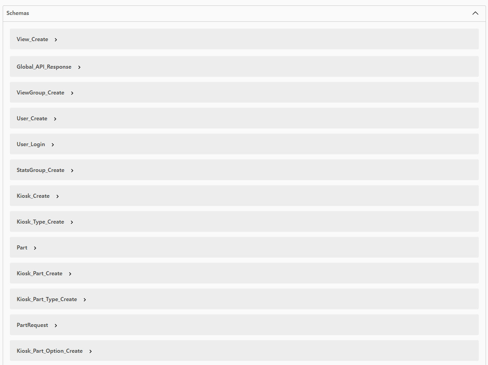

## 📚 Swagger API 적용

Restful API의 설계 및 빌드를 문서화 하기 위한 Swagger API 적용 방법을 작성합니다.

[Spring Doc 공식 페이지](https://springdoc.org/)

Spring을 사용한다면 아래 2개의 라이브러리를 사용할 수 있습니다.

- Spring Fox
- Spring Doc

Spring Fox의 경우 마지막 업데이트일인 2020년 이후 업데이트가 없으므로, Spring Doc을 이용하겠습니다.

Spring Doc은 WebFlux를 통한 비동기 방식의 개발도 지원합니다.

<br>

application.yml 설정해서 Path 설정을 안한다면 기본 Path는 `{Server I{}:{Port}/swagger-ui/index.html`입니다.

저는 그냥 포트뒤에 바로 index.html을 붙이면 들어갈 수 있게 설정하겠습니다.

---
## 📚 Configuration

**build.gradle**

- 버전은 공식 홈페이지에서 확인해서 넣어줍니다.

```groovy
implementation 'org.springdoc:springdoc-openapi-starter-webmvc-ui:2.5.0'
```

<br>

**application.yml**

- 세부 Property는 [여기](https://springdoc.org/#properties)서 확인 가능합니다.

```yaml
# Swagger
springdoc:
  api-docs:
    path: /api-docs # API 문서 생성 경로
    groups:
      enabled: true
  swagger-ui:
    path: /index.html # Swagger-ui 경로
    enabled: true
    groups-order: asc
    tags-sorter: alpha
    operations-sorter: alpha
    display-request-duration: true
    doc-expansion: none
  cache:
    disabled: true
  override-with-generic-response: false
  model-and-view-allowed: true
  default-consumes-media-type: application/json
  default-produces-media-type: application/json
```

<br>

**OpenApiConfig**

- @OpenAPIDefinition을 이용해 전체 API 문서의 타이틀, 설명, 버전을 넣어줍니다.
- `openApi Bean` : Security Schema를 이용해 Swagger에서 Authorization Header에 JWT 토큰을 입력할 수 있게 해줍니다.
- `sortSchemasAlphabetically Bean` : Swagger 상의 Schema(DTO)에 Alphabetically Sort를 적용합니다.

```java
@Configuration
@OpenAPIDefinition(info = @io.swagger.v3.oas.annotations.info.Info(
        title = "Producer-Consumer Pattern API",
        description = "API Docs for Producer-Consumer Pattern",
        version = "1.0.0"
))
public class OpenApiConfig {
    // Authorization Header 추가
    @Bean
    public OpenAPI openAPI() {
        SecurityScheme securityScheme = new SecurityScheme()
                .type(SecurityScheme.Type.HTTP)
                .scheme("bearer")
                .bearerFormat("JWT")
                .in(SecurityScheme.In.HEADER)
                .name("Authorization");

        SecurityRequirement securityRequirement = new SecurityRequirement().addList("bearerAuth");

        return new OpenAPI()
                .components(new Components().addSecuritySchemes("bearerAuth", securityScheme))
                .security(Arrays.asList(securityRequirement));
    }

    // Sort Schema Alphabetically
    @Bean
    public OpenApiCustomizer sortSchemasAlphabetically() {
        return openApi -> {
            Map<String, Schema> schemas = openApi.getComponents().getSchemas();
            openApi.getComponents().setSchemas(new TreeMap<>(schemas));
        };
    }
}
```

---
## 📚 Annotaions

**@OpenAPIDefinition**

- 전체 API에 대한 정보를 지정하는데 사용합니다.
- INFO 속성을 사용하여 API의 제목, 설명, 버전 등을 설정할 수 있습니다.

```java
@OpenAPIDefinition(info = @Info(title = "title", description = "desc", version = "1.0.0"))
```

<br>

**@Tag**

- 보통 클래스에 함수에 붙여주며, 그룹화 하거나 분류하기 위해 사용됩니다.

```java
@Tag(name = "User Add API", description = "유저 생성 API")
public class UserController {}
```

<br>

**@Operation, @Parameter, @ApiResponse**

- @Operation : 특정 API 함수에 대한 설명을 붙여줍니다.
- @Parameter : 함수 파라미터에 대한 이름, 설명을 붙여줍니다.
- @ApiResponse : 특정 HTTP Status 코드에 대한 설명을 붙여줍니다.

```java
@PreAuth(viewId = 0, authorization = AuthorizationType.Read)
@Operation(summary = "Get Users", description = "유저 전체 조회")
@ApiResponse(responseCode = "200", description = "Found User List")
@ApiResponse(responseCode = "400", description = "Invalid Parameter")
@ApiResponse(responseCode = "404", description = "Not Found")
@ApiResponse(responseCode = "405", description = "UnAuthorized Request")
@Parameter(name = "id", description = "유저 ID")
@GetMapping
public ResponseEntity getUsers(@PathVariable int id) {}
```

<br>

만약 MultiPartFormData 타입의 파일을 받으려면 아래와 같이 consumes와 produce 속성을 넣어줍니다.


```java
    @PreAuth(viewId = 0, authorization = AuthorizationType.Create)
@PostMapping(value = "/contents", consumes = MediaType.MULTIPART_FORM_DATA_VALUE, produces = MediaType.APPLICATION_JSON_VALUE)
@Operation(summary = "컨텐츠 등록 (파일) / Multi Part Form Data & Json", description = "컨텐츠 등록 (파일) / Multi Part Form Data & Json")
@Parameter(name = "file", description = "이미지(png 등), 영상(mp4 등)", required = true)
@Parameter(
        name = "dto",
        description = "File을 제외한 나머지 데이터",
        content = @Content(mediaType = MediaType.APPLICATION_JSON_VALUE, schema = @Schema(implementation = ContentsDto.class)),
        required = true)
@ApiResponse(
        responseCode = "201",
        description = "컨텐츠 정보 반환",
        content = @Content(mediaType = MediaType.APPLICATION_JSON_VALUE, schema = @Schema(implementation = ContentsDto.Response.class))
)
public ResponseEntity createContents(CustomHttpServletRequest request,
                                     @RequestPart(value = "file") MultipartFile file,
                                     @RequestPart(value = "dto") @Valid ContentsDto.Create dto) {
    return new ResponseEntity(ApiResponseDto.makeResponse(contentsService.createContents(request, file, dto)), HttpStatus.CREATED);
}
```

<br>

**@Hidden**

- 특정 API를 문서에 포함시키고 싶지 않을떄 단순히 붙여주면 됩니다.

```java
@Hidden
```

<br>

**@Schema**

- 보통 DTO 클래스에 사용하며 클래스나 필드에 붙여줍니다.
- 메인 클래스 이름 위에는 title 속성을 써주고 클래스 하위 static class 에는 name 속성을 쓰고 필드에는 description으로 설명만 써주면 됩니다.

```java
@Getter
public class UserRequest {

    @Data
    @Schema(name = "[ 유저 Request ] 생성", description = "유저 생성 Request")
    public static class Post {
        @NotNull
        @Schema(description = "유저명", example = "skw")
        private String name;
    }
}
```

---
## 📚 테스트

**DTO**

```java
@Data
@Schema(title = "테스트 DTO", description = "Test API Request & Response")
public class OpenApiDto {

    @Schema(name = "테스트 Request")
    public static class Test {
        @Schema(description = "외부에서 받은 숫자", example = "1")
        private Integer num;
    }
}
```

<br>

**Controller**

```java
@Tag(name = "Test Controller", description = "테스트 컨트롤러")
@RestController
@RequestMapping("/test")
public class OpenApiController {
    @Operation(summary = "Test Get", description = "테스트 GET")
    @ApiResponse(responseCode = "200", description = "Success")
    @GetMapping("/{num}")
    public ResponseEntity get(@PathVariable int num) {
        OpenApiDto dto = new OpenApiDto();
        dto.setNum(num);
        return new ResponseEntity(dto, HttpStatus.OK);
    }
}
```

<br>

서버를 실행시키고 `{Server IP}:{Port}/index.html`를 들어가보면 잘 나옵니다 ㅎ

