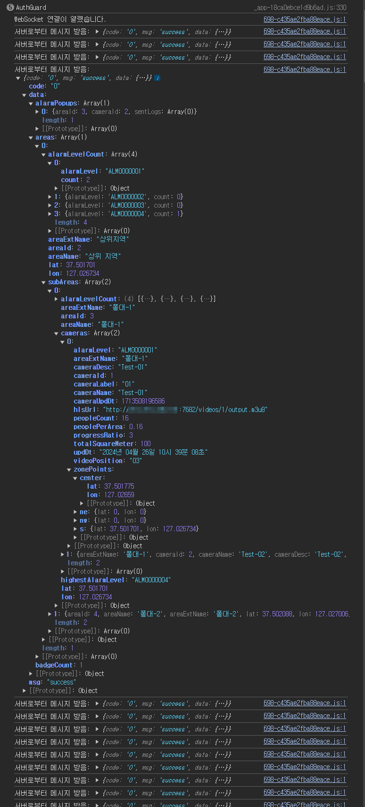
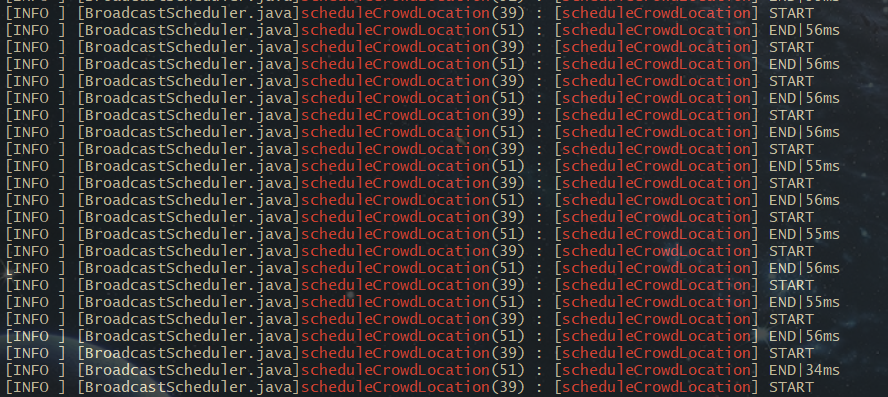

처음 WebSocket을 사용할떄 WebSocket API를 직접 사용하는것이 아닌, Stomp를 사용했었습니다.

Stomp는 WebSocket 위에서 동작하는 Messaging Sub Protocol입니다.

<br>

Stomp를 사용할때의 장점은,

구독(Subscribe) & 발행(publish) 메시징 패턴을 빠르고 쉽게 구현할 수 있고,

다양한 플랫폼과의 호환성이 높아 통합이 용이합니다.

하지만, Stomp 프로토콜 자체의 오버헤드가 있어 많은 메시지를 처리하는데 있어 속도 저하를 느껴서 바꾸게 되었습니다.

<br>

이번엔 순수 WebSocket API를 이용하는 걸로 바꾸었고,

순수 WebSocket API를 이용하면 **직접적인 메시지 포맷팅**, **연결 상태 관리** 등을 직접 제어해 복잡성이 증가하지만,

성능과 낮은 지연 시간이 중요한 상황이라 순수 WebSocket API를 선택하게 되었습니다.

---
## WebSocket Config

`WebSocketConfigurer` 인터페이스를 구현하여 `registerWebSocketHandlers` 함수를 Override 하여 사용합니다.

특정 URL로 WebSocket 요청이 이루어질떄 요청을 처리할 핸들러를 지정할 수 있으며,

이 핸들러도 직접 구현해야 합니다.

CORS 설정 (setAllowedOrigins 함수)은 임시로 전부 허용해 주었습니다.

```java
@Configuration  
@EnableWebSocket  
public class WebSocketConfig implements WebSocketConfigurer {  
    @Override  
    public void registerWebSocketHandlers(WebSocketHandlerRegistry registry) {  
        // GIS 위치별 탭  
        registry.addHandler(new CrowdLocationHandler(), "/admin/ws/v1/crowd/location").setAllowedOrigins("*");  
        //  인파 상태별 탭  
        registry.addHandler(new CrowdStatusHandler(), "/admin/ws/v1/crowd/status").setAllowedOrigins("*");
          
        // 관리자 Area, Camera 설정 탭  
        registry.addHandler(new SettingsHandler(), "/admin/ws/v1/settings").setAllowedOrigins("*");  
    }  
}
```

---
## Handler

Handler는 `TextWebSocketHandler` 확장한 텍스트 기반의 WebSocket 메시지를 처리합니다.

구현한 3개의 Handler중 하나만 보면,

각 세션의 ID를 키로하는 ConcurrentHashMap을 사용하여 동시 요청에 대한 공유 데이터에 Lock을 걸어 데이터 일관성을 보장해 주었습니다.

- `afterConnectionEstablished()` : 연결이 성공했을때 sessionMap에 해당 session의 ID를 넣습ㅂ니다.
- `afterConnectionClosed()` : WebSocket 세션이 종료될떄 sessionMap에서 해당 session을 제거합니다.
- `broadcast()` :  sessionMap에 세션이 하나라도 있고, 세션이 Open 되어 있을떄 모든 세션에 메시지를 BroadCast 합니다.

```java
@Slf4j  
@Getter  
@Component  
public class CrowdLocationHandler extends TextWebSocketHandler {  
  
    private final Map<String, WebSocketSession> sessionMap = new ConcurrentHashMap<>();  
  
    /**  
     * 소켓 연결시  
     * @param session  
     * @throws Exception  
     */  
    @Override  
    public void afterConnectionEstablished(WebSocketSession session) throws Exception {  
        super.afterConnectionEstablished(session);  
        sessionMap.put(session.getId(), session); // 세션 저장  
  
        log.info("Crowd Location Handler | Established|{}", session.getId());  
    }  
  
    /**  
     * 소켓 종료시  
     * @param session  
     * @param status  
     * @throws Exception  
     */  
    @Override  
    public void afterConnectionClosed(WebSocketSession session, CloseStatus status) throws Exception {  
        super.afterConnectionClosed(session, status);  
        try (session) {  
            sessionMap.remove(session.getId());  
        }  
  
        log.info("Crowd Location Handler | Disconnected | {} | {}", session.getId(), status.toString());  
    }  
  
    /**  
     * 연결된 모든 세션에 데이터 전달  
     * @param message  
     */  
    public void broadcast(String message) {  
        if (!sessionMap.isEmpty()) {  
            sessionMap.values().forEach(session -> {  
                if (session.isOpen()) {  
                    try {  
                        session.sendMessage(new TextMessage(message));  
                    } catch (IOException e) {  
                        e.printStackTrace();  
                    }  
                } else {  
                    log.debug("Session closed | {}", session.getId());  
                    sessionMap.remove(session.getId());  
                }  
            });  
        }  
    }  
}
```

---
## BroadCast Messages

위에서 설정 & 생성한 WebSocket Handler를 이용해 Application 기동 후 x초 간격으로 어떠한 정보들을 모든 Session에 BroadCasting 하는 클래스를 만들었습니다.

위에서 만든 SessionMap을 가져와서 Map이 비어있지 않으면 들어있는 Session들에 동일한 메시지를 뿌립니다.

그리고 

```java
@Component  
@Slf4j  
@RequiredArgsConstructor  
public class BroadcastScheduler {  
    private final CrowdLocationHandler crowdLocationHandler;  
    private final CrowdStatusHandler crowdStatusHandler;  
    private final CrowdService crowdService;  
  
    @Scheduled(initialDelay = 3000, fixedRate = 2000) // Application 기동 3초 뒤부터 2초 간격으로 실행  
    public void scheduleCrowdLocation() {  
        Map<String, WebSocketSession> sessionMap = crowdLocationHandler.getSessionMap();  
  
        if (!sessionMap.isEmpty()) {  
            String jsonString = "";  
            log.info("[Schedule Crowd Location] START");  
            long beforeTime = System.currentTimeMillis();  
            CrowdLocationDto crowdLocationDto = crowdService.getCrowdLocation();  
  
            try {  
                jsonString = ApiResponseDto.makeResponse(crowdLocationDto);  
            } catch (Exception e) {  
                e.printStackTrace();  
            }  
  
            if (StringUtils.hasText(jsonString)) crowdLocationHandler.broadcast(jsonString);  
            long afterTime = System.currentTimeMillis();  
            log.info("[Schedule Crowd Location] END | {}ms", afterTime - beforeTime);  
        }  
    }  
  
    @Scheduled(initialDelay = 4000, fixedRate = 2000) // Application 기동 4초 뒤부터 2초 간격으로 실행  
    public void scheduleCrowdStatus() {  
        Map<String, WebSocketSession> sessionMap = crowdStatusHandler.getSessionMap();  
  
        if (!sessionMap.isEmpty()) {  
            String jsonString = "";  
            log.info("[Schedule Crowd Status] START");  
            long beforeTime = System.currentTimeMillis();  
            CrowdStatusDto crowdStatusDto = crowdService.getCrowdStatus();  
  
            try {  
                jsonString = ApiResponseDto.makeResponse(crowdStatusDto);  
            } catch (Exception e) {  
                e.printStackTrace();  
            }  
  
            if (StringUtils.hasText(jsonString)) crowdStatusHandler.broadcast(jsonString);  
            long afterTime = System.currentTimeMillis();  
            log.info("[Schedule Crowd Status] END | {}ms", afterTime - beforeTime);  
        }  
    }  
}
```

<br>

프론트엔드를 빌드해서 페이지를 열어보면 의도한 데이터들이 특정 시간마다 잘 들어오고 있으며, 



<br>

Stomp를 사용했을 때 보다 성능 체감은 안되지만 MilliSecond 단위로 측정을 해보면 성능이 더 좋아진 걸 알 수 있습니다.

