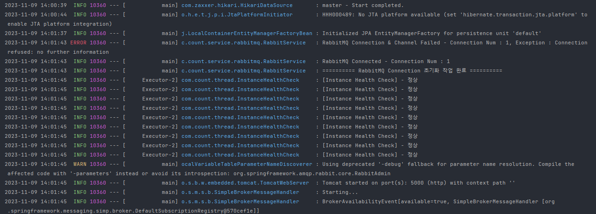
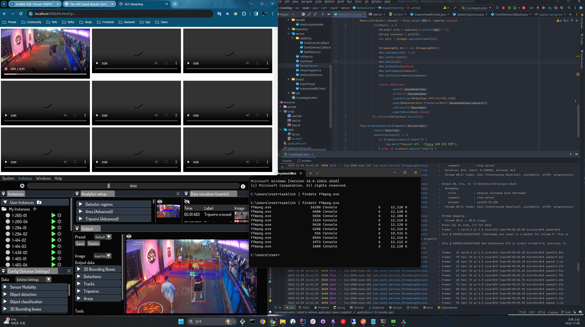
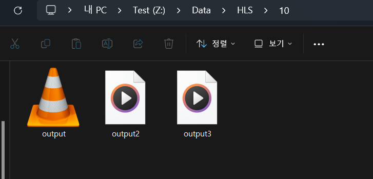

## 📘 RTSP to HLS

OS환경은 Windows 기준으로 개발 하였습니다.

브라우저에서 지원이 안되는 RTSP를 FFmpeg을 이용해 HLS로 변환하여 브라우저에서 실시간 영상을 스트리밍 합니다.

<br>

> 😯 **Windows FFmpeg Link**

https://ffmpeg.org/download.html

<br>

> 😯 **설치 후 시스템 환경변수 설정**

`setx PATH "%PATH%;{ffpmeg 경로}"`

---
## 📘 EC2 Setting

> 😯 **RPM 기반 FFmpeg & Java 17 설치**

```bash
#!/bin/bash

# FFmpeg 설치
cd /usr/local/bin 
mkdir ffmpeg 
cd ffmpeg 
wget https://www.johnvansickle.com/ffmpeg/old-releases/ffmpeg-4.2.1-amd64-static.tar.xz 
tar xvf ffmpeg-4.2.1-amd64-static.tar.xz 
mv ffmpeg-4.2.1-amd64-static/ffmpeg . 
ln -s /usr/local/bin/ffmpeg/ffmpeg /usr/bin/ffmpeg

# Java 17 설치
yum install -y java-17-amazon-corretto-headless
```

<br>

> 😯 **Debian 기반 FFmpeg 설치**

```bash
apt -y install ffmpeg
```

---
## 📘 Config

Task Executor 와 Resource Handler / Cors / WebClient 설정을 해줍니다.

<br>

> 📌 **AppConfig**

- 어플리케이션에서 사용할 스레드 수를 짐작해서 설정해 줍니다.

```java
@EnableAsync  
@Configuration  
public class AppConfig {  
    @Value("${task.executor.core.pool.size}")  
    private int corePoolSize;  
  
    @Value("${task.executor.max.pool.size}")  
    private int maxPoolSize;  
  
    @Value("${task.executor.queue.capacity}")  
    private int queueCapacity;  
  
    // Thread Pool 설정  
    @Bean  
    public TaskExecutor executor() {  
        ThreadPoolTaskExecutor executor = new ThreadPoolTaskExecutor();  
        executor.setCorePoolSize(corePoolSize);  
        executor.setMaxPoolSize(maxPoolSize);  
        executor.setQueueCapacity(queueCapacity);  
        executor.setThreadNamePrefix("Executor-");  
        executor.initialize();  
  
        return executor;  
    }  
  
    @Bean  
    public WebClient webClient() {  
        return WebClient.builder().build();  
    }  
}
```

<br>

> 📌**CorsConfig**

- Resource Handler / Cors Mapping을 해줍니다. (설명 생략)

```java
@Configuration  
public class CorsConfig implements WebMvcConfigurer {  
    @Value("${hls.file.path}")  
    private String hlsFilePath;  
  
    // "file:/home/user/videos/" 디렉토리의 리소스를 "/videos/**" 경로로 서비스  
    @Override  
    public void addResourceHandlers(ResourceHandlerRegistry registry) {  
        registry.addResourceHandler("/videos/**")  
                .addResourceLocations("file:"+hlsFilePath);  
    }  
  
    @Override  
    public void addCorsMappings(CorsRegistry registry) {  
        registry.addMapping("/**")  // 모든 경로에 대해  
                .allowedOrigins("*")  // 허용할 원본  
                .allowedMethods("GET", "POST", "PUT", "DELETE")  // 허용할 HTTP 메서드  
                .allowedHeaders("Header1", "Header2", "Header3")  
                .exposedHeaders("Header1", "Header2")  
                //.allowCredentials(true)  
                .maxAge(3600);  // 1시간 동안 pre-flight 응답을 캐시  
    }  
}
```

---
## 📘 DTO

> 📌 **Streaming DTO**

RTSP를 FFmpeg 명령으로 변환하기 위한 정보를 받는 DTO입니다.

```java
@Getter  
public class StreamingDto {  
    @NotNull  
    private Integer cameraId; // DB에 저장된 CameraID  
    @NotNull  
    private String instanceName; // RTSP Topic  
  
    @NotNull  
    private String ip;  
  
    @NotNull  
    private Integer port;  
  
    @NotNull  
    private String command; // start & stop  
  
    @NotNull  
    private String apiKey; // API 호출을 위한 키  
}
```

<br>

> 📌 **Instance DTO**

인스턴스를 주기적으로 헬스체크하는 Thread에서 Rest API 요청을 위해 필요한 인스턴스 정보입니다.

```java
@Data  
@JsonInclude(JsonInclude.Include.NON_NULL)  
public class InstanceDto {  
    @JsonProperty("instance_name")  
    private String instanceName;  
  
    @JsonProperty("solution")  
    private String solution;  
  
    @JsonProperty("solution_name")  
    private String solutionName;  
  
    @JsonProperty("solution_path")  
    private String solutionPath;  
  
    @JsonProperty("solution_version")  
    private String solutionVersion;  
  
    @JsonProperty("state")  
    private int state;  
  
}
```

---
## 📘 Controller

- startConvert() : IP와 Command(start/stop)을 URI Parameter로 보내면
- control() : Control API에 StreamingDTO의 형식대로 API 요청을 하면 FFmpeg 변환 프로세스를 시작합니다.

```java
@Slf4j  
@RestController  
@RequestMapping("/api/hls")  
@RequiredArgsConstructor  
public class StreamingController {  
    private final RestApiService restApiService;  
    private final StreamingService streamingService;  
  
    @Value("${api.key}")  
    private String apiKey;  
  
    @GetMapping("/request")  
    public void startConvert(@RequestParam String ip, @RequestParam String command) {  
        restApiService.requestStreaming(ip, command);  
    }  
  
    @PostMapping("/control")  
    public String controlHls(@Valid @RequestBody StreamingDto request) {  
        String ok = "{\"code\": 0, \"msg\": \"Success\"}";  
        String nok = "{\"code\": -1, \"msg\": \"Failure\"}";  
  
        try {  
            if (!StringUtils.hasText(request.getApiKey()) || !apiKey.trim().equals(request.getApiKey().trim())) {  
                log.error("API Key가 잘못 되었습니다. - {}", request);  
  
                return nok;  
            }  
  
            // Command가 Start or Stop 일때 FFmpeg 프로세스 실행 / 중지  
            if (request.getCommand().equalsIgnoreCase("start")) {  
                streamingService.startConverter(request.getCameraId(), request.getInstanceName(), request.getIp(), request.getPort());  
            } else if (request.getCommand().equalsIgnoreCase("stop")) {  
                streamingService.stopHlsConverter(request.getCameraId(), request.getInstanceName());  
            }  
        } catch (Exception e) {  
            log.error("HLS Controller Exception - {}, {}", e.getMessage(), request.toString());  
            e.printStackTrace();  
  
            return nok;  
        }  
  
        return ok;  
    }  
}
```

---
## 📘 Service

> 📌 **Rest API Service**

- getInstance() : 인스턴스 헬스체크를 위해 인스턴스에 GET 요청을 보내기 위한 함수입니다.
- portInstance() : 헬스체크 로직 내에서 인스턴스가 Running 중이 아니라면 실행시키는 API 요청 함수입니다.
- requestStreaming() : FFmpeg을 이용하여 RTSP를 HLS로 변환 명령을 실행시키는 함수입니다.

```java
@Slf4j  
@Service  
@RequiredArgsConstructor  
public class RestApiService {  
    private final WebClient webClient;  
  
    @Value("${api.key}")  
    private String apiKey;  
  
    private String uri = "http://localhost:5000/api/hls/control";  
  
  
    public Mono<String> getInstance(final String uri) throws Exception{  
  
        return webClient.get()  
                .uri(uri)  
                .retrieve()  
                .bodyToMono(String.class);  
    }  
  
    /**  
     * POST 요청(URI 는 / 부터 시작해야 함)  
     * @param uri  
     * @param data  
     * @return  
     */  
    public Mono<String> postInstance(final String uri, final Object data) throws Exception{  
        return webClient.post()  
                .uri(uri)  
                .bodyValue(data)  
                .retrieve()  
                .bodyToMono(String.class);  
    }  
  
    public void requestStreaming(String ip, String command) {  
        String[] cameras = {  
                "1-260-01 8554",  
                "1-260-04 8555",  
                "1-294-01 8556",  
                "1-294-02 8557",  
                "1-414-02 8558",  
                "1-414-03 8559",  
                "1-438-02 8560",  
                "1-465-01 8561",  
                "1-465-04 8562"  
        };  
  
        Mono<List<Void>> request = Flux.range(0, cameras.length)  
                .flatMap(i -> {  
                    String[] info = cameras[i].split(" ");  
                    String instance = info[0];  
                    int port = Integer.parseInt(info[1]);  
  
                    StreamingDto dto = new StreamingDto();  
                    dto.setCameraId(i + 1);  
                    dto.setPort(port);  
                    dto.setIp(ip);  
                    dto.setApiKey(apiKey);  
                    dto.setCommand(command);  
                    dto.setInstanceName(instance);  
  
                    return webClient  
                            .post()  
                            .uri(uri)  
                            .contentType(MediaType.APPLICATION_JSON)  
                            .body(BodyInserters.fromValue(dto))  
                            .retrieve()  
                            .bodyToMono(Void.class);  
                }).collect(Collectors.toList());  
  
        Flux.mergeSequential(request)  
                .then()  
                .doOnTerminate(() -> {  
                    if (command.equals("start")) {  
                        log.warn("Request API - FFmpeg 실행 요청 완료");  
                    } else if (command.equals("stop")) {  
                        log.warn("Request API - FFmpeg 중지 요청 완료");  
                    }  
                })  
                .subscribe();  
    }  
}
```

<br>

> 📌 **StreamingService**

컨트롤러로 부터 DTO를 받아 RTSP Topic, InstanceName 등 정보를 이용해 FFmpeg 프로세스를 실행합니다.

여기서 다양한 옵션을 통해 FFmpeg 프로세스의 Low Latency를 위한 튜닝 작업을 합니다.

```java
@Slf4j  
@Service  
public class StreamingService {  
    @Value("${ffmpeg.option.hls.time}")  
    private int hlsTime;  
  
    @Value("${ffmpeg.option.hls.list.size}")  
    private int hlsListSize;  
  
    @Value("${ffmpeg.option.hls.flags}")  
    private String hlsFlags;  
  
    @Value("${ffmpeg.option.start.number}")  
    private String startNumber;  
  
    @Value("${hls.file.path}")  
    private String hlsFilePath;  
  
    private Map<Integer, Process> processMap = new ConcurrentHashMap();  
  
    private String scriptPath = "script/";  
  
    /**  
     * FFmpeg 프로세스 시작  
     * @param cameraId  
     * @param instanceName  
     * @param ip  
     * @param port  
     * @throws IOException  
     * @author 신건우  
     */  
    public void startConverter(final Integer cameraId, final String instanceName, final String ip, final Integer port) throws IOException {  
        Process process = processMap.get(cameraId);  
  
        // FFmpeg에 사용할 명령어를 String Builder를 이용해 작성 합니다.  
        if (process == null || !process.isAlive()) {  
            StringBuilder builder = new StringBuilder();  
            builder.append("ffmpeg -i rtsp://");  
            builder.append(ip);  
            builder.append(":");  
            builder.append(port);  
            builder.append("/");  
            builder.append(instanceName);  
            builder.append(" -c:v copy -c:a copy ");   
//            builder.append(" -profile:v baseline ");  
//            builder.append(" -fflags nobuffer ");  
//            builder.append(" -tune zerolatency ");  
            builder.append(" -hls_time ").append(hlsTime);  
            builder.append(" -hls_list_size ").append(hlsListSize);  
            builder.append(" -hls_flags ").append(hlsFlags);  
            builder.append(" -start_number ").append(startNumber);  
            builder.append(" ").append(hlsFilePath).append(cameraId).append(File.separator).append("output.m3u8");  
  
            // 프로세스를 시작하게 할 명령어 입니다.  
            String cmd = builder.toString();  
  
            File file = new File(hlsFilePath + cameraId);  
  
            // 파일이 없으면 생성합니다.  
            if (!file.exists()) file.mkdirs();  
  
            // 명령을 전달하여 프로세스 실행합니다.  
            process = Runtime.getRuntime().exec(cmd);  
  
            // 프로세스 출력 에러 스트림 리다이렉션  
            BufferedReader errorStream = new BufferedReader(new InputStreamReader(process.getErrorStream()));  
            String line;  
            AtomicInteger exitCode = new AtomicInteger();  
  
            while ((line = errorStream.readLine()) != null) {  
                log.warn(line);  
            }  
  
            Process finalProcess = process;  
            CompletableFuture.runAsync(() -> {  
                try {  
                    exitCode.set(finalProcess.waitFor());  
                    log.warn("FFmpeg process exited with exit code: {}", exitCode);  
                } catch (InterruptedException e) {  
                    log.error("Process Wait For Failed - {}", e.getMessage());  
                }  
            });  
  
            // 카메라의 식별자와 프로세스를 Map에 넣습니다.  
            processMap.put(cameraId, process);  
  
            log.warn("FFmpeg 변환 프로세스가 시작됩니다. - {}, {}, {}, {}, {}, {}", cameraId, instanceName, ip, port, cmd, process.isAlive());  
            log.error("Process Map 테스트 : {}", processMap.entrySet().stream().toList().toString());  
  
        } else {  
            log.warn("FFmpeg 변환 프로세스가 이미 실행 중 입니다.");  
        }  
    }  
  
    /**  
     * FFmpeg 프로세스 종료  
     * @param cameraId  
     * @param instanceName  
     * @throws IOException  
     * @author 신건우  
     */  
    public void stopHlsConverter(final Integer cameraId, final String instanceName) throws IOException {  
//        Process process = processMap.get(cameraId);  
  
        // 프로세스가 존재하면 종료합니다.  
//        if (process != null && process.isAlive()) {  
//            process.destroy();  
//  
//            try {  
//                process.waitFor();  
//            } catch (Exception e) {  
//                log.error("Process Wait For Failed - {}", e.getMessage());  
//            }  
  
//            process = null;  
            Runtime.getRuntime().exec("taskkill /IM ffmpeg.exe /F /T");  
  
            File file = new File(hlsFilePath + cameraId);  
  
            // 파일이 존재하면 제거합니다.  
            if (file.exists()) {  
                file.delete();  
            }  
  
            // Map에서 프로세스를 제거합니다.  
//            processMap.remove(cameraId);  
  
//        } else {  
//            log.warn("FFmpeg 변환 프로세스가 실행 중이 아닙니다.");  
//        }  
    }  
  
    /**  
     * FFmpeg 프로세스 Health Check  
     */    
    @Scheduled(fixedDelayString = "${ffmpeg.check.interval.millis}")  
    public void checkProcess() {  
        if (processMap.isEmpty()) {  
            log.warn("Check FFmpeg - 카메라 변환 프로세스가 실행 중이 아닙니다.");  
        }  
  
        processMap.forEach((cameraId, process) -> {  
            if (process != null) {  
                if (process.isAlive()) {  
                    log.warn("Check FFmpeg - {}번 카메라 변환 프로세스가 실행 중 입니다.", cameraId);  
                }  
            }  
        });  
    }  
}
```

---
## 📘 Health Check Thread

카메라 인스턴스의 상태를 1분마다 체크 (Thread.sleep) 하여 상태가 4(Running)이 아니면 다시 실행시키는 백그라운드 데몬 스레드 입니다.

```java
@Slf4j  
@Service  
@RequiredArgsConstructor  
public class InstanceHealthCheck extends Thread {  
    private final RestApiService restApiService;  
    private final TaskExecutor executor;  
    private final ObjectMapper mapper;  
    //    private String[] instanceName = {"1-260-01", "1-260-04", "1-294-01", "1-294-02", "1-414-02", "1-414-03", "1-438-02", "1-465-01", "1-465-04"};  
    private String[] instanceName = {"Tripwire-Test"};  
    private String server = "http://localhost:8080/";  
  
    @PostConstruct  
    public void init() {  
        this.InstanceConnection();  
    }  
  
    @Override  
    public void run() {  
        while (true) {  
  
            Arrays.stream(instanceName).forEach(name -> {  
                try {  
                    String uri = server + "api/instance/get?instance_name=" + name;  
                    String result = restApiService.getInstance(uri).block();  
                    InstanceDto[] instanceDtoArray = mapper.readValue(result, InstanceDto[].class);  
  
                    if (instanceDtoArray != null && instanceDtoArray.length > 0) {  
                        Arrays.stream(instanceDtoArray).forEach(instance -> {  
  
                            if (instance.getState() == 4) {  
                                return;  
                            }  
  
                            if (instance.getState() == 0 || instance.getState() == 1 || instance.getState() == 3 || instance.getState() == 5) {  
  
                                String startUri = server + "api/instance/start";  
  
                                InstanceDto reqBody = new InstanceDto();  
                                reqBody.setInstanceName(instance.getInstanceName());  
                                reqBody.setSolution(instance.getSolution());  
  
                                try {  
                                    String requestBody = mapper.writeValueAsString(reqBody);  
                                    restApiService.postInstance(startUri, requestBody).block();  
                                    log.info("[{}] Instance Start", reqBody.getInstanceName());  
                                } catch (Exception e) {  
                                    log.error("{} Instance Start with An Exception : {}, {}",reqBody.getInstanceName(), e.getMessage(), e.getCause());  
                                }  
                            }  
                        });  
                    }  
  
                    log.info("[Instance Health Check] - 정상");  
                } catch (Exception e) {  
                    log.warn("Instance 서버가 오프라인 입니다.");  
                }  
            });  
  
            try {  
                Thread.sleep(60000);  
            } catch (InterruptedException e) {  
                e.printStackTrace();  
            }  
        }  
    }  
  
    private void InstanceConnection() {  
        executor.execute(() -> {  
            InstanceHealthCheck thread = new InstanceHealthCheck(restApiService, executor, mapper);  
            thread.setDaemon(true);  
            executor.execute(thread);  
        });  
    }  
}
```

<br>



---
## 📘 View

Library : hls.js

단순히 비디오 9개를 붙여서 HLS를 실행하는 코드라서 설명은 생략합니다.

```html
<!DOCTYPE html>  
<html lang="en">  
<head>  
    <meta charset="UTF-8">  
    <meta name="viewport" content="width=device-width, initial-scale=1.0">  
    <title>HLS Streaming</title>  
    <!-- hls.js 라이브러리 추가 -->  
    <script src="https://cdn.jsdelivr.net/npm/hls.js@latest"></script>  
    <link rel="stylesheet" type="text/css" href="hls.css">  
</head>  
<body>  
<div class="video-container">  
    <video id="video1" width="640" height="360" controls></video>  
    <video id="video2" width="640" height="360" controls></video>  
    <video id="video3" width="640" height="360" controls></video>  
    <video id="video4" width="640" height="360" controls></video>  
    <video id="video5" width="640" height="360" controls></video>  
    <video id="video6" width="640" height="360" controls></video>  
    <video id="video7" width="640" height="360" controls></video>  
    <video id="video8" width="640" height="360" controls></video>  
    <video id="video9" width="640" height="360" controls></video>  
</div>  
<script>  
    // 함수로 스트리밍 로직 분리  
    function startStreaming(videoElement, videoSource) {  
        if (Hls.isSupported()) {  
            var hls = new Hls();  
            hls.loadSource(videoSource);  
            hls.attachMedia(videoElement);  
            hls.on(Hls.Events.MANIFEST_PARSED, function () {  
                videoElement.play();  
            });  
        }  
        // 브라우저가 기본적으로 HLS를 지원하는 경우  
        else if (videoElement.canPlayType('application/vnd.apple.mpegurl')) {  
            videoElement.src = videoSource;  
            videoElement.addEventListener('loadedmetadata', function () {  
                videoElement.play();  
            });  
        }  
    }  
  
    document.addEventListener('DOMContentLoaded', function () {  
        // 비디오 요소와 소스 배열  
        var videos = [  
            { element: document.getElementById('video1'), source: 'http://127.0.0.1:5000/videos/1/output.m3u8' },  
            { element: document.getElementById('video2'), source: 'http://127.0.0.1:5000/videos/2/output.m3u8' },  
            { element: document.getElementById('video3'), source: 'http://127.0.0.1:5000/videos/3/output.m3u8' },  
            { element: document.getElementById('video4'), source: 'http://127.0.0.1:5000/videos/4/output.m3u8' },  
            { element: document.getElementById('video5'), source: 'http://127.0.0.1:5000/videos/5/output.m3u8' },  
            { element: document.getElementById('video6'), source: 'http://127.0.0.1:5000/videos/6/output.m3u8' },  
            { element: document.getElementById('video7'), source: 'http://127.0.0.1:5000/videos/7/output.m3u8' },  
            { element: document.getElementById('video8'), source: 'http://127.0.0.1:5000/videos/8/output.m3u8' },  
            { element: document.getElementById('video9'), source: 'http://127.0.0.1:5000/videos/9/output.m3u8' },  
        ];  
  
        // 각 비디오를 스트리밍 시작  
        videos.forEach(function (videoInfo) {  
            startStreaming(videoInfo.element, videoInfo.source);  
        });  
  
        document.addEventListener('keydown', function(event) {  
            if (event.key === 'Enter') {  
                videos.forEach(function (videoInfo) {  
                    videoInfo.element.play();  
                })  
            }  
        })  
    });  
</script>  
</body>  
</html>
```

```css
.video-container {  
    display: grid;  
    grid-template-columns: repeat(3, 1fr);  
    gap: 10px; /* 각 비디오 사이의 간격 조정 가능 */}  
  
.video-container video {  
    width: 100%;  
    height: auto;  
}
```

---
## 📘 실행

Controller의 request API를 이용해 FFmpeg을 실행해 RTSP를 변환해서 브라우저에 HLS를 재생합니다.

노트북의 GPU 사양이 안좋기 때문에 1개의 비디오만 돌려보겠습니다.

Request URI : `http://localhost:5000/api/hls/request?ip={ip}&command=start`

<br>

FFmpeg을 실행하는 로직은 프로세스의 응답을 WaitFor 하기 때문에 백그라운드(&)로 API를 요청 해줍니다.

Bash -> `curl -X GET http://localhost:5000/api/hls/request?ip={ip}&command=start &`

<br>



<br>

실행 후, 프로세스를 확인 해보면 9개의 FFmpeg 변환 프로세스가 떠있습니다.

지금은 테스트로 1개의 비디오만 연결했기 때문에 실제론 1개만 변환중이고,

브라우저에서 재생을 시키면 잘 변환되어 스트리밍 됩니다.

<br>

세그먼트 파일(.ts)과 재생리스트 파일(.m3u8) 파일도 잘 생기는걸 볼 수 있습니다.

