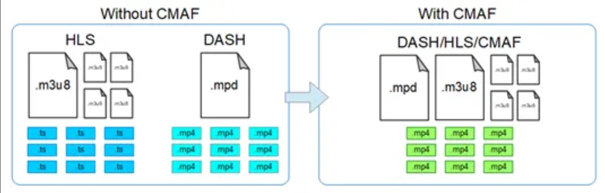

## Live Streaming 이해하기

[출처: Naver Cloud Platform](https://medium.com/naver-cloud-platform/%EB%AF%B8%EB%94%94%EC%96%B4-%EA%B8%B0%EC%88%A0-%EC%9D%B4%ED%95%B4-6%EB%8B%A8%EA%B3%84%EB%A1%9C-%EC%95%8C%EC%95%84%EB%B3%B4%EB%8A%94-%EB%9D%BC%EC%9D%B4%EB%B8%8C-%EC%83%9D%EB%B0%A9%EC%86%A1-%EC%86%A1%EC%B6%9C-%EC%9B%90%EB%A6%AC-86a5137a3655)

기존의 녹화된 영상을 시청하는 VOD와는 다른 특징을 가진 라이브 스트리밍, 어떤 원리일까요?

<br>

**라이브 스트리밍 영상의 전달 단계**

Camera **▶** Encoder **▶** Media Server(+CDN) **▶** Player **▶** Client

각 기술마다 사용하는 요소를 보겠습니다.

---

## Camera ▶ Encoder

원 카메라에서 영상을 Encoder로 보냅니다.

압축되지 않는 동영상은 무지막지하게 용량이 크기 때문에 그대로 작업하면 편집, 보관, 전송, 배포를 하는데 시간 및 비용 측면에서 낭비가 발생합니다. 

따라서 **큰 용량의 영상을 압축하는 과정**이 필요한데, 이 과정에서 **코덱**을 활용하여 다양한 방식으로 영상 압축을 하게 됩니다.

대표적인 **영상코덱에는 H.264** 가 있으며, **음성코덱으로는 AAC**가 있습니다.

<br>

**H.264**
- 효율적인 압축률을 보여주는 코덱입니다. 
- **손실 압축 방식**이지만 뛰어난 화질을 유지하며 동영상 크기를 줄여 주기 때문에 **고화질 영상의 웹 배포용으로 많이 사용**합니다​

**AAC**
- **오디오 코덱**으로 MPEG-4 Audio 라고도 부릅니다. 
- MP3(MPEG-1 Layer3)에 비해 뛰어난 음질과 **높은 압축률을 보이지만 인코딩 시간이 오래 걸린다는 단점**을 가지고 있습니다.

<br>

> **압축 방식 이해하기**

**📌 JPEG : Joint Photographic Experts Group**​

JPEG의 경우 **손실 압축형식**을 사용합니다. 디테일 일부를 희생시켜 크기를 줄이는 방식인데요. 메모리 공간을 절약할 수 있고, 온라인 게시나 이메일 전송 등에 효율적으로 사용됩니다.​

다시 말해 JPEG는 파일의 크기를 엄청나게 줄일 수 있는 **슬라이딩 스케일(Sliding Scale) 압축 방식**을 사용하여 **메모리 공간을 절약**할 수 있다는 장점이 있지만, 단점으로는 **과하게 압축을 할 경우 부자연스러우며** 확대를 할 경우에는 **픽셀처럼 보이는 현상**이 나타난다는 점을 꼽을 수 있습니다.

<br>

**📌PNG : Portable Network Graphics**​

PNG의 경우 **무손실 압축**을 사용합니다. 때문에 JPEG와는 다르게 이미지 디테일 손실이 없습니다. 결과적으로 JPEG형식보다 더 고품질 이미지를 생성하는 것입니다. 동시에, 고품질의 이미지를 생성한다는 것은 파일의 크기가 커진다는 것을 의미합니다. 따라서 무손실 압축 방식의 PNG로는 **고품질의 이미지를 생성**할 수 있지만 **상대적으로 많은 메모리**를 사용하게 됩니다.​

최근에는 네트워크 및 스토리지 기술의 발전으로 압축 없이도 원하는 작업을 수행할 수 있기 때문에, JPEG보다는 PNG가 온라인에서 많이 사용하는 이미지의 형태로 자리잡고 있습니다.​

이러한 이미지 압축 방식의 예시처럼, **각각의 상황과 목적에 맞는 압축 방식을 이용한 코덱을 사용**하는 것이 중요합니다.

---

## Encoder ▶ Media Server(+CDN Server)

렇게 Encoder를 거친 뒤, 미디어 서버로 영상을 보낼 때는 인터넷 스트리밍에 최적화된 **스트리밍 프로토콜**을 사용하게 됩니다. 

‘스트리밍 프로토콜’이라는 용어가 다소 생소하실 수 있어, 간단히 설명하겠습니다.

<br>​

스트리밍이란, **멀티미디어 파일을 다운로드 하는 동시에 실행하는 방법이나 기술**을 말합니다. 

예를 들면 넷플릭스에서 영화를 보는데 영화 전체를 다운로드 받고 난 뒤에 즉, 2GB 가량의 영상을 전부 다운 받은 후 영화가 재생된다면 사용자 불만이 폭주하겠죠?

​<br>

실제 넷플릭스는 그렇지 않습니다. **다운로드와 동시에 바로 재생이 되며, 추가 다운로드가 계속 진행되는 방식**을 스트리밍이라고 하며, 이러한 스트리밍의 규칙을 ​**스트리밍 프로토콜**이라고 부릅니다.

<br>

**_대표적인 스트리밍 프로토콜_**

> **Encoder : RTMP , RTSP , webRTC , SRT**
> 
> **Player : HLS , DASH , LL-HLS , webRTC , SRT**

<br>

**Encoder**의 경우 주로 **RTMP(Real Time Messaging Protocol) 프로토콜**을 사용합니다.​

과거에는 UDP기반의 RTSP(Real Time Streaming Protocol) 프로토콜을 많이 사용하였으나 최근에는 RTMP 프로토콜이 거의 표준이 되어가고 있습니다.

<br>

**Player**의 경우에는 **HLS(HTTP-Live Streaming), MPEG-DASH**가 대표적입니다.​

스트리밍이란 ‘다운로드와 동시에 미디어가 재생되는 기술’이라고 설명 드렸는데, 스트리밍의 효율적인 동작을 위해서는 파일을 작은 단위로 분할해야 합니다.​

이 과정은 대표적인 Player 프로토콜인 HLS, DASH을 통해 알아보도록 하겠습니다.

<br>

> **Player 프로토콜 작동 과정 이해하기** feat. HLS & DASH

✅ 우선 H.264 + AAC등 포맷의 동영상 파일을 작은 단위로 분할합니다.(용량에 따라 2초 ~10초 단위)​

<br>

✅ 이와 더불어 **분할된 파일의 재생순서가 작성된 manifest 파일을 생성**합니다.

manifest파일에는 분할된 동영상 파일을 어떤 순서로 몇 초간 재생할 것인지에 대한 내용들이 텍스트로 작성되어 있습니다. 

HLS의 경우에는 .m3u8 파일이, Dash의 경우 .mpd(xml)와 같은 manifest 파일이 생성됩니다.

이러한 과정을 거쳐 작은 단위로 분할된 미디어 파일은 mp2ts와 mp4로 구성되어 있고 mp2ts의 확장자는 .ts입니다.

<br>

**✅** **마지막으로 HLS, DASH를 지원하는 브라우**저나 Application에서 **Manifest 파일을 읽어서 재생**합니다. 

Manifest 파일에 작성되어 있는 분할된 동영상 파일을 순차적으로 읽어 들여 재생하게 됩니다. 

따라서 첫번째 segment file을 다 불러오게 되면 재생을 시작할 수 있게 되고, 

재생이 진행되면서 2번째 및 3번째 segment file을 뒤에서 계속 실행합니다.

​<br>

만약 동영상을 중간부터 재생한다고 하면 manifest 파일(.m3u8, mpd)에 근거하여 해당 타임에 맞는 segment file을 먼저 다운로드를 하게 될 것입니다.



<br>

**manifest 파일인 .m3u8 (HLS), .mpd(DASH)**는 하나 또는 여러 개의 미디어 파일 경로가 작성되어 있는 파일입니다.

최근에는 비디오 스트리밍에 있어서 **공통적인 미디어 포맷을 사용하여 복잡성과 Latency를 줄 일수 있는,**

CMAF의 등장으로 빠른 속도로 Adaptive Bitrate Stream을 제공하기 위한 표준이 등장하기도 하였습니다.

<br>

> **초기화 세그먼트 & 미디어 세그먼트**

.m3u8 확장자 파일이 가지고 있는 Segment파일들은 다시 Initialization Segment(초기화 세그먼트) 와 Media Segment(미디어 세그먼트)로 나뉘어지게 됩니다.

이 파일은 **파일 내에 실제 Segment 파일들이 어떤 식으로 재생되어야 하는지가 작성**되어 있는 것입니다.

<br>

Initialization Segment(초기화 세그먼트)는 **manifest 파일**을 부르며, 실제 동영상 정보를 담고 있는 **Media Segment(미디어 세그먼트)의 시퀀스를 디코딩하는데 필요한 정보**를 담고 있습니다. 

또한 코덱 초기화 데이터, 트랙 ID, 타임스탬프 등을 포함합니다.

<br>

아래 내용은 제가 임의의 실시간 영상을 rtsp를 변환해서 m3u8로 만들어서 파일의 내부 문자열을 가져와봤습니다.

```
#EXTM3U
#EXT-X-VERSION:3 
#EXT-X-TARGETDURATION:3 
#EXT-X-MEDIA-SEQUENCE:2 
#EXTINF:1.667000, output2.ts 
#EXTINF:1.666000, output3.ts 
#EXTINF:1.667000, output4.ts 
#EXTINF:1.667000, output5.ts 
#EXTINF:3.333000, output6.ts 
#EXTINF:1.667000, output7.ts 
#EXTINF:1.666000, output8.ts 
#EXTINF:1.669000, output9.ts 
#EXTINF:1.665000, output10.ts 
#EXTINF:1.433333, output11.ts 
#EXT-X-ENDLIST
```

- `#EXTM3U` : m3u8 파일을 뜻함
- `#EXT-X` : m3u8 Version 3을 사용한다는 의미
- `#EXT-X-TARGETDURATION` : 영상의 길이(초)
- `#EXTINF` : .ts(세그먼트)당 재생시간

그 후에는 각각의 ts(세그먼트 파일)들이 시간별로 반복됩니다. 즉, 하나의 동영상이 여러 개로 분할 된 겁니다.

<br>

각각의 .ts 파일들은 Media Segment(미디어 세그먼트)에 해당됩니다. 

Media Segment(미디어 세그먼트)는 패킷화된 동영상들, 그리고 자신이 플레이어 되어야 할 **미디어 타임라인상의 타임스탬프 정보가 포함된 실제 동영상 데이터**입니다.​

---

## Media Server ▶ Player

안정적인 송출을 위해서는 충분한 인터넷 업로드, 대역폭이 확보되어야 합니다. 

따라서 **Bitrate를 변환**하는 작업도 필수적으로 필요합니다.

> 비트레이트(Bitrate)는 특정한 시간 단위(이를테면 초 단위)마다 처리하는 비트의 수를 뜻합니다.

​<br>

나아가 **멀티비트레이트(Multi Bitrate)**는 비디오 플레이어에서 보여지는 화질 선택 기능과 밀접하게 관련이 있습니다. 

멀티비트레이트는 **비트레이트가 다른 여러 개의 영상을 준비하여 필요에 따라 영상을 전환하는 방식이나 기술**을 뜻합니다.

Bandwitdth에 따라 각기 다른 Bitrate Stream이 선택됩니다.

즉, **Bitrate**가 높을수록 동영상은 더 많은 비트를 가지게 되고, 화질은 좋아지지만 그만큼 용량은 커지게 됩니다.

<br>

예를 들면, Bitrate가 평균 4500K 정도인 BPS의 bandwidth에서 FullHD(1080p)가 선택되는데 이는 곧 1920x1080의 해상도입니다.

---

## Player ▶ Client

이후 실시간으로 생성한 HLS 및DASH 영상 조각 파일을 사용자에게 전달하려면 **전송 서버**가 있어야합니다. 

**일반적인 미디어 서버는 전송 서버의 역할까지 수행**하지만, 동시 시청자가 많은 방송일 경우에는 **대규모 트래픽을 안정적으로 처리하기 위해 CDN을 사용**하는 것을 권장합니다.

<br>

Apple의HLS의 경우 사파리에서 바로 미디어 소스를 적용할 수 있지만, DASH일 경우에는 대부분 MSE(Media Source Extensions)를 이용해서 직접 미디어 소스를 확장합니다. 

DASH나 HLS는 스트리밍할 미디어 데이터의 정보를 동영상 플레이어에게 전달하는 목적으로 만들어졌기 때문에 실질적으로 플레이어에 관여하지 않습니다.

<br>

따라서 **시청자(클라이언트)측**​에서 이러한 **Adaptive Streaming을 가능하게 하는 표준 기술로 MSE (Media Source Extensions)을 사용**하며 이를 통해 **스트리밍 데이터를 플레이어로 전달**하게 됩니다.

<br>

MSE((Media Source Extensions)의 경우 과거에는 어도비(Adobe)의 플래시 혹은 마이크로소프트의 실버 라이트가 아니면 불가능했지만, 

최근에는 **표준 웹기술만으로도 구현이 가능**해지고 있으며 이러한 웹기술이 나오는 속도도 점점 빨라지고 있는 추세입니다.

<br>

MSE(Media Source Extensions)에 대해 상세하게 알고 싶으시면 아래 링크를 참고 부탁드립니다.​

-   MSE 상세 설명자료 : [https://www.w3.org/TR/media-source/](https://www.w3.org/TR/media-source/)

<br>

---

## 정리

지금까지 설명한 내용을 6단계의 흐름으로 정리를 해보겠습니다.

​<br>

> _1. 클라이언트는 실시간 영상을 시청하기 위해 동영상의 각 Quality & Resolution 별 Segment 정보들이 담겨있는 Manifest(.m3u8, .mpd) 파일을 Server에게 요청합니다.​_
> 
> _2. Manifest 파일을 파싱합니다.​_
> 
> _3. 파싱 된 파일에서 필요한 정보들을 얻습니다. 즉, 비디오에 대한 정보, 어떤 해상도의 퀄리티를 사용할 수 있는지 그리고 어디서 해당 세그먼트를 받을 수 있는지(CDN) 파악합니다.​_
> 
> _4. 클라이언트는 User Network Bandwidth을 측정하고 manifest 내용에 따라 가장 최적의 비디오 퀄리티를 선택(Multi Bitrate)한 뒤, 필요한 Segment를 다운로드합니다.​_
> 
> _5. 다운로드한 Segment 데이터를 MSE 에게 제공합니다.​_
> 
> _6. MSE에서 받은 데이터를 형식에 맞게 디코딩하고 영상을 실행합니다._