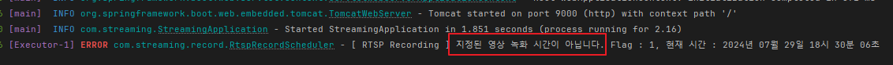
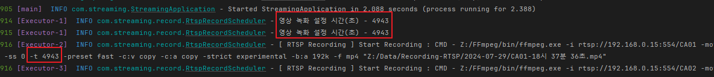
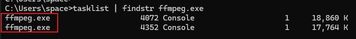
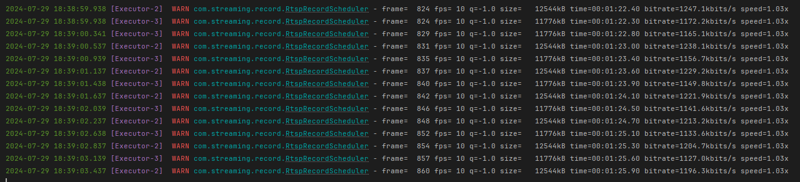
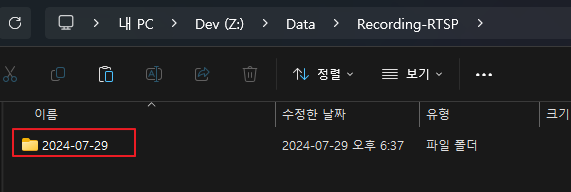
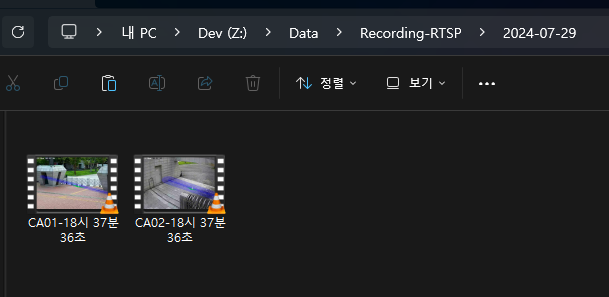

## 📚 Recording RTSP Stream to mp4

AI Engine에서 RTSP Stream을 받아서 Export하는 Stream을 받아 그대로 녹화해서 mp4 파일로 저장하는 기능을 개발 할 일이 생겼습니다.

Spring의 application.yml 파일에서 녹화 주기 시간을 2개 받아 (ex: 11:00 ~ 12:00 / 13:00 ~ 15:00) 해당 시간에만 녹화를 하도록 구현하였습니다.

---
## 📚 application.yml

Thread Pool은 시간을 체크해 녹화를 할지 말지 결정하는 Thread 1개 + 실제 녹화를 수행하는 Thread를 고려해,

최소 3개의 Thread가 필요하므로 넉넉하게 최소 5개로 잡아줍니다.

```yaml
# Thread Pool  
thread:  
  core-pool-size: 5  
  max-pool-size: 10  
  queue-capacity: 40  
  name-prefix: Executor-  
  
# RTSP URL을 "," 로 구분한 RTSP URL 리스트-> url  
# start - end time을  hhmm 형식으로 변환
recording:  
  enabled: true  
  video-directory: Z:\Data\Recording-RTSP  
  url: rtsp://192.168.0.15:554/CA01, rtsp://192.168.0.15:554/CA02  
  start-time-1: 1600  
  end-time-1: 1800  
  start-time-2:  
  end-time-2:
```

---
## 📚 RTSP Record Scheduler 구현

**녹화 조건 체크 및 녹화 시작 함수 (`check`)**
- `enabled` 상태 체크 - 이 상태에 따라 녹화 기능 On-Off 하게 설정해 둠
-  RTSP URL 리스트가 유효한지 체크.
- 필수 시간 설정값이 유효한지 체크.
- 각 시간 값을 파싱하여 `LocalTime` 객체로 변환.
- 운영체제에 따라 Separator 설정 및 현재 날짜 (yyyy-MM-dd) 디렉토리 생성.
- 해당 디렉토리 안에 RTSP Path + 날짜 + mp4 파일 생성
- 현재 시간이 녹화 시간 범위 내에 있는지 체크.
- FFmpeg 명령어 생성 및 프로세스 실행.

<br>

**모든 FFmpeg 프로세스 종료 함수 (`terminateAllProcesses`)**
- 실행 중인 모든 프로세스를 종료하고 `ConcurrentHashMap`에서 제거.

<br>

**녹화 프로세스 실행 함수 (`executeRecording`)**
  - FFmpeg 명령어 실행.
  - 에러 스트림을 읽어 로그에 기록.
  - 프로세스 종료 시 `ConcurrentHashMap`에서 제거 및 프로세스 종료 로그 기록.

```java
@Slf4j  
@Service  
@RequiredArgsConstructor  
public class RtspRecordScheduler {  
    private static final String OS = System.getProperty("os.name").toLowerCase();  
    private static final String FFMPEG_COMMAND = "Z:\\FFmpeg\\bin\\ffmpeg.exe -i %s -movflags +frag_keyframe+separate_moof+omit_tfhd_offset+faststart -reset_timestamps 1 -ss 0 -t %d -preset fast -c:v copy -c:a copy -strict experimental -b:a 192k -f mp4 \"%s\"";  
    String directoryName = new SimpleDateFormat("yyyy-MM-dd").format(new Date());  
    String fileName = new SimpleDateFormat("HH시 mm분 ss초").format(new Date()) + ".mp4";  
  
    @Value("${recording.url}")  
    private List<String> rtspUrlList;  
  
    @Value("${recording.video-directory}")  
    private String videoDirectory;  
  
    @Value("${recording.start-time-1}#{null}")  
    private String rtspStartTime1;  
  
    @Value("${recording.end-time-1}#{null}")  
    private String rtspEndTime1;  
  
    @Value("${recording.start-time-2}#{null}")  
    private String rtspStartTime2;  
  
    @Value("${recording.end-time-2}#{null}")  
    private String rtspEndTime2;  
  
    @Value("${recording.enabled}")  
    private boolean enabled;  
  
    @Qualifier("executor")  
    private final TaskExecutor executor; // Thread Pool  
    private final ConcurrentHashMap<String, Process> runningProcesses = new ConcurrentHashMap<>(); // Concurrent Hash Map  
  
    @PreDestroy  
    public void onDestroy() {  
        // 프로그램 종료 Hook 발생 시 모든 FFmpeg 프로세스 종료  
        this.terminateAllProcesses();  
    }  
  
    @Scheduled(fixedRate = 20000)  
    public void schedule() {  
        executor.execute(this::check);  
    }  
  
    public void check() {  
        // Enabled 상태가 False면 녹화 안함  
        if (!enabled) return;  
  
        // RTSP URL 체크  
        if (rtspUrlList == null || rtspUrlList.isEmpty()) {  
            log.error("[ RTSP Recording ] - RTSP URL이 입력되지 않았습니다.");  
            terminateAllProcesses(); // ConcurrentHashMap에 담긴 모든 프로세스에 SIGINT 명령 전송, SIGKILL로 할 경우 영상 재생 불가능  
            return;  
        }  
  
        // 픽수 시간 체크  
        if (rtspStartTime1 == null || rtspEndTime1 == null) {  
            log.error("[ RTSP Recording ] - 필수 시간이 입력되지 않았습니다.");  
            terminateAllProcesses(); // ConcurrentHashMap에 담긴 모든 프로세스에 SIGINT 명령 전송, SIGKILL로 할 경우 영상 재생 불가능  
            return;  
        }  
  
        String checkTimeIsNull1 = DateUtil.parseTimeToString(rtspStartTime1), checkTimeIsNull2 = DateUtil.parseTimeToString(rtspEndTime1),  
                checkTimeIsNull3 = DateUtil.parseTimeToString(rtspStartTime2), checkTimeIsNull4 = DateUtil.parseTimeToString(rtspEndTime2);  
  
        LocalTime start1 = null, end1 = null, start2 = null, end2 = null;  
  
        String flag = ""; // 시간 1,2중 1만 있을 경우 1, 둘다 있을 경우 2 할당  
  
        if (checkTimeIsNull3 == null && checkTimeIsNull4 == null) {  
            start1 = LocalTime.parse(checkTimeIsNull1);  
            end1 = LocalTime.parse(checkTimeIsNull2);  
            flag = "1";  
        } else {  
            start1 = LocalTime.parse(checkTimeIsNull1);  
            end1 = LocalTime.parse(checkTimeIsNull2);  
  
            if (checkTimeIsNull3 != null && checkTimeIsNull4 != null) {  
                start2 = LocalTime.parse(checkTimeIsNull3);  
                end2 = LocalTime.parse(checkTimeIsNull4);  
                flag = "2";  
            }  
        }  
        String separator = "";  
        if ("win".contains(OS)) {  
            videoDirectory.replace("/", "\\");  
            separator = "\\";  
        } else {  
            separator = File.separator;  
        }  
  
        String directory = videoDirectory + separator + directoryName;  
        File path = new File(directory);  
        if (!path.exists()) path.mkdirs(); // 디렉토리가 존재하지 않으면 생성  
  
        LocalTime now = LocalTime.now();  
  
        try {  
            for (String url : rtspUrlList) {  
                boolean isInFirstRange;  
                boolean isInSecondRange;  
                long durationInSeconds = 0L; // 현재 시간과 종료 시간 사이의 Seconds를 구해 FFmpeg 녹화 시간 설정에 삽입  
  
                switch (flag) {  
                    case "1": {  
                        if (now.isBefore(start1) || now.isAfter(end1)) {  
                            DateTimeFormatter logFormat = DateTimeFormatter.ofPattern("yyyy년 MM월 dd일 HH시 mm분 ss초");  
                            log.error("[ RTSP Recording ] 지정된 영상 녹화 시간이 아닙니다. Flag : {}, 현재 시간 : {}", flag, LocalDateTime.now().format(logFormat));  
                            terminateAllProcesses();  
                            return;  
                        }  
                        durationInSeconds = ChronoUnit.SECONDS.between(now, end1);  
                        break;  
                    }  
                    case "2": {  
                        isInFirstRange = !now.isBefore(start1) && !now.isAfter(end1);  
                        isInSecondRange = !now.isBefore(start2) && !now.isAfter(end2);  
  
                        if (!isInFirstRange && !isInSecondRange) {  
                            DateTimeFormatter logFormat = DateTimeFormatter.ofPattern("yyyy년 MM월 dd일 HH시 mm분 ss초");  
                            log.error("[ RTSP Recording ] 지정된 영상 녹화 시간이 아닙니다. Flag : {}, 현재 시간 : {}", flag, LocalDateTime.now().format(logFormat));  
                            terminateAllProcesses();  
                            return;  
                        }  
  
                        long durationInSeconds1 = ChronoUnit.SECONDS.between(now, end1);  
                        long durationInSeconds2 = ChronoUnit.SECONDS.between(now, end2);  
                        durationInSeconds = isInFirstRange ? durationInSeconds1 : durationInSeconds2;  
  
                        if (durationInSeconds <= 0) {  
                            log.error("[ RTSP Recording ] 시작 시간과 종료 시간을 올바르게 입력해 주세요.\n현재 설정된 시작 시간 1 : {}, 종료 시간 1 : {}\n시작 시간 2 : {}, 종료 시간 2 : {}", start1, end1, start2, end2);  
                            terminateAllProcesses();  
                            return;  
                        }  
                        break;  
                    }  
                }  
  
                if (StringUtils.hasLength(url)) {  
                    // RTSP URL에서 마지막부터 시작해 / 까지의 문자열(RTSP Path) 추출 -> RTSP Path (ex: CA01)                    String extractRtspPathString = url.substring(url.lastIndexOf('/') + 1);  
                    String fullPath = directory + "\\" + extractRtspPathString + "-" + fileName;  
                    String command = String.format(FFMPEG_COMMAND, url, durationInSeconds, fullPath).replace("\\", "/");  
  
                    // 이미 실행 중인 프로세스가 있는 경우 건너뜀  
                    if (runningProcesses.containsKey(url)) {  
                        continue;  
                    }  
  
                    log.info("영상 녹화 설정 시간(초) - {}", durationInSeconds);  
  
                    // Recoding 시작  
                    executor.execute(() -> executeRecording(url, command));  
                }  
            }  
        } catch (Exception e) {  
            log.error("[ RTSP Recording ] Failed - {}", e.getMessage());  
            e.printStackTrace();  
        }  
    }  
  
    // 모든 FFmpeg 프로세스 종료  
    private void terminateAllProcesses() {  
        runningProcesses.forEach((url, process) -> {  
            try {  
                if (process.isAlive()) {  
                    // Windows 환경에서는 taskkill 명령을 사용하여 SIGINT를 전송, SIGKILL을 할 경우 영상 재생이 안됨  
                    Runtime.getRuntime().exec("taskkill /f /pid " + process.pid() + " /t");  
                    process.waitFor();  
                }  
            } catch (Exception e) {  
                log.error("[ RTSP Recording ] Failed to send SIGINT to FFmpeg process - {}", e.getMessage());  
                e.printStackTrace();  
            }  
            runningProcesses.remove(url);  
        });  
    }  
  
    // Recording 프로세스 실행  
    private void executeRecording(String url, String command) {  
        Process process = null;  
        try {  
            log.info("[ RTSP Recording ] Start Recording : CMD - {}", command);  
            process = Runtime.getRuntime().exec(command);  
            runningProcesses.put(url, process);  
  
            // Error Stream  
            BufferedReader reader = new BufferedReader(new InputStreamReader(process.getErrorStream()));  
  
            String line;  
            while ((line = reader.readLine()) != null) log.warn(line);  
  
            process.waitFor();  
        } catch (InterruptedException e) {  
            Thread.currentThread().interrupt();  
            this.terminateAllProcesses();  
            runningProcesses.remove(url);  
        } catch (Exception e) {  
            log.error("[ RTSP Recording ] Recoding Failed - {}", e.getMessage());  
            e.printStackTrace();  
        } finally {  
            runningProcesses.remove(url);  
            process.destroy();  
            log.info("[ RTSP Recording ] - 모든 FFmpeg 프로세스 종료");  
        }  
    }  
}
```

---
## 📚 테스트

### 시간 범위에 없을때

우선 시간이 안맞을떄 녹화가 수행되지 않는지 확인해 봅니다.

application.yml에서 현재 시간에 맞지 않게 등록 해 주고 실행 하면 아래와 같은 로그가 뜨게 됩니다.



<br>

### 시간 범위에 들어와 있을 때

시간 범위에 들어와 있을때는 현재 시간과 종료 시간 사이의 초를 계산해서 FFmpeg 명령의 -t 옵션에 해당 초를 넣어,

녹화 시간을 결정합니다. 아래 로그로는 4943 초가 잘 들어간 것을 볼 수 있습니다.



<br>

**FFmpeg 프로세스 확인**

CMD를 열어 FFmpeg 프로세스가 실행중인지 확인 합니다.



<br>

**FFmpeg 프로세스의 Error Stream**

Process의 Error Stream을 보면 프레임마다 파일에 잘 쌓이고 있습니다.



<br>

**mp4 파일 확인**

이제 마지막으로 현재 날짜의 디렉터리와 파일이 생기는지 확인 해보면 잘 생겨 있으며, 재생도 잘 되는걸 확인 했습니다.



