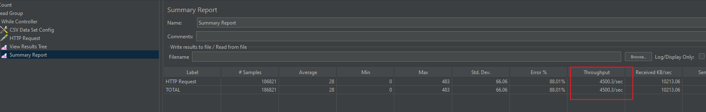
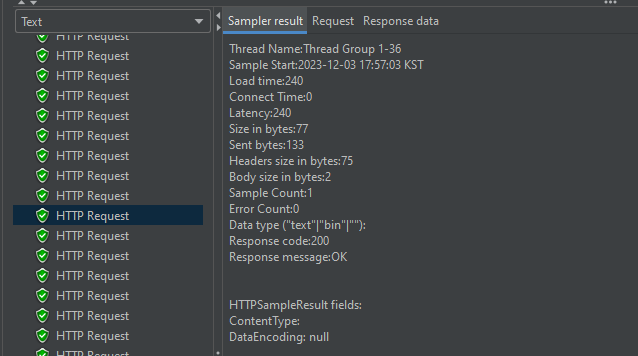
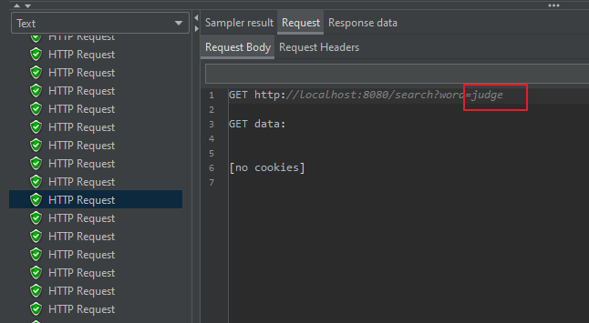
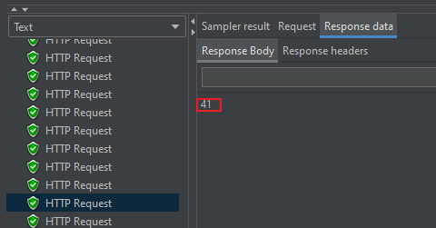

## 📘 Apache Jmeter를 이용한 어플리케이션 처리량 측정

Apache Jmeter는 Java 코드를 사용하지 않고 자동화된 성능 테스트 계획을 생성할 수 있습니다.

[Apache Jmeter Download Link](https://jmeter.apache.org/download_jmeter.cgi)

<br>

> 📕 **테스트 계획의 첫번째**

**단어 리스트를 포함한 파일을 로딩하는 것**으로, 각 단어에 HTTP 요청을 전송하고 응답을 기다립니다.

```csv
acceptable  
accessible  
accidental  
accurate  
acid  
acidic  
acoustic  
acrid  
actually

... 등등등 단어 리스트 CSV 파일
```

- ex) `http://localhost:8080/search?word=word1`
- ex) `http://localhost:8080/search?word=word2`
- ex) `http://localhost:8080/search?word=word3`

<br>

> 📕 **테스트 계획의 두번째**

서버는 가능한 한 빨리, 많은 Response를 전송합니다.

그리고 마지막엔 **전송된 요청 수 / 응답을 받는데 걸린 시간** 으로 나눠서 어플리케이션의 처리량을 알려줍니다.

<br>

> 📕 **Jmeter 설정**

- Test Plan 이름 설정
- Test Plan 우클릭 - Add - Threads - Thread Group 생성 (HTTP Server에 요청을 전송할 스레드 그룹)
- Thread 수 = 200,
- Thread Group 우클릭 - Add - Logic Controller - While Controller (입력 단어 반복 작업)
- While Controller 우클릭 - Add - Config Element - CSV Data Set Config (미리 준비된 search_words.csv 파일 로딩)
- CSV Data Set Config - Variable Names = WORD (While Loop 반복 작업에 사용할 새로운 단어)
- CSV Data Set Config - Delimiter = `\n` 으로수정
- CSV Data Set Config - Stop Thread On EOF = `True`로 설정 (파일을 하나씩 읽게 하기 위함)
- 이제 변수에 각 단어를 저장했으니 While Loop에 조건을 생성할 수 있습니다.
- While Controller - Condition 부분에 `${___jexl3("${WORD}" != "<EOF>")}` 입력

<br>

이제 반복할 때마다 파일에서 단어를 읽고 단어 변수에 저장 후, HTTP 요청을 HTTP 서버 어플리케이션에 전송해,

읽은 단어가 책에 몇번 나타났는지 물어봅니다.

- While Controller - Add - Sampler - HTTP Request 추가
- HTTP Request Endpoint(Path) = `/search?word=${WORD}`, 서버 IP, Port등 설정

<br>

마지막으로 실행된 테스트 결과를 요약할 **Listener**와 디버깅 목적의 **View Results Tree**도 추가 해줍니다..

- While Controller - Add - Listener - Summary Report
- While Controller - Add - Listener - View Results Tree

<br>

> 📕 **Jmeter 실행**

Jmeter를 실행하고 다른 스레드 풀 크기로 어플리케이션의 처리량을  측정합니다.

크기는 1부터 시작하겠습니다.

Sumarry Report 탭에서 Ctrl + R을 눌러 테스트를 실행 시켜보면 아까 설정한 어플리케이션 내부 스레드 풀의 크기 1로

초당 3~4000개의 요청을 처리하는 걸 볼 수 있습니다.

<br>

**Summary Report**



위 사진에서 Error 율이 발생한 이유는 HTTP Server를 나중에 실행했기 떄문에 생긴것 이므로 무시해도 됩니다.

---
## 📘 Application 처리량 측정 결과

이제 View Result Tree로 가서 요청과 응답 값을 확인 해봅시다.

<br>

> 📕 **Result**

Result 부분에 헤더와 메타 데이터 정보들이 나오고 HTTP Request 200 OK 가 떠있습니다.



<br>

> 📕 **Request**

검색 단어는 judge가 들어가 있습니다.



<br>

> 📕 **Response**

응답에는 책에 judge라는 단어가 41번 나온걸 볼 수 있습니다.



<br>

> 📕 **결론**

HTTP Server의 Thread Pool 크기를 물리 코어의 수 만큼 점점 늘려갈 수록 처리량도 급격히 늘어납니다.

그리고 가상 코어의 수까지 스레드를 더 추가하면 조금 이지만 그래도 처리량의 증가를 볼 수 있고,

가상 코어의 수 이상으로 스레드를 늘리면 처리량은 더이상 오르지 않습니다.

<br>

**지연 시간 최적화**를 할떄 작업을 완료한 하위 Task 들을 모두 결합할떄 발생하던 스위칭 비용 & 오버헤드가,

처리량 개선 작업에서는 오버헤드를 최소화 했기 떄문에 지연 시간 최적화에 비해 급격한 처리량 성능의 증가를 볼 수 있었습니다.