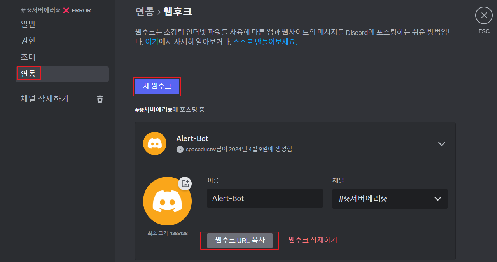
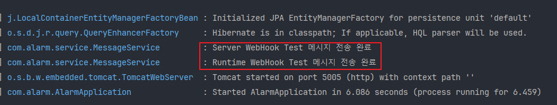
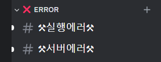
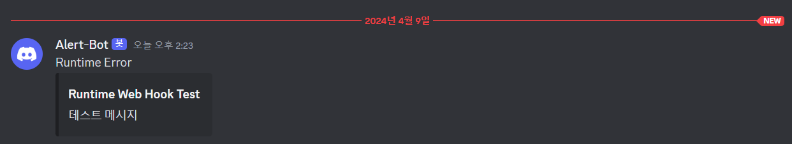
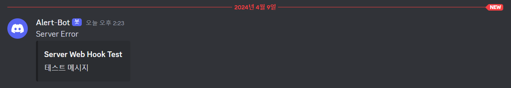

## Discord Bot 연동

Slack Push Webhook을 구현했었는데 비용 문제로 Slack을 사용하자마자 바로 Discord Push Web Hook으로 변경할 일이 생겨 작성합니다.

---

## Discord WebHook 연결

Webhook을 설정할 채널의 편집 설정에 들어가서 **연동**탭에서 **WebBook 만들기** 탭을 클릭해줍니다.



<br>

이후 바로 코드 작성으로 넘어갑니다.

[Discord WebHook API 사용법](https://discord.com/developers/docs/resources/channel#create-message)

```json
{
  "content": "Hello, World!",
  "tts": false,
  "embeds": [{
    "title": "Hello, Embed!",
    "description": "This is an embedded message."
  }]
}
```

<br>

**Message DTO**

위 공식 문서의 **Create Message** 부분의 Json 형식에 맟춰 DTO를 만들어 줍니다.

```java
@Data  
public class MessageDto {  
    private String content;  
    private boolean tts = false; // 텍스트 음성 변환  
    private List<Embed> embeds = new ArrayList<>();  
  
  
    @Data  
    public static class Embed {  
        private String title;  
        private String description;  
    }  
}
```

<br>

**Web Config**

그리고 저는 API 통신에 WebClient를 사용하기 떄문에 WebClient Config도 설정 해줍니다.

2개 채널(서버에러, 런타임에러)에 Web Hook을 사용할 예정이라 Bean을 2개로 나누어 주었습니다.

```java
@Configuration  
public class WebConfig {  
    @Value("${discord.server-error-url}")  
    private String serverErrorUrl;  
  
    @Value("${discord.runtime-error-url}")  
    private String runtimeErrorUrl;  
  
    @Value("${task.core-pool-size}")  
    private Integer corePoolSize;  
  
    @Value("${task.max-pool-size}")  
    private Integer maxPoolSize;  
  
    @Value("${task.queue-capacity}")  
    private Integer queueCapacity;  
  
    @Value("${task.name-prefix}")  
    private String namePrefix;  
  
    @Bean  
    public WebClient serverErrorClient() {  
        return WebClient.builder()  
                .baseUrl(serverErrorUrl)  
                .defaultHeader(HttpHeaders.CONTENT_TYPE, MediaType.APPLICATION_JSON_VALUE, StandardCharsets.UTF_8.toString())  
                .build();  
    }  
  
    @Bean  
    public WebClient runtimeErrorClient() {  
        return WebClient.builder()  
                .baseUrl(runtimeErrorUrl)  
                .defaultHeader(HttpHeaders.CONTENT_TYPE, MediaType.APPLICATION_JSON_VALUE, StandardCharsets.UTF_8.toString())  
                .build();  
    }  
  
    @Bean  
    public TaskExecutor executor() {  
        ThreadPoolTaskExecutor executor = new ThreadPoolTaskExecutor();  
        executor.setCorePoolSize(corePoolSize);  
        executor.setMaxPoolSize(maxPoolSize);  
        executor.setQueueCapacity(queueCapacity);  
        executor.setThreadNamePrefix(namePrefix);  
        executor.initialize();  
        return executor;  
    }  
}
```

<br>

**MessageService**

현재 이 알람 시스템을 적용하려는 프로젝트에선 에러가 나면 엄청 많은 수의 에러가 다양한 스레드에서 동시에 나오므로,

기본적으로 비동기 호출을 통해 Error Alarm을 전송하도록 만들었습니다.

```java
@Slf4j  
@Service  
@RequiredArgsConstructor  
public class MessageService {  
    private final WebClient serverErrorClient;  
    private final WebClient runtimeErrorClient;  
  
    @PostConstruct  
    public void init() {  
        this.sendServerError("Server Web Hook Test", "테스트 메시지")  
                .doOnSuccess(f -> log.info("Server WebHook Test 메시지 전송 완료"))  
                .subscribe();  
  
  
        this.sendRuntimeError("Runtime Web Hook Test", "테스트 메시지")  
                .doOnSuccess(f -> log.info("Runtime WebHook Test 메시지 전송 완료"))  
                .subscribe();  
    }  
  
    public Mono<Void> sendServerError(String title, String description) {  
            MessageDto.Embed content = new MessageDto.Embed();  
            content.setTitle(title);  
            content.setDescription(description);  
  
            MessageDto message = new MessageDto();  
            message.setContent("Server Error");  
            message.getEmbeds().add(content);  
  
            return serverErrorClient.post()  
                    .bodyValue(message)  
                    .retrieve()  
                    .bodyToMono(String.class)  
                    .then()  
                    .doOnError(error -> log.error("Runtime WebHook 전송 에러 - {}", error.getMessage()));  
    }  
  
    public Mono<Void> sendRuntimeError(String title, String description) {  
            MessageDto.Embed content = new MessageDto.Embed();  
            content.setTitle(title);  
            content.setDescription(description);  
  
            MessageDto message = new MessageDto();  
            message.setContent("Runtime Error");  
            message.getEmbeds().add(content);  
  
            return runtimeErrorClient.post()  
                    .bodyValue(message)  
                    .retrieve()  
                    .bodyToMono(String.class)  
                    .then()  
                    .doOnError(error -> log.error("Runtime WebHook 전송 에러 - {}", error.getMessage()));  
    }  
}
```

<br>

**실행 결과**



<br>

**디스코드 채널에 메시지 도착**



<br>



