## Slack Web Hook 연동

사내 플랫폼을 운영하면서 생긴 Internal Server Error 등에 직접적으로 대응 및 모니터링을 하다가,

자동화가 필요할 것 같아 Web Hook을 알아보던 중 Slack을 사용하기로 하여 알아본 Web  Hook 연동입니다.

---

## Slack Bot 생성

- https://api.slack.com/
- 위 링크 접속 - 우측 상단 **Your Apps** 클릭

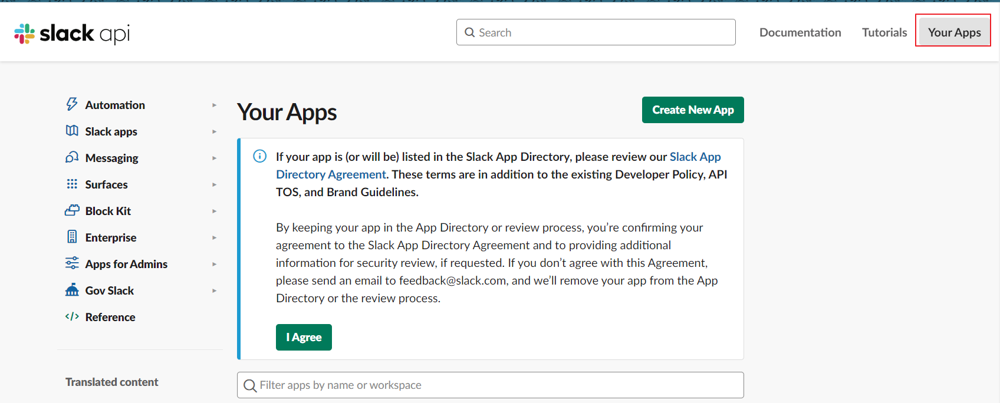

<br>

**Create an App** - **From Scratch** 를 선택 후 사용하고자 하는 앱 이름을 작성합니다. (Slack Bot 이름)

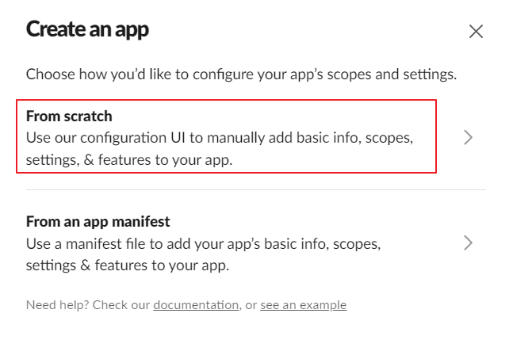

<br>

그리고 이 봇을 사용하고자 하는 WorkSpace를 선택합니다.

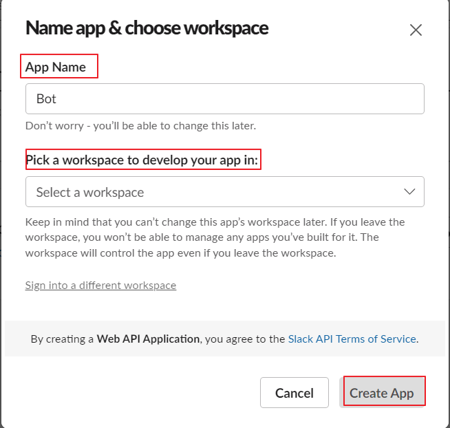

<br>

생성하였다면 좌측 Bots를 클릭하면 자기가 생성한 Slack Bot이 보입니다.

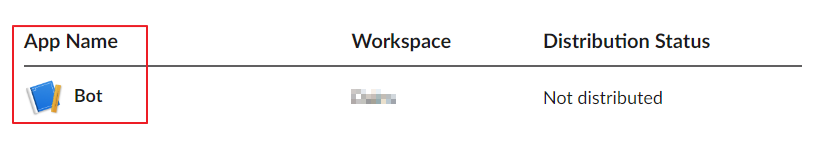

---

## Slack Bot 설정

봇 생성이 완료 되었다면 생성한 Bot을 클릭해서 들어가서, 우측 메뉴 중 **OAuth & Permissions**을 선택합니다.

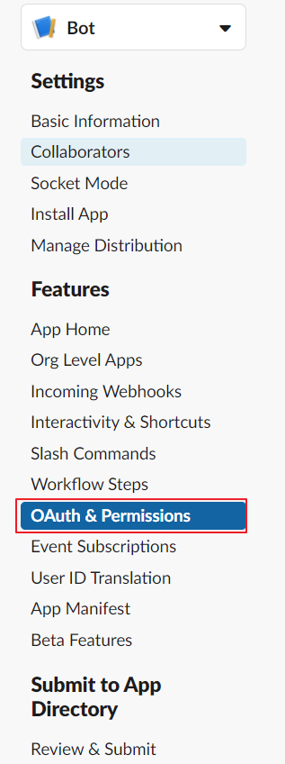

<br>

그리고 스크롤을 조금만 내리면 **Scopes** 부분에 **Bot Token Scopes**에 봇의 권한을 2개 추가 해줍니다.

- chat:write
- channels:read

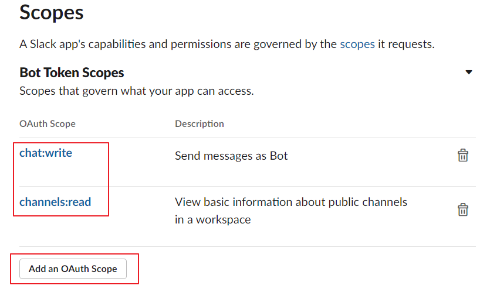

<br>

봇의 권한 설정이 끝났으니 WorkSpace에 적용해 봅시다. 위로 다시 올라가서 **Install to WorkSpace**를 클릭 해 줍니다.

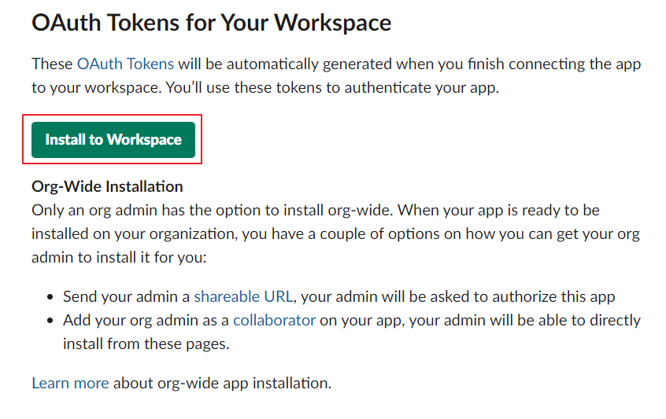

<br>

위처럼 WorkSpace에 Bot을 추가하면 Token이 나오는데, 이 토큰은 이따 생성할 Spring Boot에서 사용할 예정입니다.

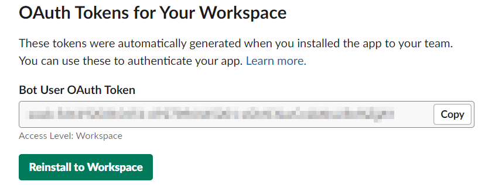

---

## Slack 채널에 슬랙봇 추가

봇을 추가하고자 하는 채널 우클릭 - **채널 세부정보**로 들어가면 **통합** 카테고리에 **앱추가** 버튼을 클릭합니다.

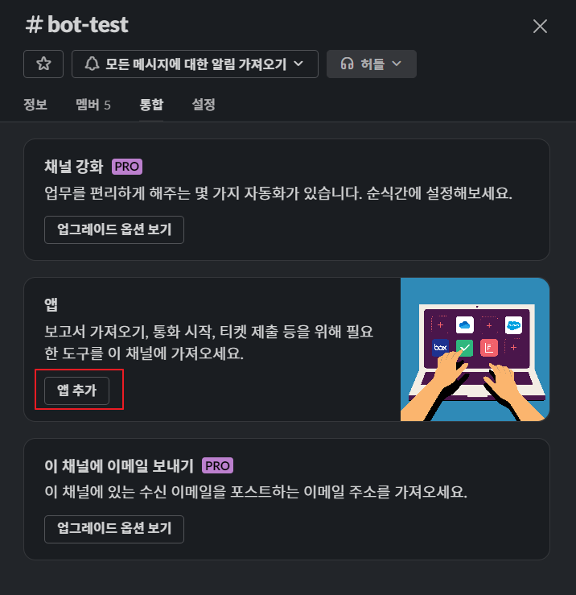

<br>

그 후 채널에 봇을 넣어줍니다.

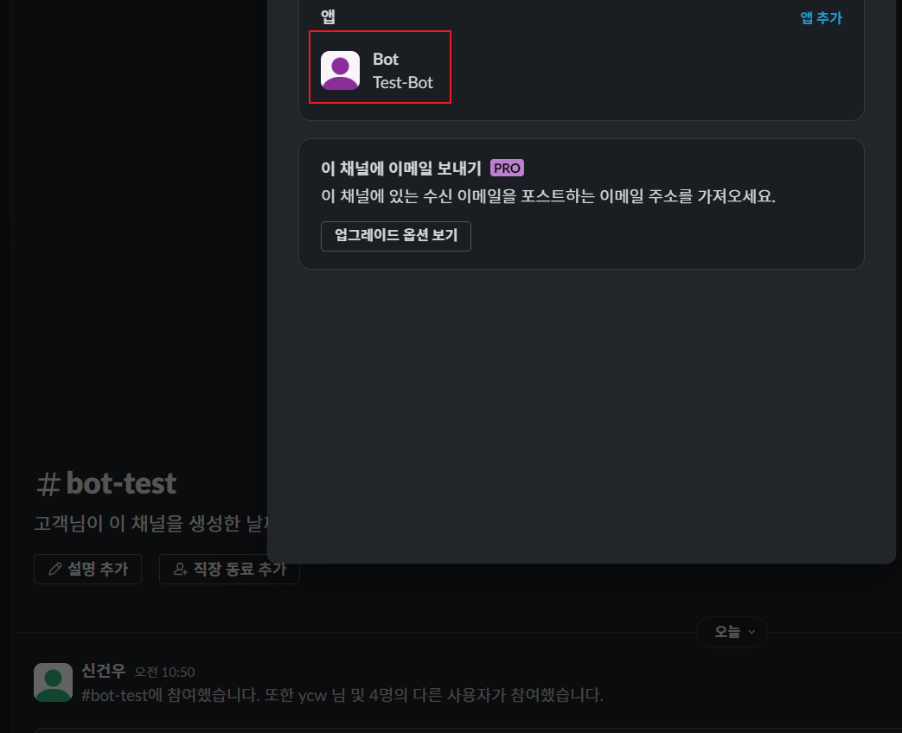

---

## Spring Boot 설정 & 구현

- https://slack.dev/java-slack-sdk/guides/getting-started-with-bolt#gradle
- 위 URL에서 Spring Boot Gradle Dependency를 추가 해 주고. 위에서 받은 Token을 **application.yml**에 등록합니다.

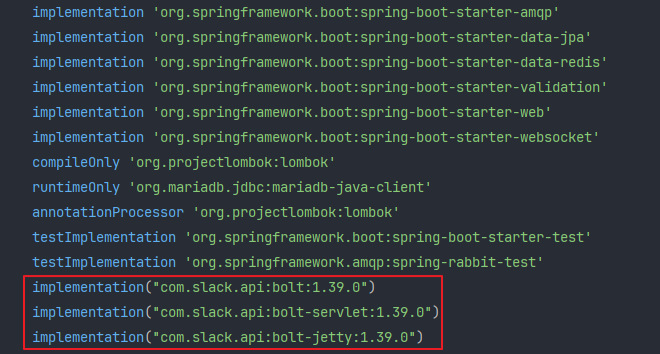

<br>

Slack API가 제공하는 **MethodsClient** 객체를 이용해 발급받은 슬랙 토큰을 Slack Instance에 넣어줍니다.

<br>

**Slack Channel**을 상수로 지정

```java
public class SlackConstants {  
    public static final String BATCH = "#배치작업";  
    public static final String CONVERT = "#변환작업";  
    public static final String ERROR = "#서버에러";  
    public static final String TEST = "#봇테스트";  
}
```

<br>

**서비스 작성**

https://slack.dev/java-slack-sdk/guides/web-api-basics

- 위 사이트에서 더욱 다양한 Slack API 사용법을 볼 수 있습니다.

```java
@Slf4j  
@Service  
public class SlackService {  
    @Value("${slack.token}")  
    private String token;  
  
    public void sendMessage(String message, String channel) {  
        String channelAddress = "";  
  
        if ("error".equals(channel)) {  
            channelAddress = SlackConstants.ERROR;  
        } else if ("batch".equals(channel)) {  
            channelAddress = SlackConstants.BATCH;  
        } else if ("convert".equals(channel)) {  
            channelAddress = SlackConstants.CONVERT;  
        } else if ("test".equals(channel)) {  
            channelAddress = SlackConstants.TEST;  
        }  
  
        try {  
            MethodsClient methods = Slack.getInstance().methods(token);  
  
            ChatPostMessageRequest request = ChatPostMessageRequest.builder()  
                    .channel(channelAddress)  
                    .text(message)  
                    .build();  
  
            methods.chatPostMessage(request);  
            log.info("Slack - Test Message 전송 완료 : {}", message);  
        } catch (Exception e) {  
            log.warn("Slack Error - {}", e.getMessage());  
        }  
    }  
}
```

<br>

**테스트 컨트롤러 작성**

```java
@Slf4j  
@RestController  
@RequestMapping("/slack")  
@RequiredArgsConstructor  
public class SlackController {  
    private final SlackService slackService;  
  
    @GetMapping("/test")  
    public void test() {  
        slackService.sendMessage("테스트 메시지 전송", "test");  
        log.info("Slack Test");  
    }  
}
```

<br>

**API 호출해보기**

- 컨트롤러에 Get 요청을 보내니 컨트롤러에 적힌 테스트 메시지 전송 글자가 잘 나오고 있습니다.

```bash
curl -X GET http://localhost:8080/slack/test
```

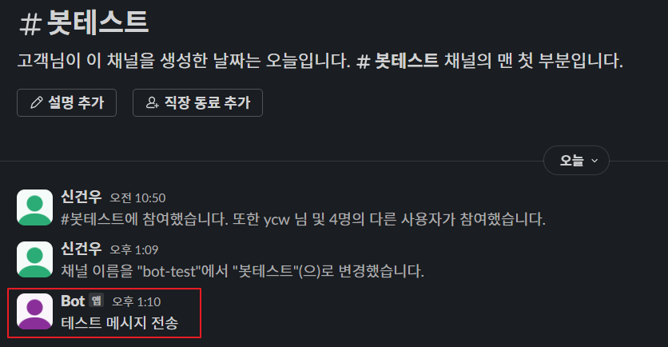

<br>

Slack Bot을 연동하여 메시지 보내기에 성공했으니 이제 실제 필요한 프로젝트의 로직에

원하는 메시지를 특정 주기마다 보내야하는 메시지는 Scheduler를 이용하거나,

Health Check 로직 실행 중 에러가 발생하면 메시지를 보내는 등 활용하면 될 것 같습니다.