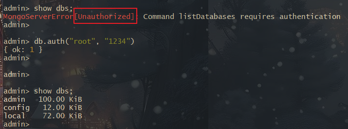

## MongoDB 기본 사용법

> **Docker Container 사용 - 이름과 포트, 초기 유저 & 비밀번호를 지정해 생성**

```bash
# MongoDB Container 생성
docker run -d --name mongo --restart=on-failure -e MONGO_INITDB_ROOT_USERNAME=root -e MONGO_INITDB_ROOT_PASSWORD=1234 -p 5000:27017 mongo

# Mongo Container -> MongoDB CLI 진입
docker exec -it mongo mongosh

# 처음에 무조건 admin DB에 진입해서 권한 잠금 해제를 해야함
use admin
db.auth("root", "1234")

# 원하는 DB를 이제 사용
use skw
```



<br>

> **MongoDB CLI**

**MongoDB CLI 접속**

```bash
mongo -u root -p 1234
```

<br>

**Database 관련 CLI 명령어**

```sql
-- DB 리스트
show dbs

-- 현재 사용중인 DB 출력
db

-- 현재 사용중인 DB 정보
db.stats()

-- 지정한 DB 사용
use skw

-- DB 삭제
db.dropDatabase()
```

<br>

**in Spring**

```java
mTemplate.getDb().getMongo().getDatabase("skw")
```

---
## Collection(Table)

> **Collection 생성**

| **Field** | **Type** | **Desc**                                                          |
| --------- | -------- | ----------------------------------------------------------------- |
| capped    | boolean  | Capped Collection 이란 고정된 크기를 가지는 컬렉션이며, 사이즈 초과 시, 가장 오래된 데이터를 덮어씀 |
| size      | number   | capped가 true일 경우, 필수 설정해야 되는 값으로 컬렉션의 최대 사이즈 지정 (단위:byte)         |
| max       | number   | 해당 컬렉션에 추가할 수 있는 최대 document 개수                                   |
<br>

**Mongo CLI**

```sql
-- 컬랙션 생성 : skw.createCollection(name, [options])
-- name : Collection 이름 지정 / options : Collection의 설정값

-- 일반 컬렉션
db.createCollection("skw")

-- Capped 컬렉션
db.createCollection(
	"skw",
	{
		capped: true,
		size: 6142800,
		max: 10000
	}
)
```

<br>

**Spring Data Mongo**

```java
// 일반 컬렉션 생성
mTemplate.createCollection("skw");

// Capped 컬렉션 생성
CollectionOptions options = CollectionOptions.empty()
	.capped()
	.size(6142800)
	.maxDocuments(10000);

mTemplate.createCollection("skw", options);
```

<br>

> **Collection 조회 & 제거**

**Mongo CLI**

```sql
-- 컬렉션 리스트 조회
show collections

-- 컬렉션 삭제
db.{컬렉션명}.drop()
```

<br>

**in Spring**

```java
// 컬렉션 리스트 조회
Set<String collections = mTemplate.getCollectionNames();

// 컬렉션 삭제
mTemplate.dropCollection(컬렉션명)
```

---
## Documents (Row)

> **데이터 삽입 (insert)**

- `insert (deprecated)` = 단일 또는 다수의 Document를 입력할 떄 사용, 만약 컬렉션이 존재하지 않다면 자동으로 생성 후 Insert 해줌
- `insertOne` = 단일 Document를 입력할 때 사용
- `insertMany` = 다수의 Document를 입력할 떄 사용

<br>

**Mongo CLI**

```sql
/* test라는 Collection이 있다고 가정함 */

-- 단일 Inseet
db.test.insertOne({"name":"이름"})

-- 여러개를 넣을떄는 배열로 묶음
db.test.insertMany([
	{"name": "이름"},
	{"age": 20}
])
```

<br>

**in Spring**

```java
import org.bson.Document;

// --- 단일 Document 삽입 ---
Document doc = new Document().put("name", "이름"); // Document 생성과 동시에 값 넣기
mTemplate.insert(doc, "test"); // test Collection에 Document 삽입

// --- 여러 Document 삽입 ---
List<Document> docs = new ArrayList<>();
docs.add(new Document().put("name":"abc"));
docs.addd(new Document().put("name2":"def"));

mTemplate.insert(docs, "test");
```

<br>

> **데이터 조회**

**Mongo CLI**

```sql
-- 컬렉션의 모든 Document 조회, pretty()를 붙이면 더 깔끔하게 보여줌
db.컬렉션명.find()
db.컬렉션명.find().pretty()

-- name이 abc인 Documemt 조회
db.컬렉션명.find({"name":"abc"})

-- name이 abc인 Documemet 리스트 중 첫번쨰거만 선택
db.컬렉션명.findOne({"name":"abc"})
```

<br>

**in Spring**

```java
// test 컬렉션의 모든 Document 조회
MongoCollection<Document> collection = mTemplate.getCollection("test")

// name이 abc인 Document 조회
for (Document doc : collection.find(new Document("name", "abc"))) {}

// name이 abc인 Document 리스트 중 첫번쨰 것만 조회
Document firstDic = collection.find(new Document("name", "abc")).first();


/* Query 와 Criteria를 이용한 조회 */
import org.springframework.data.mongodb.core.query.Criteria; 
import org.springframework.data.mongodb.core.query.Query;

// test 컬렉션의 모든 Document 조회
List<Document> documents = mongoTemplate.findAll(Document.class, "test");

// name이 abc인 Document 조회
Query query = new Query().addCreteria(Creteria.where("name").is("abc"));
List<Document> findAbc = mTemplate.find(query, Document.class, "test");

// name이 abc인 Document List 중 첫번쨰 것만 조회
Document findOneDoc = mTemplate.findOne(query, Document.class, "test");
```

<br>

> **데이터 수정**

- `updateOne`은 매칭되는 다큐먼트 중 첫 번째만 수정
- `updateMany`는 매칭되는 모든 다큐먼트를 수정. 기존의 {multi:true} 옵션이 두 메소드로 나누어졌다고 생각하면 됨
- `replaceOne` 메소드는 다큐먼트를 통째로 다른 것으로 대체. $set을 안 썼을 때 상황과 유사함

<br>

**Mongo CLI**

- `name` 필드가 `"F"`인 문서가 없으면 아무런 변화도 일어나지 않습니다.
- `name` 필드가 `"F"`인 문서가 있지만 `category` 배열이 없다면
    - `$push`는 `category` 필드를 배열로 만들어 `"science"` 값을 추가합니다.
    - `$pull`은 `category` 필드가 배열이 아니면 아무런 변화를 일으키지 않습니다.

```sql
db.test.update({
	"개수": 120 -- 개수가 120개 인걸 찾아서
}, {
		$set: {
			개수: 130, -- 130으로 업데이트를 하면서
			이름: "이름" -- 기존에 없던 Document인 이름을 추가
		}
})

-- 이름이 F인걸 찾아 값이 있다면 업데이트, 없다면 새로운 문서 삽입
db.test.update({
	name: "F"
}, {
		$set: {
			name: "F",
			나이: 20
		}
}, {upsert: true})

-- $push를 이용하여 category라는 field에 science라는 배열을 추가
db.test.update({
    name: "F"
}, {
    $push: {
        category: "science"
    }
})

-- $pull을 이용하여 science 배열 값 제거
db.test.update({
    name: "F"
}, {
    $pull: {
    	category: "science"
	}
})
```

<br>

**in Spring**

```java
// 1. "개수" 필드가 120인 문서를 찾아 "개수"를 130으로 업데이트하고, "이름" 필드 추가  
public void updateCountAndAddName() {  
    Query query = new Query();  
    query.addCriteria(Criteria.where("개수").is(120));  
  
    Update update = new Update();  
    update.set("개수", 130);  
    update.set("이름", "이름");  
  
    mongoTemplate.updateFirst(query, update, "test");  
}  
  
// 2. "name"이 "F"인 문서를 찾아 업데이트하거나 없으면 새로운 문서 삽입  
public void upsertNameAndAge() {  
    Query query = new Query();  
    query.addCriteria(Criteria.where("name").is("F"));  
  
    Update update = new Update();  
    update.set("name", "F");  
    update.set("나이", 20);  
  
    mongoTemplate.upsert(query, update, "test");  
}  
  
// 3. "name"이 "F"인 문서의 "category" 배열에 "science" 추가  
public void pushToCategory() {  
    Query query = new Query();  
    query.addCriteria(Criteria.where("name").is("F"));  
  
    Update update = new Update();  
    update.push("category", "science");  
  
    mongoTemplate.updateFirst(query, update, "test");  
}  
  
// 4. "name"이 "F"인 문서의 "category" 배열에서 "science" 제거  
public void pullFromCategory() {  
    Query query = new Query();  
    query.addCriteria(Criteria.where("name").is("F"));  
  
    Update update = new Update();  
    update.pull("category", "science");  
  
    mongoTemplate.updateFirst(query, update, "test");  
}
```

<br>

> **데이터 삭제**

**Mongo CLI**

```sql
-- test Collection 내부 모든 Document 삭제
db.test.remove()

-- name이 abc인 Document 전부 삭제
db.test.remove({"name":"abc"})
or 
db.test.deleteOne({name:"abc"})
```

<br>

**in Spring**

```java
// test Collection 내부 모든 Document 삭제
Query query = new Query();
mongoTemplate.remove(query, "test");

// name이 abc인 Document 전부 삭제
Query query = new Query(); 
query.addCriteria(Criteria.where("name").is("abc")); 
mongoTemplate.remove(query, "test");
```