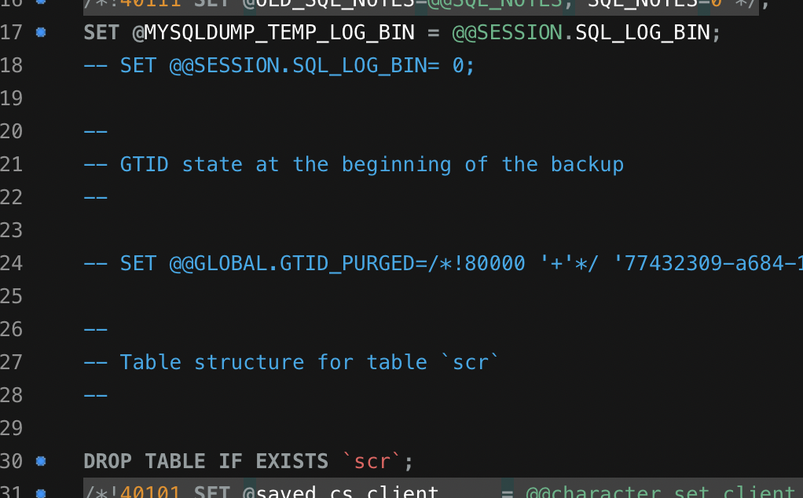

## ❌ MySQL - Global Transaction Identifier Error (GTID)

NCP에 있는 DB서버의 Prod DB Dump를 떠서 AWS RDS로 DB이전을 하는중 에러가 발생하여 해결 기록 글을 작성합니다.

<br>

NCP와 AWS의 MySQL은 둘 다 GTID를 사용하는데, 보통의 Mysql DB Restore는 GTID를 사용하지 않습니다.

백업 단계에서 `--set-gtid-purged=OFF` 옵션을 추가해야 하는데 이를 사용하지 않았기 떄문입니다.

```
Warning: A partial dump from a server that has GTIDs will by default include the GTIDs of all transactions, even those that changed suppressed parts of the database. If you don't want to restore GTIDs, pass --set-gtid-purged=OFF. To make a complete dump, pass --all-databases --triggers --routines --events. 
```

<br>

> **GTID 란?**

MySQL Replication에서 서버의 각 트랜잭션을 구분하는 고유 식별자입니다.

GTID는 모든 트랜잭션과 1:1 관계이며, GTID를 활용하면 복제본으로 

장애조치, 계층적 복제, 특정 시점으로 백업 복구 등의 작업을 더 쉽게 구현할 수 있으며, 오류 발생 빈도도 줄일 수 있습니다.

<br>

**이 에러의 해결법은 옵션을 2개 추가하면 됩니다.**

```bash
--set-gtid-purged=OFF \
--column-statistics=0
```

<br>

**만약 위 방법이 안된다면 .sql 파일에 서 세 군데에 주석처리를 해주면 됩니다.**

- SET @@SESSION.SQL_LOG_BIN=0;
- SET @@GLOBAL.GTID_PURGE=/*!80000 '+'*/
- SET @@SESSION.SQL_LOG_BIN = @MYSQLDUMP_TEMP


<br>

**그래도 안된다면  아래 명령을 이용해 봅시다.**

```sql
mysqldump -u [username] -p [databaseName] --set-gtid-purged=OFF > [filename].sql
```

---

## RDS Grant Privilege Error

**만약 RDS를 사용한다면 이런 에러를 추가로 만날겁니다.** 

```
ERROR 1227 (42000) Access denied; you need (at least one of) the SUPER, SYSTEM_VARIABLES_ADMIN or SESSION_VARIABLES_ADMIN privilege(s) for this operation
```

<br>

> **Why?**

RDS는 기본적으로 SYS Access(Super 권한)을 제공하지 않습니다.

이진 로깅이 켜져 있는 경우 DB인스턴스의 사용자 지정 DB 파라미터 그룹에서,

`log_bin_trust_function_creators`를 `true`로 설정합니다.

<br>

> **DB 파라미터 그룹을 지정하지 않고 RDS 인스턴스를 생성하는 방법**

기본 파라미터 그룹은 수정을 할 수 없으니 새로운 파라미터 그룹을 생성해줍니다.

RDS의 파라미터 그룹을 이동해서 위 파라미터를 찾고 값을 1(True)로 설정합니다.

<br>

그 후, RDS DB 수정화면에서 파라미터 그룹을 새로 만든 파라미터 그룹으로 지정해줍니다.

AWS 공식 Docs에 파라미터 그룹을 변경하고 5분정도 기다리라고 하니 5분을 기다리고,

되도록 RDS DB를 Restart 해주는게 좋다고 하니 재부팅 해줍니다.

(log_bin_trust_function_creators는 동적 파라미터 이므로 재부팅을 안해도 되지만 time_zone 등 여러개를 바꾸었으므로 저는 재부팅을 했습니다.)

<br>

DB 이전이 완료됬다면 보안을 위해 `log_bin_function_creators` 파라미터를 다시 0(false)로 설정해줍니다.

---

## Python SQL Script 작성

[Mysql 1227 Error](https://iizz.tistory.com/339) 의 연장선으로 파일들의 GTID를 일일이 삭제하기 귀찮아서 스크립트를 작성했습니다.

AWS RDS의 Super Privileged를 얻는데 실패했다면 Python 코드를 이용한 SQL Script를 작성합니다.

스크립트에서 Product Dump의 SQL 파일들을 수정하여 Data Import를 할 수 있습니다.

<br>

SQL 주석 변환 스크립트를 작성하기 전, 실제 데이터의 Encoding 형식을 확인하는 스크립트를 먼저 실행하고,

아래 스크립트에서 해당 인코딩 방식을 사용하여 디코딩 합니다.

아래 스크립트는 폴더 내부의 .sql을 돌면서 .sql 파일의 인코딩 방식을 리스트에 담고 모아서 출력하는 스크립트 입니다.

<br>

터미널에서 `pip3 install chardet`을 입력해 chardet 모듈을 설치해줍니다.

chardet 모듈의 위치를 파악하기 위해 파이썬 실행기를 열어서 `print(chardet.__file__)` 을 입력해서 위치를 확인합니다.

위치를 확인하면 site-packages 까지의 경로를  스크립트 변수에 추가합니다.

<br>

> **check_encoding.py**

```python
import os
import sys

# chardet 모듈 경로 추가
chardet_path = '/Library/Frameworks/Python.framework/Versions/3.11/lib/python3.11/site-packages'
sys.path.append(chardet_path)

# chardet 모듈 import
import chardet

# 특정 디렉토리 내의 모든 .sql 파일을 찾습니다.
directory = '/Users/space/Prod/Prod_DB_Dump'  # 실제 폴더 경로로 변경해야 합니다.
sql_files = [file for file in os.listdir(directory) if file.endswith(".sql")]

# 인코딩 확인 결과를 저장할 리스트를 생성합니다.
encoding_list = []

# 각 파일을 순회하면서 인코딩을 확인합니다.
for sql_file in sql_files:
    file_path = os.path.join(directory, sql_file)

    # 파일을 바이너리 모드로 읽어들입니다.
    with open(file_path, 'rb') as file:
        raw_data = file.read()

        # 파일의 인코딩을 감지합니다.
        result = chardet.detect(raw_data)
        encoding = result['encoding']
        confidence = result['confidence']

    # 인코딩 정보를 리스트에 추가합니다.
    encoding_list.append((sql_file, encoding, confidence))

# 인코딩 정보를 출력합니다.
for file_name, encoding, confidence in encoding_list:
    print(f"File: {file_name}")
    print(f"Encoding: {encoding} (confidence: {confidence})")
    print()
```

<br>

그럼 .sql 파일들의 인코딩 방식이 리스트로 출력이 됩니다.


<br>

이제 추가로 작성할 스크립트는 해당 라인들을 .sql 파일들을 돌며 주석처리를 합니다.
- SET @@SESSION.SQL_LOG_BIN=0;
- SET @@GLOBAL.GTID_PURGE=/*!80000 '+'*/
- SET @@SESSION.SQL_LOG_BIN = @MYSQLDUMP_TEMP

<br>

아래 코드에서

commented_lines에 GLOBAL.GTID 부분의 `<hash-code> `부분은 직접 .sql 파일에 적혀있는 hash 로 지정해야 합니다.

그리고, with open() 함수에 encoding 값을 정해줬으면 아래 open()함수에도 똑같이 붙여줘야 합니다.

> **sql_script.py**

```python
import os

# 주석 처리할 라인들
commented_lines = [
    "SET @@SESSION.SQL_LOG_BIN= 0;",
    "SET @@GLOBAL.GTID_PURGED=/*!80000 '+'*/ '<hash-code>';",
    "SET @@SESSION.SQL_LOG_BIN = @MYSQLDUMP_TEMP_LOG_BIN;"

]

# 특정 디렉토리 내의 모든 .sql 파일을 찾습니다.
directory = '/Users/space/Prod/Prod_DB_Dump'
sql_files = [file for file in os.listdir(directory) if file.endswith(".sql")]

  
# 각 파일을 순회하면서 주석 처리를 진행합니다.
for sql_file in sql_files:
    file_path = os.path.join(directory, sql_file)

  
    # 파일을 읽어들입니다.
    with open(file_path, 'r', encoding='utf-8') as file:
        lines = file.readlines()

  
    # 주석 처리할 라인을 찾아서 주석 처리합니다.
    with open(file_path, 'w', encoding='utf-8') as file:
        for line in lines:
            if line.strip() in commented_lines:
                file.write(f'-- {line}')
            else:
                file.write(line)
```

<br>

.sql 파일 중 아무거나 들어가보면 주석처리가 잘 되있는것을 볼 수 있고, RDS로 DB 데이터 이전도 잘 됩니다.

<br>



---

## 스크립트 병합

위의 두 스크립트를 합쳐놓은 스크립트를 작성하였습니다.

```python
import os
import sys

# chardet 모듈 경로 추가
chardet_path = '/Library/Frameworks/Python.framework/Versions/3.11/lib/python3.11/site-packages'
sys.path.append(chardet_path)

# chardet 모듈 import
import chardet

# 폴더 경로 설정
directory = '/Users/space/Prod/Prod_DB_Dump'  # 실제 폴더 경로로 변경해야 합니다.

# 주석 처리할 라인
commented_lines = [
    "SET @@SESSION.SQL_LOG_BIN= 0;",
    "SET @@GLOBAL.GTID_PURGED=/*!80000 '+'*/ '77432309-a684-11ec-b662-f220afbb1580:1-709257';",
    "SET @@SESSION.SQL_LOG_BIN = @MYSQLDUMP_TEMP_LOG_BIN;"
]

# 특정 디렉토리 내의 모든 .sql 파일을 찾습니다.
sql_files = [file for file in os.listdir(directory) if file.endswith(".sql")]

# 각 파일을 순회하면서 인코딩을 확인하고 주석 처리 및 인코딩을 진행합니다.
for sql_file in sql_files:
    file_path = os.path.join(directory, sql_file)

    # 파일의 인코딩을 확인합니다.
    with open(file_path, 'rb') as file:
        raw_data = file.read()
        result = chardet.detect(raw_data)
        encoding = result['encoding']

    # 파일을 해당 인코딩으로 다시 열어서 주석 처리 및 인코딩을 진행합니다.
    with open(file_path, 'r', encoding=encoding, errors='replace') as file:
        lines = file.readlines()

    with open(file_path, 'w', encoding=encoding, errors='backslashreplace') as file:
        for line in lines:
            if any(commented_line in line for commented_line in commented_lines):
                file.write(f'-- {line}')  # 주석 처리된 라인으로 수정
            else:
                file.write(line)

    print(f"Processed file: {sql_file} (Encoding: {encoding})")

    # 실행 로그를 파일에 기록합니다.
    log_file = "execution_log.txt"  # 실행 로그를 저장할 파일 이름
    with open(log_file, 'a', encoding='utf-8') as log:
        log.write(f"Processed file: {sql_file} (Encoding: {encoding})\n")

print("Script execution completed.")
```

<br>

스크립트 실행 시 파일마다 인코딩 방식을 체크해서 변환이 잘 되는걸 볼 수 있습니다.

이제 RDS의 Super Privileged 문제와 Encoding 문제 전부 해결 완료했습니다.

<br>

