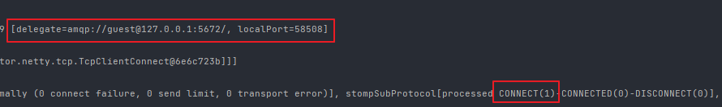
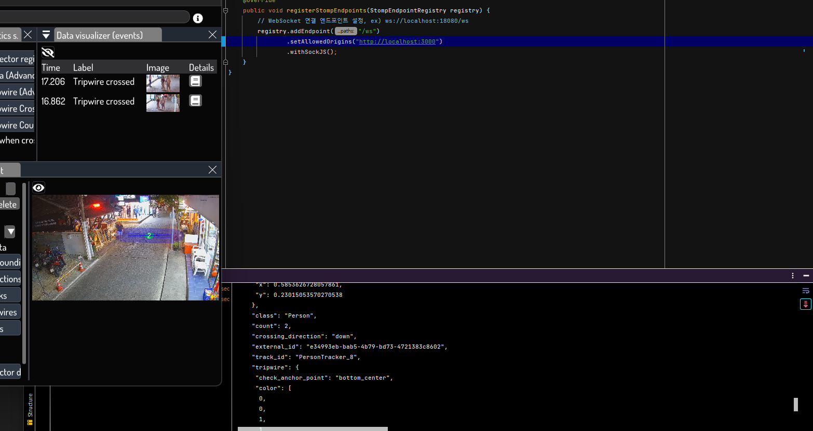
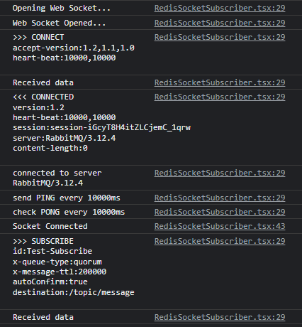
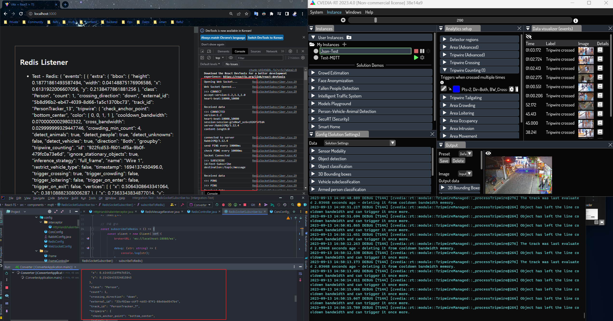

## 구현 요구사항

- 딥러닝 엔진에서 MQTT 데이터 전송
- 클러스터링/데이터 미러링된 RabbitMQ 클러스터 5대 노드에서 각 라우팅 키에 맞게 Exchange -> Routing Key -> Quorum Queue에 메시지들이 쌓이고 Slave Queue에 메시지가 미러링 됩니다.
- Redis 설치
- Backend(Spring Data Redis)에서 미러링 된 Slave Queue에서 데이터를 가져와서 Redis Pub/Sub 채널을 열어줍니다.
- Spring Redis(Backend)에서 소켓을 열어줍니다.
- 소켓의 URL은 `WebSocketConfig` 클래스에 나온것처럼 `ws://localhost:18080/ws`입니다.
- 프론트엔드(React/TypeScript 환경)에서 백엔드의 소켓에 접속해 데이터를 받아옵니다.

---

[Spring Data Redis Pub-Sub 공식 문서](https://docs.spring.io/spring-data/data-redis/docs/current/reference/html/#pubsub)

RabbitMQ 등 다른 메시지 큐도 많은데 Redis의 Pub/Sub 기능을 사용하는 이유는,

`성능`과 `Push Based Subscription` 방식 때문입니다.

이벤트를 저장하지 않기 때문에 속도가 매우 뺴르며 Publish한 데이터를 저장할 필요가 없습니다.

그리고 Pub/Sub뿐 아니라 다양한 Json을 주고 받을 떄 저장이 필요한데 이 경우도 RedisJson을 활용하는 등 활용할 기능이 많습니다.

<br>

두 번째로는 `Push Based Subscription`입니다. 

Kafka의 경우 Subscriber가 Pull 요청을 보내야 Message를 받아오는데,

Redis는 Publisher가 Publish하면 자동으로 모든 Subscriber에게 Message를 BroadCasting 합니다.

<br>

> 📕 **Redis vs Kafka**

**Redis**
- 모든 Subscriber에게 BroadCasting을 원하고, 데이터를 저장하지 않을 때
- 속도가 중요하고, 데이터 손실을 감수할 수 있는 경우
- 시스템에서 전송된 메시지를 보관하는 것을 원하지 않을 경우 (성능)
- 처리할 데이터의 양이 크지 않을 때

<br>

**Kafka**
- 신뢰성 있는 메시지의 전달 보장을 위할 때
- 메시지 소비 후에도 큐의 메시지를 복제 & 보관하기 원할 때
- 속도가 큰 문제가 아닌 경우
- 데이터의 크기가 클 경우

---

## Redis 설치

도커 컨테이너 사용 X

<br>

> 📕 **설치**

**Debian 기반**

```bash
apt-get -y update
apt-get -y upgrade
apt-get -y install redis-server firewalld
systemctl start redis-server && systemctl enable redis-server

firewall-cmd --permanent --add-port=6379/tcp && firewall-cmd --permanent --add-service=redis && firewall-cmd --reload
```

**RPM 기반**

```bash
dnf -y update
dnf -y upgrade
dnf -y install redis-server firewalld
systemctl start redis-server && systemctl enable redis-server

firewall-cmd --permanent --add-port=6379/tcp && firewall-cmd --permanent --add-service=redis && firewall-cmd --reload
```

<br>

> 📕 **각종 설정값 변경**  => `/etc/redis/redis.conf`

```bash
# 최대 메모리 사양 
# -> 최대 사용 메모리 사양을 256mb로 설정한다. 단위는 mb나 g 등 필요에 맞춰 적어주면된다. 
maxmemory 256mb 

# maxmemory 에 설정된 용량을 초과했을때 삭제할 데이터 선정 방식
# - noeviction : 쓰기 동작에 대해 error 반환 (Default)
# - volatile-lru : expire 가 설정된 key 들중에서 LRU algorithm 에 의해서 선택된 key 제거
# - allkeys-lru : 모든 key 들 중 LRU algorithm에 의해서 선택된 key 제거
# - volatile-random : expire 가 설정된 key 들 중 임의의 key 제거
# - allkeys-random : 모든 key 들 중 임의의 key 제거
# - volatile-ttl : expire time(TTL)이 가장 적게 남은 key 제거 (minor TTL)
maxmemory-policy volatile-ttl

# 프로세스 포트 
# -> port 부분은 초기에 주석처리가 되어 있는데, 디폴트 값으로 6379 포트에서 동작한다. 
# -> 만약, 6379가 아닌 다른 포트를 설정하고 싶다면 주석을 해제하고 포트번호를 입력하면된다. 
port 1234 

# 외부접속 허용 
# -> 기본 실행 환경은 localhost(127.0.0.1)로 되어있다. 
# -> 만약, 모든 외부접속에 대한 허용을 하고 싶다면, 0.0.0.0 으로 변경하면 된다. 
bind 0.0.0.0 

# 비밀번호 설정 
# -> 서버 접속에 비밀번호를 적용시키고 싶다면 아래와 같이 수정하자. 
requirepass [접속 패스워드 입력] 

# DB 데이터를 주기적으로 파일로 백업하기 위한 설정입니다.
# Redis 가 재시작되면 이 백업을 통해 DB 를 복구합니다.
#save 900 1      # 15분 안에 최소 1개 이상의 key 가 변경 되었을 때
#save 300 10     # 5분 안에 최소 10개 이상의 key 가 변경 되었을 때
#save 60 10000   # 60초 안에 최소 10000 개 이상의 key 가 변경 되었을 때
```

<br>

비밀번호를 암호화해서 넣고 싶다면 아래 명령어로 암호화 해서 지정 가능합니다.

```bash
# 암호화된 비밀번호가 필요하다면, 터미널에 다음 명령어로 생성 가능하다. 
echo "MyPassword" | sha256sum
```

---

## Spring Data Redis (BackEnd)

> 📕 **build.gradle Dependency 추가**

```groovy
// Redis
implementation'org.springframework.boot:spring-boot-starter-data-redis'

// WebSocket
implementation 'org.springframework.boot:spring-boot-starter-websocket'

// Project Reactor  
implementation 'io.projectreactor.netty:reactor-netty-http'
```

<br>

> 📕 **WebSocketConfig**

`WebSocketMessageBrokerConfigurer` : 인터페이스를 구현해 STOMP로 메시지 처리 구성합니다.

**configureMessageBroker() 함수** : 메시지를 중간에서 라우팅할 때 사용하는 메시지 브로커를 구성하는 함수입니다.
- 보통 `/topic`, `/queue`를 사용합니다.
- `/topic`은 한명이 Message를 발행했을 때 해당 토픽을 구독하고 있는 N명에게 메시지를 브로드캐스팅 할 때 사용합니다.
- `/queue`는 한명이 Message를 발행했을 때 발행한 1명에게 다시 정보를 보내는 경우에 사용합니다.
`enableSimpleBrokerRelay`
- 해당 주소를 구독하는 클라이언트에게 메시지를 보냅니다.
- 즉, 인자에는 구독 요청의 prefix를 넣고, 클라이언트에서 1번 채널을 구독하고자 할 때는 /sub/1 형식과 같은 규칙을 따라야 합니다.
`setApplicationDestinationPrefixes`
- 메시지 발행 요청의 prefix를 넣습니다.
- /로 시작하는 메시지만 해당 Broker에서 받아서 처리하고, 클라이언트에서 WebSocket에 접속할 수 있는 endpoint를 지정합니다.
- 만약 `/app`으로 설정한다면, 실제 구독 신청 URL은 `/app/topic`처럼 시작 URL을 지정합니다.

<br>

**registerStompEndpoints() 함수** : Socket Endpoint를 등록하는 함수입니다.
- `ws`라는 Endpoint에 Interceptor를 추가해 Socket을 등록합니다.

```java
@Configuration  
@RequiredArgsConstructor  
@EnableWebSocketMessageBroker  
public class WebSocketConfig implements WebSocketMessageBrokerConfigurer {  
  
    @Override  
    public void configureMessageBroker(MessageBrokerRegistry config) {  
        // 이 토픽을 구독하면 Subscriber 들에게 메시지를 브로드캐스팅 함  
        config.enableStompBrokerRelay("/topic");  
  
        // 메시지 발행 요청할 때 사용  
        config.setApplicationDestinationPrefixes("/");  
    }  
  
    @Override  
    public void registerStompEndpoints(StompEndpointRegistry registry) {  
        // WebSocket 연결 엔드포인트 설정, ex) ws://localhost:18080/ws  
        registry  
                .addEndpoint("/ws")  
                .setAllowedOriginPatterns("http://localhost:3000")  
                .addInterceptors(new HttpSessionHandshakeInterceptor());  
    }  
}
```

<br>

> 📕 **HttpHandshakeInterceptor**

- 웹소켓은 처음 Connect 시점에 Handshake라는 작업이 수행됩니다.
- Handshake 과정은 HTTP 통신 기반으로 이루어지며 GET 방식으로 통신을 하게 됩니다.
- 이때, HTTTP Request Header의 Connection 속성은 Upgrade로 되어야 합니다.
- HTTP에 존재하는 Session을 WebSocket Session으로 등록합니다, SESSION 변수는 static 변수로 String 타입입니다.

```java
public class HttpHandshakeInterceptor implements HandshakeInterceptor {  
    @Override  
    public boolean beforeHandshake(ServerHttpRequest request,   
                                   ServerHttpResponse response,   
                                   WebSocketHandler wsHandler,   
                                   Map<String, Object> attributes) throws Exception {  
        if (request instanceof ServletServerHttpRequest servletRequest) {  
            HttpSession session = servletRequest.getServletRequest().getSession();  
            attributes.put(SESSION, session);  
        }  
        return true;  
    }  
  
    @Override  
    public void afterHandshake(ServerHttpRequest request,   
                               ServerHttpResponse response,   
                               WebSocketHandler wsHandler,   
                               Exception exception) {}  
}
```

<br>

> 📕 **RedisController**

- `@MessageMapping` 발행 경로를. `@SendTo` or `@SendToUser`를 사용하면 구독 경로를 지정합니다.
- **@MessageMapping URL은** `WebSocketConfig`에서 설정한 DestinationPrefixes를 뺸 URL을 입력해주면 됩니다.
- 만약 DestinationPrefixes를 `/app`이라고 가정하고 나머지 URL은 `/topic/message`라고 가정하면, 
- **ex) @MessageMapping("topic/message)" 처럼 `/app`을 뺸 나머지 URL을 입력하면 됩니다.**

<br>

- 즉, `@MessageMapping`에 설정한 URL로 클라이언트로부터 요청 메시지를 받으면, `@SendTo`로 설정한 URL을 구독한 클라이언트들에게 메시지를 보냅니다.
- `@SendTo`는 1:N으로 메시지를 보낼때 사용하는 구조이며, 보통 경로가 `/topic`으로 시작합니다.
- `@SendToUser` 는 보통 1:1로 메시지를 보낼때 사용하는 구조이며, 보통 경로가 `/queue`로 시작합니다.


```java
@Controller  
@RequiredArgsConstructor  
public class RedisController {  
    private final RedisTemplate<String, Object> template;  
  
    @MessageMapping("/topic/message")  
    @SendTo("/topic/message")  
    public String getData() {  
        return Objects.requireNonNull(template.opsForValue().get("데이터")).toString();  
    }  
}
```

<br>

> 📕 **RedisConfig**

**RedisConnectionFactory**
- `application.yml`에 지정된 Redis의 접속정보로 Connection을 합니다.

<br>

**MessageListenerAdapter**
- Topic을 Subscribe하는 Listener들을 정의합니다.
- 이 Listener는 밑에서 설명하겠습니다.

**RedisMessageListenerContainer**
- Redis Channel(Topic)로 부터 메시지를 받고, 주입된 리스너들에게 비동기로 Dispatch 하는 역할을 수행하는 컨테이너입니다. 
- 즉, 발행된 메시지 처리를 위한 리스너들을 설정할 수 있습니다.

<br>

**MessageListenerAdaper**\
- `RedisMessageListenerContainer`로부터 메시지를 Dispatch 받고, 실제 메시지를 처리하는 비즈니스 로직이 담긴 `Subscriber Bean`을 추가 해 줍니다.

<br>

**RedisTemplate**
- Redis서버와 상호작용하기 위한 RedisTemplate 관련 설정을 해 줍니다.
- Redis 서버에는 bytes 코드만이 저장되므로 key와 value에 Serializer를 설정해 줍니다. 
- Json 포맷 형식으로 메시지를 교환하기 위해 ValueSerializer에 Jackson2JsonRedisSerializer로 설정해 줍니다.

<br>

**Topic**
- 공유를 위해 Channel Topic을 빈으로 등록해 단일화 시켜줍니다.

```java
@Configuration  
public class RedisConfig {  
  
    @Value("${spring.data.redis.host}")  
    private String host;  
  
    @Value("${spring.data.redis.port}")  
    private int port;  
  
    // Redis 연결 설정  
    @Bean  
    public RedisConnectionFactory factory() {  
        return new LettuceConnectionFactory(host, port);  
    }  
  
    @Bean  
    public MessageListenerAdapter listener(RedisSubscriber subscriber) {  
        return new MessageListenerAdapter(subscriber, "onMessage");  
    }  
  
    // Redis Channel(Topic)로 부터 메시지를 받고, 주입된 리스너들에게 비동기로 Dispatch 하는 역할  
    // Pub & Sub을 처리하는 Listener    @Bean  
    public RedisMessageListenerContainer listenerContainer() {  
        RedisMessageListenerContainer container = new RedisMessageListenerContainer();  
        container.setConnectionFactory(factory());  
        return container;  
    }  
  
    // 어플리케이션에서 사용할 Redis Template    @Bean  
    public RedisTemplate<String, Object> template() {  
        RedisTemplate<String, Object> template = new RedisTemplate<>();  
        template.setConnectionFactory(factory());  
        template.setKeySerializer(new StringRedisSerializer());  
        template.setValueSerializer(new Jackson2JsonRedisSerializer<>(String.class));  
        return template;  
    }  
  
    @Bean  
    ChannelTopic topic() {  
        return new ChannelTopic("message");  
    }  
}
```

<br>

> 📕 **RedisMessageReceiver**

위 Redis Config의 MessageListenerAdapter에 추가되는 Listener 클래스 입니다.

`receive()` 함수는 메시지를 발행하는 역할입니다.

Redis Template를 이용해 들어온 메시지를 변환하여 수신합니다.

```java
@Slf4j  
@Service  
@RequiredArgsConstructor  
public class RedisMessageReceiver {  
  
    private final RedisTemplate<String, Object> template;  
  
    public void receive(String message) {  
        template.convertAndSend("channel", message);  
    }  
}
```

<br>

> 📕 **RedisSubscriber**

- Redis로부터 온 메시지를 역직렬화하여 메시지를 Topic 명과 함께 전달합니다.
- `onMessage()` 함수는 메시지를 구독 및 전달하는 함수입니다.

```java
@Service  
@RequiredArgsConstructor  
public class RedisSubscriber implements MessageListener {  
  
    private final RedisTemplate<String, Object> template;  
  
    // Redis로부터 온 메시지를 역직렬화 하여 메시지 전달  
    @Override  
    public void onMessage(Message message) {  
        String publishMessage = template.getStringSerializer().deserialize(message.getBody());  
        assert publishMessage != null;  
        template.convertAndSend("/topic/message", publishMessage);  
    }  
}
```

<br>

> 📕 **실행 결과**

😯 **RabbitMQ 서버**

딥러닝 엔진과 백엔드 서버를 실행시키고 채널이 오픈 되며 잠잠하던 그래프에 변동이 생겼습니다.

Exchange를 거쳐 맞는 Routing Key를 가진 Quorum Queue에 MQTT 데이터가 쌓입니다.


<br><br>

😯 **Spring Log**

아래 사진은 백엔드 서버를 키고 딥러닝 엔진 돌려서 RabbitMQ에 있는 데이터를 Spring Redis가 가져와서 스프링 로그를 찍은 사진입니다.

- RabbitMQ 서버의 amqp 포트인 5672와 guest 계정으로 잘 데이터를 받아왔으며,
- 프론트엔드와 소켓이 Connect된 것을 확인할 수 있습니다.



<br>



이제 프론트엔드에서 Redis Channel을 Subscribe 해새 데이터를 소켓을 이용해 넘겨보겠습니다.

---

## React (FrontEnd)

RabbitMQ Quorum Queue에 쌓인 데이터를 백엔드의 Redis에서 받아서 Pub/Sub으 구조로

Redis Channel을 Subscribe하고 백엔드 <-> 프론트엔드 소켓을 열어 데이터를 받아옵니다.

<br>

Broker URL을 위에 나온 것처럼 `ws://localhost:18080/ws`로 설정해주었고,

Subscribe Topic은 `/topic/message`를 주었습니다.

```tsx
import React, { useEffect, useState } from 'react';  
import {Client} from '@stomp/stompjs';  
  
interface RedisState {  
    messages: string[];  
    subscribed: boolean;  
    client: Client;  
}  
  
const RedisSocketSubscriber: React.FC<RedisState> = () => {  
    const [messages, setMessages] = useState<string[]>([]);  
    const [subscribed, setSubscribed] = useState(false);  
    const [client, setClient] = useState<Client>();  
  
    // Life Cycle Hooks  
    useEffect(() => {  
        subscribeToRedis();  
        return () => {  
            unSubscribeFromRedis();  
        };  
    }, []);  
  
    // 구독 함수  
    const subscribeToRedis = () => {  
        const client = new Client({  
            brokerURL: 'ws://localhost:18080/ws',  
  
            debug: (str: string) => {  
                console.log(str);  
            },  
        });  
  
            console.log('Socket Connected');  
  
            // 1번째 파라미터로 Redis Subscribe명, 2번째는 콜백 함수  
            client.subscribe('/topic/message', (frame) => {  
                    const newMessage = `Test - Redis: ${frame.body}`;  
                    setMessages((prevMessages) => [...prevMessages, newMessage]);  
                },  
                {  
                    id: 'Test-Subscribe',  
                });  
            setSubscribed(true);  
        };  
  
        // 오류 메시지의 세부 정보 출력  
        client.onStompError = (frame) => {  
            console.error('STOMP error', frame.headers['message']);  
            console.log('Error Details:', frame.body);  
        };  
  
        setClient(client);  
        client.activate();  
    };  
  
    // 구독 해제 함수, 버튼을 클릭하면 구독을 해제함  
    const unSubscribeFromRedis = () => {  
        if (client) {  
            client.unsubscribe('Test-Subscribe');  
            setClient(null);  
            setSubscribed(false);  
        }  
    };  
  
    return (  
        <div>  
            <h2>Redis Listener</h2>  
            <ul>  
                {messages.map((message, index) => (  
                    <li key={index}>  
                        <p>{message}</p>  
                    </li>  
                ))}  
            </ul>  
            {!subscribed ? (  
                <button onClick={subscribeToRedis}>Subscribe</button>  
            ) : (  
                // 구독 중일 때 해지 버튼  
                <button onClick={unSubscribeFromRedis}>Unsubscribe</button>  
            )}  
        </div>  
    );  
};  
  
export default RedisSocketSubscriber;
```

~~Stomp Client Header에 `x-queue-type`, `x-message-ttl`, `autoConfirm` 옵션을 준 이유는,~~

~~RabbitMQ의 쿼럼 큐는 메시지를 받고 ACK를 보내야 하는데 임시로 전부 ACK를 날리게 헤더에 설정했고,~~

~~Message-TTL과 Message-Type은 쿼럼 큐의 Arguments와 맟춰준 것이며, 안맟춰주면 소켓이 안열리게 됩니다.~~

~~현재 Header 옵션을 주면 에러가 나긴 하지만 헤더를 비우면 일단 잘 데이터를 잘 받아오긴 합니다.~~

~~헤더 로직 수정 후 내용 수정하겠습니다.~~

<br>

STOMP Header 옵션을 설정 안해줘도 Quorum Queue의 헤더 옵션이 잘 들어가는 것을 확인했습니다.

위 코드 그대로 사용하면 됩니다.

<br>

> 📕 **실행 결과**

😯 **Web Socket Connected / Topic Subscription 성공**

아래 사진을 보시면 소켓이 연결되고 구독 URL인 `/topic/message`를 구독해서 Message Sucscribe가 잘 된걸 볼 수 있습니다.



<br>

😯 **끝**

Rabbit -> Redis -> Spring Data Redis(Socket) ->  Frontend(Socket) 으로 Redis Pub/Sub을 이용해 데이터 전달에 성공했습니다!!

이제 중간에 Spring Data Redis에서 받은 데이터 중 원하는 데이터 필드만 뽑아 엔티티화 해서 MariaDB 저장 후 프론트로 넘기면 되는데 이건 생략 하겠습니다.

