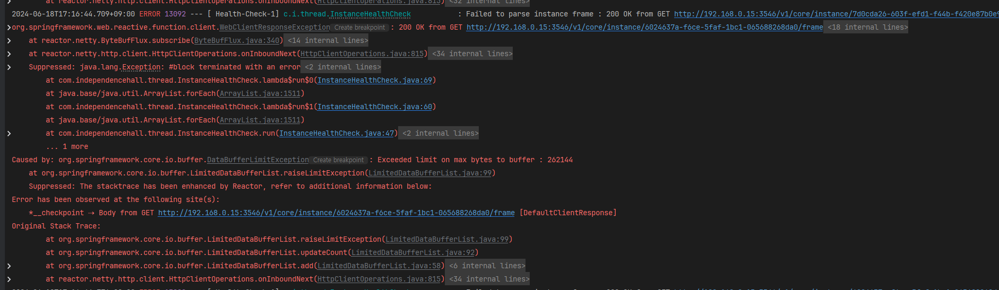
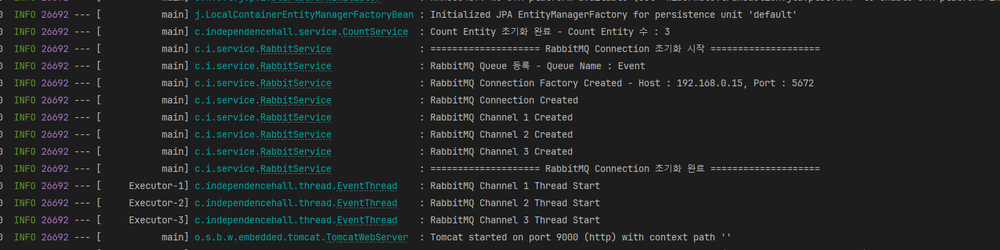

## DataBufferLimitException - Webflux 버퍼 크기 제한 초과

WebClient로 Data를 받는 작업 중, WebClient에서 허용하는 Buffer를 초과한 데이터가 들어왔을떄 발생한 에러 해결 기록입니다.

아래 API 요청 코드에서 return되는 데이터 중 1개 필드의 값이 Encoding된 Streaming Frame 데이터를 받도록 되어 있었습니다.

```java
public Mono<String> getRtspStreamFrame(final String uri) {  
    return webClient.get().uri(uri).retrieve().bodyToMono(String.class);  
}
```

<br>

서버를 실행 시킨 후, 해당 API 요청을 해보니 아래와 같은 에러가 발생했습니다.

`DataBufferLimitException` **에러는 Spring WebFlux에서 데이터를 버퍼링하는 동안 설정된 크기 제한을 초과했을 때 발생합니다.**

Spring WebClient의 기본 Buffer Size는 명시적으로 설정하지 않으면 제한이 없으나,

Reactor Netty의 기본 Buffer size는 `HttpClient`의 `maxInMemorySize` 설정에 의존하고 이 기본 사이즈는 256KB입니다.



<br>

### Buffer Size 명시적 지정 (Optinal)

결론만 말하면 Buffer Size를 늘리지 않고 해결을 하였지만 혹시나 필요할떄 찾아보기 위해 Buffer Size를 명시적으로 늘리는 방법을 작성합니다.

아래 코드는 WebClient Bean에 Custom ExchangeStrategies를 설정해 버퍼 사이즈를 16MB로 늘려줍니다.

```java
@Bean  
public WebClient webClient() {  
    int maxInMemorySize = 16 * 1024 * 1024; // 16MB  
  
    HttpClient httpClient = HttpClient.create()  
            .option(ChannelOption.CONNECT_TIMEOUT_MILLIS, 5000)  
            .responseTimeout(Duration.ofMillis(5000))  
            .doOnConnected(i ->  
                    i.addHandlerLast(new ReadTimeoutHandler(5000, TimeUnit.MILLISECONDS))  
                    .addHandlerLast(new WriteTimeoutHandler(5000, TimeUnit.MILLISECONDS)));  
  
    return WebClient.builder()
		    // 이부분
            .exchangeStrategies(ExchangeStrategies.builder()  
                    .codecs(configurer -> configurer.defaultCodecs().maxInMemorySize(maxInMemorySize))  
                    .build())  
            .clientConnector(new ReactorClientHttpConnector(HttpClient.create().responseTimeout(Duration.ofMinutes(1))))  
            .clientConnector(new ReactorClientHttpConnector(httpClient))  
            .build();  
}
```

<br>

### Streaming 방식으로 API 응답 처리

BufferSize를 늘리지 않고 Streaming 방식으로 API의 응답을 받는 방식이고,

전체 응답을 받지 않고 중간에 잘라 메모리 부하를 줄여주는 방식을 선택하였습니다.

- 기존 Mono로 받던 데이터를 `bodyToFlux(DataBuffer.class)`를 이용해 `Flux<DataBuffer>` 타입의 데이터 조각으로 수신합니다.
- 각 DataBuffer를 문자열로 변환해 DataBufferUtils 클래스의 `release`를 사용해 Buffer를 해제합니다.
- `recude((acc, current) -> acc + current)` 를 이용해 각 코드 조각을 하나의 문자열로 합칩니다.

`reduce((acc, current) -> acc + current)`는 `Flux`의 모든 조각을 하나의 `String`으로 합칩니다. `acc`는 누적된 문자열이고, `current`는 현재 조각입니다.

<br>

**제가 사용하는 API의 응답 형식입니다.**

```json
{
	"frame": "",
	"running": true
}
```

이 API의 경우 frame의 값이 매우 크게 들어오는 API이고, 특정 Health Check를 위해 호출하던 API 입니다.

Health Check를 위해 frame의 값이 ""(빈문자열)이 아닌지만 확인하면 되기 때문에 10글자를 제외한,

이후의 frame 필드의 값은 버려줄거기 때문에 processFrameField 함수를 추가로 작성해 frame값을 잘라준 Json 형식을 return 해줍니다.

```java
public Mono<String> getRtspStreamFrame(final String uri) {  
    return webClient.get().uri(uri).retrieve().bodyToFlux(DataBuffer.class)  
            // 각 DataBuffer를 문자열로 변환  
            .map(dataBuffer -> {  
                byte[] bytes = new byte[dataBuffer.readableByteCount()];  
                dataBuffer.read(bytes);  
                DataBufferUtils.release(dataBuffer); // DataBuffer 해제  
                return new String(bytes, StandardCharsets.UTF_8);  
            })  
            // 모든 조각을 하나의 문자열로 결합  
            .reduce((acc, current) -> acc + current)  
            // 결합된 응답 처리  
            .mapNotNull(response -> {  
                try {  
                    return processFrameField(response);  
                } catch (IOException e) {  
                    log.error("Instance Frame Request 실패 - {}", e.getMessage());  
                    return null;  
                }  
            });  
}  
  
private String processFrameField(String response) throws IOException {  
    JsonFactory factory = mapper.getFactory();  
    JsonParser parser = factory.createParser(response);  
    StringWriter writer = new StringWriter();  
    writer.write("{");  
  
    boolean firstField = true; // 첫 번째 필드인지 확인하는 플래그  
  
    /**  
     * JSON Streaming 파싱 시작  
     * { "frame": "", "running": true } 의 응답을 받는 API임  
     */  
    while (!parser.isClosed()) {  
        JsonToken token = parser.nextToken();  
        if (token == null) break;  
  
        if (token == JsonToken.FIELD_NAME) {  
            // 필드 이름을 얻음  
            if (!firstField) writer.write(","); // 첫 번째 필드가 아니면 콤마 추가  
            else firstField = false; // 첫 번째 필드 플래그 설정 해제  
  
            String fieldName = parser.getCurrentName();  
            writer.write("\"" + fieldName + "\":");  
            parser.nextToken();  
  
            // frame 필드의 값에 많은 데이터가 들어오니 10글자로 제한  
            if ("frame".equals(fieldName)) {  
                String frameValue = parser.getText();  
                if (frameValue.length() > 10) {  
                    frameValue = frameValue.substring(0, 10);  
                }  
                writer.write("\"" + frameValue + "\"");  
            } else {  
                writer.write(mapper.writeValueAsString(parser.readValueAsTree())); // 다른 필드는 그대로 유지  
            }  
        }  
    }  
    writer.write("}");  
    parser.close();  
      
    return writer.toString();  
}
```

<br>

WebClient 로직를 수정한 후 서버를 실행시켜 원래 돌리던 AI 모델의 RTSP Stream이 정상적으로 Streaming을 유지하는지,

지속적으로 RTSP Stream의 Frame을 헬스체크하고, 파싱하던 중 DTO에 나던 에러가 안나고 잘 파싱해서

frame 값이 빈 문자열인지 지속적으로 확인이 가능해졌습니다.

