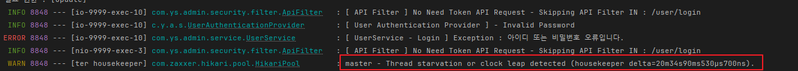

## 📚 HikariCP - Thread Starvation & Clock Leap

Spring Boot 서버에서 가끔 보이던 특정 문구가 있었는데, 일이 바빠서 무시하다가 이번에 여유가 좀 생겨서 알아보았습니다.

이 경고 문구는 **스레드가 기아상태**가 되거나 **시스템 시간이 실제 시간과 비동기화 되는 현상인 Clock Leap**가 일어났을떄 발생합니다.

어쩌다 1번씩 가끔 뜨고 가끔 API 호출도 안되는 현상이 있어 바로 알아보았습니다.

```
master - Thread starvation or clock leap detected (housekeeper delta=20m34s90ms530µs700ns).
```



<br>

정확한 원인은 아직도 잘 모르지만 검색 결과 유추할 수 있는 원인은 아래와 같습니다.

- House Keeping Thread 중지로 인한 Clock Leap Detection (시간대가 갑자기 큰폭으로 변경, House Keeping Thread 중지 => 확인 결과 아님)
- 노트북 화면 잠금으로 인한 Clock Leap 발생 **(제일 유력한 원인)**
- Hikari CP Thread Pool 개수 부족 (가능성 없음)
- 서버 리소스 부족 (CPU 50% / Memory 40% => 가능성 없음)

---
## 📚 House Keeping Thread 중지로 인한 Clock Leap Detection

검색해본 결과 많은 답변에서 말하길 이 현상이 발생하기 위한 조건 중 하나는 과도하게 많은 Garbage를 수집할 때 발생합니다.

<br>

Garbage가 많으면 시스템 리소스를 많이 소모하고 GC가 실행될 떄 모든 스레드의 실행이 일시적으로 중단되며,

이떄 시스템의 정리 작업을 하는 House Keeping Thread가 멈춰 Clock Leap가 발생한다고 합니다.

<br>

즉 Spring Boot에서 House Keeping Thread를 실행했을 떄 Garbage Collection이 더 오래 실행 되면서 메모리를 확보하려고 했고,

GC가 하우스키핑 스레드를 포함한 모든 응용 프로그램 스레드를 차단하고 있기 때문에, Clock Leap가 발생한다고 합니다.

<br>

우선 어플리케이션 규모가 크지도 않고, 코드 내 불필요한 Garbage도 많지 않아 용의선상에서 제외합니다.

하나 이상한 점은 하우스키핑 델타값이 20분이나 차이나는거 보면 Garbage 문제는 확실히 아닌것 같습니다.

---
## 📚 노트북 화면 잠금으로 인한 Clock Leap Detection

**(거의 이거 떄문에 발생하는 거라고 추정)**

글 처음에 1번씩 뜰떄 있고, 많이 뜰떄가 있다고 했는데 아마 제 생각에 **1번씩 뜰떄가 이 경우**인것 같습니다.

보통 PC는 CPU가 비활성 상태일 때 전력 소비를 줄이기 위한 기술인 C-States는 시스템 클럭을 조정하여 Clock Leap를 발생시킬 수 있습니다.

또한 화면 잠금 시 하드디스크가 비활성 상태로 전환되면서 데이터의 I/O가 작업이 지연될 수 있으며 이 또한 Clock Leap를 발생시킬 수 있습니다.

아마 이번에 노트북 로컬에서 Spring Boot를 돌리면서 화면 잠금을 해놓고 다른 서버에서 API 호출을 자꾸 해서 그런것 같습니다. 

---
## 📚 HikariCP Thread Pool 개수 & 서버 리소스 부족

로컬에서 혼자 개발하고 그렇게 큰 규모도 아니며 규모에 비해 Thread Pool도 넉넉하게 15개로 잡았으므로 스레드 풀 문제는 아닐것 같습니다.

그리고 Linux 서버의 CPU도 Max 50% 이상 넘어가지 않고 Memory도 충분하기 떄문에 이 문제도 아닌것 같았습니다.

정확한건 Heap 메모리 Dump와 Thread 관련 Dump를 비교하며 Memory Leak이 발생하는지 등등 확인을 해봐야 알겠지만,

OutOfMemory가 뜬게 아니니까 넘어갑니다.

```yaml
  # MariaDB  
  datasource:  
    hikari:  
      connection-test-query: SELECT 1  
      pool-name: master  
      maximum-pool-size: 15 
      minimum-idle: 5  
#      jdbc-url: jdbc:mariadb://192.168.0.5:5001/ys # 협업용 DB#      
      jdbc-url: jdbc:mariadb://192.168.0.5:5001/test # 로컬 개발용  
      username: skw  
      password: 1234  
      driver-class-name: org.mariadb.jdbc.Driver  
      connection-timeout: 5000  
      idle-timeout: 10000
```