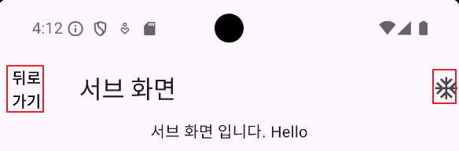
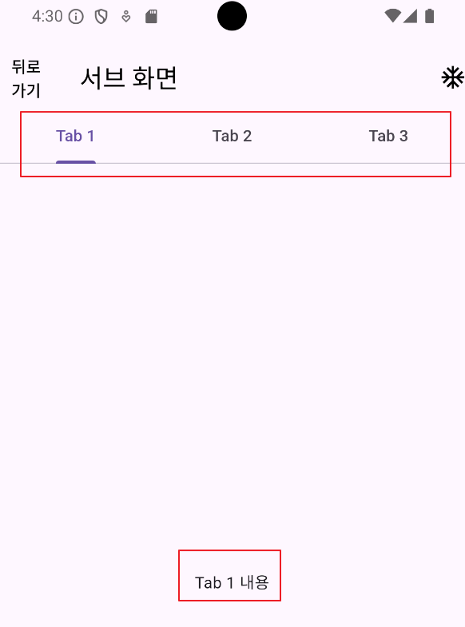
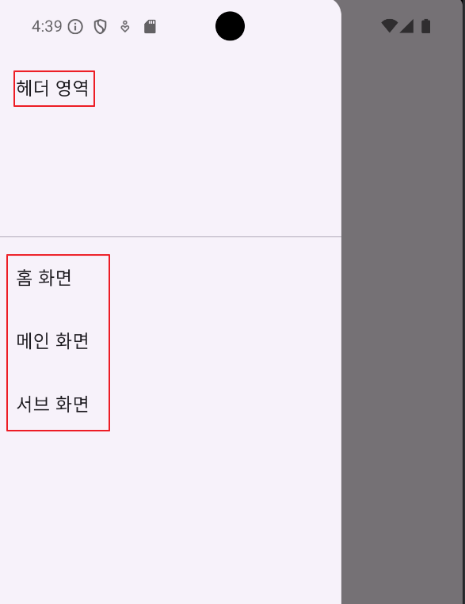

## 📚 Navigation Bar

사실 지금까지 세부 기능을 안썼을뿐 Widget에 사용한 Appbar 자체도 Navigation Bar에 속합니다.

title만 사용 해서 `메인 화면`이나 `서브 화면` 정도의 title만 사용했었습니다.

아래 사진에서 큰 박스가 Appbar 부분이고 title인 메인 화면 문구와 기본적인 뒤로 가기 버튼 외에 아무것도 없으며,

debug 표시도 거슬리니 제거해 보겠습니다.


<br>

우선 Debug 모드 해제는 Main App에서 MaterialApp의 child로 `debugShowCheckedModeBanner: false,`를 주면 Debug 표시가 사라집니다.

다시 Sub Screen으로 돌아와서, 메인 화면이라는 곳이 존재하는 AppBar를 보겠습니다.

AppBar의 좌측은 `leading`, 우측은 `actions`라는 값으로 지정 가능합니다.

저는 여기서 AppBar를 만들면 기본으로 생성되는 좌측의 화살표 표시를 뒤로 가기 버튼으로 만들고 우측에 아이콘을 하나 넣어보겠습니다.

기본 화살표는 `automaticallyImplyLeading: false` 옵션으로 없애 주었습니다.

```dart
class SubScreen extends StatelessWidget {
  String msg;

  SubScreen({super.key, required this.msg});

  @override
  Widget build(BuildContext context) {
    return Scaffold(
      appBar: AppBar(
        automaticallyImplyLeading: false,
        title: Text('서브 화면'),
        leading: TextButton(
            onPressed: () {
              Navigator.pop(context);
            },
            child: Text(
              '뒤로 가기',
              style: TextStyle(color: Colors.black),
            )),
        actions: [
          Icon(Icons.ac_unit_outlined),
        ],
      ),
      body: Column(
        children: [
          Center(
            child: Text('서브 화면 입니다. $msg'),
          ),
        ],
      ),
    );
  }
}
```



<br>

이 외에도 `backgroundColor`등 많은 옵션이 있어서 자유롭게 쓰면 됩니다.

```dart
class SubScreen extends StatelessWidget {
  String msg;

  SubScreen({super.key, required this.msg});

  @override
  Widget build(BuildContext context) {
    return Scaffold(
      appBar: AppBar(
        automaticallyImplyLeading: false,
        backgroundColor: Colors.black,
        title: Text('서브 화면', style: TextStyle(color: Colors.white),),
        leading: TextButton(
            onPressed: () {
              Navigator.pop(context);
            },
            child: Text(
              '뒤로 가기',
              style: TextStyle(color: Colors.white),
            )),
        actions: [
          Icon(Icons.ac_unit_outlined, color: Colors.white,),
        ],
      ),
      body: Column(
        children: [
          Center(
            child: Text('서브 화면 입니다. $msg'),
          ),
        ],
      ),
    );
  }
}
```


---

## 📚 Tab Bar

Tab bar의 내용(Contents)를 먼저 만듭니다.

- 기존 페이지에 해당하는 `Scaffold` 자체를 `DefaultTabController`의 child로 감싸준다.
- 페이지에 해당하는 위젯인 Scaffold의 body에 `TabBarView`를 지정해, 각 탭의 내용을 만듭니다.
- TabBarView의 children에 해당하는 각 Center는 각 탭의 내용이 됩니다.

```dart
    return DefaultTabController(
      length: 3,
      child: Scaffold(
        appBar: AppBar(), // AppBar 내용 생략

        // Tab Bar View
        body: TabBarView(
          children: [
            Center(
              child: Text('Tab 1 내용'),
            ),
            Center(
              child: Text('Tab 2 내용'),
            ),
            Center(
              child: Text('Tab 3 내용'),
            ),
          ],
        ),
      ),
    );
```

<br>

탭의 내용만 있고 탭은 안만들었으니, 이제 Scaffold의 bdy가 아닌 다시 AppBar 부분으로 돌아와서 `bottom`을 추가해서 탭을 만들어 줍니다.

탭의 이름은 간단하게 Tab 1,2,3으로 지정하겠습니다.

```dart
        appBar: AppBar(
          automaticallyImplyLeading: false,
          title: Text(
            '서브 화면',
            style: TextStyle(color: Colors.black),
          ),
          leading: TextButton(
              onPressed: () {
                Navigator.pop(context);
              },
              child: Text(
                '뒤로 가기',
                style: TextStyle(color: Colors.black),
              )),
          actions: [
            Icon(
              Icons.ac_unit_outlined,
              color: Colors.black,
            ),
          ],
          
          // 이부분
          bottom: TabBar(
            tabs: [
              Tab(
                text: 'Tab 1',
              ),
              Tab(
                text: 'Tab 2',
              ),
              Tab(
                text: 'Tab 3',
              ),
            ],
          ),
        ),
```



---

## 📚 Drawer

Drawer는 어플리케이션에서 흔히 볼 수 있는 `메뉴` 버튼과 같습니다.

이번에 Drawer는 Main 화면에 만들어 보겠습니다. TapBar와 같이 화면에 해당하는 위젯은 Scaffold의 필드로 `drawer`를 선언하고 보통 child로 `ListView`를 자주 사용합니다.

그리고 메뉴의 상단 제목 부분에 위치할 위젯은 `DrawerHeader` 부분에 작성해주고, 나머지는 `ListTile`을 이용해 홈, 메인, 서브 화면을 지정해줍니다.

`ListTile`의 `onTap` 부분에는 해당 탭을 클릭했을떄 Navigation 해서 이동하는 로직이라던지 원하는 로직을 넣으면 됩니다.

```dart
class _MainScreenState extends State<MainScreen> {
  @override
  Widget build(BuildContext context) {
    return Scaffold(
      appBar: AppBar(
        title: Text('메인화면'),
      ),
      body: Column(
        children: [
          TextButton(
            onPressed: () {
              // Text Button을 만들면 기본적으로 파란색 링크처럼 표시 됨
              // 버튼 클릭 시 /sub 화면을 생성하면서 이동
              Navigator.pushNamed(context, '/sub', arguments: 'Hello');

              // 현재 내 화면과 교체하면서 이동
              // Navigator.pushReplacementNamed(context, '/sub');
            },
            child: Text('서브 화면으로 이동'),
          ),
        ],
      ),
        drawer: Drawer(
          child: ListView(
            children: [
              DrawerHeader(
                child: Text('헤더 영역'),
              ),
              ListTile(
                title: Text('홈 화면'),
                onTap: () {},
              ),
              ListTile(
                title: Text('메인 화면'),
                onTap: () {},
              ),
              ListTile(
                title: Text('서브 화면'),
                onTap: () {},
              ),
            ],
          ),
        )
    );
  }
}
```


<br>

