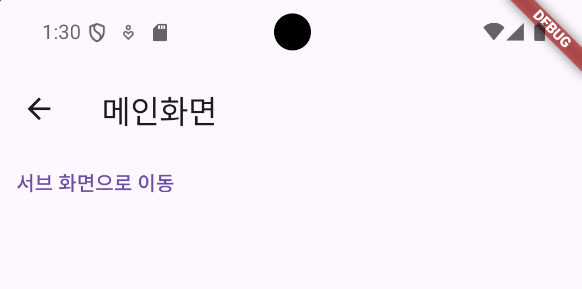
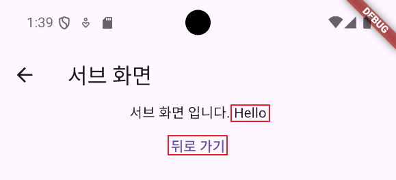

## 📚 Navigator

Flutter에서 Navigator는 위젯 트리에서의 페이지 이동(혹은 경로)을 관리하는 역할을 합니다. 

이를 통해 새로운 화면을 표시하거나, 이전 화면으로 돌아가는 등의 작업을 수행할 수 있습니다. 

Navigator는 여러 개의 경로(Route)를 스택(stack) 형태로 관리하며, 스택의 맨 위에 있는 경로가 현재 화면으로 표시됩니다.

Navigator의 주요 메서드 중 pushNamed와 pushReplacementNamed에 대해 설명하겠습니다.

---

## 📚 pushNamed

pushNamed 메서드는 명명된 경로(named route)를 스택에 추가하여, 해당 경로를 화면에 표시합니다. 

이는 새로운 화면을 추가하고, 사용자가 다시 뒤로 이동할 수 있도록 이전 화면을 스택에 유지합니다.

<br>

**사용 시점**

- 사용자가 새로운 화면으로 이동할 때
- 이전 화면으로 돌아가기를 원할 때

```dart
Navigator.pushNamed(context, '/sub');
```

---

## 📚 pushReplacementNamed

pushReplacementNamed 메서드는 현재의 경로를 제거하고, 새로운 명명된 경로를 스택에 추가합니다. 

이 메서드는 새로운 화면으로 이동할 때 이전 화면을 스택에서 제거하여, 다시 뒤로 가기 버튼을 눌렀을 때 더 이상 해당 화면으로 돌아갈 수 없도록 합니다.

<br>

**사용 시점**

- 사용자가 로그인 후 홈 화면으로 이동하거나, 특정 작업 완료 후 새로운 화면으로 전환하여 이전 화면으로 돌아가지 않기를 원할 때

```dart
Navigator.pushReplacementNamed(context, '/sub');
```

---

## 📚 Push Named & Push Replacement Named 구현

아래 앱의 구조는 Splash Screen(시작화면)이 뜨고 10초후 메인 화면이 뜨는데 여기서 서브 스크린으로 이동할 수 있는 구조입니다.

아래 코드에서 만약 `pushNamed`를 사용한다면 Main -> Sub로 갔다가 뒤로가기를 했을떄 Main으로 다시 돌아오게 됩니다.

<br>

만약 `pushReplacementNamed`를 사용했다면 Main -> Sub로 넘어 간 순간 Main은 사라지고 뒤로가기를 하면 시작 화면인 Splash Screen으로 돌아가게 됩니다.

**main_screen.dart**

```dart
class _MainScreenState extends State<MainScreen> {

  @override
  Widget build(BuildContext context) {
    return Scaffold(
      appBar: AppBar(
        title: Text('메인화면'),
      ),
      body: Column(
        children: [
          TextButton(onPressed:() { // Text Button을 만들면 기본적으로 파란색 링크처럼 표시 됨
            // 버튼 클릭 시 /sub 화면을 생성하면서 이동
            Navigator.pushNamed(context, '/sub');

            // 현재 내 화면과 교체하면서 이동
            // Navigator.pushReplacementNamed(context, '/sub');

          }, child: Text('서브 화면으로 이동'))
        ],
      ),
    );
  }
}
```

---

## 📚 Arguments - Object 전달

React의 Props와 비슷한 개념으로 React에서 다른 컴포넌트에 오브젝트를 전달할 떄 사용합니다.

Flutter에서는 pushNamed의 3번쨰 파라미터인 argumemts를 사용해 다른 화면으로 데이터를 보냅니다.

예시로 `Hello` 라는 글자를 보낼겁니다.

```dart
Navigator.pushNamed(context, '/sub', arguments: 'hello');
```

<br><br>

3번쨰 파라미터를 설정한 후, 화면 라우팅을 설정한 곳(main.dart)에 `routes`에 라우팅 해놨던 `/sub`를 지우고,`onGenerateRoute`를 사용해 줍니다.

`onGenerateRoute`는 Lifecycle Hook 느낌으로 라우팅이 처음 시작 됐을때 실행됩니다.

`settings`에는 라우팅 될 화면의 이름인 `name`과 넘어오는 파라미터인 Object 타입의 `arguments`를 받을 수 있습니다.

`arguments`를 넘어오는 데이터 타입에 맞게 String으로 타입 캐스팅을 해줍니다.

**main.dart**

```dart
      routes: {
        '/': (context) => SplashScreen(),
        '/main': (context) => MainScreen(),
      },
      onGenerateRoute: (settings) {
        if (settings.name == '/sub') {
          // Navigator에서 넘겨준 'hello' 값을 타입 캐스팅해서 받음
          String msg = settings.arguments as String;

          return MaterialPageRoute(
            builder: (context) {
              return SubScreen(
                msg: msg,
              );
            },
          );
        }
      },
```

<br><br>

그리고, SubScreen 자체에서 데이터를 받을 수 있도록 전역 변수와 생성자를 수정해 줍니다.

생성자에 `required`를 사용해 필수 값으로 설정하고 msg 변수를 다른 화면으로부터 받을때 Column 위젯의 children인 Center의 Text에 넣었습니다.

**sub_screen.dart**

```dart
class SubScreen extends StatelessWidget {
  String msg;

  SubScreen({super.key, required this.msg});

  @override
  Widget build(BuildContext context) {
    return Scaffold(
      appBar: AppBar(
        title: Text('서브 화면'),
      ),
      body: Column(
        children: [
          Center(
            child: Text('서브 화면 입니다. $msg'),
          ),
          TextButton(onPressed: () {
            Navigator.pop(context); // 현재 화면 제거
          }, child: Text('뒤로 가기'))
        ],
      ),
    );
  }
}
```

<br><br>

이제 앱을 실행시켜 보면 메인 화면에서 서브 화면으로 이동하는 버튼이 있습니다.

이 버튼을 누르는 순간 서브 화면에 `Hello` 라는글자가 전달이 되어야 합니다.



<br><br>

서브 화면으로 이동했을 때 `Hello` 라는 글자가 제대로 전달됐고, 뒤로 가기를 눌렀을때 `Navigator.pop`을 줬기 떄문에, 현재 화면이 사라지게 됩니다.



