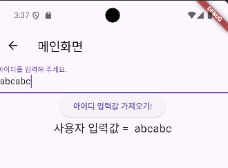

## 📚 Set State

이 기능을 보면 React의 LifeCycle Hook과 비슷한 개념 같아 보입니다.

setState는 Flutter 프레임워크에서 상태(state)를 업데이트하고, 해당 상태가 변경되었음을 Flutter에게 알려 UI를 다시 그립니다. 

setState 메소드를 호출하면, Flutter는 그에 따라 상태를 변경하고, 해당 상태를 참조하는 위젯을 다시 빌드합니다.

<br>

아래 코드에서는 사용자의 입력값을 받으면 `stateMessage` 변수를 업데이트하고 UI를 다시 그리도록 했습니다.

<br>

### 성능 차이

**setState 내부에 코드를 넣는 경우**

- 상태 변경과 UI 업데이트가 함께 이루어져 코드가 간결하고 명확합니다. 
- 성능 상 이점이 크지는 않지만, 코드의 가독성과 유지보수성이 높아집니다.

<br>

**setState 외부에 코드를 넣는 경우**

- 코드가 분리되어 상태 변경과 UI 업데이트를 따로 처리해야 합니다. 
- 이는 코드의 복잡성을 증가시키고, 실수로 상태 변경 후 setState 호출을 잊어버리는 등의 문제가 발생할 수 있습니다. 
- 성능 차이는 거의 없지만, 코드의 안정성과 일관성이 떨어질 수 있습니다.

```dart
class _SetStateState extends State<SetState> {
  // 사용자의 입력을 컨트롤러가 받음
  TextEditingController idController = TextEditingController();
  String stateMessage = '이 곳에 값이 업데이트 됩니다.';

  @override
  Widget build(BuildContext context) {
    return Scaffold(
      appBar: AppBar(
        title: Text('메인화면'),
      ),
      body: Column(
        children: [
          TextField(
            controller: idController,
            decoration: InputDecoration(labelText: '아이디를 입력해 주세요.'),
          ),
          // 버튼을 이용해 사용자의 입력값을 컨트롤러에서 가져와 Console에 찍기
          ElevatedButton(
            onPressed: () {
              // State가 변경되면 stateMessage 변수에 사용자의 입력값을 넣음
              setState(() {
                stateMessage = idController.text.toString();
              });
            },
            child: Text('아이디 입력값 가져오기!'),
          ),
          Text(
            '사용자 입력값 = $stateMessage',
            style: TextStyle(fontSize: 20),
          ),
        ],
      ),
    );
  }
}
```

<br>

