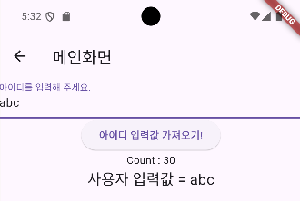

## 📚 Value Notifier

ValueNotifier는 Flutter에서 값을 관찰하고, 값이 변경될 때 리스너들에게 알리는 데 사용되는 클래스입니다. 

간단한 상태 관리에 유용하며, setState를 사용하는 것보다 더 명확하고 간결하게 상태 변화를 관리할 수 있습니다.

ValueListenableBuilder는 ValueNotifier와 함께 사용되어, ValueNotifier의 값이 변경될 때마다 UI를 업데이트하는 데 사용됩니다. 

setState와 달리 더 구체적으로 특정 값의 변경에만 반응할 수 있습니다.

```dart
class _ValueCounterState extends State<ValueCounter> {
  // 사용자의 입력을 컨트롤러가 받음
  TextEditingController idController = TextEditingController();
  String stateMessage = '이 곳에 값이 업데이트 됩니다.';
  ValueNotifier<int> counter = ValueNotifier<int>(0); // 0으로 초기화

  @override
  Widget build(BuildContext context) {
    return Scaffold(
      appBar: AppBar(
        title: Text('메인화면'),
      ),
      body: Column(
        children: [
          TextField(
            controller: idController,
            decoration: InputDecoration(labelText: '아이디를 입력해 주세요.'),
          ),
          // 버튼을 이용해 사용자의 입력값을 컨트롤러에서 가져와 Console에 찍기
          ElevatedButton(
            onPressed: () {
              // State가 변경되면 stateMessage 변수에 사용자의 입력값을 넣음
              setState(() {
                stateMessage = idController.text.toString();
              });

              counter.value = 30;
            },
            child: Text('아이디 입력값 가져오기!'),
          ),

          // 값을 지속적으로 Listen
          ValueListenableBuilder<int>(
            valueListenable: counter,
            builder: (context, value, child) {
              return Text('Count : $value');
            },
          ),
          Text(
            '사용자 입력값 = $stateMessage',
            style: TextStyle(fontSize: 20),
          ),
        ],
      ),
    );
  }
}
```

