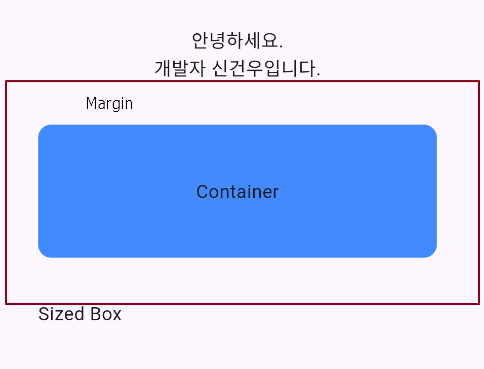

## 📚 Container & SizedBox Widget

HTML의 `<div>`나 React BootStrap의 `Container`와 매우 유사한 개념입니다.

Container는 다용도로 사용할 수 있는 위젯으로, 

내부에 다른 위젯을 배치하고, 배경색, 크기, 여백(margin), 패딩(padding), 테두리(border), 모서리 반경(border radius) 등을 지정할 수 있습니다.

```dart
class _MainScreenState extends State<MainScreen> {
  @override
  Widget build(BuildContext context) {
    return Scaffold(
      appBar: AppBar(
        title: Text('메인화면'),
      ),
      body: Center(
        // child: Text('메인 화면 입니다.'),
        child: Column(
          mainAxisAlignment: MainAxisAlignment.center,
          children: [
            Text('안녕하세요.'),
            Text('개발자 신건우입니다.'),
            Container(
              width: 300,
              height: 100,
              margin: EdgeInsets.all(32), // margin 32 전체 margin에 적용
              // margin: EdgeInsets.only(left: 10,right: 0, top: 0, bottom: 0) // 원하는 margin 방향만 지정 가능
              alignment: Alignment.center, // Text 중앙으로
              decoration: BoxDecoration(borderRadius: BorderRadius.circular(10), color: Colors.blueAccent,),
              child: Text('Container'),
            ),
            SizedBox(
              width: 300,
              height: 100,
              child: Text('Sized Box'),
            )
          ],
        ),
      ),
    );
  }
}
```

<br>

위 코드에서 `Container`에 대한 설명입니다.

- `width`: 300, height: 100: Container의 너비를 300, 높이를 100으로 설정합니다.
- `margin`: EdgeInsets.all(32): Container의 외부 여백을 모든 방향으로 32픽셀 설정합니다.
- `EdgeInsets.only(left: 10, right: 0, top: 0, bottom: 0)`와 같은 방법으로 특정 방향에만 여백을 줄 수도 있습니다.
- `alignment`: Alignment.center: Container 안의 자식 위젯을 중앙에 배치합니다.
- `decoration`: BoxDecoration을 사용하여 Container의 배경색과 모서리 반경을 설정합니다.
- `borderRadius`: BorderRadius.circular(10): 모서리를 10픽셀 반경으로 둥글게 만듭니다.
- `color`: Colors.blueAccent: Container의 배경색을 파란색으로 설정합니다.
- `child`: Container 내부에 배치할 자식 위젯을 설정합니다. 여기서는 Text('Container')가 자식으로 설정되어 있습니다.

<br>

위 코드에서 `Sized Box`에 대한 설명입니다.

SizedBox는 자식 위젯의 크기를 강제로 지정할 수 있으며, 자식 위젯이 없을 경우 특정 크기의 빈 공간을 만드는 데 사용될 수 있습니다. 이 예제에서는 Text 위젯이 지정된 크기에 맞춰 배치됩니다.

- SizedBox는 특정 크기의 박스를 만들기 위해 사용되는 위젯입니다.
- 주로 빈 공간을 만들거나, 자식 위젯의 크기를 지정할 때 사용됩니다.
- `width`: 300, height: 100: SizedBox의 너비를 300, 높이를 100으로 설정합니다.
- `child`: SizedBox 내부에 배치할 자식 위젯을 설정합니다.

<br>

