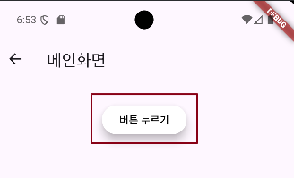
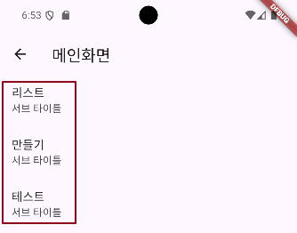

## 📚 Elevated Button Widget

ElevatedButton은 Flutter에서 사용하는 버튼 위젯 중 하나로, 일반적으로 사용자 인터페이스에서 클릭 가능한 요소를 제공할 때 사용됩니다. 

기본적으로, 버튼은 그림자가 있어 사용자에게 누를 수 있는 버튼임을 시각적으로 알려줍니다.

- onPressed: 버튼이 눌렸을 때 실행될 콜백 함수를 지정합니다. 콜백 함수가 null이면 버튼은 비활성화됩니다.
- style: ElevatedButton.styleFrom 메서드를 사용하여 버튼의 스타일을 커스터마이즈할 수 있습니다. 여기에는 배경색, 글자색, 그림자, 패딩, 모서리 둥글기 등이 포함됩니다.
- child: 버튼 안에 표시될 위젯을 지정합니다. 일반적으로 Text나 Icon 위젯을 사용합니다.

```dart
class _ElevatedButtonWidgetState extends State<ElevatedButtonWidget> {
  @override
  Widget build(BuildContext context) {
    return Scaffold(
        appBar: AppBar(
          title: Text('메인화면'),
        ),
        body: Container( // 버튼의 크기를 늘리기 위한 컨테이너
          alignment: Alignment.center,
          // width: 200,
          // height: 100,
          margin: EdgeInsets.all(32),

          child: Column(
            children: [
              ElevatedButton(
                  onPressed: () {
                    print('버튼이 클리 되었습니다.');
                  },
                  style: ElevatedButton.styleFrom( // 버튼 스타일
                      backgroundColor: Colors.white, // 배경색
                      foregroundColor: Colors.black, // 글자색
                      elevation: 10 // 그림자
                  ),
                  child: Text('버튼 누르기'))
            ],
          ),
        ));
  }
}
```



---

## 📚 List View Widget

ListView는 스크롤 가능한 목록을 표시하는 위젯으로, 많은 데이터 항목을 효율적으로 보여줄 때 사용됩니다. 

ListView는 기본적으로 수직 스크롤 목록을 지원하지만, 수평 스크롤 목록도 만들 수 있습니다.

- children: 리스트에 포함될 위젯들의 목록을 직접 지정할 수 있습니다. 모든 위젯을 미리 생성하여 리스트에 포함시키는 방식입니다.
- builder: ListView.builder는 대량의 데이터 항목을 효율적으로 관리할 수 있도록 항목이 스크롤 될 때마다 동적으로 생성 및 폐기합니다.
- separatorBuilder: ListView.separated는 항목들 사이에 구분자를 추가할 수 있는 빌더입니다.
- scrollDirection: 목록이 수직 또는 수평으로 스크롤될지 지정합니다.
- shrinkWrap: 리스트의 크기를 자식 위젯에 맞출지 여부를 지정합니다.
- padding: 리스트의 내부 패딩을 지정합니다.

```dart
class _ListViewWidgetState extends State<ListViewWidget> {
  List list = ['리스트', '만들기', '테스트'];

  @override
  Widget build(BuildContext context) {
    return Scaffold(
        appBar: AppBar(
          title: Text('메인화면'),
        ),
        body: ListView.builder(
          itemBuilder: (context, index) {
            return ListTile(
              title: Text('${list[index]}'),
              subtitle: Text('서브 타이틀'),
            );
          },
          itemCount: list.length,
        ));
  }
}
```

