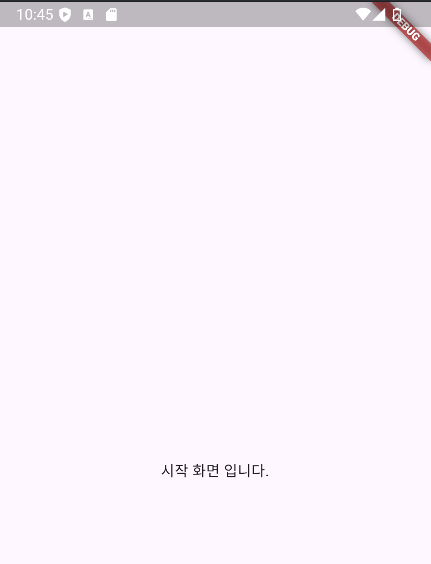
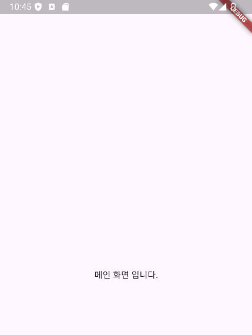

## 📚 Route

MaterialApp 위젯은 어플리케이션 전체 앱으로 보면되고, Scaffold는 각 화면(페이지)단으로 볼 수 있다고 배웠었습니다.

이번엔 각 화면 관리를 용이하게 해주는 route에 대해 학습합니다.

아래 코드는 Flutter 프로젝트를 처음 만들때 기본으로 생성되는 MyApp입니다.

`theme` 부분도 기본적으로 설정된 테마가 있습니다.

```dart
class MyApp extends StatelessWidget {
  const MyApp({super.key});

  @override
  Widget build(BuildContext context) {
    return MaterialApp(
      title: 'Flutter Demo',
      theme: ThemeData(
        colorScheme: ColorScheme.fromSeed(seedColor: Colors.deepPurple),
        useMaterial3: true,
      ),
      home: const MainScreen(),
    );
  }
}
```

---

## 📚 Route 적용

위 앱에서 기본 테마를 지우고, MeterialApp 위젯의 파라미터로 `initialRoute`와 `routes`를 할당해줍니다.

아직 Splash Screen과 MainScreen 위젯을 만들지 않은 상태이고, 메인 화면에 Splash Screen, 다른 화면은 Main Screen 위젯을 설정합니다.

처음 Widget을 학습할 떄 `main.dart` 파일 내부에 Widget 클래스들을 생성했지만 이제 screen 디렉토리를 새로 만들어 줄겁니다.

- **initialRoute** : 앱이 시작될 때 루트 경로에 해당하는 화면을 보여주도록 설정
- **routes** : 어플리케이션 내의 경로와 Widget을 매핑되며, 기본적으로 Map 타입의 `경로, 보여줄 위젯` 형식의 위젯 생성 함수를 설정합니다.


```dart
class MyApp extends StatelessWidget {
  const MyApp({super.key});

  @override
  Widget build(BuildContext context) {
    return MaterialApp(
      title: 'Flutter Demo',
      initialRoute: '/',
      routes: {
        '/': (context) => SplashScreen(),
        'main': (context) => MainScreen(),
      },
      // theme: ThemeData(
      //   colorScheme: ColorScheme.fromSeed(seedColor: Colors.deepPurple),
      //   useMaterial3: true,
      // ),
    );
  }
}
```

<br>

이제 Splash Screen과 Main Screen을 만들어 봅시다.

이번에 만들것은 시작화면인 Splash Screen이 뜨고 10초후 Main Screen으로 넘어가게 만들어 보겠습니다.

_(Splash Screen이라는 용어는 보통 App 개발 생태계에서 시작 화면이라는 의미를 가집니다.)_

screen 디렉토리에서 `splash_screen` 파일을 Stateless Widget으로, `main_screen` 파일을 Stateful Widget으로 만들어 줍니다.

**Flutter에서 Dart 파일명은 Snake Case를 사용해야 합니다. (단어 사이에 _ 사용)**

<br>

### Splash Screen

Splash Screen에서 봐야할 건 Future 부분입니다.

`Future.delayed`의 첫번쨰 파라미터는 시간을 나타내며 이 시간이 지난 후 2번쨰 파라미터의 CallBack Function이 실행됩니다.

2번쨰 콜백 함수로 내부에서`Navigator.pushNamed`를 이용해 `/main` 화면으로 이동하게 해두었습니다.

그리고, `/main`화면에 매핑된 Widget은 Main Screen입니다.

시작화면 문구는 "시작 화면 입니다."로 지정하였습니다.

```dart
class SplashScreen extends StatelessWidget {
  const SplashScreen({super.key});

  @override
  Widget build(BuildContext context) {
    Future.delayed(Duration(seconds: 10), () {
      Navigator.pushNamed(context, '/main');
    });

    return Scaffold(
      body: Center(
        child: Text('시작 화면 입니다.'),
      ),
    );
  }
}
```

<br>

### Main Screen

시작화면인 Splash Screen에서 10초후 넘어올 위젯이며, 문구는 "메인 화면 입니다."로 설정하였습니다.

```dart
class MainScreen extends StatefulWidget {
  const MainScreen({super.key});

  @override
  State<MainScreen> createState() => _MainScreenState();
}

class _MainScreenState extends State<MainScreen> {
  @override
  Widget build(BuildContext context) {
    return Scaffold(
      body: Center(
        child: Text('메인 화면 입니다.'),
      ),
    );
  }
}
```

<br>

### 앱 실행

앱을 실행시키면 Splash Screen에서 설정한 문구가 나옵니다.



<br>

그리고 10초 후, `/main`에 매핑된 Main Screen 위젯이 나옵니다.



---

## 📚 결론

전체적으로 보면 React의 Router 개념과 거의 비슷하고, 코드는 아주 간단하게 Route의 흐름을 이해하기 위한 학습을 하였습니다.

그리고 하나 염두해 두어야 할 부분이 바로 `Navigator.pushNamed()` 함수인데, 

이 pushNamed()는 시작 화면에서 메인 화면으로 **"이동"** 하는 개념이라기 보다는 탑을 쌓듯이 메인화면에서 뒤로가기를 누르면 다시 시작화면으로 돌아옵니다.