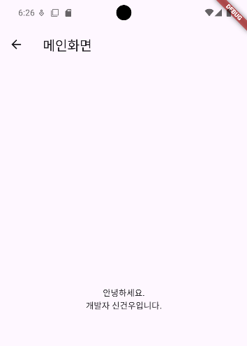
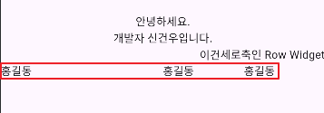

## 📚 Column-Row-Expanded Widget

### Column Widget

위젯을 세로로 정렬해주는 위젯입니다.

지난번 만든 Main Screen에 App Bar로 "메인화면"을 넣고 인사말을 넣었습니다.

그리고 Column의 파라미터 중 `mainAxisAlignment(주 축 정렬)`를 Center로 설정해 문구를 화면 정중앙으로 배치 시켰습니다.

만약 축을 설정하지 않으면 기본적으로 Column 위젯은 화면 정중앙이 아닌 상단부터 시작됩니다.

```dart
class _MainScreenState extends State<MainScreen> {
  @override
  Widget build(BuildContext context) {
    return Scaffold(
      appBar: AppBar(
        title: Text('메인화면'),
      ),
      body: Center(
        // child: Text('메인 화면 입니다.'),
        child: Column(
          mainAxisAlignment: MainAxisAlignment.center,
          children: [
            Text('안녕하세요.'),
            Text('개발자 신건우입니다.'),
          ],
        ),
      ),
    );
  }
}
```



<br>

### Row Widget

단순히 Column의 반대 개념이므로 설명은 생략합니다.

```dart
class _MainScreenState extends State<MainScreen> {
  @override
  Widget build(BuildContext context) {
    return Scaffold(
      appBar: AppBar(
        title: Text('메인화면'),
      ),
      body: Center(
        // child: Text('메인 화면 입니다.'),
        child: Column(
          mainAxisAlignment: MainAxisAlignment.center,
          children: [
            Text('안녕하세요.'),
            Text('개발자 신건우입니다.'),
            Row(
              mainAxisAlignment: MainAxisAlignment.end,
              children: [Text('이건'), Text('세로축인 Row Widget')],
            )
          ],
        ),
      ),
    );
  }
}
```

<br>

### Expanded Widget

Expanded는 CSS의 space around와 비슷한 개념으로, 각 children의 간격을 자동으로 맟춰줍니다.

이떄 flex라는 파라미터를 사용했는데 이 flex는 각 항목이 차지하는 비율을 의미합니다.

아래 코드를 보면 1개에만 2를 적용했는데 2:1:1의 비율로 정렬을 하겠다는 의미입니다.

```dart
class _MainScreenState extends State<MainScreen> {
  @override
  Widget build(BuildContext context) {
    return Scaffold(
      appBar: AppBar(
        title: Text('메인화면'),
      ),
      body: Center(
        // child: Text('메인 화면 입니다.'),
        child: Column(
          mainAxisAlignment: MainAxisAlignment.center,
          children: [
            Text('안녕하세요.'),
            Text('개발자 신건우입니다.'),
            Row(
              mainAxisAlignment: MainAxisAlignment.end,
              children: [
                Text('이건'),
                Text('세로축인 Row Widget')],
            ),
            Row(
              children: [
                Expanded(flex: 2, child: Text('홍길동')),
                Expanded(child: Text('홍길동')),
                Expanded(child: Text('홍길동')),
              ],
            )
          ],
        ),
      ),
    );
  }
}
```

