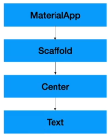

## 📚 Widget

Widget의 기본적인 Tree구조는 아래와 같습니다.

- **runApp()** : Flutter Application의 첫 EntryPoint
- **MaterialApp()** : 전체 앱
- **Scaffold()** : 화면 정의 & UI 용도의 Widget -> 페이지
- **Center()** : Contents의 중앙 위치
- **Text()** : 텍스트
- **TextStyle** : 말그대로 텍스트 스타일

<br>

### **안드로이드 스튜디오에는 여러가지 버튼들**

- **Hot Reload** : 가상 머신에 변경된 코드를 불러오고 위젯 트리를 재빌드합니다. 이때 앱의 상태를 보존하기 때문에 `main()`이나 `initState()`를 재실행하지 않습니다. (Intellij와 Android Studio에서는 ⌘\, VSCode에서는 ⌃F5)
- **Hot Restart** : 가상 머신에 변경된 코드를 불러오고 Flutter 앱을 재시작합니다. 이때 앱은 상태를 잃어버립니다. (Intellij와 Android Studio에서는 ⇧⌘\, VSCode에서는 ⇧⌘F5)
- **Full Restart** : iOS, Android, Web 어플을 재시작합니다. 
- 이는 앞선 두가지보다 더 많은 시간을 필요로하는데 Java / Kotlin / ObjC / Swift 코드를 재 컴파일링 해야하기 때문입니다.
- Web의 경우에는 Dart Development Compiler를 재시작하기까지 합니다. 풀 리스타트에는 단축키는 따로 없어서 직접 앱을 멈췄다가 시작해야 합니다.

<br>

### Widget Tree

Widget이란 클래스의 일종이며, Material, Scaffold, Center, Text 전부 위젯입니다.

위젯 트리를 그려보면 아래와 같습니다.



---

## 📚 Stateless Widget

Stateless Widget이란 상태가 없는 위젯으로, 한번 생성되면 내부 데이터나 상태를 변경할 수 없고, UI를 그리기 위한 정보만을 가집니다.

위 **Widget Tree**를 기반으로 각 클래스를 분리해서 위젯을 넣어줍니다.

- `main.dart`파일 최상단에 **main()**함수에서 `runApp()`의 파라미터로 Stateless Widget인 `MyApp`을 넣어줍니다.
- 클래스에 `StatelessWidget`을 상속받아서 Widget을 반환하는 build() 함수를 오버라이딩 해 title과 body를 간단히 넣어줍니다.
- 이렇게 사용하면 Hot Reload를 사용 가능한데, Hot Reload는 build 메서드 내의 코드만 실행 시킵니다.

```dart
import 'package:flutter/material.dart';

void main() {
  runApp(const MyApp());
}

class MyApp extends StatelessWidget {
  const MyApp({super.key});

  @override
  Widget build(BuildContext context) {
    return MaterialApp(
      title: 'Flutter Demo',
      theme: ThemeData(
        colorScheme: ColorScheme.fromSeed(seedColor: Colors.deepPurple),
        useMaterial3: true,
      ),
      home: const MainScreen(),
    );
  }
}

/**
 * StatelessWidget을 상속한 MainScreen Widjet
 */
class MainScreen extends StatelessWidget {
  const MainScreen({super.key});

  @override
  Widget build(BuildContext context) {
    return Scaffold(
      appBar: AppBar(title: Text('어플리케이션'),),
      body: Text('안녕하세요'),
    );
  }
}
```

---

## 📚 Stateful Widget

Stateful Widget은 Stateless와 반대로 상태를 가지며, 값의 변경이 가능합니다.

아래 코드의 initState를 예시로 보면 위젯 빌드 후 3초가 지나면 `title`, `msg`를 바뀌게 할 수 있습니다.

```dart
/**
 * StatefulWidget을 구현한 MainScreen2
 */
class MainScreen2 extends StatefulWidget {
  const MainScreen2({super.key});

  @override
  State<MainScreen2> createState() => _MainScreen2State();
}

// Spring의 PostConstructor 같은 느낌의 initState를 이용해 Body의 문구를 3초 후 바꿈 -> 상태 변경
class _MainScreen2State extends State<MainScreen2> {
  String title = '어플리케이션';
  String msg = '안녕하세요';

  @override
  void initState() {
    super.initState();
    
    Future.delayed(Duration(seconds: 3), () {
      setState(() {
        msg = '안녕하세요2';
        title = '어플리케이션2';
      });
    },);
  }

  @override
  Widget build(BuildContext context) {
    return Scaffold(
      appBar: AppBar(title: Text(title),),
      body: Text(msg),
    );
  }
}
```