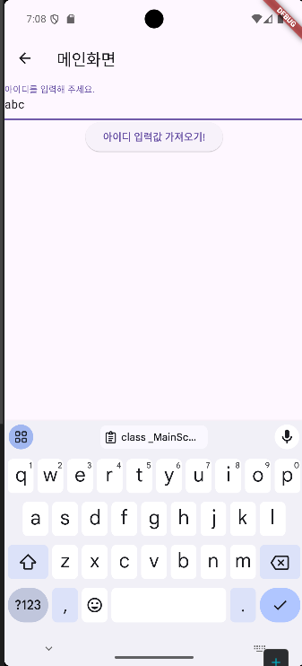

## 📚 Text Field Widget

Text Field는 HTML로 치면 Input 태그와 유사합니다.

사용자가 텍스트를 입력할 수 있는 TextField와, 그 값을 받은 Controller가 존재하고,

버튼을 하나 만들어 컨트롤러에서 받은 입력값을 콘솔에 출력하는 간단한 코드 입니다.

```dart
class _TextFieldWidgetState extends State<TextFieldWidget> {
  // 사용자의 입력을 컨트롤러가 받음
  TextEditingController idController = TextEditingController();

  @override
  Widget build(BuildContext context) {
    return Scaffold(
      appBar: AppBar(
        title: Text('메인화면'),
      ),
      body: Column(
        children: [
          TextField(
            controller: idController,
            decoration: InputDecoration(labelText: '아이디를 입력해 주세요.'),
          ),
          // 버튼을 이용해 사용자의 입력값을 컨트롤러에서 가져와 Console에 찍기
          ElevatedButton(
              onPressed: () {
                print(idController.text.toString());
              },
              child: Text('아이디 입력값 가져오기!'))
        ],
      ),
    );
  }
}
```

