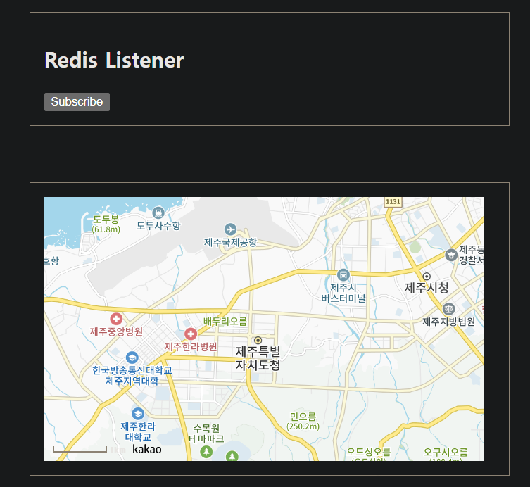

## Kakao Map API (React, Spring)

React / Spring Boot 각각의 환경에서 Kakao Map API를 연동하는 방법에 대해 알아보겠습니다.

<br>

[Kakao Maps API](https://apis.map.kakao.com)

**APP Key 발급**
- 위 링크로 방문해 우측 상단 `APP KEY 발급` 버튼을 눌러줍니다.
- `어플리케이션 추가` 버튼 클릭
- `앱이름, 사명자명` 지정 후 저장
- 만들어진 어플리케이션을 클릭해 들어가서 App Key(JavaScript Key)를 확인합니다.

<br>

**플랫폼 등록**
- 좌측 카테고리에 **플랫폼**을 눌러서 `Web 플랫폼 등록`을 눌러줍니다.
- 사이트 도메인에 `http://localhost:3000`를 등록합니다. (3000 = React 기본 포트)

---

## React (TypeScript)

> 📕 **index.html**

- `appkey` 부분에 JavaScript Key를 넣어줍니다.

```html
<script type="text/javascript" src="//dapi.kakao.com/v2/maps/sdk.js?appkey=YOUR-KEY"></script>
```

<br>

> 📕 **KakaoMap.tsx**

**declare global 이란?**
- TypeScript 환경에서는 index.html에 API를 추가해도, kakao 객체의 존재 여부를 TypeScript는 인식하지 못합니다.
- 이 경우, TypeScript에게 Kakao라는 객체가 window에 존재하고 있다고 인식시켜 줘야 합니다.
- 이럴 때 사용하는 TypeScript 문법이 declare 입니다.

<br>

카카오맵을 그릴 컴포넌트를 작성합니다.

맵의 크기는 Map 변수에 Styled Component를 사용해서 작성하였습니다.

```tsx
import React, {useEffect} from "react";  
import styled from "styled-components";  
  
declare global {  
    interface Window {  
        kakao: any;  
    }  
}  
  
// Kakao Map 크기  
const Map = styled.div`  
width: 500px;  
height: 300px;  
`;
  
const KakaoMap: React.FC = () => {  
    useEffect(() => {  
        const container = document.getElementById('map');  
        const options = {  
            center: new window.kakao.maps.LatLng(33.450701, 126.50667),  
            level: 5  
        };  
  
        const map = new window.kakao.maps.Map(container, options);  
  
        return () => {};  
    }, []);  
  
    return (  
        <Map id="map" />  
    )  
}  
  
export default KakaoMap;
```

<br>

> 📕 **App.tsx**

메인 App에 KakaoMap 컴포넌트를 등록 해줍니다.

```tsx
import './App.css'  
 
import RedisSocketSubscriber from "./components/mqtt/RedisSocketSubscriber";  
import KakaoMap from "./components/kakao/KakaoMap";  
  
interface CircleProps {  
    color?: string;  
    size?: string;  
}  
  
const Circle = styled.div<CircleProps>`  
    width: 5rem;    height: 5rem;    background: ${props => props.color || 'black'};  
    border-radius: 50%;    ${props => props.size &&   
    css`  
    width: 10rem;    height: 10rem;  
    `}  
`;  
  
const AppBlock = styled.div`  
  width: 512px;  margin: 0 auto;  margin-top: 4rem;  border: 1px solid black;  padding: 1rem;`;  
  
const App: React.FC = () => {  
  
    const onSubmit = (form: { name: string; description: string; }) => {  
        console.log(form);  
    }  
  
    return (  
        <ContextProvider>  
            <div>  
                <AppBlock>  
                    {/*<RabbitMqWebSocketHandler />*/}  
                    <RedisSocketSubscriber />  
                </AppBlock>
                
                <AppBlock>  
                    <KakaoMap />  
                </AppBlock>  
            </div>  
        </ContextProvider>  
    );  
}  
  
export default App
```

<br>

> 📕 **결과**

프론트엔드 서버를 켜보면 카카오 맵이 잘 나오고, 마우스 Wheel Up/Down으로 Zoom Level 변경도 잘 작동합니다.


