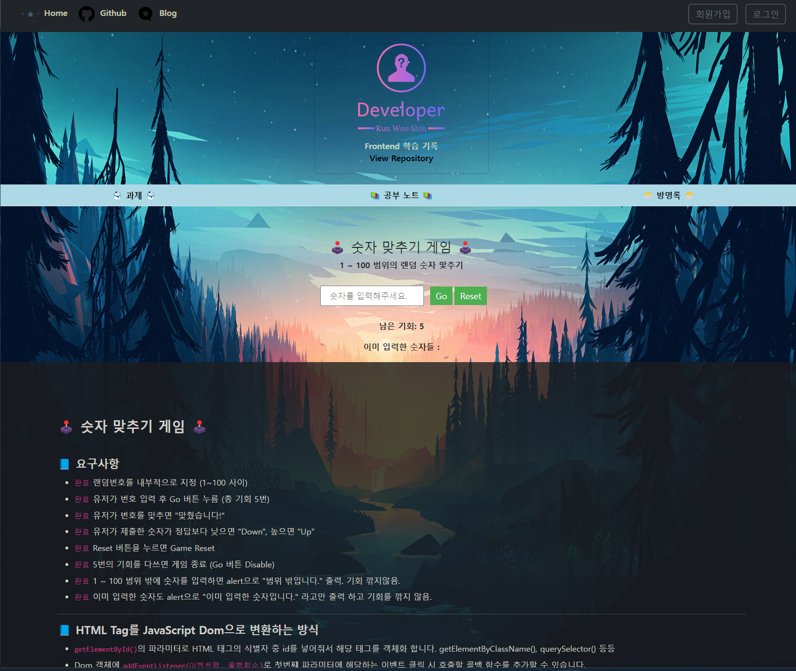

## 📘 React Markdown

학습 기록 사이트를 만들면서 내가 공부한 글(마크다운)을 마크다운으로 보이게 하고 싶고,

글을 쓸때도 마크다운으로 입력해서 글을 등록하고 싶어 알아 보았습니다.

<br>

사용한 라이브러리는 다음과 같습니다.

- react-markdown
- react-syntax-highlighter (코드 블럭)
- rehype-raw (HTML 파싱)
- rehype-sanitize (XSS 방지)
- remark-gfm (마크다운 확장 기능)

---
## 📘 Code Component, BlockQuote, Code Highlighter

이 코드에서는 마크다운 텍스트의 스타일과 BlockQuote, 코드블럭을 정의합니다.

- 맨 처음 styled-component를 이용한 스타일링은 개인적으로 원하는 스타일로 바꾸고 싶어 커스터마이징 하였습니다.

<br>

> **Code 컴포넌트**

- `code({className, children, ...props}) { ... }` : 이 함수는 마크다운 내의 `code` 요소를 처리합니다.
    - 입력 파라미터로 className, children, 그리고 props를 받습니다.
-  const match = className ? /language-(\w+)/.exec(className) : null;
    - 이 코드는 className이 정의되어 있을 때, 그 값이 "language-언어이름" 형태인지를 정규표현식으로 확인합니다. 일치하는 경우 match에 그 결과를 저장합니다.
    - 코드블럭에 어떤 언어인지를 표시하는 Language를 표시하는데 사용됩니다.
- return match ? ... : `<code className={className} style={{ margin: 0 }} {...props}>{children}</code>`
    - match가 있으면, 즉 className이 "language-언어이름" 형태라면 SyntaxHighlighter를 사용하여 코드를 강조 표시하고, 그렇지 않으면 기본 `code` 요소를 반환합니다.

<br>

**MarkdownComponent.tsx**

```tsx
import {Components} from "react-markdown";  
import styled from "styled-components";  
import dracula from 'react-syntax-highlighter/dist/esm/styles/prism/dracula';  
import {Prism as SyntaxHighlighter} from 'react-syntax-highlighter';  
  
const SyntaxHighlighterContainer = styled.div`  
    background-color: #37393b;    
    border-radius: 10px;    
    font-weight: 550;
`;  
  
const LanguageLabel = styled.div`  
    background-color: #37393b;    
    padding-left: 10px;    
    padding-top: 3px;    
    color: #c4c7c5;
`;  
  
const MarkdownComponent: Components = {  
    code({className, children, ...props}) {  
        const match = className ? /language-(\w+)/.exec(className) : null;  
  
        return match ?  
            <SyntaxHighlighterContainer>  
                <LanguageLabel>{match ? match[1] : 'text'}</LanguageLabel>  
                <SyntaxHighlighter  
                    style={{  
                        ...dracula,  
                        margin: 0,  
                    }}  
                    language={match[1] || ''}  
                    PreTag="div"  
                    children={String(children).replace(/\n$/, '')}  
                    {...props}  
                />  
            </SyntaxHighlighterContainer>  
            : <code className={className} style={{ margin: 0 }} {...props}>{children}</code>  
    },  
    blockquote({children}) {  
        return <blockquote  
            style={  
                {  
                    fontSize: '14px',  
                    color: 'white',  
                    borderLeft: '5px solid lightblue',  
                    paddingLeft: '10px',  
                    height: '2rem',  
                    borderRadius: '3px',  
                    background: 'rgba(100, 100, 100, 0.3)',  
                }  
            }>{children}</blockquote>;  
    }  
};  
  
export default MarkdownComponent;
```

---
## 📘 Markdown 적용

숫자 맟추기 게임 하단에 마크다운 설명을 붙이는 NumberGuess 컴포넌트입니다.

- `components={MarkdownComponent}` : 이 속성은 위에서 정의한 `MarkdownComponent`를 사용하여 `code`와 `blockquote`라는 특정 마크다운 요소들을 사용자 정의하는 방법을 설정합니다.
- `rehypePlugins={[rehypeRaw, rehypeSanitize]}` : 이 속성은 HTML 문자열을 실제 HTML로 파싱하고, 위험한 HTML을 제거하여 XSS(크로스 사이트 스크립팅) 공격을 방지하는 플러그인들을 설정합니다.
- `remarkPlugins={[gfm]}` : 이 속성은 GitHub Flavored Markdown(GFM)을 지원하기 위한 플러그인을 설정합니다. GFM은 표준 마크다운에 추가적인 확장 기능(테이블, 작업 목록 등)을 제공하는 GitHub의 마크다운 방언입니다.
- `children={NumberGameNote.content}` : 이 속성은 화면에 표시할 마크다운 문법의 텍스트를 설정합니다. 여기서는 `NumberGameNote.content`라는 변수에 저장된 텍스트를 사용하고 있습니다.

<br>

**NumberGuess.tsx**

```tsx
import React, {useEffect, useState} from "react";  
import {ViewContainer} from "../../styles/container/ViewContainer.ts";  
import ReactMarkdown from "react-markdown";  
import MarkdownComponent from "../note/MarkdownComponent.tsx";  
import rehypeRaw from "rehype-raw";  
import rehypeSanitize from "rehype-sanitize";  
import gfm from "remark-gfm";  
import ConfettiExplosion from "react-confetti-explosion";  
import {NumberGameNote} from "../../model/Assignment.ts";  
import {GameContainer, StyledButton, StyledInput} from "../../styles/assignment/NumberGuess.ts";  
  
/**  
 * TODO  
 * 랜덤번호를 내부적으로 지정 (1~100 사이)  
 * 유저가 번호 입력 후 Go 버튼 누름 (총 기회 5번)  
 * 유저가 번호를 맟추면 "맟췄습니다!"  
 * 유저가 제출한 숫자가 정답보다 낮으면 "Down", 높으면 "Up"  
 * Reset 버튼을 누르면 Game Reset  
 * 5번의 기회를 다쓰면 게임 종료 (Go 버튼 Disable)  
 * 1 ~ 100 범위 밖에 숫자를 입력하면 alert으로 "범위 밖입니다." 출력. 기회 깎지않음.  
 * 이미 입력한 숫자도 alert으로 "이미 입력한 숫자입니다." 라고만 출력 하고 기회를 깎지 않음.  
 * * ----------------- * 
 * @userGuess : 사용자가 입력한 추측값 저장  
 * @gameMessage : 게임의 현재 상태를 사용자에게 알려주는 메시지 저장  
 * @remainingAttempts : 사용자의 게임에서 남은 횟수 저장, 0이 되면 게임 종료  
 * @randomNumber : 1 ~ 100 사이 임의의 난수를 생성해 상태로 관리  
 * @priviousGuesses : 사용자가 이전에 입력한 추측값을 저장하는 배열  
 * @restartCountdown : 사용자의 기회가 전부 소진되거나, 정답을 맟췄을때 자동으로 게임 재시작을 하기 위한 Countdown Interval 표시  
 * @isExploding : 정답을 맟출 시 폭죽 효과 애니메이션 추가  
 */  
const NumberGuess: React.FC = () => {  
    const [userGuess, setUserGuess] = useState<string>('');  
    const [gameMessage, setGameMessage] = useState<string>('');  
    const [remainingAttempts, setRemainingAttempts] = useState<number>(5);  
    const [randomNumber, setRandomNumber] = useState<number>(Math.floor(Math.random() * 100) + 1);  
    const [previousGuesses, setPreviousGuesses] = useState<string[]>([]);  
    const [restartCountdown, setRestartCountdown] = useState<number | null>(null);  
    const [isExploding, setIsExploding] = useState(false);  
  
    useEffect(() => {  
        console.log(randomNumber)  
    }, [randomNumber]);  
  
    useEffect(() => {  
        let countdownInterval: number | null = null;  
  
        if (restartCountdown !== null) {  
            countdownInterval = window.setInterval(() => {  
                setRestartCountdown(prev => {  
                    if (prev !== null && prev > 1) {  
                        return prev - 1;  
                    } else {  
                        window.clearInterval(countdownInterval!);  
                        resetGame();  
                        return null;  
                    }  
                });  
            }, 1000);  
        }  
  
        return () => {  
            if (countdownInterval) {  
                window.clearInterval(countdownInterval);  
            }  
        };  
    }, [restartCountdown]);  
  
    useEffect(() => {  
        if (isExploding) {  
            const timeout = setTimeout(() => {  
                setIsExploding(false);  
            }, 500);  
  
            return () => clearTimeout(timeout);  
        }  
    }, [isExploding]);  
  
    const verifyUserGuess = () => {  
        const parsedUserGuess = parseInt(userGuess);  
  
        if (!isNaN(parsedUserGuess)) {  
            if (parsedUserGuess < 1 || parsedUserGuess > 100) {  
                alert("범위 밖입니다.");  
                setUserGuess('');  
                return;  
            }  
  
            if (previousGuesses.includes(userGuess)) {  
                alert("이미 입력한 숫자입니다.");  
                setUserGuess('');  
                return;  
            }  
  
            if (parsedUserGuess === randomNumber) {  
                setGameMessage("맞췄습니다!");  
                setRemainingAttempts(0);  
                setIsExploding(true);  
            } else if (parsedUserGuess > randomNumber) {  
                setGameMessage("Down");  
                setRemainingAttempts(prev => prev - 1);  
            } else {  
                setGameMessage("Up");  
                setRemainingAttempts(prev => prev - 1);  
            }  
  
            setPreviousGuesses(prev => [...prev, userGuess]);  
            setUserGuess('');  
        } else {  
            alert("숫자만 입력 가능합니다.");  
        }  
  
        if (parsedUserGuess === randomNumber || remainingAttempts === 1) {  
            setGameMessage(parsedUserGuess === randomNumber ? "맞췄습니다!" : "기회를 모두 소진 하였습니다.");  
            setRemainingAttempts(0);  
            setRestartCountdown(5);  
        }  
    };  
  
    const resetGame = () => {  
        setUserGuess('');  
        setGameMessage('');  
        setRemainingAttempts(5);  
        setRandomNumber(Math.floor(Math.random() * 100) + 1);  
        setPreviousGuesses([]);  
    };  
  
    return (  
        <div>  
            <div style={{position: 'fixed', top: '50%', left: '50%', transform: 'translate(-50%, -50%)'}}>  
                {isExploding && <ConfettiExplosion/>}  
            </div>  
  
            <GameContainer>  
                <div>  
                    <h4 style={{marginTop: "30px"}}>🕹️ 숫자 맞추기 게임 🕹️</h4>  
                    <p>1 ~ 100 범위의 랜덤 숫자 맟추기</p>  
                    <StyledInput  
                        type="text"  
                        value={userGuess}  
                        onChange={(e) => setUserGuess(e.target.value)}  
                        placeholder="숫자를 입력해주세요."  
                    />  
                    <StyledButton onClick={verifyUserGuess} disabled={remainingAttempts === 0}>Go</StyledButton>  
                    <StyledButton onClick={resetGame}>Reset</StyledButton>  
                    <p>{gameMessage}</p>  
                    <p>남은 기회: {remainingAttempts}</p>  
                    {restartCountdown !== null && (  
                        <p>{restartCountdown}초 후 게임이 재시작 됩니다...</p>  
                    )}  
                    <p>이미 입력한 숫자들 : {previousGuesses.join(', ')}</p>  
                </div>  
            </GameContainer>  
  
            <div style={{all: 'initial'}}>  
                <ViewContainer>  
                    <div style={{padding: "30px"}}>  
                        <ReactMarkdown  
                            components={MarkdownComponent}  
                            rehypePlugins={[rehypeRaw, rehypeSanitize]}  
                            remarkPlugins={[gfm]}  
                            children={NumberGameNote.content}  
                        >  
                        </ReactMarkdown>  
                    </div>  
                </ViewContainer>  
            </div>  
        </div>  
    );  
};  
  
export default NumberGuess;
```

<br>

위 방법은 NumberGuessNote.content 객체에 content 필드에 마크다운 메모를 그대로 넣기만 하면 정적으로 글을 넣는 방법입니다.

```ts
export const NumberGuessNote = {
	content: ''
}
```

<br>

좀 귀찮지만 글을 입력하는 공간을 따로 만들고 마크다운 글 입력 후 제출하면 마크다운 글이 생성되는 Write Component도 따로 작성 해 주었습니다.

이 경우 글을 Backend DB에 저장해 주었고, 글을 불러올때도 마찬가지로 Backend의 DB에서 Markdown Text를 가져옵니다.

<br>

**Write.tsx**

```tsx
import React, { useState } from 'react';  
import { useNavigate } from 'react-router-dom';  
import {postNote} from "../../model/Api.ts";  
import {PostNote} from "../../model/Note.ts";  
import {CategorySelect, ContentTextarea, Header, SubmitButton, TitleInput} from "../../styles/note/Write.ts";  
  
const Write: React.FC = () => {  
    const [title, setTitle] = useState('');  
    const [content, setContent] = useState('');  
    const [category, setCategory] = useState('HTML & CSS');  
    const navigate = useNavigate();  
  
    const handleSubmit = () => {  
        const note: PostNote = {  
            title: title,  
            content: content,  
            category: category,  
        };  
  
        try {  
            postNote(note).then(r => {  
                if (r.status === 201) {  
                    if (category === "Assignment") {  
                        navigate('/assignment');  
                    } else {  
                        navigate('/note');  
                    }  
                    console.log("글 작성 성공!")  
                } else {  
                    console.error(`글 작성 실패`)  
                }  
            })  
        } catch (error) {  
            console.error(`글 작성 실패 - ${error}`)  
        }  
    };  
  
    return (  
        <div>  
            <Header>  
                <CategorySelect value={category} onChange={(e) => setCategory(e.target.value)}>  
                    <option value="HTML & CSS">HTML & CSS</option>  
                    <option value="JavaScript">JavaScript</option>  
                    <option value="React & TypeScript">React & TypeScript</option>  
                    <option value="Assignment">Assignment</option>  
                </CategorySelect>  
                <TitleInput  
                    type="text"  
                    value={title}  
                    onChange={(e) => setTitle(e.target.value)}  
                    placeholder="제목을 입력 해주세요."  
                />  
                <SubmitButton onClick={handleSubmit}>제출</SubmitButton>  
            </Header>  
            <ContentTextarea  
                value={content}  
                onChange={(e) => setContent(e.target.value)}  
            />  
        </div>  
    );  
};  
  
export default Write;
```

<br>

**BackEnd Note Entity**

글자를 10000글자 제한으로 두고 @Lob으로 처리하였습니다.

```kotlin
@Entity  
data class Note(  
    @Id @GeneratedValue(strategy = GenerationType.IDENTITY)  
    val id: Long? = null,  
    val title: String = "",  
    @Lob  
    @Column(length = 10000)  
    val content: String = "",  
    val category: String = ""  
) {  
    companion object {  
        fun createOf(title: String, content: String, category: String) = Note(  
            title = title,  
            content = content,  
            category = category  
        )  
    }  
}
```

---
## 📘 적용 완료

게임 하단에 마크다운 문법으로 작성한 글이 마크다운 형식으로 보이게 되었습니다.

